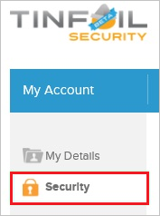

# Configure TINFOIL SECURITY for Single sign-on with Microsoft Entra ID

In this article,  you learn how to integrate TINFOIL SECURITY with Microsoft Entra ID. When you integrate TINFOIL SECURITY with Microsoft Entra ID, you can:

* Control in Microsoft Entra ID who has access to TINFOIL SECURITY.
* Enable your users to be automatically signed-in to TINFOIL SECURITY with their Microsoft Entra accounts.
* Manage your accounts in one central location.

## Prerequisites
The scenario outlined in this article assumes that you already have the following prerequisites:

[!INCLUDE [common-prerequisites.md](~/identity/saas-apps/includes/common-prerequisites.md)]
* TINFOIL SECURITY single sign-on (SSO) enabled subscription.

## Scenario description

In this article,  you configure and test Microsoft Entra SSO in a test environment.

* TINFOIL SECURITY supports **IDP** initiated SSO.

> [!NOTE]
> Identifier of this application is a fixed string value so only one instance can be configured in one tenant.

## Add TINFOIL SECURITY from the gallery

To configure the integration of TINFOIL SECURITY into Microsoft Entra ID, you need to add TINFOIL SECURITY from the gallery to your list of managed SaaS apps.

1. Sign in to the [Microsoft Entra admin center](https://entra.microsoft.com) as at least a [Cloud Application Administrator](~/identity/role-based-access-control/permissions-reference.md#cloud-application-administrator).
1. Browse to **Entra ID** > **Enterprise apps** > **New application**.
1. In the **Add from the gallery** section, type **TINFOIL SECURITY** in the search box.
1. Select **TINFOIL SECURITY** from results panel and then add the app. Wait a few seconds while the app is added to your tenant.

 Alternatively, you can also use the [Enterprise App Configuration Wizard](https://portal.office.com/AdminPortal/home?Q=Docs#/azureadappintegration). In this wizard, you can add an application to your tenant, add users/groups to the app, assign roles, and walk through the SSO configuration as well. [Learn more about Microsoft 365 wizards.](/microsoft-365/admin/misc/azure-ad-setup-guides)

## Configure and test Microsoft Entra SSO for TINFOIL SECURITY

Configure and test Microsoft Entra SSO with TINFOIL SECURITY using a test user called **B.Simon**. For SSO to work, you need to establish a link relationship between a Microsoft Entra user and the related user in TINFOIL SECURITY.

To configure and test Microsoft Entra SSO with TINFOIL SECURITY, perform the following steps:

1. **[Configure Microsoft Entra SSO](#configure-azure-ad-sso)** - to enable your users to use this feature.
    1. **Create a Microsoft Entra test user** - to test Microsoft Entra single sign-on with B.Simon.
    1. **Assign the Microsoft Entra test user** - to enable B.Simon to use Microsoft Entra single sign-on.
1. **[Configure TINFOIL SECURITY SSO](#configure-tinfoil-security-sso)** - to configure the single sign-on settings on application side.
    1. **[Create TINFOIL SECURITY test user](#create-tinfoil-security-test-user)** - to have a counterpart of B.Simon in TINFOIL SECURITY that's linked to the Microsoft Entra representation of user.
1. **[Test SSO](#test-sso)** - to verify whether the configuration works.

## Configure Microsoft Entra SSO

Follow these steps to enable Microsoft Entra SSO.

1. Sign in to the [Microsoft Entra admin center](https://entra.microsoft.com) as at least a [Cloud Application Administrator](~/identity/role-based-access-control/permissions-reference.md#cloud-application-administrator).
1. Browse to **Entra ID** > **Enterprise apps** > **TINFOIL SECURITY** > **Single sign-on**.
1. On the **Select a single sign-on method** page, select **SAML**.
1. On the **Set up single sign-on with SAML** page, select the pencil icon for **Basic SAML Configuration** to edit the settings.

   

1. On the **Basic SAML Configuration** section, the application is pre-configured and the necessary URLs are already pre-populated with Azure. The user needs to save the configuration by selecting the **Save** button.

1. Visitly application expects the SAML assertions in a specific format, which requires you to add custom attribute mappings to your SAML token attributes configuration. The following screenshot shows the list of default attributes.

	

1. In addition to above, Visitly application expects few more attributes to be passed back in SAML response which are shown below. These attributes are also pre populated but you can review them as per your requirements.

	| Name | Source Attribute |
	| ------------------- | -------------|
	| accountid | UXXXXXXXXXXXXX |

	> [!NOTE]
	> You get the accountid value explained later in the article.

1. In the **SAML Signing Certificate** section, select **Edit** button to open **SAML Signing Certificate** dialog.

	

1. In the **SAML Signing Certificate** section, copy the **Thumbprint Value** and save it on your computer.

    

1. On the **Set up TINFOIL SECURITY** section, copy the appropriate URL(s) based on your requirement.

	

[!INCLUDE [create-assign-users-sso.md](~/identity/saas-apps/includes/create-assign-users-sso.md)]

## Configure TINFOIL SECURITY SSO

1. In a different web browser window, sign into your TINFOIL SECURITY company site as an administrator.

1. In the toolbar on the top, select **My Account**.

    

1. Select **Security**.

    

1. On the **Single Sign-On** configuration page, perform the following steps:

    

    a. Select **Enable SAML**.

    b. Select **Manual Configuration**.

    c. In **SAML Post URL** textbox, paste the value of **Login URL**.

    d. In **SAML Certificate Fingerprint** textbox, paste the value of **Thumbprint** which you have copied from **SAML Signing Certificate** section.
  
    e. Copy **Your Account ID** value and paste the value in **Source Attribute** textbox under **User Attributes & Claims** section in Azure portal.

    f. Select **Save**.

### Create TINFOIL SECURITY test user

In order to enable Microsoft Entra users to sign in to TINFOIL SECURITY, they must be provisioned into TINFOIL SECURITY. In the case of TINFOIL SECURITY, provisioning is a manual task.

**To get a user provisioned, perform the following steps:**

1. If the user is a part of an Enterprise account, you need to [contact the TINFOIL SECURITY support team](https://www.tinfoilsecurity.com/contact) to get the user account created.

1. If the user is a regular TINFOIL SECURITY SaaS user, then the user can add a collaborator to any of the user’s sites. This triggers a process to send an invitation to the specified email to create a new TINFOIL SECURITY user account.

> [!NOTE]
> You can use any other TINFOIL SECURITY user account creation tools or APIs provided by TINFOIL SECURITY to provision Microsoft Entra user accounts.

## Test SSO

In this section, you test your Microsoft Entra single sign-on configuration with following options.

* Select **Test this application**, and you should be automatically signed in to the TINFOIL SECURITY for which you set up the SSO.

* You can use Microsoft My Apps. When you select the TINFOIL SECURITY tile in the My Apps, you should be automatically signed in to the TINFOIL SECURITY for which you set up the SSO. For more information, see [Microsoft Entra My Apps](/azure/active-directory/manage-apps/end-user-experiences#azure-ad-my-apps).

## Related content

Once you configure TINFOIL SECURITY you can enforce session control, which protects exfiltration and infiltration of your organization’s sensitive data in real time. Session control extends from Conditional Access. [Learn how to enforce session control with Microsoft Defender for Cloud Apps](/cloud-app-security/proxy-deployment-aad).
