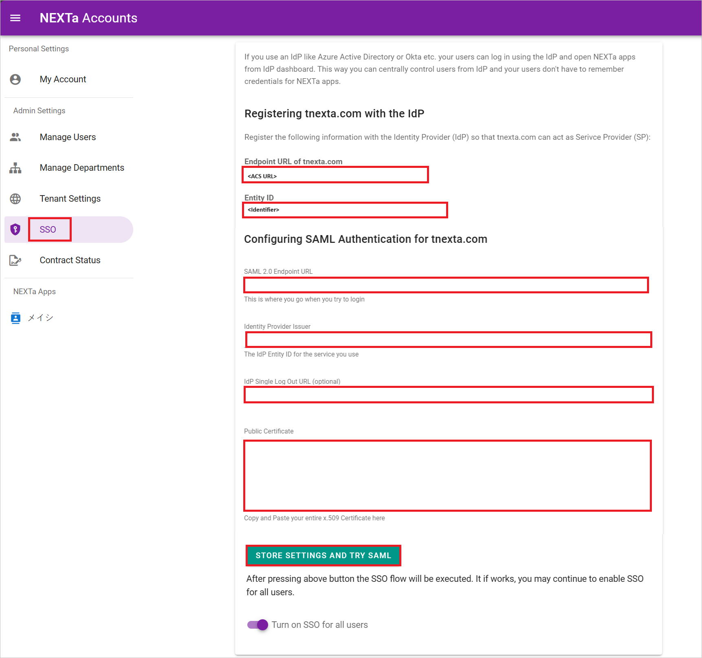
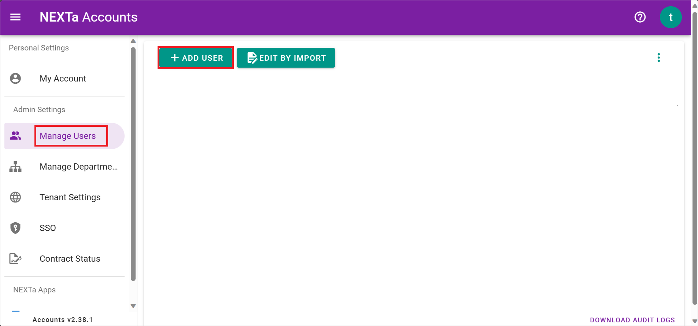
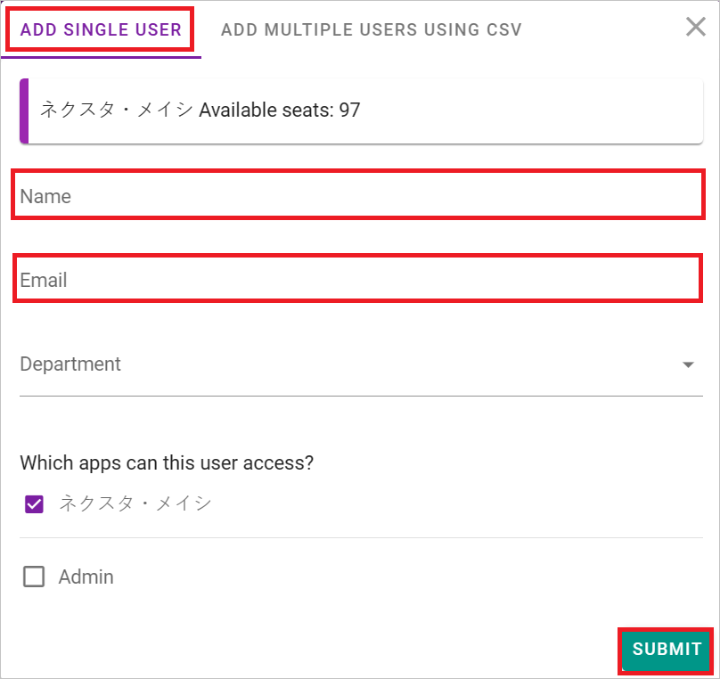

# Configure Tonichi Nexta Meishi for Single sign-on with Microsoft Entra ID

In this article,  you learn how to integrate Tonichi Nexta Meishi with Microsoft Entra ID. When you integrate Tonichi Nexta Meishi with Microsoft Entra ID, you can:

* Control in Microsoft Entra ID who has access to Tonichi Nexta Meishi.
* Enable your users to be automatically signed-in to Tonichi Nexta Meishi with their Microsoft Entra accounts.
* Manage your accounts in one central location.

## Prerequisites
The scenario outlined in this article assumes that you already have the following prerequisites:

[!INCLUDE [common-prerequisites.md](~/identity/saas-apps/includes/common-prerequisites.md)]
* Tonichi Nexta Meishi single sign-on (SSO) enabled subscription.

## Scenario description

In this article,  you configure and test Microsoft Entra SSO in a test environment.

* Tonichi Nexta Meishi supports both **SP and IDP** initiated SSO.

## Add Tonichi Nexta Meishi from the gallery

To configure the integration of Tonichi Nexta Meishi into Microsoft Entra ID, you need to add Tonichi Nexta Meishi from the gallery to your list of managed SaaS apps.

1. Sign in to the [Microsoft Entra admin center](https://entra.microsoft.com) as at least a [Cloud Application Administrator](~/identity/role-based-access-control/permissions-reference.md#cloud-application-administrator).
1. Browse to **Entra ID** > **Enterprise apps** > **New application**.
1. In the **Add from the gallery** section, type **Tonichi Nexta Meishi** in the search box.
1. Select **Tonichi Nexta Meishi** from results panel and then add the app. Wait a few seconds while the app is added to your tenant.

Alternatively, you can also use the [Enterprise App Configuration Wizard](https://portal.office.com/AdminPortal/home?Q=Docs#/azureadappintegration). In this wizard, you can add an application to your tenant, add users/groups to the app, assign roles, and walk through the SSO configuration as well. [Learn more about Microsoft 365 wizards.](/microsoft-365/admin/misc/azure-ad-setup-guides)

## Configure and test Microsoft Entra SSO for Tonichi Nexta Meishi

Configure and test Microsoft Entra SSO with Tonichi Nexta Meishi using a test user called **B.Simon**. For SSO to work, you need to establish a link relationship between a Microsoft Entra user and the related user in Tonichi Nexta Meishi.

To configure and test Microsoft Entra SSO with Tonichi Nexta Meishi, perform the following steps:

1. **[Configure Microsoft Entra SSO](#configure-microsoft-entra-sso)** - to enable your users to use this feature.
    1. **Create a Microsoft Entra test user** - to test Microsoft Entra single sign-on with B.Simon.
    1. **Assign the Microsoft Entra test user** - to enable B.Simon to use Microsoft Entra single sign-on.
1. **[Configure Tonichi Nexta Meishi SSO](#configure-tonichi-nexta-meishi-sso)** - to configure the single sign-on settings on application side.
    1. **[Create Tonichi Nexta Meishi test user](#create-tonichi-nexta-meishi-test-user)** - to have a counterpart of B.Simon in Tonichi Nexta Meishi linked to the Microsoft Entra representation of user.
1. **[Test SSO](#test-sso)** - to verify whether the configuration works.

## Configure Microsoft Entra SSO

Follow these steps to enable Microsoft Entra SSO in the Microsoft Entra admin center.

1. Sign in to the [Microsoft Entra admin center](https://entra.microsoft.com) as at least a [Cloud Application Administrator](~/identity/role-based-access-control/permissions-reference.md#cloud-application-administrator).
1. Browse to **Entra ID** > **Enterprise apps** > **Tonichi Nexta Meishi** > **Single sign-on**.
1. On the **Select a single sign-on method** page, select **SAML**.
1. On the **Set up single sign-on with SAML** page, select the pencil icon for **Basic SAML Configuration** to edit the settings.

   

1. On the **Basic SAML Configuration** section, perform the following steps:

    a. In the **Identifier** text box, type a URL using the following pattern:
    `https://<SUBDOMAIN>.tnexta.com/accounts/saml2/all/metadata`

    b. In the **Reply URL** text box, type a URL using the following pattern:
    `https://<SUBDOMAIN>.tnexta.com/accounts/saml2/all/acs`

1. Perform the following step, if you wish to configure the application in **SP** initiated mode:

    In the **Sign-on URL** text box, type a URL using the following pattern:
    `https://<SUBDOMAIN>.tnexta.com/accounts/`

	> [!NOTE]
	> These values aren't real. Update these values with the actual Identifier, Reply URL and Sign on URL. Contact [Tonichi Nexta Meishi support team](mailto:nexta@tonichi-printing.co.jp) to get these values. You can also refer to the patterns shown in the **Basic SAML Configuration** section in the Microsoft Entra admin center.

1. On the **Set up single sign-on with SAML** page, in the **SAML Signing Certificate** section, find **Certificate (Raw)** and select **Download** to download the certificate and save it on your computer.

	

1. On the **Set up Tonichi Nexta Meishi** section, copy the appropriate URL(s) based on your requirement.

	

[!INCLUDE [create-assign-users-sso.md](~/identity/saas-apps/includes/create-assign-users-sso.md)]

## Configure Tonichi Nexta Meishi SSO

1. Sign in to Tonichi Nexta Meishi company site as an administrator.

1. Go to **Admin Settings** > **SSO** and perform the following steps:

   

    a. Copy **Endpoint URL of tnexta.com** value. Paste this value into the **Reply URL** text box in the **Basic SAML Configuration** section in Microsoft Entra admin center.

    b. Copy **Entity ID** value. Paste this value into the **Identifier (Entity ID)** text box in the **Basic SAML Configuration** section in Microsoft Entra admin center.

    c. In the **SAML 2.0 Endpoint URL** textbox, paste the **Login URL** value, which you have copied from the Microsoft Entra admin center.
    
    d. In the **Identity Provider Issuer** textbox, paste the **Microsoft Entra Identifier** value, which you have copied from the Microsoft Entra admin center.

    e. In the **Idp Single Log Out URL** textbox, paste the **Logout URL** value, which you have copied from the Microsoft Entra admin center.

    f. Open the downloaded **Certificate (Raw)** into Notepad and paste the content into the **Public Certificate** textbox.

    g. Select **STORE SETTINGS AND TRY SAML**.

### Create Tonichi Nexta Meishi test user

1. In a different web browser window, sign into Tonichi Nexta Meishi website as an administrator.

1. Go to **Admin Settings** > **Manage Users** and select **+ ADD USER** 

   

1. Perform the following steps in the following page:

   

   1. In the **Name** textbox, enter a valid name of the user.

   1. In the **Email** textbox, enter a valid emailaddress of the user.

   1. Select **SUBMIT**.

## Test SSO 

In this section, you test your Microsoft Entra single sign-on configuration with following options.
 
#### SP initiated:
 
* Select **Test this application** in Microsoft Entra admin center. this option redirects to Tonichi Nexta Meishi Sign on URL where you can initiate the sign-in flow.  
 
* Go to Tonichi Nexta Meishi Sign-on URL directly and initiate the sign-in flow from there.
 
#### IDP initiated:
 
* Select **Test this application** in Microsoft Entra admin center and you should be automatically signed in to the Tonichi Nexta Meishi for which you set up the SSO.
 
You can also use Microsoft My Apps to test the application in any mode. When you select the Tonichi Nexta Meishi tile in the My Apps, if configured in SP mode you would be redirected to the application sign-on page for initiating the sign-in flow and if configured in IDP mode, you should be automatically signed in to the Tonichi Nexta Meishi for which you set up the SSO. For more information about the My Apps, see [Introduction to the My Apps](https://support.microsoft.com/account-billing/sign-in-and-start-apps-from-the-my-apps-portal-2f3b1bae-0e5a-4a86-a33e-876fbd2a4510).

## Related content

Once you configure Tonichi Nexta Meishi you can enforce session control, which protects exfiltration and infiltration of your organization's sensitive data in real time. Session control extends from Conditional Access. [Learn how to enforce session control with Microsoft Defender for Cloud Apps](/cloud-app-security/proxy-deployment-any-app).
