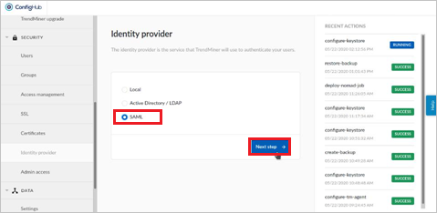
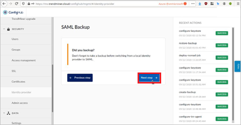
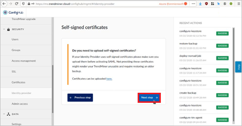
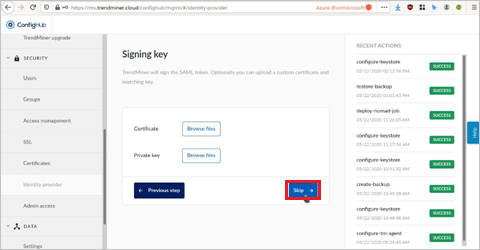
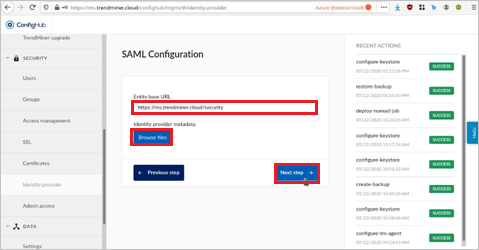
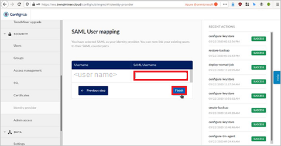

# Configure TrendMiner for Single sign-on with Microsoft Entra ID

In this article,  you learn how to integrate TrendMiner with Microsoft Entra ID. When you integrate TrendMiner with Microsoft Entra ID, you can:

* Control in Microsoft Entra ID who has access to TrendMiner.
* Enable your users to be automatically signed-in to TrendMiner with their Microsoft Entra accounts.
* Manage your accounts in one central location.

## Prerequisites
The scenario outlined in this article assumes that you already have the following prerequisites:

[!INCLUDE [common-prerequisites.md](~/identity/saas-apps/includes/common-prerequisites.md)]
* TrendMiner single sign-on (SSO) enabled subscription.

## Scenario description

In this article,  you configure and test Microsoft Entra SSO in a test environment.

* TrendMiner supports **SP and IDP** initiated SSO

## Adding TrendMiner from the gallery

To configure the integration of TrendMiner into Microsoft Entra ID, you need to add TrendMiner from the gallery to your list of managed SaaS apps.

1. Sign in to the [Microsoft Entra admin center](https://entra.microsoft.com) as at least a [Cloud Application Administrator](~/identity/role-based-access-control/permissions-reference.md#cloud-application-administrator).
1. Browse to **Entra ID** > **Enterprise apps** > **New application**.
1. In the **Add from the gallery** section, type **TrendMiner** in the search box.
1. Select **TrendMiner** from results panel and then add the app. Wait a few seconds while the app is added to your tenant.

 Alternatively, you can also use the [Enterprise App Configuration Wizard](https://portal.office.com/AdminPortal/home?Q=Docs#/azureadappintegration). In this wizard, you can add an application to your tenant, add users/groups to the app, assign roles, and walk through the SSO configuration as well. [Learn more about Microsoft 365 wizards.](/microsoft-365/admin/misc/azure-ad-setup-guides)

## Configure and test Microsoft Entra SSO for TrendMiner

Configure and test Microsoft Entra SSO with TrendMiner using a test user called **B.Simon**. For SSO to work, you need to establish a link relationship between a Microsoft Entra user and the related user in TrendMiner.

To configure and test Microsoft Entra SSO with TrendMiner, perform the following steps:

1. **[Configure Microsoft Entra SSO](#configure-azure-ad-sso)** - to enable your users to use this feature.
    1. **Create a Microsoft Entra test user** - to test Microsoft Entra single sign-on with B.Simon.
    1. **Assign the Microsoft Entra test user** - to enable B.Simon to use Microsoft Entra single sign-on.
1. **[Configure TrendMiner SSO](#configure-trendminer-sso)** - to configure the single sign-on settings on application side.
    1. **[Create TrendMiner test user](#create-trendminer-test-user)** - to have a counterpart of B.Simon in TrendMiner that's linked to the Microsoft Entra representation of user.
1. **[Test SSO](#test-sso)** - to verify whether the configuration works.

## Configure Microsoft Entra SSO

Follow these steps to enable Microsoft Entra SSO.

1. Sign in to the [Microsoft Entra admin center](https://entra.microsoft.com) as at least a [Cloud Application Administrator](~/identity/role-based-access-control/permissions-reference.md#cloud-application-administrator).
1. Browse to **Entra ID** > **Enterprise apps** > **TrendMiner** > **Single sign-on**.
1. On the **Select a single sign-on method** page, select **SAML**.
1. On the **Set up single sign-on with SAML** page, select the edit/pen icon for **Basic SAML Configuration** to edit the settings.

   

1. On the **Basic SAML Configuration** section, if you wish to configure the application in **IDP** initiated mode, enter the values for the following fields:

    a. In the **Identifier** text box, type a URL using the following pattern:
    `https://<CUSTOMER>.trendminer.cloud/security/saml/metadata`

    b. In the **Reply URL** text box, type a URL using the following pattern:
    `https://<CUSTOMER>.trendminer.cloud/security/saml/SSO`

1. Select **Set additional URLs** and perform the following step if you wish to configure the application in **SP** initiated mode:

    In the **Sign-on URL** text box, type a URL using the following pattern:
    `https://<CUSTOMER>.trendminer.cloud/`

	> [!NOTE]
	> These values aren't real. Update these values with the actual Identifier, Reply URL and Sign-on URL. Contact [TrendMiner Client support team](mailto:support@trendminer.com) to get these values. You can also refer to the patterns shown in the **Basic SAML Configuration** section.

1. On the **Set up single sign-on with SAML** page, in the **SAML Signing Certificate** section,  find **Federation Metadata XML** and select **Download** to download the certificate and save it on your computer.

	

1. On the **Set up TrendMiner** section, copy the appropriate URL(s) based on your requirement.

	

[!INCLUDE [create-assign-users-sso.md](~/identity/saas-apps/includes/create-assign-users-sso.md)]

## Configure TrendMiner SSO

1. Open a new web browser window and sign into your TrendMiner company site as an administrator.

1. In the left menu, select **SECURITY > Identity Provider**

1. In the **Identity Provider** page, select **SAML** and then select **Next step**.

    

1. Select **Next step** in **SAML Backup** page.

    

1. Select **Next step** for **Self-Signed certificates**.

    

1. You can **Skip** uploading a signing key.

    

1. In the **SAML Configuration** screen in **Entity base URL**, enter domain URL like `https://trendminer.domain.com/`

1. In **Identity provider metadata**, upload the **Azure Metadata file** which you have copied and then select **Next step**.

    

1. In the **SAML User mapping** section, enter usernames that you use to login and select **Finish**.

    

### Create TrendMiner test user

In this section, you create a user called Britta Simon in TrendMiner. Work with [TrendMiner support team](mailto:support@trendminer.com) to add the users in the TrendMiner platform. Users must be created and activated before you use single sign-on.

## Test SSO 

In this section, you test your Microsoft Entra single sign-on configuration with following options. 

#### SP initiated:

* Select **Test this application**, this option redirects to TrendMiner Sign on URL where you can initiate the login flow.  

* Go to TrendMiner Sign-on URL directly and initiate the login flow from there.

#### IDP initiated:

* Select **Test this application**, and you should be automatically signed in to the TrendMiner for which you set up the SSO 

You can also use Microsoft Access Panel to test the application in any mode. When you select the TrendMiner tile in the Access Panel, if configured in SP mode you would be redirected to the application sign on page for initiating the login flow and if configured in IDP mode, you should be automatically signed in to the TrendMiner for which you set up the SSO. For more information about the Access Panel, see [Introduction to the Access Panel](https://support.microsoft.com/account-billing/sign-in-and-start-apps-from-the-my-apps-portal-2f3b1bae-0e5a-4a86-a33e-876fbd2a4510).

## Related content

Once you configure TrendMiner you can enforce session control, which protects exfiltration and infiltration of your organization’s sensitive data in real time. Session control extends from Conditional Access. [Learn how to enforce session control with Microsoft Defender for Cloud Apps](/cloud-app-security/proxy-deployment-any-app).
