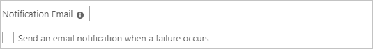

# Configure Twingate for automatic user provisioning with Microsoft Entra ID

This article describes the steps you need to perform in both Twingate and Microsoft Entra ID to configure automatic user provisioning. When configured, Microsoft Entra ID automatically provisions and de-provisions users and groups to [Twingate](https://www.twingate.com/) using the Microsoft Entra provisioning service. For important details on what this service does, how it works, and frequently asked questions, see [Automate user provisioning and deprovisioning to SaaS applications with Microsoft Entra ID](~/identity/app-provisioning/user-provisioning.md).

## Capabilities Supported
> [!div class="checklist"]
> * Create users in Twingate
> * Remove users in Twingate when they don't require access anymore
> * Keep user attributes synchronized between Microsoft Entra ID and Twingate
> * Provision groups and group memberships in Twingate
> * Single sign-on to Twingate (recommended)

## Prerequisites

The scenario outlined in this article assumes that you already have the following prerequisites:

* [A Microsoft Entra tenant](~/identity-platform/quickstart-create-new-tenant.md)
* One of the following roles: [Application Administrator](/entra/identity/role-based-access-control/permissions-reference#application-administrator), [Cloud Application Administrator](/entra/identity/role-based-access-control/permissions-reference#cloud-application-administrator), or [Application Owner](/entra/fundamentals/users-default-permissions#owned-enterprise-applications).
* A Twingate tenant in a product tier that supports identity provider integration. See [Twingate pricing](https://www.twingate.com/pricing/) for details on different product tiers.
* A user account in Twingate with Admin permissions.

## Step 1: Plan your provisioning deployment
1. Learn about [how the provisioning service works](~/identity/app-provisioning/user-provisioning.md).
2. Determine who's in [scope for provisioning](~/identity/app-provisioning/define-conditional-rules-for-provisioning-user-accounts.md).
3. Determine what data to [map between Microsoft Entra ID and Twingate](~/identity/app-provisioning/customize-application-attributes.md).

## Step 2: Configure Twingate to support provisioning with Microsoft Entra ID

1. Sign in to your [Twingate Admin Console](https://auth.twingate.com/).
2. Navigate to **Settings > Identity Provider**
3. Select the `...` button to open the action menu. Select **Regenerate SCIM Token**. Note that this would invalidate your existing token if any.

      

4. Copy the **SCIM Endpoint** and **SCIM token** from the modal. These values are entered in the **Tenant URL** and **Secret Token** fields respectively in the Provisioning tab of your Twingate application.

      

## Step 3: Add Twingate from the Microsoft Entra application gallery

Add Twingate from the Microsoft Entra application gallery to start managing provisioning to Twingate. If you have previously setup Twingate for SSO, you can use the same application. However, we recommend that you create a separate app when testing out the integration initially. Learn more about adding an application from the gallery [here](~/identity/enterprise-apps/add-application-portal.md).

## Step 4: Define who is in scope for provisioning

[!INCLUDE [create-assign-users-provisioning.md](~/identity/saas-apps/includes/create-assign-users-provisioning.md)]

## Step 5: Configure automatic user provisioning to Twingate

This section guides you through the steps to configure the Microsoft Entra provisioning service to create, update, and disable users and/or groups in Twingate based on user and/or group assignments in Microsoft Entra ID.

### To configure automatic user provisioning for Twingate in Microsoft Entra ID:

1. Sign in to the [Microsoft Entra admin center](https://entra.microsoft.com) as at least a [Cloud Application Administrator](~/identity/role-based-access-control/permissions-reference.md#cloud-application-administrator).
1. Browse to **Entra ID** > **Enterprise apps**

	

1. In the applications list, select **Twingate**.

	

3. Select the **Provisioning** tab.

	

4. Set the **Provisioning Mode** to **Automatic**.

	

5. Under the **Admin Credentials** section, input your Twingate Tenant URL and Secret Token. Select **Test Connection** to ensure Microsoft Entra ID can connect to Twingate. If the connection fails, ensure your Twingate account has Admin permissions and try again.

 	

6. In the **Notification Email** field, enter the email address of a person or group who should receive the provisioning error notifications and select the **Send an email notification when a failure occurs** check box.

	

7. Select **Save**.

8. Under the **Mappings** section, select **Synchronize Microsoft Entra users to Twingate**.

9. Review the user attributes that are synchronized from Microsoft Entra ID to Twingate in the **Attribute-Mapping** section. The attributes selected as **Matching** properties are used to match the user accounts in Twingate for update operations. If you choose to change the [matching target attribute](~/identity/app-provisioning/customize-application-attributes.md), you need to ensure that the Twingate API supports filtering users based on that attribute. Select the **Save** button to commit any changes.

   |Attribute|Type|Supported For Filtering|
   |---|---|---|
   |externalId|String|&check;|
   |userName|String|
   |active|Boolean|
   |emails[type eq "work"].value|String|
   |name.givenName|String|
   |name.familyName|String|

10. Under the **Mappings** section, select **Synchronize Microsoft Entra groups to Twingate**.

11. Review the group attributes that are synchronized from Microsoft Entra ID to Twingate in the **Attribute-Mapping** section. The attributes selected as **Matching** properties are used to match the groups in Twingate for update operations. Select the **Save** button to commit any changes.

      |Attribute|Type|Supported For Filtering|
      |---|---|---|
      |externalId|String|&check;|
      |displayName|String|
      |members|Reference|

12. To configure scoping filters, refer to the following instructions provided in the [Scoping filter  article](~/identity/app-provisioning/define-conditional-rules-for-provisioning-user-accounts.md).

13. To enable the Microsoft Entra provisioning service for Twingate, change the **Provisioning Status** to **On** in the **Settings** section.

	

14. Define the users and/or groups that you would like to provision to Twingate by choosing the desired values in **Scope** in the **Settings** section.

	

15. When you're ready to provision, select **Save**.

	

This operation starts the initial synchronization cycle of all users and groups defined in **Scope** in the **Settings** section. The initial cycle takes longer to perform than subsequent cycles, which occur approximately every 40 minutes as long as the Microsoft Entra provisioning service is running.

## Step 6: Change Assignment required setting
The default setting is **No** which allows users to log into Twingate without being assigned in the enterprise application.

1. Select **Properties**.

   

2. Set **Assignment required** to **Yes**

   

3. Select **Save**

   

## Step 7: Monitor your deployment
Once you've configured provisioning, use the following resources to monitor your deployment:

1. Use the [provisioning logs](~/identity/monitoring-health/concept-provisioning-logs.md) to determine which users have been provisioned successfully or unsuccessfully
2. Check the [progress bar](~/identity/app-provisioning/application-provisioning-when-will-provisioning-finish-specific-user.md) to see the status of the provisioning cycle and how close it's to completion
3. If the provisioning configuration seems to be in an unhealthy state, the application will go into quarantine. Learn more about quarantine states [here](~/identity/app-provisioning/application-provisioning-quarantine-status.md).

## Additional resources

* [Managing user account provisioning for Enterprise Apps](~/identity/app-provisioning/configure-automatic-user-provisioning-portal.md)
* [What is application access and single sign-on with Microsoft Entra ID?](~/identity/enterprise-apps/what-is-single-sign-on.md)

## Related content

* [Learn how to review logs and get reports on provisioning activity](~/identity/app-provisioning/check-status-user-account-provisioning.md)
