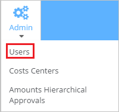
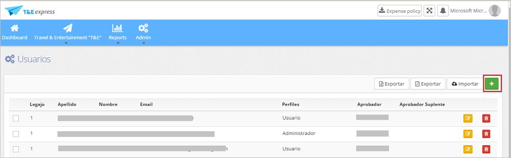
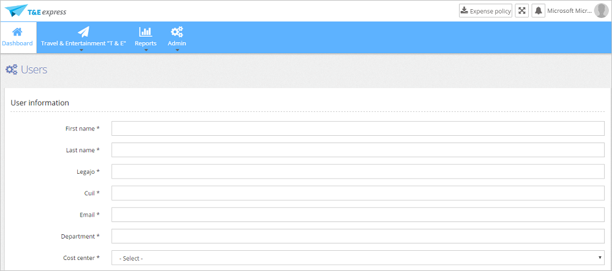
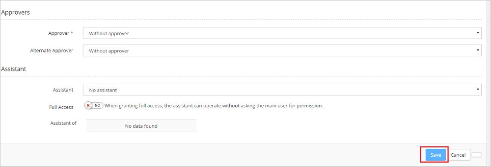

# Configure T&E Express for Single sign-on with Microsoft Entra ID

In this article,  you learn how to integrate T&E Express with Microsoft Entra ID.
Integrating T&E Express with Microsoft Entra ID provides you with the following benefits:

* You can control in Microsoft Entra ID who has access to T&E Express.
* You can enable your users to be automatically signed-in to T&E Express (Single Sign-On) with their Microsoft Entra accounts.
* You can manage your accounts in one central location.

If you want to know more details about SaaS app integration with Microsoft Entra ID, see [What is application access and single sign-on with Microsoft Entra ID](~/identity/enterprise-apps/what-is-single-sign-on.md).
If you don't have an Azure subscription, [create a free account](https://azure.microsoft.com/free/) before you begin.

## Prerequisites
The scenario outlined in this article assumes that you already have the following prerequisites:

[!INCLUDE [common-prerequisites.md](~/identity/saas-apps/includes/common-prerequisites.md)]
* T&E Express single sign-on enabled subscription

## Scenario description

In this article,  you configure and test Microsoft Entra single sign-on in a test environment.

* T&E Express supports **IDP** initiated SSO

## Adding T&E Express from the gallery

To configure the integration of T&E Express into Microsoft Entra ID, you need to add T&E Express from the gallery to your list of managed SaaS apps.

**To add T&E Express from the gallery, perform the following steps:**

1. Sign in to the [Microsoft Entra admin center](https://entra.microsoft.com) as at least a [Cloud Application Administrator](~/identity/role-based-access-control/permissions-reference.md#cloud-application-administrator).
1. Browse to **Entra ID** > **Enterprise apps** > **New application**.
1. In the search box, type **T&E Express**, select **T&E Express** from result panel then select **Add** button to add the application.

	

## Configure and test Microsoft Entra single sign-on

In this section, you configure and test Microsoft Entra single sign-on with T&E Express based on a test user called **Britta Simon**.
For single sign-on to work, a link relationship between a Microsoft Entra user and the related user in T&E Express needs to be established.

To configure and test Microsoft Entra single sign-on with T&E Express, you need to complete the following building blocks:

1. **[Configure Microsoft Entra Single Sign-On](#configure-azure-ad-single-sign-on)** - to enable your users to use this feature.
2. **[Configure T&E Express Single Sign-On](#configure-te-express-single-sign-on)** - to configure the Single Sign-On settings on application side.
3. **Create a Microsoft Entra test user** - to test Microsoft Entra single sign-on with Britta Simon.
4. **Assign the Microsoft Entra test user** - to enable Britta Simon to use Microsoft Entra single sign-on.
5. **[Create T&E Express test user](#create-te-express-test-user)** - to have a counterpart of Britta Simon in T&E Express that's linked to the Microsoft Entra representation of user.
6. **[Test single sign-on](#test-single-sign-on)** - to verify whether the configuration works.

### Configure Microsoft Entra single sign-on

In this section, you enable Microsoft Entra single sign-on.

To configure Microsoft Entra single sign-on with T&E Express, perform the following steps:

1. Sign in to the [Microsoft Entra admin center](https://entra.microsoft.com) as at least a [Cloud Application Administrator](~/identity/role-based-access-control/permissions-reference.md#cloud-application-administrator).
1. Browse to **Entra ID** > **Enterprise apps** > **T&E Express** application integration page, select **Single sign-on**.

    

1. On the **Select a Single sign-on method** dialog, select **SAML/WS-Fed** mode to enable single sign-on.

    

1. On the **Set up Single Sign-On with SAML** page, select **Edit** icon to open **Basic SAML Configuration** dialog.

	

1. On the **Set up Single Sign-On with SAML** page, perform the following steps:

    

    a. In the **Identifier** text box, type the value as URL using the following pattern:
    `https://<domain>.tyeexpress.com`

    b. In the **Reply URL** text box, type a URL using the following pattern:
    `https://<domain>.tyeexpress.com/authorize/samlConsume.aspx`

1. On the **Set up Single Sign-On with SAML** page, in the **SAML Signing Certificate** section, select **Download** to download the **Federation Metadata XML** from the given options as per your requirement and save it on your computer.

	

6. On the **Set up T&E Express** section, copy the appropriate URL(s) as per your requirement.

	

	a. Login URL

	b. Microsoft Entra Identifier

	c. Logout URL

### Configure T&E Express Single Sign-On

1. To configure single sign-on on **T&E Express** side, login to the T&E express application without SAML single sign on using admin credentials.

1. Under the **Admin** Tab, Select **SAML domain** to Open the SAML settings page.

	

1. Select the **Activar(Activate)** option from **No** to **SI(Yes)**. In the **Identity Provider Metadata** textbox, paste the metadata XML which you have downloaded.

	

1. Select the **Guardar(Save)** button to save the settings.

[!INCLUDE [create-assign-users-sso.md](~/identity/saas-apps/includes/create-assign-users-sso.md)]

### Create T&E Express test user

In order to enable Microsoft Entra users to log into T&E Express, they must be provisioned into T&E Express. In case of T&E Express, provisioning is a manual task.

**To provision a user accounts, perform the following steps:**

1. Log in to your T&E Express company site as an administrator.

1. Under Admin tag, select Users to open the Users master page.

    

1. On the home page, select **+** to add the users.

	

1. Enter all the mandatory details as asked in the form and select the save button to save the details.

	

	

### Test single sign-on

In this section, you test your Microsoft Entra single sign-on configuration using the Access Panel.

When you select the T&E Express tile in the Access Panel, you should be automatically signed in to the T&E Express for which you set up SSO. For more information about the Access Panel, see [Introduction to the Access Panel](https://support.microsoft.com/account-billing/sign-in-and-start-apps-from-the-my-apps-portal-2f3b1bae-0e5a-4a86-a33e-876fbd2a4510).

## Additional Resources

- [List of articles on How to Integrate SaaS Apps with Microsoft Entra ID](./tutorial-list.md)

- [What is application access and single sign-on with Microsoft Entra ID?](~/identity/enterprise-apps/what-is-single-sign-on.md)

- [What is Conditional Access in Microsoft Entra ID?](~/identity/conditional-access/overview.md)
