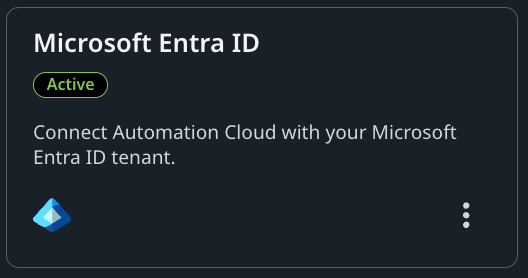
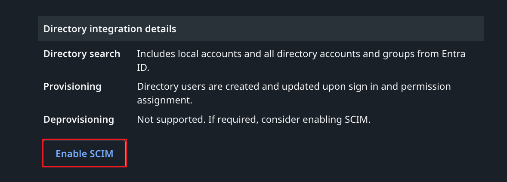
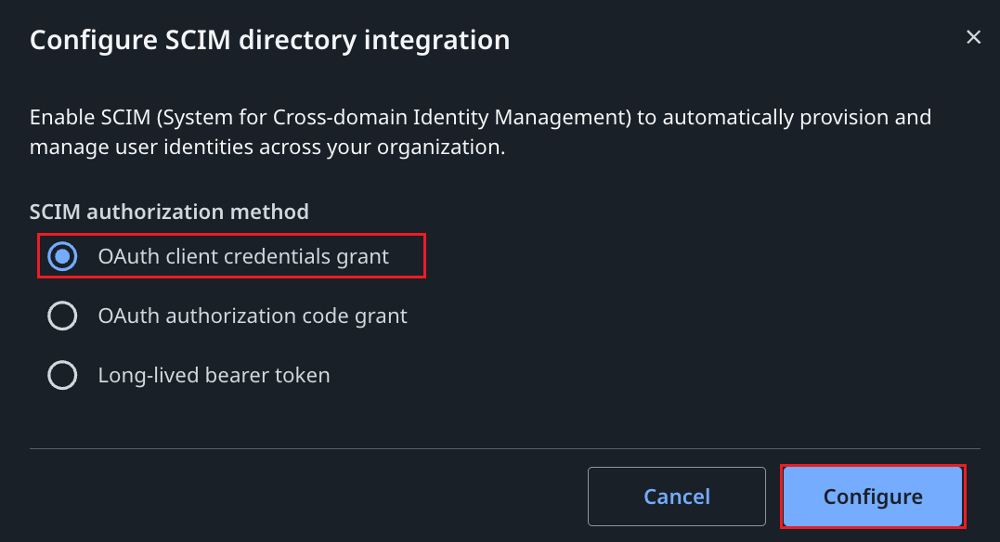
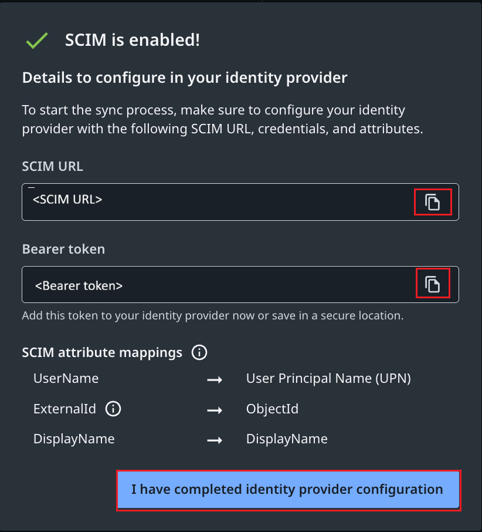
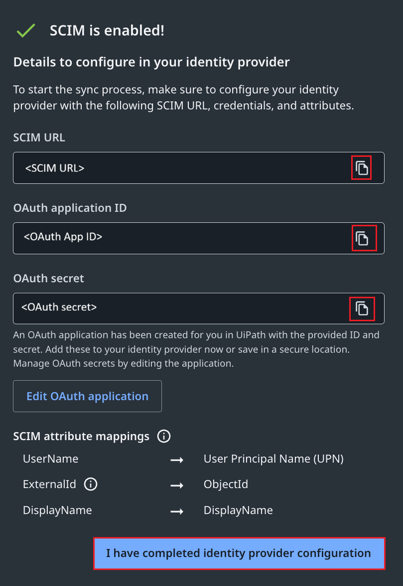
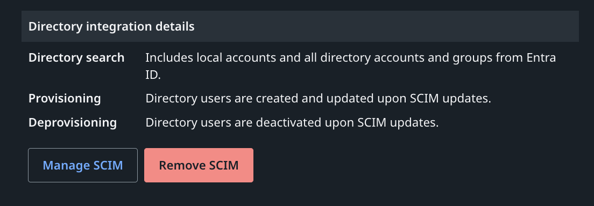

# Configure UiPath for automatic user provisioning with Microsoft Entra ID

This article describes the steps you need to perform in both UiPath and Microsoft Entra ID to configure automatic user provisioning. When configured, Microsoft Entra ID automatically provisions and deprovisions users to [UiPath](https://www.UiPath.com/) using the Microsoft Entra provisioning service. For important details on what this service does, how it works, and frequently asked questions, see [Automate user provisioning and deprovisioning to SaaS applications with Microsoft Entra ID](~/identity/app-provisioning/user-provisioning.md).  

## Capabilities supported
> [!div class="checklist"]
> * Create users in UiPath
> * Remove users in UiPath when they don't require access anymore
> * Keep user attributes synchronized between Microsoft Entra ID and UiPath
> * [Single sign-on](~/identity/enterprise-apps/add-application-portal-setup-oidc-sso.md) to UiPath (recommended).

> [!NOTE]
> UiPath currently supports user provisioning only. Group provisioning is not supported.

## Prerequisites

The scenario outlined in this article assumes that you already have the following prerequisites:

* [A Microsoft Entra tenant](~/identity-platform/quickstart-create-new-tenant.md) 
* One of the following roles: [Application Administrator](/entra/identity/role-based-access-control/permissions-reference#application-administrator), [Cloud Application Administrator](/entra/identity/role-based-access-control/permissions-reference#cloud-application-administrator), or [Application Owner](/entra/fundamentals/users-default-permissions#owned-enterprise-applications).
* A user account in UiPath with Admin permissions.

## Step 1: Plan your provisioning deployment
* Learn about [how the provisioning service works](~/identity/app-provisioning/user-provisioning.md).
* Determine who's in [scope for provisioning](~/identity/app-provisioning/define-conditional-rules-for-provisioning-user-accounts.md).
* Determine what data to [map between Microsoft Entra ID and UiPath](~/identity/app-provisioning/customize-application-attributes.md).

## Step 2: Configure UiPath to support provisioning with Microsoft Entra ID

1. Sign in to [UiPath Automation Cloud](https://cloud.uipath.com) with an account that has admin permissions in your UiPath organization.

1. In the left-hand menu, select **Admin**, then navigate to **Security Settings** > **Authentication settings**.

1. Ensure the Microsoft Entra ID directory integration is configured and shows **Active** status.

    

1. Scroll down to the **Directory integration details** section and click **Enable SCIM**.

    

1. In the **Configure SCIM directory integration** dialog, select one of the following SCIM authorization methods supported by Entra ID:
    * **OAuth client credentials grant** (Recommended)
    * **Long-lived bearer token**

    

1. Click **Configure**. The **SCIM is enabled!** confirmation screen displays the connection details you need to configure in Microsoft Entra ID.

    **For Bearer token:**
    * **SCIM URL** : The endpoint URL for the SCIM connector.
    * **Bearer token** : The secret token to authenticate requests.

    

    **For OAuth client credentials grant:**
    * **SCIM URL** : The endpoint URL for the SCIM connector.
    * **OAuth application ID** : The client identifier for the OAuth application.
    * **OAuth secret** : The client secret for the OAuth application.

    

    Please Copy these values, you will need them later in this tutorial.

    > [!NOTE]
    > Leave this browser tab open. Do not click **I have completed identity provider configuration** until you have completed the steps in Step 5.

1. After completing the Entra ID configuration in Step 5, return to UiPath and click **I have completed identity provider configuration**. The Directory integration details section now confirms SCIM provisioning and deprovisioning are active.

    

## Step 3: Add UiPath from the Microsoft Entra application gallery

Add UiPath from the Microsoft Entra application gallery to start managing provisioning to UiPath. If you have previously setup UiPath for SSO, you can use the same application. However, we recommend that you create a separate app when testing out the integration initially. Learn more about adding an application from the gallery
[here](~/identity/enterprise-apps/add-application-portal.md).

## Step 4: Define who is in scope for provisioning 

[!INCLUDE [create-assign-users-provisioning.md](~/identity/saas-apps/includes/create-assign-users-provisioning.md)]

## Step 5: Configure automatic user provisioning to UiPath 

This section guides you through the steps to configure the Microsoft Entra provisioning service to create, update, and disable users in UiPath based on user assignments in Microsoft Entra ID.

### To configure automatic user provisioning for UiPath in Microsoft Entra ID

1. Sign in to the [Microsoft Entra admin center](https://entra.microsoft.com) as at least an app owner or a [Cloud Application Administrator](~/identity/role-based-access-control/permissions-reference.md#cloud-application-administrator).
1. Browse to **Entra ID** > **Enterprise apps**

    

1. In the applications list, select **UiPath**.

    

1. Select the **Provisioning** tab.

    

1. Select **+ New configuration**.

    

1. In the connection details, enter the values obtained from Step 2 based on your chosen authorization method:

    **For OAuth2 client credentials grant (Recommended):**
    * **Tenant URL** — Enter the **SCIM URL** from Step 2 (e.g., `https://cloud.uipath.com/{orgId}/identity_/api/scim/v2`).
    * **Token endpoint** — Enter your UiPath organization's token exchange endpoint (e.g., `https://cloud.uipath.com/{org-name}/identity_/connect/token`).
    * **Client identifier** — Enter the **OAuth application ID** from Step 2.
    * **Client secret** — Enter the **OAuth secret** from Step 2.

    **For Bearer authentication:**
    * **Tenant URL** — Enter the **SCIM URL** from Step 2 (e.g., `https://cloud.uipath.com/{orgId}/identity_/api/scim/v2`).
    * **Secret token** — Enter the **Bearer token** from Step 2.

    Select **Test Connection** to ensure Microsoft Entra ID can connect to UiPath. If the connection fails, verify the values entered match those provided in Step 2 and try again.
    
    

1. Select **Create** to create your configuration.  

1. Select **Properties** on the **Overview** page.  

1. Select the **Edit** icon to edit the properties. Enable notification emails and provide an email to receive quarantine notifications. Enable **Accidental deletions prevention**. Select **Apply** to save the changes. 

   

1. Select **Attribute Mapping** in the left panel and select users.

1. Review the user attributes that are synchronized from Microsoft Entra ID to UiPath in the **Attribute-Mapping** section. The attributes selected as **Matching** properties are used to match the user accounts in UiPath for update operations. If you choose to change the [matching target attribute](~/identity/app-provisioning/customize-application-attributes.md), you need to ensure that the UiPath API supports filtering users based on that attribute. Select the **Save** button to commit any changes.

    |Attribute|Type|Supported for filtering|Required by UiPath|
    |---|---|---|---|
    |userName|String|&check;|&check;|
    |externalId|String|&check;|&check;|
    |displayName|String||&check;|
    |title|String||
    |emails[type eq "work"].value|String||
    |name.givenName|String||
    |name.familyName|String||
    |addresses[type eq "work"].locality|String||
    |urn:ietf:params:scim:schemas:extension:enterprise:2.0:User:organization|String||
    |urn:ietf:params:scim:schemas:extension:enterprise:2.0:User:department|String||

1. To configure scoping filters, refer to the following instructions provided in the [Scoping filter article](~/identity/app-provisioning/define-conditional-rules-for-provisioning-user-accounts.md) article.

1. When you're ready to provision, select **Start Provisioning** from the **Overview** page.

## Step 6: Monitor your deployment

[!INCLUDE [monitor-deployment.md](~/identity/saas-apps/includes/monitor-deployment.md)]

## Additional resources

* [Managing user account provisioning for Enterprise Apps](~/identity/app-provisioning/configure-automatic-user-provisioning-portal.md)
* [What is application access and single sign-on with Microsoft Entra ID?](~/identity/enterprise-apps/what-is-single-sign-on.md)

## Related content

* [Learn how to review logs and get reports on provisioning activity](~/identity/app-provisioning/check-status-user-account-provisioning.md)
