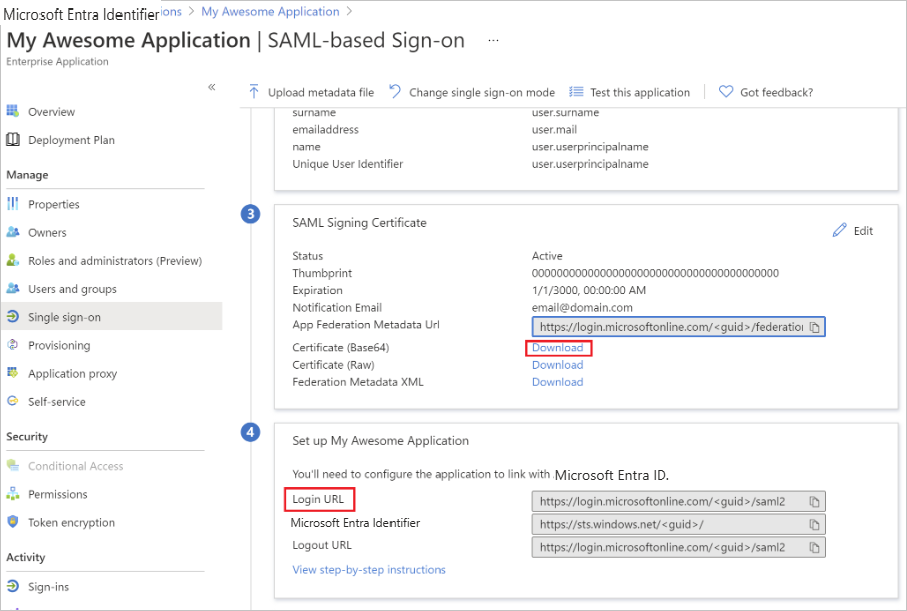
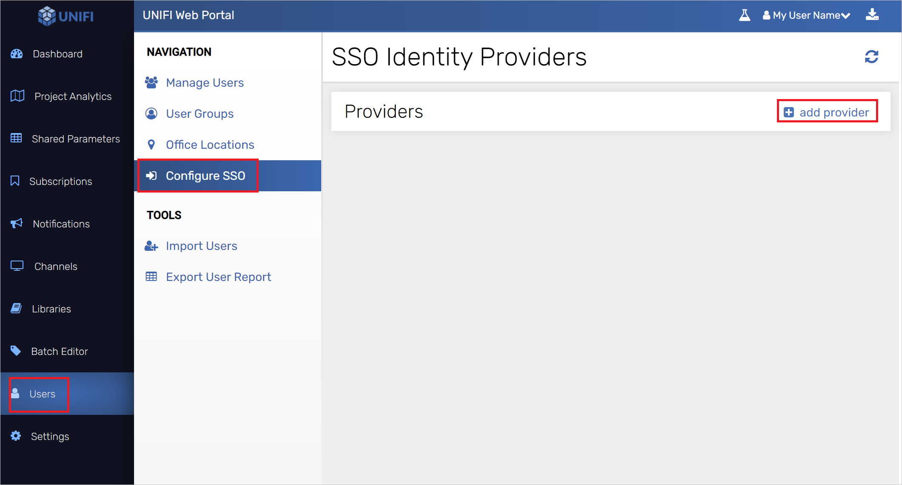
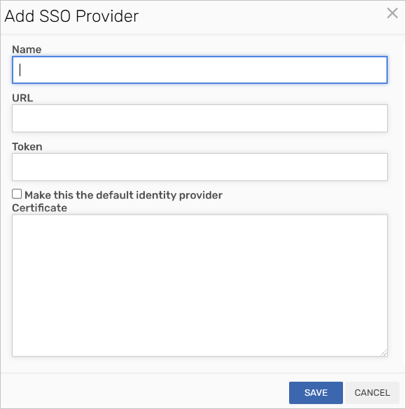
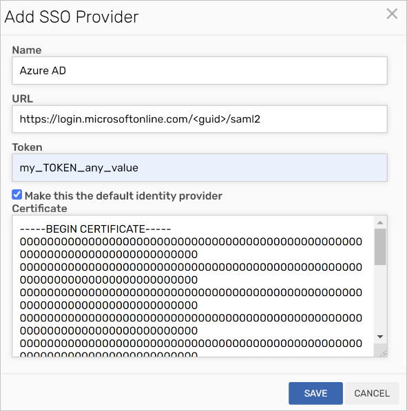

# Configure UNIFI for automatic user provisioning with Microsoft Entra ID

This article describes the steps you need to perform in both UNIFI and Microsoft Entra ID to configure automatic user provisioning. When configured, Microsoft Entra ID automatically provisions and de-provisions users and groups to [UNIFI](http://www.unifilabs.com/) using the Microsoft Entra provisioning service. For important details on what this service does, how it works, and frequently asked questions, see [Automate user provisioning and deprovisioning to SaaS applications with Microsoft Entra ID](~/identity/app-provisioning/user-provisioning.md). 

## Capabilities Supported
> [!div class="checklist"]
> * Create users in UNIFI
> * Remove users in UNIFI when they don't require access anymore
> * Keep user attributes synchronized between Microsoft Entra ID and UNIFI
> * Provision groups and group memberships in UNIFI
> * [Single sign-on](unifi-tutorial.md) to UNIFI (recommended)

## Prerequisites

The scenario outlined in this article assumes that you already have the following prerequisites:

* [!INCLUDE [common-prerequisites.md](~/identity/saas-apps/includes/common-prerequisites.md)]
* A [UNIFI](http://www.unifilabs.com/) tenant.
* A user account in UNIFI with Admin permissions.

## Step 1: Plan your provisioning deployment
1. Learn about [how the provisioning service works](~/identity/app-provisioning/user-provisioning.md).
1. Determine who's in [scope for provisioning](~/identity/app-provisioning/define-conditional-rules-for-provisioning-user-accounts.md).
1. Determine what data to [map between Microsoft Entra ID and UNIFI](~/identity/app-provisioning/customize-application-attributes.md). 

## Step 2: Configure UNIFI to support provisioning with Microsoft Entra ID

1. Make sure SSO is enabled successfully in your Enterprise Application in Azure. 
1. Find the **Login URL** in Single sign-on. In our case it's `https://login.microsoftonline.com/<guid>/saml2`.
1. Download the Certificate (Base64) under the SAML Signing Certificate section.

	

1. If your identity provider isn't added to UNIFI, then login to UNIFI Portal as a **Company Admin**. Navigate to **Users -> Configure SSO -> add provider** button.

	

1. The add SSO Provider modal is displayed.

	

1. Provide any unique **Name** value you desire. the **URL** is the **Login URL** from your Microsoft Entra Enterprise Application. Provide any value for the **Token**. Place your Certificate (Base64) value in the **Certificate** field. If you want all of your users created from this point forward to use this identity provider, select the **Make this the default identity provider** checkbox.

	

1. Select SAVE Button.

## Step 3: Add UNIFI from the Microsoft Entra application gallery

Add UNIFI from the Microsoft Entra application gallery to start managing provisioning to UNIFI. If you have previously setup UNIFI for SSO you can use the same application. However, we recommend that you create a separate app when testing out the integration initially. Learn more about adding an application from the gallery [here](~/identity/enterprise-apps/add-application-portal.md). 

## Step 4: Define who is in scope for provisioning 

[!INCLUDE [create-assign-users-provisioning.md](~/identity/saas-apps/includes/create-assign-users-provisioning.md)]

## Step 5: Configure automatic user provisioning to UNIFI 

This section guides you through the steps to configure the Microsoft Entra provisioning service to create, update, and disable users and/or groups in UNIFI based on user and/or group assignments in Microsoft Entra ID.

### Configure automatic user provisioning for UNIFI in Microsoft Entra ID

1. Sign in to the [Microsoft Entra admin center](https://entra.microsoft.com) as at least a [Cloud Application Administrator](~/identity/role-based-access-control/permissions-reference.md#cloud-application-administrator).
1. Browse to **Entra ID** > **Enterprise apps**

	

1. In the applications list, select **UNIFI**.

	

1. Select the **Provisioning** tab.

	

1. Select **+ New configuration**.

	

1. In the **Admin Credentials** section, enter your UNIFI **Tenant URL** -`https://licensing.inviewlabs.com/api/scim/v2/` and **Secret Token**. Select **Test Connection** to ensure Microsoft Entra ID can connect to UNIFI. If the connection fails, ensure your UNIFI account has Admin permissions and try again.

   

1. Select **Create** to create your configuration.

1. Select **Properties** on the **Overview** page.

1. Select the **Edit** icon to edit the properties. Enable notification emails and provide an email to receive quarantine notifications. Enable **Accidental deletions prevention**. Select **Apply** to save the changes.

   

1. Select **Attribute Mapping** in the left panel and select **users**.

1. Review the user attributes that are synchronized from Microsoft Entra ID to UNIFI in the **Attribute-Mapping** section. The attributes selected as **Matching** properties are used to match the user accounts in UNIFI for update operations. If you choose to change the [matching target attribute](~/identity/app-provisioning/customize-application-attributes.md), you need to ensure that the UNIFI API supports filtering users based on that attribute. Select the **Save** button to commit any changes.

   |Attribute|Type|Supported for filtering|
   |---|---|---|
   |userName|String|&check;
   |active|Boolean|   
   |name.givenName|String|
   |name.familyName|String|
   |externalId|String|

1. Select **Groups**.

1. Review the group attributes that are synchronized from Microsoft Entra ID to UNIFI in the **Attribute-Mapping** section. The attributes selected as **Matching** properties are used to match the groups in UNIFI for update operations. Select the **Save** button to commit any changes.

      |Attribute|Type|Supported for filtering|
      |---|---|---|
      |displayName|String|&check;
      |members|Reference|
      |externalId|String|      

1. To configure scoping filters, refer to the instructions provided in the [Scoping filter article](~/identity/app-provisioning/define-conditional-rules-for-provisioning-user-accounts.md).

1. Use [on-demand provisioning](~/identity/app-provisioning/provision-on-demand.md) to validate sync with a small number of users before deploying more broadly in your organization.  

1. When you're ready to provision, select **Start Provisioning** from the **Overview** page.

## Step 6: Monitor your deployment

[!INCLUDE [monitor-deployment.md](~/identity/saas-apps/includes/monitor-deployment.md)]

## More resources

* [Managing user account provisioning for Enterprise Apps](~/identity/app-provisioning/configure-automatic-user-provisioning-portal.md)
* [What is application access and single sign-on with Microsoft Entra ID?](~/identity/enterprise-apps/what-is-single-sign-on.md)

## Related content

* [Learn how to review logs and get reports on provisioning activity](~/identity/app-provisioning/check-status-user-account-provisioning.md)
