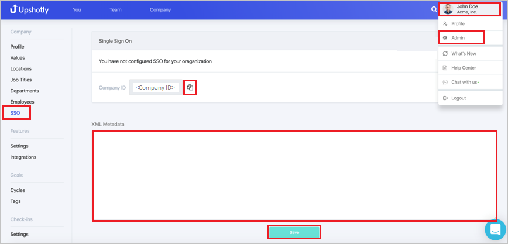

# Configure Upshotly for Single sign-on with Microsoft Entra ID

In this article,  you learn how to integrate Upshotly with Microsoft Entra ID. When you integrate Upshotly with Microsoft Entra ID, you can:

* Control in Microsoft Entra ID who has access to Upshotly.
* Enable your users to be automatically signed-in to Upshotly with their Microsoft Entra accounts.
* Manage your accounts in one central location.

## Prerequisites
The scenario outlined in this article assumes that you already have the following prerequisites:

[!INCLUDE [common-prerequisites.md](~/identity/saas-apps/includes/common-prerequisites.md)]
* Upshotly single sign-on (SSO) enabled subscription.

## Scenario description

In this article,  you configure and test Microsoft Entra SSO in a test environment.

* Upshotly supports **SP and IDP** initiated SSO

## Adding Upshotly from the gallery

To configure the integration of Upshotly into Microsoft Entra ID, you need to add Upshotly from the gallery to your list of managed SaaS apps.

1. Sign in to the [Microsoft Entra admin center](https://entra.microsoft.com) as at least a [Cloud Application Administrator](~/identity/role-based-access-control/permissions-reference.md#cloud-application-administrator).
1. Browse to **Entra ID** > **Enterprise apps** > **New application**.
1. In the **Add from the gallery** section, type **Upshotly** in the search box.
1. Select **Upshotly** from results panel and then add the app. Wait a few seconds while the app is added to your tenant.

 Alternatively, you can also use the [Enterprise App Configuration Wizard](https://portal.office.com/AdminPortal/home?Q=Docs#/azureadappintegration). In this wizard, you can add an application to your tenant, add users/groups to the app, assign roles, and walk through the SSO configuration as well. [Learn more about Microsoft 365 wizards.](/microsoft-365/admin/misc/azure-ad-setup-guides)

## Configure and test Microsoft Entra SSO for Upshotly

Configure and test Microsoft Entra SSO with Upshotly using a test user called **B.Simon**. For SSO to work, you need to establish a link relationship between a Microsoft Entra user and the related user in Upshotly.

To configure and test Microsoft Entra SSO with Upshotly, perform the following steps:

1. **[Configure Microsoft Entra SSO](#configure-azure-ad-sso)** - to enable your users to use this feature.
    1. **Create a Microsoft Entra test user** - to test Microsoft Entra single sign-on with B.Simon.
    1. **Assign the Microsoft Entra test user** - to enable B.Simon to use Microsoft Entra single sign-on.
1. **[Configure Upshotly SSO](#configure-upshotly-sso)** - to configure the single sign-on settings on application side.
    1. **[Create Upshotly test user](#create-upshotly-test-user)** - to have a counterpart of B.Simon in Upshotly that's linked to the Microsoft Entra representation of user.
1. **[Test SSO](#test-sso)** - to verify whether the configuration works.

## Configure Microsoft Entra SSO

Follow these steps to enable Microsoft Entra SSO.

1. Sign in to the [Microsoft Entra admin center](https://entra.microsoft.com) as at least a [Cloud Application Administrator](~/identity/role-based-access-control/permissions-reference.md#cloud-application-administrator).
1. Browse to **Entra ID** > **Enterprise apps** > **Upshotly** > **Single sign-on**.
1. On the **Select a single sign-on method** page, select **SAML**.
1. On the **Set up single sign-on with SAML** page, select the edit/pencil icon for **Basic SAML Configuration** to edit the settings.

   

1. On the **Basic SAML Configuration** section, if you wish to configure the application in **IDP** initiated mode, the application is pre-configured and the necessary URLs are already pre-populated with Azure. The user needs to save the configuration by selecting the **Save** button.

1. Select **Set additional URLs** and perform the following step if you wish to configure the application in **SP** initiated mode:

    In the **Sign-on URL** text box, type a URL using the following pattern:
    `https://app.upshotly.com/api/sso/login/<companyID>`

	> [!NOTE]
	> The Sign-on URL value isn't real. Update this values with the actual Sign-on URL. You get the **companyID** value explained later in the article. Contact [Upshotly Client support team](mailto:support@upshotly.com) for queries. You can also refer to the patterns shown in the **Basic SAML Configuration** section.

1. On the **Set up single sign-on with SAML** page, in the **SAML Signing Certificate** section,  find **Federation Metadata XML** and select **Download** to download the certificate and save it on your computer.

	

1. On the **Set up Upshotly** section, copy the appropriate URL(s) based on your requirement.

	

[!INCLUDE [create-assign-users-sso.md](~/identity/saas-apps/includes/create-assign-users-sso.md)]

## Configure Upshotly SSO

1. In a different web browser window, sign in to your Upshotly company site as an administrator

1. Select the **User Profile** and navigate to **Admin > SSO** and perform the following steps:

	

	a. Copy the **Company ID** value and use this **Company ID** value to replace **Company ID** value present in the **Sign On URL** in the **Basic SAML Configuration** section.

	b. Open downloaded **Federation metadata XML** from Azure portal into Notepad, copy the content of metadata XML and paste it into **XML metadata** textbox.

### Create Upshotly test user

In this section, you create a user called B.Simon in Upshotly Edge Cloud. Work with [Upshotly Client support team](mailto:support@upshotly.com) to add the users in the Upshotly Edge Cloud platform. Users must be created and activated before you use single sign-on.

## Test SSO 

In this section, you test your Microsoft Entra single sign-on configuration with following options.

#### SP initiated:

* Select **Test this application**, this option redirects to Upshotly Sign on URL where you can initiate the login flow.

* Go to Upshotly Sign-on URL directly and initiate the login flow from there.

#### IDP initiated:

* Select **Test this application**, and you should be automatically signed in to the Upshotly for which you set up the SSO

You can also use Microsoft My Apps to test the application in any mode. When you select the Upshotly tile in the My Apps, if configured in SP mode you would be redirected to the application sign on page for initiating the login flow and if configured in IDP mode, you should be automatically signed in to the Upshotly for which you set up the SSO. For more information about the My Apps, see [Introduction to the My Apps](https://support.microsoft.com/account-billing/sign-in-and-start-apps-from-the-my-apps-portal-2f3b1bae-0e5a-4a86-a33e-876fbd2a4510).

## Related content

Once you configure Upshotly you can enforce session control, which protects exfiltration and infiltration of your organization’s sensitive data in real time. Session control extends from Conditional Access. [Learn how to enforce session control with Microsoft Defender for Cloud Apps](/cloud-app-security/proxy-deployment-any-app).
