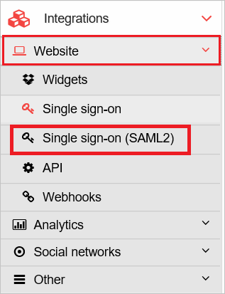
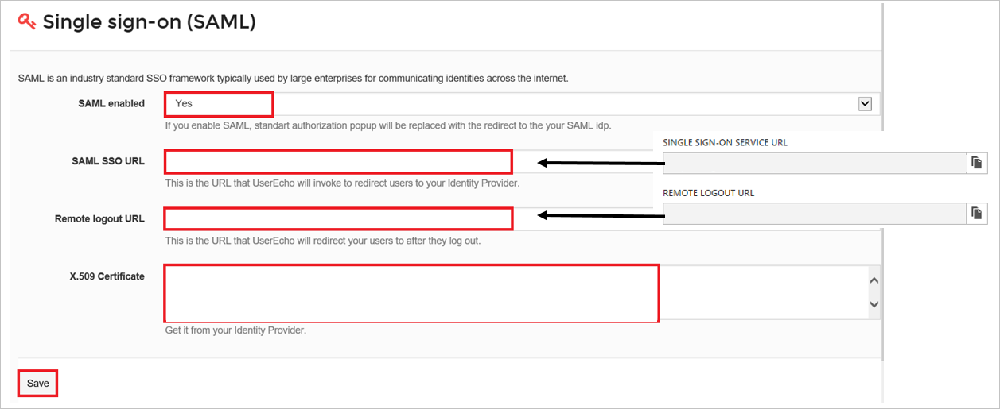
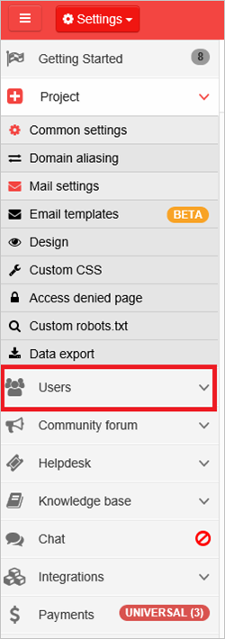
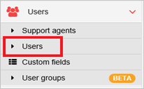

# Tutorial: Microsoft Entra SSO integration with UserEcho

In this tutorial, you'll learn how to integrate UserEcho with Microsoft Entra ID. When you integrate UserEcho with Microsoft Entra ID, you can:

* Control in Microsoft Entra ID who has access to UserEcho.
* Enable your users to be automatically signed-in to UserEcho with their Microsoft Entra accounts.
* Manage your accounts in one central location.

## Prerequisites

To configure Microsoft Entra integration with UserEcho, you need the following items:

* A Microsoft Entra subscription. If you don't have a Microsoft Entra environment, you can get a [free account](https://azure.microsoft.com/free/).
* UserEcho single sign-on enabled subscription.
* Along with Cloud Application Administrator, Application Administrator can also add or manage applications in Microsoft Entra ID.
For more information, see [Azure built-in roles](~/identity/role-based-access-control/permissions-reference.md).

## Scenario description

In this tutorial, you configure and test Microsoft Entra single sign-on in a test environment.

* UserEcho supports **SP** initiated SSO.

## Add UserEcho from the gallery

To configure the integration of UserEcho into Microsoft Entra ID, you need to add UserEcho from the gallery to your list of managed SaaS apps.

1. Sign in to the [Microsoft Entra admin center](https://entra.microsoft.com) as at least a [Cloud Application Administrator](~/identity/role-based-access-control/permissions-reference.md#cloud-application-administrator).
1. Browse to **Identity** > **Applications** > **Enterprise applications** > **New application**.
1. In the **Add from the gallery** section, type **UserEcho** in the search box.
1. Select **UserEcho** from results panel and then add the app. Wait a few seconds while the app is added to your tenant.

 Alternatively, you can also use the [Enterprise App Configuration Wizard](https://portal.office.com/AdminPortal/home?Q=Docs#/azureadappintegration). In this wizard, you can add an application to your tenant, add users/groups to the app, assign roles, as well as walk through the SSO configuration as well. [Learn more about Microsoft 365 wizards.](/microsoft-365/admin/misc/azure-ad-setup-guides)

## Configure and test Microsoft Entra SSO for UserEcho

Configure and test Microsoft Entra SSO with UserEcho using a test user called **B.Simon**. For SSO to work, you need to establish a link relationship between a Microsoft Entra user and the related user in UserEcho.

To configure and test Microsoft Entra SSO with UserEcho, perform the following steps:

1. **[Configure Microsoft Entra SSO](#configure-azure-ad-sso)** - to enable your users to use this feature.
   1. **[Create a Microsoft Entra test user](#create-an-azure-ad-test-user)** - to test Microsoft Entra single sign-on with B.Simon.
   1. **[Assign the Microsoft Entra test user](#assign-the-azure-ad-test-user)** - to enable B.Simon to use Microsoft Entra single sign-on.
1. **[Configure UserEcho SSO](#configure-userecho-sso)** - to configure the single sign-on settings on application side.
   1. **[Create UserEcho test user](#create-userecho-test-user)** - to have a counterpart of B.Simon in UserEcho that is linked to the Microsoft Entra representation of user.
1. **[Test SSO](#test-sso)** - to verify whether the configuration works.

## Configure Microsoft Entra SSO

Follow these steps to enable Microsoft Entra SSO.

1. Sign in to the [Microsoft Entra admin center](https://entra.microsoft.com) as at least a [Cloud Application Administrator](~/identity/role-based-access-control/permissions-reference.md#cloud-application-administrator).
1. Browse to **Identity** > **Applications** > **Enterprise applications** > **UserEcho** > **Single sign-on**.
1. On the **Select a single sign-on method** page, select **SAML**.
1. On the **Set up single sign-on with SAML** page, click the pencil icon for **Basic SAML Configuration** to edit the settings.

   

1. On the **Basic SAML Configuration** section, perform the following steps:

    a. In the **Identifier (Entity ID)** text box, type a URL using the following pattern:
    `https://<companyname>.userecho.com/saml/metadata/`

	b. In the **Sign on URL** text box, type a URL using the following pattern:
    `https://<companyname>.userecho.com/`

	> [!NOTE]
	> These values are not real. Update these values with the actual Identifier and Sign on URL. Contact [UserEcho Client support team](https://feedback.userecho.com/) to get these values. You can also refer to the patterns shown in the **Basic SAML Configuration** section.

1. On the **Set up Single Sign-On with SAML** page, in the **SAML Signing Certificate** section, click **Download** to download the **Certificate (Base64)** from the given options as per your requirement and save it on your computer.

	

1. On the **Set up UserEcho** section, copy the appropriate URL(s) as per your requirement.

	

### Create a Microsoft Entra test user 

In this section, you'll create a test user called B.Simon.

1. Sign in to the [Microsoft Entra admin center](https://entra.microsoft.com) as at least a [User Administrator](~/identity/role-based-access-control/permissions-reference.md#user-administrator).
1. Browse to **Identity** > **Users** > **All users**.
1. Select **New user** > **Create new user**, at the top of the screen.
1. In the **User** properties, follow these steps:
   1. In the **Display name** field, enter `B.Simon`.  
   1. In the **User principal name** field, enter the username@companydomain.extension. For example, `B.Simon@contoso.com`.
   1. Select the **Show password** check box, and then write down the value that's displayed in the **Password** box.
   1. Select **Review + create**.
1. Select **Create**.

### Assign the Microsoft Entra test user

In this section, you'll enable B.Simon to use single sign-on by granting access to UserEcho.

1. Sign in to the [Microsoft Entra admin center](https://entra.microsoft.com) as at least a [Cloud Application Administrator](~/identity/role-based-access-control/permissions-reference.md#cloud-application-administrator).
1. Browse to **Identity** > **Applications** > **Enterprise applications** > **UserEcho**.
1. In the app's overview page, find the **Manage** section and select **Users and groups**.
1. Select **Add user**, then select **Users and groups** in the **Add Assignment** dialog.
1. In the **Users and groups** dialog, select **B.Simon** from the Users list, then click the **Select** button at the bottom of the screen.
1. If you're expecting any role value in the SAML assertion, in the **Select Role** dialog, select the appropriate role for the user from the list and then click the **Select** button at the bottom of the screen.
1. In the **Add Assignment** dialog, click the **Assign** button.

## Configure UserEcho SSO

1. In another browser window, sign on to your UserEcho company site as an administrator.

2. In the toolbar on the top, click your user name to expand the menu, and then click **Setup**.
   
     

3. Click **Integrations**.
   
     

4. Click **Website**, and then click **Single sign-on (SAML2)**.
   
     

5. On the **Single sign-on (SAML)** page, perform the following steps:
   
    
	
	a. As **SAML-enabled**, select **Yes**.
	
	b. Paste **Login URL** into the **SAML SSO URL** textbox.
	
	c. Paste **Logout URL** into the **Remote Logout URL** textbox.
	
	d. Open your downloaded certificate in Notepad, copy the content, and then paste it into the **X.509 Certificate** textbox.
	
	e. Click **Save**.

### Create UserEcho test user

The objective of this section is to create a user called Britta Simon in UserEcho.

**To create a user called Britta Simon in UserEcho, perform the following steps:**

1. Sign-on to your UserEcho company site as an administrator.

2. In the toolbar on the top, click your user name to expand the menu, and then click **Setup**.
   
    

3. Click **Users**, to expand the **Users** section.
   
    

4. Click **Users**.
   
    

5. Click **Invite a new user**.
   
    

6. On the **Invite a new user** dialog, perform the following steps:
   
    

	a. In the **Name** textbox, type name of the user like Britta Simon.
	
	b.  In the **Email** textbox, type the email address of user like Brittasimon@contoso.com.
	
	c. Click **Invite**.

## Test SSO 

In this section, you test your Microsoft Entra single sign-on configuration with following options. 

* Click on **Test this application**, this will redirect to UserEcho Sign-on URL where you can initiate the login flow. 

* Go to UserEcho Sign-on URL directly and initiate the login flow from there.

* You can use Microsoft My Apps. When you click the UserEcho tile in the My Apps, this will redirect to UserEcho Sign-on URL. For more information, see [Microsoft Entra My Apps](/azure/active-directory/manage-apps/end-user-experiences#azure-ad-my-apps).

## Next steps

Once you configure UserEcho you can enforce session control, which protects exfiltration and infiltration of your organization’s sensitive data in real time. Session control extends from Conditional Access. [Learn how to enforce session control with Microsoft Cloud App Security](/cloud-app-security/proxy-deployment-aad).
