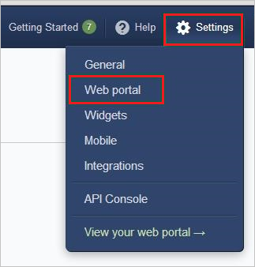
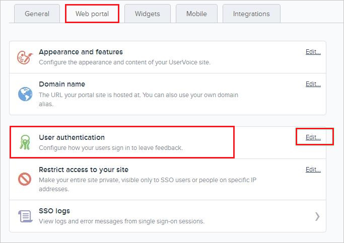
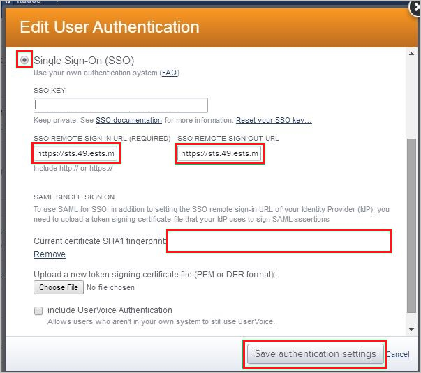
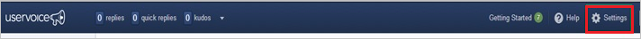
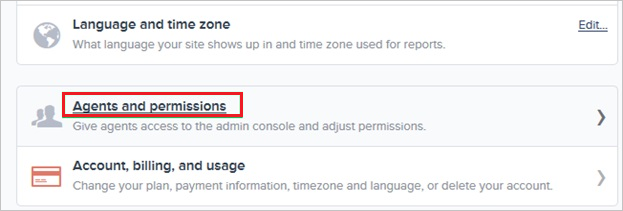
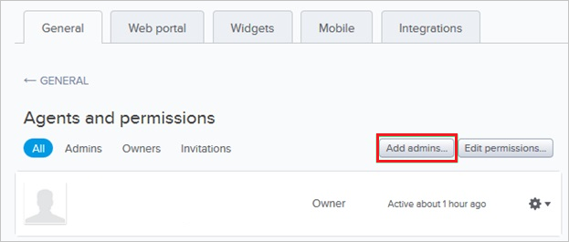
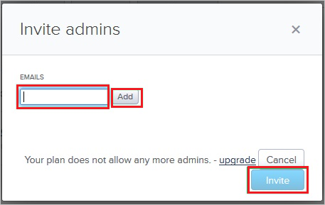

# Configure UserVoice for Single sign-on with Microsoft Entra ID

In this article,  you learn how to integrate UserVoice with Microsoft Entra ID. When you integrate UserVoice with Microsoft Entra ID, you can:

* Control in Microsoft Entra ID who has access to UserVoice.
* Enable your users to be automatically signed-in to UserVoice with their Microsoft Entra accounts.
* Manage your accounts in one central location.

## Prerequisites
The scenario outlined in this article assumes that you already have the following prerequisites:

[!INCLUDE [common-prerequisites.md](~/identity/saas-apps/includes/common-prerequisites.md)]
* UserVoice single sign-on enabled subscription.

## Scenario description

In this article,  you configure and test Microsoft Entra single sign-on in a test environment.

* UserVoice supports **SP** initiated SSO.

## Add UserVoice from the gallery

To configure the integration of UserVoice into Microsoft Entra ID, you need to add UserVoice from the gallery to your list of managed SaaS apps.

1. Sign in to the [Microsoft Entra admin center](https://entra.microsoft.com) as at least a [Cloud Application Administrator](~/identity/role-based-access-control/permissions-reference.md#cloud-application-administrator).
1. Browse to **Entra ID** > **Enterprise apps** > **New application**.
1. In the **Add from the gallery** section, type **UserVoice** in the search box.
1. Select **UserVoice** from results panel and then add the app. Wait a few seconds while the app is added to your tenant.

 Alternatively, you can also use the [Enterprise App Configuration Wizard](https://portal.office.com/AdminPortal/home?Q=Docs#/azureadappintegration). In this wizard, you can add an application to your tenant, add users/groups to the app, assign roles, and walk through the SSO configuration as well. [Learn more about Microsoft 365 wizards.](/microsoft-365/admin/misc/azure-ad-setup-guides)

## Configure and test Microsoft Entra SSO for UserVoice

Configure and test Microsoft Entra SSO with UserVoice using a test user called **B.Simon**. For SSO to work, you need to establish a link relationship between a Microsoft Entra user and the related user in UserVoice.

To configure and test Microsoft Entra SSO with UserVoice, perform the following steps:

1. **[Configure Microsoft Entra SSO](#configure-azure-ad-sso)** - to enable your users to use this feature.
    1. **Create a Microsoft Entra test user** - to test Microsoft Entra single sign-on with B.Simon.
    1. **Assign the Microsoft Entra test user** - to enable B.Simon to use Microsoft Entra single sign-on.
1. **[Configure UserVoice SSO](#configure-uservoice-sso)** - to configure the single sign-on settings on application side.
    1. **[Create UserVoice test user](#create-uservoice-test-user)** - to have a counterpart of B.Simon in UserVoice that's linked to the Microsoft Entra representation of user.
1. **[Test SSO](#test-sso)** - to verify whether the configuration works.

## Configure Microsoft Entra SSO

Follow these steps to enable Microsoft Entra SSO.

1. Sign in to the [Microsoft Entra admin center](https://entra.microsoft.com) as at least a [Cloud Application Administrator](~/identity/role-based-access-control/permissions-reference.md#cloud-application-administrator).
1. Browse to **Entra ID** > **Enterprise apps** > **UserVoice** > **Single sign-on**.
1. On the **Select a single sign-on method** page, select **SAML**.
1. On the **Set up single sign-on with SAML** page, select the pencil icon for **Basic SAML Configuration** to edit the settings.

   

1. On the **Basic SAML Configuration** section, perform the following steps:

    a. In the **Identifier (Entity ID)** text box, type a URL using the following pattern:
    `https://<TENANT_NAME>.UserVoice.com`

    b. In the **Sign on URL** text box, type a URL using the following pattern:
    `https://<TENANT_NAME>.UserVoice.com`

	> [!NOTE]
	> These values aren't real. Update these values with the actual Identifier and Sign on URL. Contact [UserVoice Client support team](https://www.uservoice.com/) to get these values. You can also refer to the patterns shown in the **Basic SAML Configuration** section.

5. In the **SAML Signing Certificate** section, select **Edit** button to open **SAML Signing Certificate** dialog.

	

6. In the **SAML Signing Certificate** section, copy the **Thumbprint** and save it on your computer.

    

7. On the **Set up UserVoice** section, copy the appropriate URL(s) as per your requirement.

	

[!INCLUDE [create-assign-users-sso.md](~/identity/saas-apps/includes/create-assign-users-sso.md)]

## Configure UserVoice SSO

1. In a different web browser window, sign in to your UserVoice company site as an administrator.

2. In the toolbar on the top, select **Settings**, and then select **Web portal** from the menu.
   
    

3. On the **Web portal** tab, in the **User authentication** section, select **Edit** to open the **Edit User Authentication** dialog page.
   
    

4. On the **Edit User Authentication** dialog page, perform the following steps:
   
    
   
    a. Select **Single Sign-On (SSO)**.
 
    b. Paste the **Login URL** value into the **SSO Remote Sign-In** textbox.

    c. Paste the **Logout URL** value into the **SSO Remote Sign-Out textbox**.
 
    d. Paste the **Thumbprint** value,.  into the **Current certificate SHA1 fingerprint** textbox.
	
	e. Select **Save authentication settings**.

### Create UserVoice test user

To enable Microsoft Entra users to sign in to UserVoice, they must be provisioned into UserVoice. In the case of UserVoice, provisioning is a manual task.

### To provision a user account, perform the following steps:

1. Sign in to your **UserVoice** tenant.

2. Go to **Settings**.
   
    

3. Select **General**.

4. Select **Agents and permissions**.
   
    

5. Select **Add admins**.
   
    

6. On the **Invite admins** dialog, perform the following steps:
   
    
   
    a. In the Emails textbox, type the email address of the account you want to provision, and then select **Add**.
   
    b. Select **Invite**.

> [!NOTE]
> You can use any other UserVoice user account creation tools or APIs provided by UserVoice to provision Microsoft Entra user accounts.

## Test SSO 

In this section, you test your Microsoft Entra single sign-on configuration with following options. 

* Select **Test this application**, this option redirects to UserVoice Sign-on URL where you can initiate the login flow. 

* Go to UserVoice Sign-on URL directly and initiate the login flow from there.

* You can use Microsoft My Apps. When you select the UserVoice tile in the My Apps, this option redirects to UserVoice Sign-on URL. For more information about the My Apps, see [Introduction to the My Apps](https://support.microsoft.com/account-billing/sign-in-and-start-apps-from-the-my-apps-portal-2f3b1bae-0e5a-4a86-a33e-876fbd2a4510).

## Related content

Once you configure UserVoice you can enforce session control, which protects exfiltration and infiltration of your organization’s sensitive data in real time. Session control extends from Conditional Access. [Learn how to enforce session control with Microsoft Defender for Cloud Apps](/cloud-app-security/proxy-deployment-aad).
