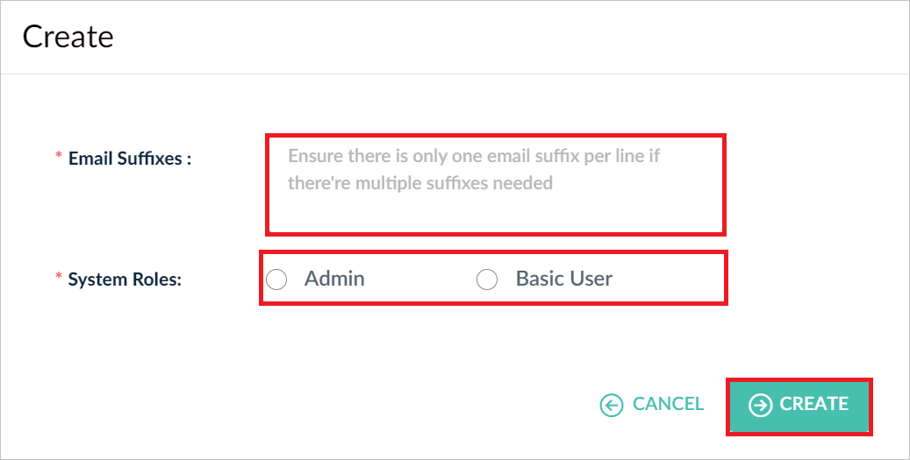

# Configure valid8Me for Single sign-on with Microsoft Entra ID

In this article,  you learn how to integrate valid8Me with Microsoft Entra ID. When you integrate valid8Me with Microsoft Entra ID, you can:

* Control in Microsoft Entra ID who has access to valid8Me.
* Enable your users to be automatically signed-in to valid8Me with their Microsoft Entra accounts.
* Manage your accounts in one central location.

## Prerequisites

To get started, you need the following items:

* A Microsoft Entra subscription. If you don't have a subscription, you can get a [free account](https://azure.microsoft.com/free/).
* valid8Me single sign-on (SSO) enabled subscription.
* Along with Cloud Application Administrator, Application Administrator can also add or manage applications in Microsoft Entra ID.
For more information, see [Azure built-in roles](~/identity/role-based-access-control/permissions-reference.md).

## Scenario description

In this article,  you configure and test Microsoft Entra SSO in a test environment.

* valid8Me supports **SP** and **IDP** initiated SSO.

> [!NOTE]
> Identifier of this application is a fixed string value so only one instance can be configured in one tenant.

## Add valid8Me from the gallery

To configure the integration of valid8Me into Microsoft Entra ID, you need to add valid8Me from the gallery to your list of managed SaaS apps.

1. Sign in to the [Microsoft Entra admin center](https://entra.microsoft.com) as at least a [Cloud Application Administrator](~/identity/role-based-access-control/permissions-reference.md#cloud-application-administrator).
1. Browse to **Entra ID** > **Enterprise apps** > **New application**.
1. In the **Add from the gallery** section, type **valid8Me** in the search box.
1. Select **valid8Me** from results panel and then add the app. Wait a few seconds while the app is added to your tenant.

 Alternatively, you can also use the [Enterprise App Configuration Wizard](https://portal.office.com/AdminPortal/home?Q=Docs#/azureadappintegration). In this wizard, you can add an application to your tenant, add users/groups to the app, assign roles, and walk through the SSO configuration as well. [Learn more about Microsoft 365 wizards.](/microsoft-365/admin/misc/azure-ad-setup-guides)

## Configure and test Microsoft Entra SSO for valid8Me

Configure and test Microsoft Entra SSO with valid8Me using a test user called **B.Simon**. For SSO to work, you need to establish a link relationship between a Microsoft Entra user and the related user at valid8Me.

To configure and test Microsoft Entra SSO with valid8Me, perform the following steps:

1. **[Configure Microsoft Entra SSO](#configure-azure-ad-sso)** - to enable your users to use this feature.
    1. **Create a Microsoft Entra test user** - to test Microsoft Entra single sign-on with B.Simon.
    1. **Assign the Microsoft Entra test user** - to enable B.Simon to use Microsoft Entra single sign-on.
1. **[Configure valid8Me SSO](#configure-valid8me-sso)** - to configure the single sign-on settings on application side.
    1. **[Create valid8Me test user](#create-valid8me-test-user)** - to have a counterpart of B.Simon in valid8Me that's linked to the Microsoft Entra representation of user.
1. **[Test SSO](#test-sso)** - to verify whether the configuration works.

## Configure Microsoft Entra SSO

Follow these steps to enable Microsoft Entra SSO.

1. Sign in to the [Microsoft Entra admin center](https://entra.microsoft.com) as at least a [Cloud Application Administrator](~/identity/role-based-access-control/permissions-reference.md#cloud-application-administrator).
1. Browse to **Entra ID** > **Enterprise apps** > **valid8Me** > **Single sign-on**.
1. On the **Select a single sign-on method** page, select **SAML**.
1. On the **Set up single sign-on with SAML** page, select the pencil icon for **Basic SAML Configuration** to edit the settings.

    

1. On the **Basic SAML Configuration** section, the user doesn't have to perform any step as the app is already pre-integrated with Azure.

1. If you wish to configure the application in **SP** initiated mode:

    In the **Sign on URL (Optional)** text box, type a URL using the following pattern:
    `https://login.valid8me.com/?idp=https://sts.windows.net/${TenantID}/`

    > [!Note]
    > This value isn't real. Update this value with the actual Sign on URL. Contact [valid8Me support team](mailto:support@valid8me.com) to get the value. You can also refer to the patterns shown in the **Basic SAML Configuration** section.

1. On the **Set up single sign-on with SAML** page, in the **SAML Signing Certificate** section,  find **Certificate (Base64)** and select **Download** to download the certificate and save it on your computer.

    

1. On the **Set up valid8Me** section, copy the appropriate URL(s) based on your requirement.

	  

[!INCLUDE [create-assign-users-sso.md](~/identity/saas-apps/includes/create-assign-users-sso.md)]

## Configure valid8Me SSO

1. Log in to your valid8Me company site as an administrator.

1. From the left side menu, expand **Configuration** >  **Single Sign On** > **Identity Management** tab and select **Create**.

1. In the **Microsoft Entra SAML settings** section, perform the following steps:

    a. In the **Login URL** textbox, paste the **Login URL** value, which you copied previously.

    b. In the **Microsoft Entra Identifier** textbox, paste the **Microsoft Entra Identifier** value, which you copied previously.

    c. In the **Logout URL** textbox, paste the **Logout URL** value, which you copied previously.

    d. Open the downloaded **Certificate (Base64)** into Notepad and upload file into the **Certificate (Base64)** textbox.

    e. Select **Create**.

### Create valid8Me test user

1. In a different web browser window, log in to your valid8Me website as an administrator.

1. Navigate to **Configuration** >  **Single Sign On** > **Invitation** tab and select **Create**. 
    
1. Perform the following steps in the **Create** page:

    

    1. Enter a valid email domain in the **Email Suffixes** textbox.
    
        > [!Note]
        > the domain name should be same as Microsoft Entra account email domain.

    1. Select one of the **System Roles** according to your requirement.

    1. Select **Create**.

## Test SSO 

In this section, you test your Microsoft Entra single sign-on configuration with following options. 

#### SP initiated:

* Select **Test this application**, this option redirects to valid8Me Sign on URL where you can initiate the login flow.  

* Go to valid8Me Sign on URL directly and initiate the login flow from there.

#### IDP initiated:

* Select **Test this application**, and you should be automatically signed in to the valid8Me for which you set up the SSO. 

You can also use Microsoft My Apps to test the application in any mode. When you select the valid8Me tile in the My Apps, if configured in SP mode you would be redirected to the application sign-on page for initiating the login flow and if configured in IDP mode, you should be automatically signed in to the valid8Me for which you set up the SSO. For more information, see [Microsoft Entra My Apps](/azure/active-directory/manage-apps/end-user-experiences#azure-ad-my-apps).

## Related content

Once you configure valid8Me you can enforce session control, which protects exfiltration and infiltration of your organization’s sensitive data in real time. Session control extends from Conditional Access. [Learn how to enforce session control with Microsoft Cloud App Security](/cloud-app-security/proxy-deployment-aad).
