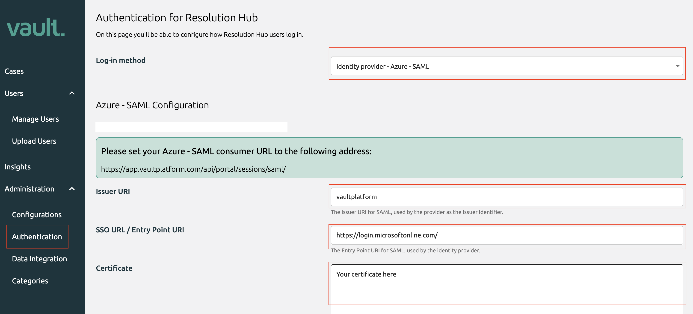
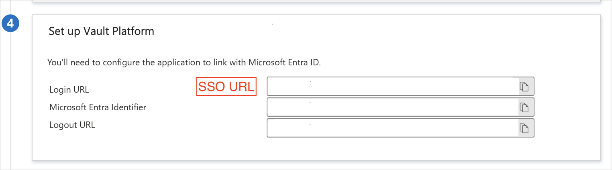
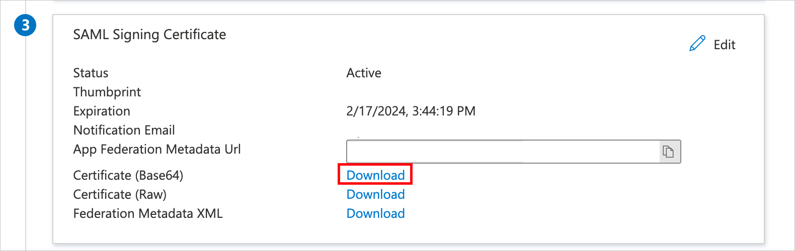
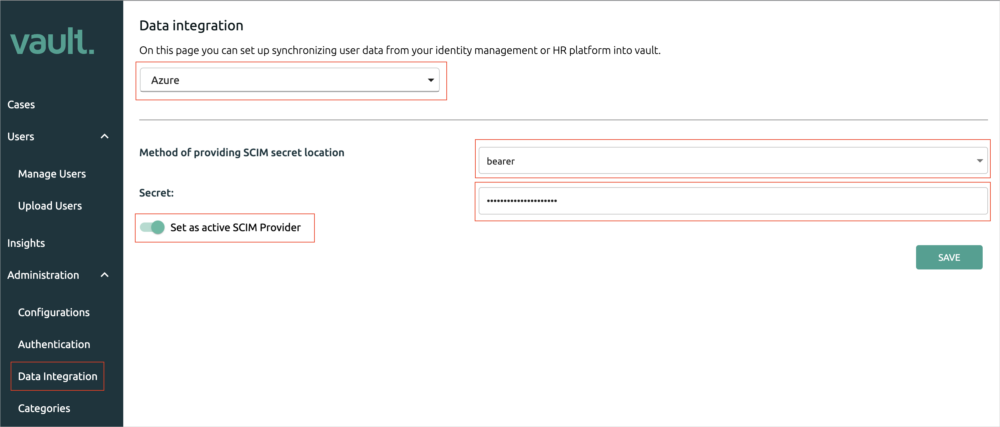

# Configure Vault Platform for automatic user provisioning with Microsoft Entra ID

This article describes the steps you need to perform in both Vault Platform and Microsoft Entra ID to configure automatic user provisioning. When configured, Microsoft Entra ID automatically provisions and de-provisions users to [Vault Platform](https://vaultplatform.com) using the Microsoft Entra provisioning service. For important details on what this service does, how it works, and frequently asked questions, see [Automate user provisioning and deprovisioning to SaaS applications with Microsoft Entra ID](~/identity/app-provisioning/user-provisioning.md). 

## Supported capabilities
> [!div class="checklist"]
> * Create users in Vault Platform.
> * Remove users in Vault Platform when they don't require access anymore.
> * Keep user attributes synchronized between Microsoft Entra ID and Vault Platform.
> * [Single sign-on](vault-platform-tutorial.md) to Vault Platform (recommended).

## Prerequisites

The scenario outlined in this article assumes that you already have the following prerequisites:

* [A Microsoft Entra tenant](~/identity-platform/quickstart-create-new-tenant.md) 
* One of the following roles: [Application Administrator](/entra/identity/role-based-access-control/permissions-reference#application-administrator), [Cloud Application Administrator](/entra/identity/role-based-access-control/permissions-reference#cloud-application-administrator), or [Application Owner](/entra/fundamentals/users-default-permissions#owned-enterprise-applications).
* An administrator account with Vault Platform.

## Step 1: Plan your provisioning deployment
1. Learn about [how the provisioning service works](~/identity/app-provisioning/user-provisioning.md).
1. Determine who's in [scope for provisioning](~/identity/app-provisioning/define-conditional-rules-for-provisioning-user-accounts.md).
1. Determine what data to [map between Microsoft Entra ID and Vault Platform](~/identity/app-provisioning/customize-application-attributes.md).

## Step 2: Configure Vault Platform to support provisioning with Microsoft Entra ID
Contact Vault Platform support to configure Vault Platform to support provisioning with Microsoft Entra ID.

### 1. Authentication

Go to the Vault Platform, login with your email and password (initial login method), then head to the **Administration > Authentication page**.

There, first change the login method dropdown to **Identity Provider - Azure - SAML**

Using the details in the SAML setup instructions page, enter the information:

1. Issuer URI must be set to `vaultplatform`
2. SSO URL must be set to the value of Login URL
   
3. Download the **Certificate (Base64)** file, open it in a text editor and copy its contents (including the `-----BEGIN/END CERTIFICATE-----` markers) into the **Certificate** text field
   

### 2. Data Integration

Next go to **Administration > Data Integration** inside Vault Platform

1. For **Data Integration** select `Azure`.
1. For **Method of providing SCIM secret location** set `bearer`.
1. For **Secret** set a complex string, similar to a strong password. Keep this string secure as it's used later on at **Step 5**
1. Toggle **Set as active SCIM Provider** to be active.

## Step 3: Add Vault Platform from the Microsoft Entra application gallery

Add Vault Platform from the Microsoft Entra application gallery to start managing provisioning to Vault Platform. If you have previously setup Vault Platform for SSO you can use the same application. However it's recommended that you create a separate app when testing out the integration initially. Learn more about adding an application from the gallery [here](~/identity/enterprise-apps/add-application-portal.md). 

## Step 4: Define who is in scope for provisioning 

[!INCLUDE [create-assign-users-provisioning.md](~/identity/saas-apps/includes/create-assign-users-provisioning.md)]

## Step 5: Configure automatic user provisioning to Vault Platform 

This section guides you through the steps to configure the Microsoft Entra provisioning service to create, update, and disable users in TestApp based on user and/or group assignments in Microsoft Entra ID.

### To configure automatic user provisioning for Vault Platform in Microsoft Entra ID:

1. Sign in to the [Microsoft Entra admin center](https://entra.microsoft.com) as at least a [Cloud Application Administrator](~/identity/role-based-access-control/permissions-reference.md#cloud-application-administrator).
1. Browse to **Entra ID** > **Enterprise apps**

	

1. In the applications list, select **Vault Platform**.

	

1. Select the **Provisioning** tab.

	

1. Set the **Provisioning Mode** to **Automatic**.

	

1. Under the **Admin Credentials** section, input your Vault Platform Tenant URL (URL with structure `https://app.vaultplatform.com/api/scim/${organization-slug}`) and Secret Token (from Step 2.2). Select **Test Connection** to ensure Microsoft Entra ID can connect to Vault Platform. If the connection fails, ensure your Vault Platform account has Admin permissions and try again.

 	

1. In the **Notification Email** field, enter the email address of a person or group who should receive the provisioning error notifications and select the **Send an email notification when a failure occurs** check box.

	

1. Select **Save**.

1. Under the **Mappings** section, select **Synchronize Microsoft Entra users to Vault Platform**.

1. Review the user attributes that are synchronized from Microsoft Entra ID to Vault Platform in the **Attribute-Mapping** section. The attributes selected as **Matching** properties are used to match the user accounts in Vault Platform for update operations. If you choose to change the [matching target attribute](~/identity/app-provisioning/customize-application-attributes.md), you need to ensure that the Vault Platform API supports filtering users based on that attribute. Select the **Save** button to commit any changes.

   |Attribute|Type|Supported for filtering|Required by Vault Platform|
   |---|---|---|---|
   |userName|String|&check;|&check;
   |externalId|String|&check;|&check;
   |active|Boolean||&check;
   |displayName|String||
   |title|String||&check;
   |emails[type eq "work"].value|String||&check;
   |name.givenName|String||&check;
   |name.familyName|String||&check;
   |addresses[type eq "work"].locality|String||&check;
   |addresses[type eq "work"].country|String||&check;
   |urn:ietf:params:scim:schemas:extension:enterprise:2.0:User:employeeNumber|String||&check;
   |urn:ietf:params:scim:schemas:extension:enterprise:2.0:User:department|String||&check;
   |urn:ietf:params:scim:schemas:extension:enterprise:2.0:User:manager|String||
   |userType|String||
   |urn:ietf:params:scim:schemas:extension:enterprise:2.0:User:division|String||
   |urn:ietf:params:scim:schemas:extension:enterprise:2.0:User:organization|String||
   
>[!NOTE]
>The attribute "externalID" is only sent to Vault on object creation and will not be updated if changed in Entra ID.

1. To configure scoping filters, refer to the following instructions provided in the [Scoping filter  article](~/identity/app-provisioning/define-conditional-rules-for-provisioning-user-accounts.md).

1. To enable the Microsoft Entra provisioning service for Vault Platform, change the **Provisioning Status** to **On** in the **Settings** section.

	

1. Define the users that you would like to provision to Vault Platform by choosing the desired values in **Scope** in the **Settings** section.

	

1. When you're ready to provision, select **Save**.

	

This operation starts the initial synchronization cycle of all users defined in **Scope** in the **Settings** section. The initial cycle takes longer to perform than subsequent cycles, which occur approximately every 40 minutes as long as the Microsoft Entra provisioning service is running. 

## Step 6: Monitor your deployment

[!INCLUDE [monitor-deployment.md](~/identity/saas-apps/includes/monitor-deployment.md)]

## More resources

* [Managing user account provisioning for Enterprise Apps](~/identity/app-provisioning/configure-automatic-user-provisioning-portal.md)
* [What is application access and single sign-on with Microsoft Entra ID?](~/identity/enterprise-apps/what-is-single-sign-on.md)

## Related content

* [Learn how to review logs and get reports on provisioning activity](~/identity/app-provisioning/check-status-user-account-provisioning.md)
