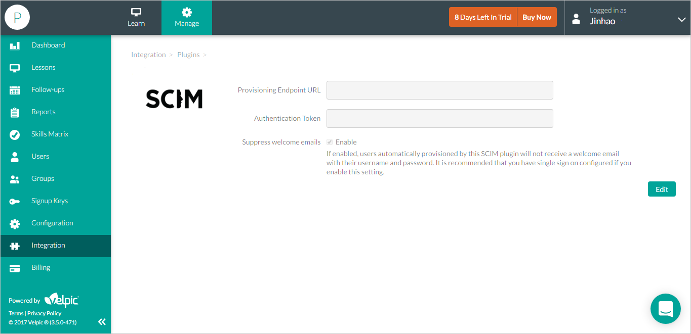

# Configure Configuring Velpic for for automatic user provisioning with Microsoft Entra ID

The objective of this article is to show you the steps you need to perform in Velpic and Microsoft Entra ID to automatically provision and de-provision user accounts from Microsoft Entra ID to Velpic.

> [!NOTE]
> This article describes a connector built on top of the Microsoft Entra user provisioning service. For important details on what this service does, how it works, and frequently asked questions, see [Automate user provisioning and deprovisioning to SaaS applications with Microsoft Entra ID](~/identity/app-provisioning/user-provisioning.md).

## Prerequisites

The scenario outlined in this article assumes that you already have the following items:

[!INCLUDE [common-prerequisites.md](~/identity/saas-apps/includes/common-prerequisites.md)]
* A Velpic tenant with the Enterprise plan or better enabled
* A user account in Velpic with Admin permissions

## Assigning users to Velpic

Microsoft Entra ID uses a concept called "assignments" to determine which users should receive access to selected apps. In the context of automatic user account provisioning, only the users and groups that have been "assigned" to an application in Microsoft Entra ID is synchronized. 

Before configuring and enabling the provisioning service, you need to decide what users and/or groups in Microsoft Entra ID represent the users who need access to your Velpic app. Once decided, you can assign these users to your Velpic app by following the instructions here:

[Assign a user or group to an enterprise app](~/identity/enterprise-apps/assign-user-or-group-access-portal.md)

### Important tips for assigning users to Velpic

* It's recommended that a single Microsoft Entra user be assigned to Velpic to test the provisioning configuration. Additional users and/or groups may be assigned later.

* When assigning a user to Velpic, you must select either the **User** role, or another valid application-specific role (if available) in the assignment dialog. The **Default Access** role doesn't work for provisioning, and these users are skipped.

## Configuring user provisioning to Velpic

This section guides you through connecting your Microsoft Entra ID to Velpic's user account provisioning API, and configuring the provisioning service to create, update, and disable assigned user accounts in Velpic based on user and group assignment in Microsoft Entra ID.

> [!TIP]
> You may also choose to enabled SAML-based Single Sign-On for Velpic, following the instructions provided in the [Azure portal](https://portal.azure.com). Single sign-on can be configured independently of automatic provisioning, though these two features complement each other.

### To configure automatic user account provisioning to Velpic in Microsoft Entra ID:

1. Sign in to the [Microsoft Entra admin center](https://entra.microsoft.com) as at least a [Cloud Application Administrator](~/identity/role-based-access-control/permissions-reference.md#cloud-application-administrator).
1. Browse to **Entra ID** > **Enterprise apps**.

2. If you have already configured Velpic for single sign-on, search for your instance of Velpic using the search field. Otherwise, select **Add** and search for **Velpic** in the application gallery. Select Velpic from the search results, and add it to your list of applications.

3. Select your instance of Velpic, then select the **Provisioning** tab.

4. Set the **Provisioning Mode** to **Automatic**.

    

5. Under the **Admin Credentials** section, input the **Tenant URL&Secret Token** of Velpic.(You can find these values under your Velpic account: **Manage** > **Integration** > **Plugin** > **SCIM**)

    

6. Select **Test Connection** to ensure Microsoft Entra ID can connect to your Velpic app. If the connection fails, ensure your Velpic account has Admin permissions and try step 5 again.

7. Enter the email address of a person or group who should receive provisioning error notifications in the **Notification Email** field, and check the checkbox below.

8. Select **Save**.

9. Under the Mappings section, select **Synchronize Microsoft Entra users to Velpic**.

10. In the **Attribute Mappings** section, review the user attributes that's synchronized from Microsoft Entra ID to Velpic. The attributes selected as **Matching** properties are used to match the user accounts in Velpic for update operations. Select the Save button to commit any changes.

11. To enable the Microsoft Entra provisioning service for Velpic, change the **Provisioning Status** to **On** in the **Settings** section

12. Select **Save**.

This starts the initial synchronization of any users and/or groups assigned to Velpic in the Users and Groups section. The initial sync takes longer to perform than subsequent syncs, which occur approximately every 40 minutes as long as the service is running. You can use the **Synchronization Details** section to monitor progress and follow links to provisioning activity reports, which describe all actions performed by the provisioning service.

For more information on how to read the Microsoft Entra provisioning logs, see [Reporting on automatic user account provisioning](~/identity/app-provisioning/check-status-user-account-provisioning.md).

## More resources

* [Managing user account provisioning for Enterprise Apps](~/identity/app-provisioning/configure-automatic-user-provisioning-portal.md)
* [What is application access and single sign-on with Microsoft Entra ID?](~/identity/enterprise-apps/what-is-single-sign-on.md)

## Related content

* [Learn how to review logs and get reports on provisioning activity](~/identity/app-provisioning/check-status-user-account-provisioning.md)
