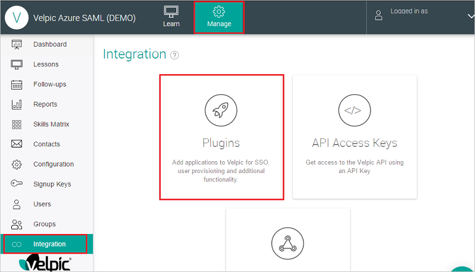
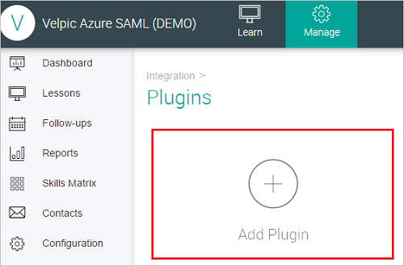
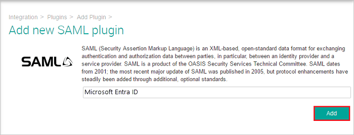
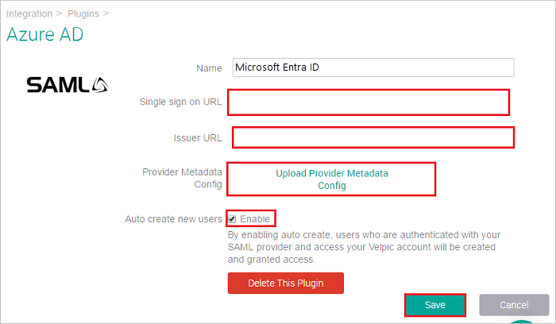
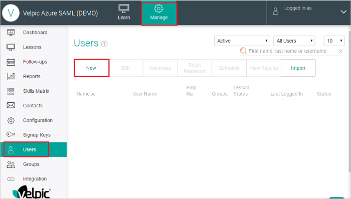
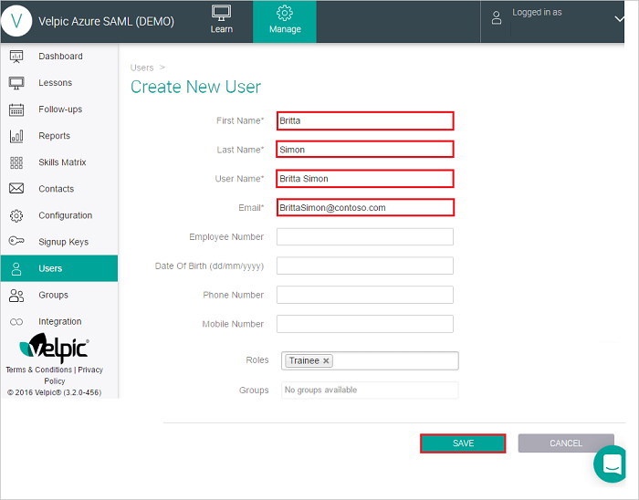
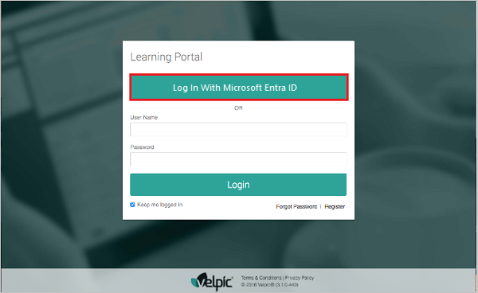

# Configure Velpic SAML for Single sign-on with Microsoft Entra ID

In this article,  you learn how to integrate Velpic SAML with Microsoft Entra ID. When you integrate Velpic SAML with Microsoft Entra ID, you can:

* Control in Microsoft Entra ID who has access to Velpic SAML.
* Enable your users to be automatically signed-in to Velpic SAML with their Microsoft Entra accounts.
* Manage your accounts in one central location.

## Prerequisites
The scenario outlined in this article assumes that you already have the following prerequisites:

[!INCLUDE [common-prerequisites.md](~/identity/saas-apps/includes/common-prerequisites.md)]
* Velpic SAML single sign-on (SSO) enabled subscription.

## Scenario description

In this article,  you configure and test Microsoft Entra SSO in a test environment.

* Velpic SAML supports **SP** initiated SSO.
* Velpic SAML supports  [Automated user provisioning](velpic-provisioning-tutorial.md).

## Adding Velpic SAML from the gallery

To configure the integration of Velpic SAML into Microsoft Entra ID, you need to add Velpic SAML from the gallery to your list of managed SaaS apps.

1. Sign in to the [Microsoft Entra admin center](https://entra.microsoft.com) as at least a [Cloud Application Administrator](~/identity/role-based-access-control/permissions-reference.md#cloud-application-administrator).
1. Browse to **Entra ID** > **Enterprise apps** > **New application**.
1. In the **Add from the gallery** section, type **Velpic SAML** in the search box.
1. Select **Velpic SAML** from results panel and then add the app. Wait a few seconds while the app is added to your tenant.    

 Alternatively, you can also use the [Enterprise App Configuration Wizard](https://portal.office.com/AdminPortal/home?Q=Docs#/azureadappintegration). In this wizard, you can add an application to your tenant, add users/groups to the app, assign roles, and walk through the SSO configuration as well. [Learn more about Microsoft 365 wizards.](/microsoft-365/admin/misc/azure-ad-setup-guides)

## Configure and test Microsoft Entra SSO for Velpic SAML

Configure and test Microsoft Entra SSO with Velpic SAML using a test user called **B.Simon**. For SSO to work, you need to establish a link relationship between a Microsoft Entra user and the related user in Velpic SAML.

To configure and test Microsoft Entra SSO with Velpic SAML, perform the following steps:

1. **[Configure Microsoft Entra SSO](#configure-azure-ad-sso)** - to enable your users to use this feature.
    1. **Create a Microsoft Entra test user** - to test Microsoft Entra single sign-on with B.Simon.
    1. **Assign the Microsoft Entra test user** - to enable B.Simon to use Microsoft Entra single sign-on.
1. **[Configure Velpic SAML SSO](#configure-velpic-saml-sso)** - to configure the single sign-on settings on application side.
    1. **[Create Velpic SAML test user](#create-velpic-saml-test-user)** - to have a counterpart of B.Simon in Velpic SAML that's linked to the Microsoft Entra representation of user.
1. **[Test SSO](#test-sso)** - to verify whether the configuration works.

## Configure Microsoft Entra SSO

Follow these steps to enable Microsoft Entra SSO.

1. Sign in to the [Microsoft Entra admin center](https://entra.microsoft.com) as at least a [Cloud Application Administrator](~/identity/role-based-access-control/permissions-reference.md#cloud-application-administrator).
1. Browse to **Entra ID** > **Enterprise apps** > **Velpic SAML** > **Single sign-on**.
1. On the **Select a single sign-on method** page, select **SAML**.
1. On the **Set up single sign-on with SAML** page, select the pencil icon for **Basic SAML Configuration** to edit the settings.

   

1. On the **Basic SAML Configuration** section, perform the following steps:

	a. In the **Sign on URL** text box, type a URL using the following pattern:
    `https://<sub-domain>.velpicsaml.net`

    b. In the **Identifier (Entity ID)** text box, type a URL using the following pattern:
    `https://auth.velpic.com/saml/v2/<entity-id>/login`

	> [!NOTE]
	> Please note that the Sign on URL is provided by the Velpic SAML team and Identifier value is available when you configure the SSO Plugin on Velpic SAML side. You need to copy that value from Velpic SAML application  page and paste it here.

1. On the **Set up single sign-on with SAML** page, in the **SAML Signing Certificate** section,  find **Federation Metadata XML** and select **Download** to download the certificate and save it on your computer.

	

1. On the **Set up Velpic SAML** section, copy the appropriate URL(s) based on your requirement.

	

[!INCLUDE [create-assign-users-sso.md](~/identity/saas-apps/includes/create-assign-users-sso.md)]

## Configure Velpic SAML SSO

1. In a different web browser window, sign in to your Velpic SAML company site as an administrator

4. Select **Manage** tab and go to **Integration** section where you need to select **Plugins** button to create new plugin for Sign-In.

	

5. Select the **Add plugin** button.
	
	

6. Select the **SAML** tile in the Add Plugin page.
	
	

7. Enter the name of the new SAML plugin and select the **Add** button.

	

8. Enter the details as follows:

	

	a. In the **Name** textbox, type the name of SAML plugin.

	b. In the **Issuer URL** textbox, paste the **Microsoft Entra Identifier** you copied from the **Configure sign-on** window.

	c. In the **Provider Metadata Config** upload the Metadata XML file which you downloaded previously.

	d. You can also choose to enable SAML just in time provisioning by enabling the **Auto create new users** checkbox. If a user doesn’t exist in Velpic and this flag isn't enabled, the login from Azure will fail. If the flag is enabled the user will automatically be provisioned into Velpic at the time of login. 

	e. Copy the **Single sign on URL** from the text box and paste it.
	
	f. Select **Save**.

### Create Velpic SAML test user

This step is usually not required as the application supports just in time user provisioning. If the automatic user provisioning isn't enabled then manual user creation can be done as described below.

Sign into your Velpic SAML company site as an administrator and perform following steps:
	
1. Select Manage tab and go to Users section, then select New button to add users.

	

2. On the **“Create New User”** dialog page, perform the following steps.

	
	
	a. In the **First Name** textbox, type the first name of B.

	b. In the **Last Name** textbox, type the last name of Simon.

	c. In the **User Name** textbox, type the user name of B.Simon.

	d. In the **Email** textbox, type the email address of B.Simon@contoso.com account.

	e. Rest of the information is optional, you can fill it if needed.
	
	f. Select **SAVE**.

> [!NOTE]
> Velpic SAML also supports automatic user provisioning, you can find more details [here](./velpic-provisioning-tutorial.md) on how to configure automatic user provisioning.

## Test SSO 

In this section, you test your Microsoft Entra single sign-on configuration using the My Apps.

1. When you select the Velpic SAML tile in the My Apps, you should get login page of Velpic SAML application. You should see the **Log In With Microsoft Entra ID** button on the sign in page.

	

1. Select the **Log In With Microsoft Entra ID** button to log in to Velpic using your Microsoft Entra account.

## Related content

Once you configure Velpic SAML you can enforce session control, which protects exfiltration and infiltration of your organization’s sensitive data in real time. Session control extends from Conditional Access. [Learn how to enforce session control with Microsoft Defender for Cloud Apps](/cloud-app-security/proxy-deployment-aad).
