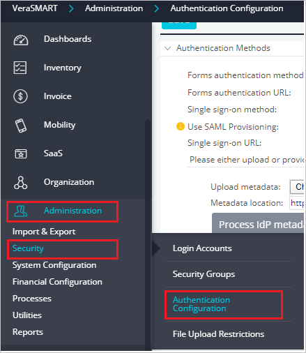
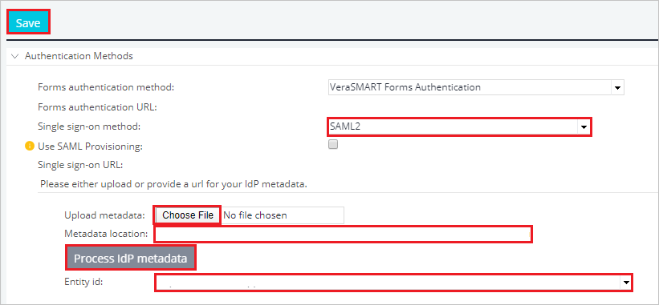

# Configure VeraSMART for Single sign-on with Microsoft Entra ID

In this article,  you learn how to integrate VeraSMART with Microsoft Entra ID. When you integrate VeraSMART with Microsoft Entra ID, you can:

* Control in Microsoft Entra ID who has access to VeraSMART.
* Enable your users to be automatically signed-in to VeraSMART with their Microsoft Entra accounts.
* Manage your accounts in one central location.

To learn more about SaaS app integration with Microsoft Entra ID, see [What is application access and single sign-on with Microsoft Entra ID](~/identity/enterprise-apps/what-is-single-sign-on.md).

## Prerequisites
The scenario outlined in this article assumes that you already have the following prerequisites:

[!INCLUDE [common-prerequisites.md](~/identity/saas-apps/includes/common-prerequisites.md)]
* VeraSMART single sign-on (SSO) enabled subscription.

## Scenario description

In this article,  you configure and test Microsoft Entra SSO in a test environment.

* VeraSMART supports **SP and IDP** initiated SSO
* VeraSMART supports **Just In Time** user provisioning
* Once you configure VeraSMART you can enforce session control, which protects exfiltration and infiltration of your organization’s sensitive data in real time. Session control extends from Conditional Access. [Learn how to enforce session control with Microsoft Defender for Cloud Apps](/cloud-app-security/proxy-deployment-any-app).

## Adding VeraSMART from the gallery

To configure the integration of VeraSMART into Microsoft Entra ID, you need to add VeraSMART from the gallery to your list of managed SaaS apps.

1. Sign in to the [Microsoft Entra admin center](https://entra.microsoft.com) as at least a [Cloud Application Administrator](~/identity/role-based-access-control/permissions-reference.md#cloud-application-administrator).
1. Browse to **Entra ID** > **Enterprise apps** > **New application**.
1. In the **Add from the gallery** section, type **VeraSMART** in the search box.
1. Select **VeraSMART** from results panel and then add the app. Wait a few seconds while the app is added to your tenant.

 Alternatively, you can also use the [Enterprise App Configuration Wizard](https://portal.office.com/AdminPortal/home?Q=Docs#/azureadappintegration). In this wizard, you can add an application to your tenant, add users/groups to the app, assign roles, and walk through the SSO configuration as well. [Learn more about Microsoft 365 wizards.](/microsoft-365/admin/misc/azure-ad-setup-guides)

## Configure and test Microsoft Entra SSO for VeraSMART

Configure and test Microsoft Entra SSO with VeraSMART using a test user called **B.Simon**. For SSO to work, you need to establish a link relationship between a Microsoft Entra user and the related user in VeraSMART.

To configure and test Microsoft Entra SSO with VeraSMART, complete the following building blocks:

1. **[Configure Microsoft Entra SSO](#configure-azure-ad-sso)** - to enable your users to use this feature.
    1. **Create a Microsoft Entra test user** - to test Microsoft Entra single sign-on with B.Simon.
    1. **Assign the Microsoft Entra test user** - to enable B.Simon to use Microsoft Entra single sign-on.
1. **[Configure VeraSMART SSO](#configure-verasmart-sso)** - to configure the single sign-on settings on application side.
    1. **[Create VeraSMART test user](#create-verasmart-test-user)** - to have a counterpart of B.Simon in VeraSMART that's linked to the Microsoft Entra representation of user.
1. **[Test SSO](#test-sso)** - to verify whether the configuration works.

## Configure Microsoft Entra SSO

Follow these steps to enable Microsoft Entra SSO.

1. Sign in to the [Microsoft Entra admin center](https://entra.microsoft.com) as at least a [Cloud Application Administrator](~/identity/role-based-access-control/permissions-reference.md#cloud-application-administrator).
1. Browse to **Entra ID** > **Enterprise apps** > **VeraSMART** > **Single sign-on**.
1. On the **Select a single sign-on method** page, select **SAML**.
1. On the **Set up single sign-on with SAML** page, select the edit/pen icon for **Basic SAML Configuration** to edit the settings.

   

1. On the **Basic SAML Configuration** section, if you wish to configure the application in **IDP** initiated mode, enter the values for the following fields:

    a. In the **Identifier** text box, type a URL using the following pattern:
    `https://<SUBDOMAIN>.calero.com/<DOMAIN_NAME>/VeraSMART`

    b. In the **Reply URL** text box, type a URL using the following pattern:
    `https://<SUBDOMAIN>.calero.com/<DOMAIN_NAME>/VeraSMART/Saml2/Acs`

1. Select **Set additional URLs** and perform the following step if you wish to configure the application in **SP** initiated mode:

    In the **Sign-on URL** text box, type a URL using the following pattern:
    `https://<SUBDOMAIN>.calero.com/<DOMAIN_NAME>/VeraSMART/SSO`

	> [!NOTE]
	> These values aren't real. Update these values with the actual Identifier, Reply URL and Sign-on URL. Contact [VeraSMART Client support team](mailto:support@calero.com) to get these values. You can also refer to the patterns shown in the **Basic SAML Configuration** section.

1. On the **Set up single sign-on with SAML** page, In the **SAML Signing Certificate** section, select copy button to copy **App Federation Metadata Url** and save it on your computer.

	

[!INCLUDE [create-assign-users-sso.md](~/identity/saas-apps/includes/create-assign-users-sso.md)]

## Configure VeraSMART SSO

1. Log in to the VeraSMART as an administrator.

1. Go to the **Administration** > **Security** > **Authentication Configuration**.

    

1. Perform the following steps in the following page:

    

    a. Select **SAML2** as **Single sign-on method**  from the dropdown.

    b. In the **Metadata location** textbox, enter the metadata file URL.

    c. Select **Process IDP metadata**.

    > [!NOTE]
    > Alternatively you can also upload the **Metadata** file by selecting the **Choose File** option.

    d. Select the **Entity ID** value from the Entity ID dropdown.

    e. Select **Save**.

### Create VeraSMART test user

In this section, a user called B.Simon is created in VeraSMART. VeraSMART supports just-in-time user provisioning, which is enabled by default. There's no action item for you in this section. If a user doesn't already exist in VeraSMART, a new one is created after authentication.

## Test SSO 

In this section, you test your Microsoft Entra single sign-on configuration using the Access Panel.

When you select the VeraSMART tile in the Access Panel, you should be automatically signed in to the VeraSMART for which you set up SSO. For more information about the Access Panel, see [Introduction to the Access Panel](https://support.microsoft.com/account-billing/sign-in-and-start-apps-from-the-my-apps-portal-2f3b1bae-0e5a-4a86-a33e-876fbd2a4510).

## Additional resources

- [List of articles on How to Integrate SaaS Apps with Microsoft Entra ID](./tutorial-list.md)

- [What is application access and single sign-on with Microsoft Entra ID?](~/identity/enterprise-apps/what-is-single-sign-on.md)

- [What is Conditional Access in Microsoft Entra ID?](~/identity/conditional-access/overview.md)

- [What is session control in Microsoft Defender for Cloud Apps?](/cloud-app-security/proxy-intro-aad)
