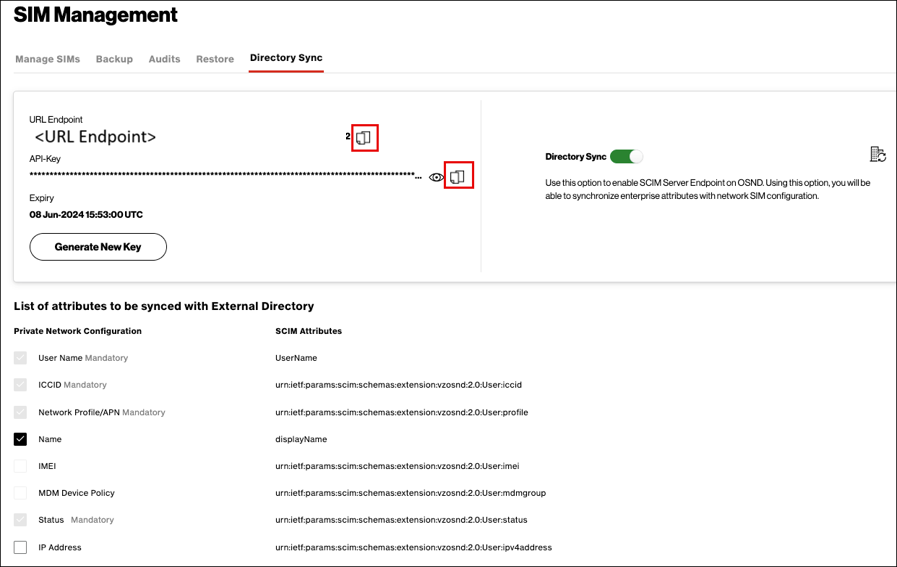

---
title: Configure Verizon Provisioning for automatic user provisioning with Microsoft Entra ID
description: Learn how to automatically provision and de-provision user accounts from Microsoft Entra ID to Verizon Provisioning.

ms.service: entra-id
ms.subservice: saas-apps

ms.topic: how-to
ms.date: 05/20/2026

# Customer intent: As an IT administrator, I want to learn how to automatically provision and deprovision user accounts from Microsoft Entra ID to Verizon Provisioning so that I can streamline the user management process and ensure that users have the appropriate access to Verizon Provisioning.
--- 

# Configure Verizon Provisioning for automatic user provisioning with Microsoft Entra ID

This article describes the steps you need to perform in both Verizon User Provisioning and Microsoft Entra ID to configure automatic user provisioning. When configured, Microsoft Entra ID automatically provisions and deprovisions users to [Verizon User Provisioning](https://www.verizon.com) using the Microsoft Entra provisioning service. For important details on what this service does, how it works, and frequently asked questions, see [Automate user provisioning and deprovisioning to SaaS applications with Microsoft Entra ID](~/identity/app-provisioning/user-provisioning.md).  

## Capabilities supported
> [!div class="checklist"]
> * Create users in Verizon Provisioning
> * Remove users in Verizon Provisioning when they don't require access anymore
> * Keep user attributes synchronized between Microsoft Entra ID and Verizon Provisioning
> * Provision groups and group memberships in Verizon.
> * Verizon supports Client Credentials Authentication.

## Prerequisites

The scenario outlined in this article assumes that you already have the following prerequisites:

* [A Microsoft Entra tenant](~/identity-platform/quickstart-create-new-tenant.md) 
* One of the following roles: [Application Administrator](/entra/identity/role-based-access-control/permissions-reference#application-administrator), [Cloud Application Administrator](/entra/identity/role-based-access-control/permissions-reference#cloud-application-administrator), or [Application Owner](/entra/fundamentals/users-default-permissions#owned-enterprise-applications).
* A user account in Verizon User Provisioning with Admin permissions.

## Step 1: Plan your provisioning deployment
* Learn about [how the provisioning service works](~/identity/app-provisioning/user-provisioning.md).
* Determine who's in [scope for provisioning](~/identity/app-provisioning/define-conditional-rules-for-provisioning-user-accounts.md).
* Determine what data to [map between Microsoft Entra ID and Verizon User Provisioning](~/identity/app-provisioning/customize-application-attributes.md).

## Step 2: Configure Verizon Provisioning to support provisioning with Microsoft Entra ID

1. Log in to the Verizon On Site Network Dashboard with your administrator credentials. 
2. Navigate to **SIM Management > Directory Sync** and make sure **Discovery Sync** is toggled **ON** (toggle button will show green).

    

3. Copy the **URL Endpoint**, the **Token URL endpoint** and **Client ID** required for configuration and you will need to enter these in Microsoft Entra side. 
4. Select any **additional attributes** you want to synchronize with Verizon’s Private Network.
    > [!Note]
    > Certain mandatory attributes (e.g. ICCID) are preselected and grayed out.
5. Click **Save**.

## Step 3: Add Verizon Provisioning from the Microsoft Entra application gallery

Add Verizon from the Microsoft Entra application gallery to start managing provisioning to Verizon. If you have previously setup Verizon OSND, you can use the same application. However, we recommend that you create a separate app when testing out the integration initially. Learn more about adding an application from the gallery here.
[here](~/identity/enterprise-apps/add-application-portal.md).

## Step 4: Define who is in scope for provisioning 

[!INCLUDE [create-assign-users-provisioning.md](~/identity/saas-apps/includes/create-assign-users-provisioning.md)]

## Step 5: Configure automatic user provisioning to Verizon Provisioning 

This section guides you through the steps to configure the Microsoft Entra provisioning service to create, update, and disable users in Verizon Provisioning based on user assignments in Microsoft Entra ID.

### Configure automatic user provisioning for Verizon Provisioning in Microsoft Entra ID

1. Sign in to the [Microsoft Entra admin center](https://entra.microsoft.com) as at least an app owner or a [Cloud Application Administrator](~/identity/role-based-access-control/permissions-reference.md#cloud-application-administrator).
1. Browse to **Entra ID** > **Enterprise apps**

    

1. In the applications list, select **Verizon**.

    

1. Select the **Provisioning** tab.

    

1. Select **+ New configuration**.

    

1. In the Tenant URL field, input your Verizon Tenant URL, Token Endpoint, Client ID, and Client Secret. Select Test Connection to ensure Microsoft Entra ID can connect to Verizon. If the connection fails, ensure your Verizon account has Admin permissions and try again.
    
    

1. Select **Create** to create your configuration.  

1. Select **Properties** in the **Overview** page.  

1. Select the **Edit** icon to edit the properties. Enable notification emails and provide an email to receive quarantine emails. Enable accidental deletions prevention. Click **Apply** to save the changes.  

   

1. Select **Attribute Mapping** in the left panel and select users.

1. Review the user attributes that are synchronized from Microsoft Entra ID to Verizon in the **Attribute-Mapping** section. The attributes selected as **Matching** properties are used to match the user accounts in Verizon for update operations. If you choose to change the [matching target attribute](~/identity/app-provisioning/customize-application-attributes.md), you need to ensure that the Verizon API supports filtering users based on that attribute. Select the **Save** button to commit any changes.

    |Attribute|Type|Supported for filtering|Required by Verizon|
    |---|---|---|---|
    |userName|String|&check;|&check;|
    |displayname|String|||
    |active|Boolean|||
    |urn:ietf:params:scim:schemas:extension:vzosnd:2.0:User:iccid|String||&check;|
    |urn:ietf:params:scim:schemas:extension:vzosnd:2.0:User:profile|String||&check;|
    |urn:ietf:params:scim:schemas:extension:vzosnd:2.0:User:imei|String|||
    |urn:ietf:params:scim:schemas:extension:vzosnd:2.0:User:ipv4address|String|||

1. Select **groups**.

1. Review the group attributes that are synchronized from Microsoft Entra ID to Verizon in the **Attribute-Mapping** section. The attributes selected as **Matching** properties are used to match the groups in Verizon for update operations. Select the **Save** button to commit any changes.

1. To configure scoping filters, refer to the following instructions provided in the [Scoping filter article](~/identity/app-provisioning/define-conditional-rules-for-provisioning-user-accounts.md).

1. When you're ready to provision, select **Start Provisioning** from the **Overview** page.

## Step 6: Monitor your deployment

[!INCLUDE [monitor-deployment.md](~/identity/saas-apps/includes/monitor-deployment.md)]

## Additional resources

* [Managing user account provisioning for Enterprise Apps](~/identity/app-provisioning/configure-automatic-user-provisioning-portal.md)
* [What is application access and single sign-on with Microsoft Entra ID?](~/identity/enterprise-apps/what-is-single-sign-on.md)

## Related content

[Learn how to review logs and get reports on provisioning activity](~/identity/app-provisioning/check-status-user-account-provisioning.md)
