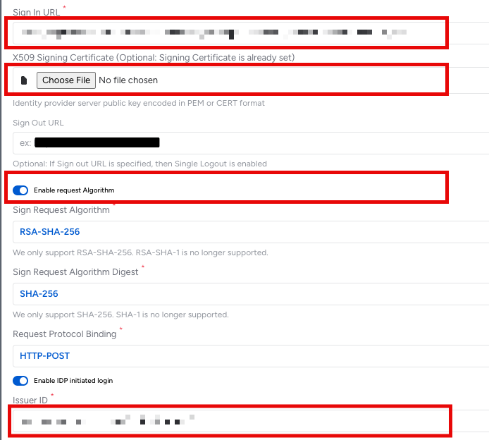

# Configure Veza for Single sign-on with Microsoft Entra ID

In this article,  you learn how to integrate Veza with Microsoft Entra ID. When you integrate Veza with Microsoft Entra ID, you can:

* Control in Microsoft Entra ID who has access to Veza.
* Enable your users to be automatically signed-in to Veza with their Microsoft Entra accounts.
* Manage your accounts in one central location.

## Prerequisites

To get started, you need the following items:

* A Microsoft Entra subscription. If you don't have a subscription, you can get a [free account](https://azure.microsoft.com/free/).
* Veza single sign-on (SSO) enabled subscription.
* Along with Cloud Application Administrator, Application Administrator can also add or manage applications in Microsoft Entra ID. For more information, see [Azure built-in roles](~/identity/role-based-access-control/permissions-reference.md).

## Scenario description

In this article,  you configure and test Microsoft Entra SSO in a test environment.

* Veza supports **SP** and **IDP** initiated SSO.
* Veza supports **Just In Time** user provisioning.

## Add Veza from the gallery

To configure the integration of Veza into Microsoft Entra ID, you need to add Veza from the gallery to your list of managed SaaS apps.

1. Sign in to the [Microsoft Entra admin center](https://entra.microsoft.com) as at least a [Cloud Application Administrator](~/identity/role-based-access-control/permissions-reference.md#cloud-application-administrator).
1. Browse to **Entra ID** > **Enterprise apps** > **New application**.
1. In the **Add from the gallery** section, type **Veza** in the search box.
1. Select **Veza** from results panel and then add the app. Wait a few seconds while the app is added to your tenant.

Alternatively, you can also use the [Enterprise App Configuration Wizard](https://portal.office.com/AdminPortal/home?Q=Docs#/azureadappintegration). In this wizard, you can add an application to your tenant, add users/groups to the app, assign roles, and walk through the SSO configuration as well. [Learn more about Microsoft 365 wizards.](/microsoft-365/admin/misc/azure-ad-setup-guides)

## Configure and test Microsoft Entra SSO for Veza

Configure and test Microsoft Entra SSO with Veza using a test user called **B.Simon**. For SSO to work, you need to establish a link relationship between a Microsoft Entra user and the related user in Veza.

To configure and test Microsoft Entra SSO with Veza, perform the following steps:

1. **[Configure Microsoft Entra SSO](#configure-azure-ad-sso)** - to enable your users to use this feature.
    1. **Create a Microsoft Entra test user** - to test Microsoft Entra single sign-on with B.Simon.
    1. **Assign the Microsoft Entra test user** - to enable B.Simon to use Microsoft Entra single sign-on.
1. **[Configure Veza SSO](#configure-veza-sso)** - to configure the single sign-on settings on application side.
    1. **[Create Veza test user](#create-veza-test-user)** - to have a counterpart of B.Simon in Veza that's linked to the Microsoft Entra representation of user.
1. **[Test SSO](#test-sso)** - to verify whether the configuration works.

## Configure Microsoft Entra SSO

Follow these steps to enable Microsoft Entra SSO.

1. Sign in to the [Microsoft Entra admin center](https://entra.microsoft.com) as at least a [Cloud Application Administrator](~/identity/role-based-access-control/permissions-reference.md#cloud-application-administrator).
1. Browse to **Entra ID** > **Enterprise apps** > **Veza** > **Single sign-on**.
1. On the **Select a single sign-on method** page, select **SAML**.
1. On the **Set up single sign-on with SAML** page, select the pencil icon for **Basic SAML Configuration** to edit the settings.

   

1. On the **Basic SAML Configuration** section, perform the following steps:

	a. In the **Identifier** text box, type a URL using the following pattern:
    `https://<customer>.vezacloud.com/auth/saml/metadata`.

    b. In the **Reply URL** text box, type a URL using the following pattern:
    `https://<customer>.vezacloud.com/auth/saml/acs`.

1. If you wish to configure the application in **SP** initiated mode, then perform the following step:

    In the **Sign-on URL** text box, type a URL using the following pattern:
    `https://<instancename>.veza.com/login`.

1. On the **Set up single sign-on with SAML** page, in the **SAML Signing Certificate** section, find **Certificate (Base64)** and select **Download** to download the certificate and save it on your computer.

    

1. On the **Set up Veza** section, copy the **Login URL**, **Microsoft Entra ID Identifier**, and **Logout URL**. You use these to configure SAML on Veza.

	 

[!INCLUDE [create-assign-users-sso.md](~/identity/saas-apps/includes/create-assign-users-sso.md)]

## Configure Veza SSO

1. Log in to your Veza company site as an administrator.

1. Go to **Administration** > **Sign-in Settings**. Under **Enable SAML**, select **configure** to set up SAML.

    

1. In the **Configure SSO** page, perform the following steps:

    

    a. In the **Sign In Url** textbox, paste the **Login URL** value, which you've copied.

    b. Open the downloaded **Certificate (Base64)** and upload the file into the **X509 Signing Certificate** by selecting **Choose File** option.

    c. Toggle **Enable Request Algorithm** and select RSA-SHA-256 and SHA-256 as the **Sign Request Algorithm**. For the **Request Protocol Binding**, use **HTTP-POST**.

    d. To enable IdP-initiated login, toggle **Enable IDP initiated login**. In the **Issuer ID** field, paste the **Microsoft Entra Identifier** URL from Entra.

    e. In the **Sign Out URL** textbox, paste the **Logout URL** value, copied from Entra.

    f. Select **Save** on the Veza SSO configuration and toggle the option to **Enable SAML**.

### Create Veza test user

In this section, a user called B.Simon is created in Veza. Veza supports just-in-time user provisioning, which is enabled by default. There's no action item for you in this section. If a user doesn't already exist in Veza, a new one is created after authentication.

## Test SSO 

In this section, you test your Microsoft Entra single sign-on configuration with following options.

#### SP initiated:

* Select **Test this application**, this option redirects to Veza Sign-On URL where you can initiate the login flow. 

* Go to Veza Sign-On URL directly and initiate the login flow from there.

#### IDP initiated:

* Select **Test this application**, and you should be automatically signed in to the Veza tenant for which you enabled SSO.

You can also use Microsoft My Apps to test the application in any mode. When you select the Veza tile in the My Apps, if configured in SP mode you would be redirected to the application Sign-On page for initiating the login flow and if configured in IDP mode, you should be automatically signed in to the Veza for which you set up the SSO. For more information, see [Microsoft Entra My Apps](/azure/active-directory/manage-apps/end-user-experiences#azure-ad-my-apps).

## Related content

Once you configure Veza you can enforce session control, which protects exfiltration and infiltration of your organization’s sensitive data in real time. Session control extends from Conditional Access. [Learn how to enforce session control with Microsoft Defender for Cloud Apps](/cloud-app-security/proxy-deployment-any-app).
