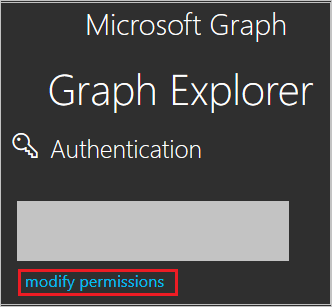

# Configure VIDA for Single sign-on with Microsoft Entra ID

In this article,  you learn how to integrate VIDA with Microsoft Entra ID. When you integrate VIDA with Microsoft Entra ID, you can:

* Control in Microsoft Entra ID who has access to VIDA.
* Enable your users to be automatically signed-in to VIDA with their Microsoft Entra accounts.
* Manage your accounts in one central location.

## Prerequisites
The scenario outlined in this article assumes that you already have the following prerequisites:

[!INCLUDE [common-prerequisites.md](~/identity/saas-apps/includes/common-prerequisites.md)]
* VIDA single sign-on (SSO) enabled subscription.

## Scenario description

In this article,  you configure and test Microsoft Entra SSO in a test environment.

* VIDA supports **SP** initiated SSO.

* VIDA supports **Just In Time** user provisioning.

## Adding VIDA from the gallery

To configure the integration of VIDA into Microsoft Entra ID, you need to add VIDA from the gallery to your list of managed SaaS apps.

1. Sign in to the [Microsoft Entra admin center](https://entra.microsoft.com) as at least a [Cloud Application Administrator](~/identity/role-based-access-control/permissions-reference.md#cloud-application-administrator).
1. Browse to **Entra ID** > **Enterprise apps** > **New application**.
1. In the **Add from the gallery** section, type **VIDA** in the search box.
1. Select **VIDA** from results panel and then add the app. Wait a few seconds while the app is added to your tenant.

 Alternatively, you can also use the [Enterprise App Configuration Wizard](https://portal.office.com/AdminPortal/home?Q=Docs#/azureadappintegration). In this wizard, you can add an application to your tenant, add users/groups to the app, assign roles, and walk through the SSO configuration as well. [Learn more about Microsoft 365 wizards.](/microsoft-365/admin/misc/azure-ad-setup-guides)


<a name='configure-and-test-azure-ad-sso-for-vida'></a>

## Configure and test Microsoft Entra SSO for VIDA

Configure and test Microsoft Entra SSO with VIDA using a test user called **B.Simon**. For SSO to work, you need to establish a link relationship between a Microsoft Entra user and the related user in VIDA.

To configure and test Microsoft Entra SSO with VIDA, perform the following steps:

1. **[Configure Microsoft Entra SSO](#configure-azure-ad-sso)** - to enable your users to use this feature.
    1. **Create a Microsoft Entra test user** - to test Microsoft Entra single sign-on with B.Simon.
    1. **Assign the Microsoft Entra test user** - to enable B.Simon to use Microsoft Entra single sign-on.
1. **[Configure VIDA SSO](#configure-vida-sso)** - to configure the single sign-on settings on application side.
    1. **[Create VIDA test user](#create-vida-test-user)** - to have a counterpart of B.Simon in VIDA that's linked to the Microsoft Entra representation of user.
1. **[Test SSO](#test-sso)** - to verify whether the configuration works.

<a name='configure-azure-ad-sso'></a>

## Configure Microsoft Entra SSO

Follow these steps to enable Microsoft Entra SSO.

1. Sign in to the [Microsoft Entra admin center](https://entra.microsoft.com) as at least a [Cloud Application Administrator](~/identity/role-based-access-control/permissions-reference.md#cloud-application-administrator).
1. Browse to **Entra ID** > **Enterprise apps** > **VIDA** > **Single sign-on**.
1. On the **Select a single sign-on method** page, select **SAML**.
1. On the **Set up single sign-on with SAML** page, select the pencil icon for **Basic SAML Configuration** to edit the settings.

   

1. On the **Basic SAML Configuration** section, enter the values for the following fields:

    a. In the **Identifier (Entity ID)** text box, type the value: 
    `urn:amazon:cognito:sp:eu-west-2_IDmTxjGr6`
    
    b. In the **Reply URL** text box, type the URL:
    `https://vitruevida.auth.eu-west-2.amazoncognito.com/saml2/idpresponse`
    
    c. In the **Sign-on URL** text box, type a URL using the following pattern:
    
    `https://vitruevida.com/?teamid=<ID>&idp=<IDP_NAME>`

	> [!NOTE]
	> The Sign-on URL value isn't real. Update the value with the actual Sign-On URL. Contact [VIDA Client support team](mailto:support@vitruehealth.com) to get the value. You can also refer to the patterns shown in the **Basic SAML Configuration** section.

1. VIDA application expects the SAML assertions in a specific format, which requires you to add custom attribute mappings to your SAML token attributes configuration. The following screenshot shows the list of default attributes.

	

1. In addition to above, VIDA application expects few more attributes to be passed back in SAML response which are shown below. These attributes are also pre populated but you can review them as per your requirements.
	
	| Name | Source Attribute|
	| ---------------- | --------- |
	| assignedroles | user.assignedroles |

1. On the **Set up single sign-on with SAML** page, in the **SAML Signing Certificate** section,  find **Federation Metadata XML** and select **Download** to download the certificate and save it on your computer.

	

1. On the **Set up VIDA** section, copy the appropriate URL(s) based on your requirement.

	

<a name='create-an-azure-ad-test-user'></a>

[!INCLUDE [create-assign-users-sso.md](~/identity/saas-apps/includes/create-assign-users-sso.md)]

## Configure Role-Based Single Sign-On in VIDA

1. To associate a VIDA role with the Microsoft Entra user, you must create a role in Microsoft Entra ID by following these steps:

    a. Sign on to the [Microsoft Graph Explorer](https://developer.microsoft.com/graph/graph-explorer).

    b. Select **modify permissions** to obtain required permissions for creating a role.

    

    c. Select the following permissions from the list and select **Modify Permissions**, as shown in the following figure.

    

    >[!NOTE]
    >After permissions are granted, log on to the Graph Explorer again.

    d. On the Graph Explorer page, select **GET** from the first drop-down list and **beta** from the second drop-down list. Then enter `https://graph.microsoft.com/beta/servicePrincipals` in the field next to the drop-down lists, and select **Run Query**.

    

    >[!NOTE]
    >If you're using multiple directories, you can enter `https://graph.microsoft.com/beta/contoso.com/servicePrincipals` in the field of the query.

    e. In the **Response Preview** section, extract the appRoles property from the 'Service Principal' for subsequent use.

    

    >[!NOTE]
    >You can locate the appRoles property by entering `https://graph.microsoft.com/beta/servicePrincipals/<objectID>` in the field of the query. Note that the `objectID` is the object ID you have copied from the Microsoft Entra ID **Properties** page.

    f. Go back to the Graph Explorer, change the method from **GET** to **PATCH**, paste the following content into the **Request Body** section, and select **Run Query**:
    
   ```
   { 
   "appRoles": [
       {
           "allowedMemberTypes": [
           "User"
           ],
           "description": "User",
           "displayName": "User",
           "id": "18d14569-c3bd-439b-9a66-3a2aee01****",
           "isEnabled": true,
           "origin": "Application",
           "value": null
       },
       {
           "allowedMemberTypes": [
           "User"
           ],
           "description": "msiam_access",
           "displayName": "msiam_access",
           "id": "b9632174-c057-4f7e-951b-be3adc52****",
           "isEnabled": true,
           "origin": "Application",
           "value": null
       },
       {
       "allowedMemberTypes": [
           "User"
       ],
       "description": "VIDACompanyAdmin",
       "displayName": "VIDACompanyAdmin",
       "id": "293414bb-2215-48b4-9864-64520937d437",
       "isEnabled": true,
       "origin": "ServicePrincipal",
       "value": "VIDACompanyAdmin"
       },
       {
       "allowedMemberTypes": [
           "User"
       ],
       "description": "VIDATeamAdmin",
       "displayName": "VIDATeamAdmin",
       "id": "2884f1ae-5c0d-4afd-bf28-d7d11a3d7b2c",
       "isEnabled": true,
       "origin": "ServicePrincipal",
       "value": "VIDATeamAdmin"
       },
       {
       "allowedMemberTypes": [
           "User"
       ],
       "description": "VIDAUser",
       "displayName": "VIDAUser",
       "id": "37b3218c-0c06-484f-90e6-4390ce5a8787",
       "isEnabled": true,
       "origin": "ServicePrincipal",
       "value": "VIDAUser"
       }
   ]
   }
   ```
   > [!NOTE]
   > Microsoft Entra ID will send the value of these roles as the claim value in SAML response. However, you can only add new roles after the `msiam_access` part for the patch operation. To smooth the creation process, we recommend that you use an ID generator, such as GUID Generator, to generate IDs in real time.

   g. After the 'Service Principal' is patched with the required role, attach the role with the Microsoft Entra user (B.Simon) by following the steps of **Assign the Microsoft Entra test user** section of the article.

## Configure VIDA SSO

To configure single sign-on on **VIDA** side, you need to send the downloaded **Federation Metadata XML** and appropriate copied URLs from the application configuration to [VIDA support team](mailto:support@vitruehealth.com). They set this setting to have the SAML SSO connection set properly on both sides.

### Create VIDA test user

In this section, a user called Britta Simon is created in VIDA. VIDA supports just-in-time user provisioning, which is enabled by default. There's no action item for you in this section. If a user doesn't already exist in VIDA, a new one is created after authentication.

## Test SSO 

In this section, you test your Microsoft Entra single sign-on configuration with following options. 

* Select **Test this application**, this option redirects to VIDA Sign-on URL where you can initiate the login flow. 

* Go to VIDA Sign-on URL directly and initiate the login flow from there.

* You can use Microsoft My Apps. When you select the VIDA tile in the My Apps, this option redirects to VIDA Sign-on URL. For more information, see [Microsoft Entra My Apps](/azure/active-directory/manage-apps/end-user-experiences#azure-ad-my-apps).

## Related content

Once you configure VIDA you can enforce session control, which protects exfiltration and infiltration of your organization’s sensitive data in real time. Session control extends from Conditional Access. [Learn how to enforce session control with Microsoft Defender for Cloud Apps](/cloud-app-security/proxy-deployment-aad).
