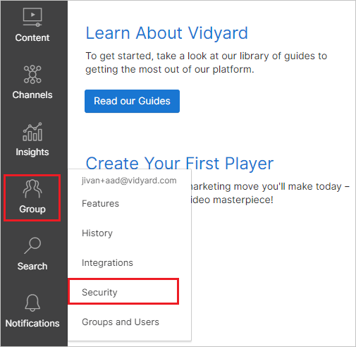
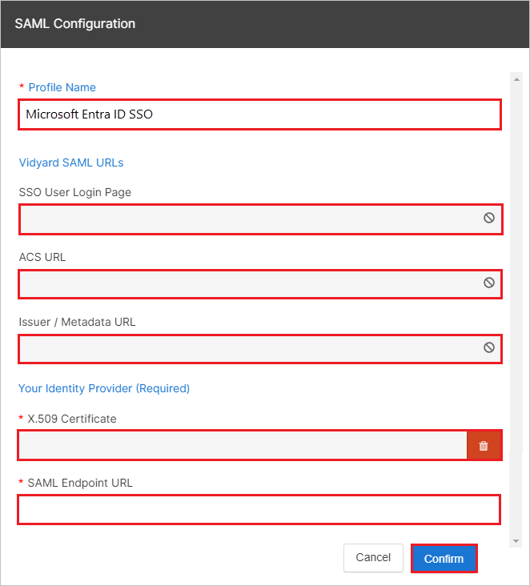

# Microsoft Entra integration with Vidyard

In this article,  you learn how to integrate Vidyard with Microsoft Entra ID.
Integrating Vidyard with Microsoft Entra ID provides you with the following benefits:

* You can control in Microsoft Entra ID who has access to Vidyard.
* You can enable your users to be automatically signed-in to Vidyard (Single Sign-On) with their Microsoft Entra accounts.
* You can manage your accounts in one central location.

If you want to know more details about SaaS app integration with Microsoft Entra ID, see [What is application access and single sign-on with Microsoft Entra ID](~/identity/enterprise-apps/what-is-single-sign-on.md).
If you don't have an Azure subscription, [create a free account](https://azure.microsoft.com/free/) before you begin.

## Prerequisites
The scenario outlined in this article assumes that you already have the following prerequisites:
[!INCLUDE [common-prerequisites.md](~/identity/saas-apps/includes/common-prerequisites.md)]
* Vidyard single sign-on enabled subscription

## Scenario description

In this article,  you configure and test Microsoft Entra single sign-on in a test environment.

* Vidyard supports **SP** and **IDP** initiated SSO

* Vidyard supports **Just In Time** user provisioning

## Adding Vidyard from the gallery

To configure the integration of Vidyard into Microsoft Entra ID, you need to add Vidyard from the gallery to your list of managed SaaS apps.

**To add Vidyard from the gallery, perform the following steps:**

1. Sign in to the [Microsoft Entra admin center](https://entra.microsoft.com) as at least a [Cloud Application Administrator](~/identity/role-based-access-control/permissions-reference.md#cloud-application-administrator).
1. Browse to **Entra ID** > **Enterprise apps** > **New application**.
1. In the search box, type **Vidyard**, select **Vidyard** from result panel then select **Add** button to add the application.

	 

## Configure and test Microsoft Entra single sign-on

In this section, you configure and test Microsoft Entra single sign-on with Vidyard based on a test user called **Britta Simon**.
For single sign-on to work, a link relationship between a Microsoft Entra user and the related user in Vidyard needs to be established.

To configure and test Microsoft Entra single sign-on with Vidyard, you need to complete the following building blocks:

1. **[Configure Microsoft Entra Single Sign-On](#configure-azure-ad-single-sign-on)** - to enable your users to use this feature.
2. **[Configure Vidyard Single Sign-On](#configure-vidyard-single-sign-on)** - to configure the Single Sign-On settings on application side.
3. **Create a Microsoft Entra test user** - to test Microsoft Entra single sign-on with Britta Simon.
4. **Assign the Microsoft Entra test user** - to enable Britta Simon to use Microsoft Entra single sign-on.
5. **[Create Vidyard test user](#create-vidyard-test-user)** - to have a counterpart of Britta Simon in Vidyard that's linked to the Microsoft Entra representation of user.
6. **[Test single sign-on](#test-single-sign-on)** - to verify whether the configuration works.

### Configure Microsoft Entra single sign-on

In this section, you enable Microsoft Entra single sign-on.

To configure Microsoft Entra single sign-on with Vidyard, perform the following steps:

1. Sign in to the [Microsoft Entra admin center](https://entra.microsoft.com) as at least a [Cloud Application Administrator](~/identity/role-based-access-control/permissions-reference.md#cloud-application-administrator).
1. Browse to **Entra ID** > **Enterprise apps** > **Vidyard** application integration page, select **Single sign-on**.

    

1. On the **Select a Single sign-on method** dialog, select **SAML/WS-Fed** mode to enable single sign-on.

    

1. On the **Set up Single Sign-On with SAML** page, select **Edit** icon to open **Basic SAML Configuration** dialog.

	

1. On the **Basic SAML Configuration** section, if you wish to configure the application in **IDP** initiated mode, perform the following steps:

    

    a. In the **Identifier** text box, type a URL using the following pattern:
    `https://secure.vidyard.com/sso/saml/<unique id>/metadata`

    b. In the **Reply URL** text box, type a URL using the following pattern:
    `https://secure.vidyard.com/sso/saml/<unique id>/consume`

5. Select **Set additional URLs** and perform the following step if you wish to configure the application in **SP** initiated mode:

    

    In the **Sign-on URL** text box, type a URL using the following pattern:
    `https://secure.vidyard.com/sso/saml/<unique id>/login`

	> [!NOTE]
	> These values aren't real. You update these values with the actual Identifier, Reply URL, and Sign-On URL, which is explained later in the article. You can also refer to the patterns shown in the **Basic SAML Configuration** section.

6. On the **Set up Single Sign-On with SAML** page, in the **SAML Signing Certificate** section, select **Download** to download the **Certificate (Base64)** from the given options as per your requirement and save it on your computer.

	

7. On the **Set up Vidyard** section, copy the appropriate URL(s) as per your requirement.

	

	a. Login URL

	b. Microsoft Entra Identifier

	c. Logout URL

### Configure Vidyard Single Sign-On

1. In a different web browser window, sign in to your Vidyard Software company site as an administrator.

2. From the Vidyard dashboard, select **Group** > **Security**

	

3. Select **New Profile** tab.

	

4. In the **SAML Configuration** section, perform the following steps:

	

	a. Enter general profile name in the **Profile Name** textbox.

	b. Copy **SSO User Login Page** value and paste it into **Sign on URL** textbox in **Basic SAML Configuration** section.

	c. Copy **ACS URL** value and paste it into **Reply URL** textbox in **Basic SAML Configuration** section.

	d. Copy **Issuer/Metadata URL** value and paste it into **Identifier** textbox in **Basic SAML Configuration** section.

	e. Open your downloaded certificate file from Azure portal in Notepad and then paste it into the **X.509 Certificate** textbox.

	f. In the **SAML Endpoint URL** textbox, paste the value of **Login URL** copied from Azure portal.

	g. Select **Confirm**.

5. From the Single Sign On tab, select **Assign** next to an existing profile.

	> [!NOTE]
	> Once you have created an SSO profile, assign it to any group(s) for which users will require access through Azure. If the user doesn't exist within the group to which they were assigned, Vidyard will automatically create a user account and assign their role in real-time.

6. Under **Assign SAML Configuration to Organizations**, select your organization group, which is visible in the **Groups Available to Assign**.

7. You can see the assigned groups under the **Groups Currently Assigned**. Select a role for the group as per your organization and select **Confirm**.

	> [!NOTE]
	> For more information, refer to [this doc](https://knowledge.vidyard.com/hc/articles/360009990033-SAML-based-Single-Sign-On-SSO-in-Vidyard).

[!INCLUDE [create-assign-users-sso.md](~/identity/saas-apps/includes/create-assign-users-sso.md)]

### Create Vidyard test user

In this section, a user called Britta Simon is created in Vidyard. Vidyard supports just-in-time user provisioning, which is enabled by default. There's no action item for you in this section. If a user doesn't already exist in Vidyard, a new one is created after authentication.

>[!Note]
>If you need to create a user manually, contact [Vidyard support team](mailto:support@vidyard.com).

### Test single sign-on 

In this section, you test your Microsoft Entra single sign-on configuration using the Access Panel.

When you select the Vidyard tile in the Access Panel, you should be automatically signed in to the Vidyard for which you set up SSO. For more information about the Access Panel, see [Introduction to the Access Panel](https://support.microsoft.com/account-billing/sign-in-and-start-apps-from-the-my-apps-portal-2f3b1bae-0e5a-4a86-a33e-876fbd2a4510).

## Additional Resources

- [List of articles on How to Integrate SaaS Apps with Microsoft Entra ID](./tutorial-list.md)

- [What is application access and single sign-on with Microsoft Entra ID?](~/identity/enterprise-apps/what-is-single-sign-on.md)

- [What is Conditional Access in Microsoft Entra ID?](~/identity/conditional-access/overview.md)
