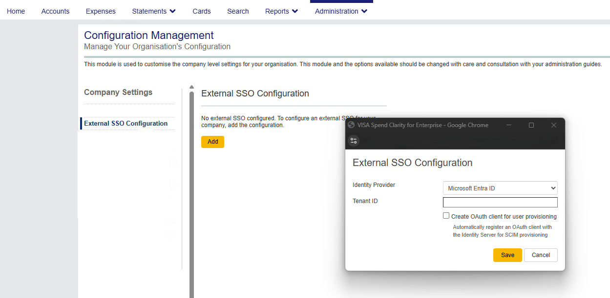
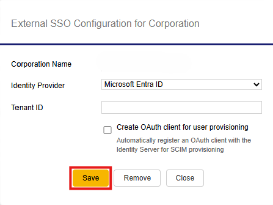
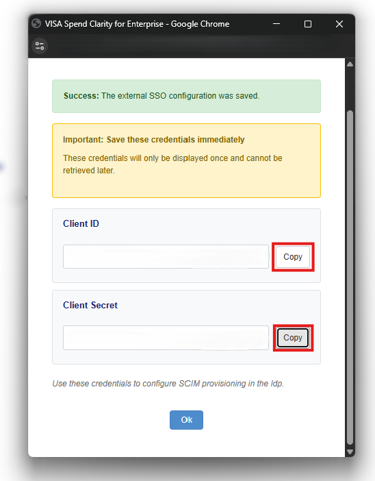

# Configure Visa Spend Clarity for Enterprise for automatic user provisioning with Microsoft Entra ID

This article describes the steps you need to perform in both Visa Spend Clarity for Enterprise and Microsoft Entra ID to configure automatic user provisioning. When configured, Microsoft Entra ID automatically provisions and deprovisions users to [Visa Spend Clarity for Enterprise](https://enterprise.spendclarity.visa.com/) using the Microsoft Entra provisioning service. For important details on what this service does, how it works, and frequently asked questions, see [Automate user provisioning and deprovisioning to SaaS applications with Microsoft Entra ID](~/identity/app-provisioning/user-provisioning.md).  

## Capabilities supported
> [!div class="checklist"]
> * Create users in Visa Spend Clarity for Enterprise.
> * Remove users in Visa Spend Clarity for Enterprise when they don't require access anymore.
> * Keep user attributes synchronized between Microsoft Entra ID and Visa Spend Clarity for Enterprise.
> * Provision groups and group memberships in Visa Spend Clarity for Enterprise.
> * Enable [single sign-on](~/identity/enterprise-apps/add-application-portal-setup-oidc-sso.md) to Visa Spend Clarity for Enterprise (recommended).

## Prerequisites

The scenario outlined in this article assumes that you already have the following prerequisites:

* [A Microsoft Entra tenant](~/identity-platform/quickstart-create-new-tenant.md) 
* One of the following roles: [Application Administrator](/entra/identity/role-based-access-control/permissions-reference#application-administrator), [Cloud Application Administrator](/entra/identity/role-based-access-control/permissions-reference#cloud-application-administrator), or [Application Owner](/entra/fundamentals/users-default-permissions#owned-enterprise-applications).
* A user account in Visa Spend Clarity for Enterprise with Admin permissions.

## Step 1: Plan your provisioning deployment
* Learn about [how the provisioning service works](~/identity/app-provisioning/user-provisioning.md).
* Determine who's in [scope for provisioning](~/identity/app-provisioning/define-conditional-rules-for-provisioning-user-accounts.md).
* Determine what data to [map between Microsoft Entra ID and Visa Spend Clarity for Enterprise](~/identity/app-provisioning/customize-application-attributes.md).

## Step 2: Configure Visa Spend Clarity for Enterprise to support provisioning with Microsoft Entra ID

Before configuring provisioning in Microsoft Entra ID, you need to register an OAuth client in Visa Spend Clarity for Enterprise. Visa Spend Clarity for Enterprise supports Dynamic Client Registration, which automatically creates the OAuth 2.0 / OpenID Connect (OIDC) client when you map your Microsoft Entra tenant to your corporation or company.

To register an OAuth client and obtain the credentials Microsoft Entra ID uses to call the Visa Spend Clarity for Enterprise provisioning API, follow these steps:

1. Sign in to [Visa Spend Clarity for Enterprise](https://enterprise.spendclarity.visa.com/) with an Admin account.

1. Depending on your access level, navigate to one of the following:
   * **Administration** > **Company Management** > **Advanced Configuration** > **External SSO Configuration** (for company-level mapping in a company context), or
   * **Administration** > **Corporate Administration** > **Manage Corporate SSO** (for corporation-level mapping).

    

1. In the **External SSO Configuration** dialog, complete the following fields:

    | Field | Value |
    |---|---|
    | **Identity Provider** | Select **Microsoft Entra ID** from the drop-down list. |
    | **Tenant ID** | Enter your Microsoft Entra tenant ID (for example, `12345678-1234-1234-1234-123456789abc`). |
    | **Create OAuth Client for User Provisioning** | Select this checkbox to automatically create an OAuth/OIDC client via Dynamic Client Registration. |

    > [!IMPORTANT]
    > The **Create OAuth Client** checkbox is hidden when editing an existing tenant mapping to prevent duplicate client creation. If you need to recreate credentials for an existing mapping, contact Visa Spend Clarity for Enterprise support.

1. Select **Save**. Visa Spend Clarity for Enterprise saves the tenant mapping and initiates Dynamic Client Registration in the background.

    

1. After successful registration, Visa Spend Clarity for Enterprise displays the OAuth client credentials:

    | Credential | Description |
    |---|---|
    | **Client ID** | The unique identifier of the OAuth client. |
    | **Client Secret** | The secret used to authenticate as the OAuth client. |

    Use the **Copy** buttons next to each value to copy them to your clipboard.

    

    > [!WARNING]
    > **Save these credentials immediately.** The client secret is displayed only once and cannot be retrieved later. Store the values in a secure password manager or secrets vault. If the credentials are lost, you must delete the OAuth client and create a new tenant mapping.

1. If client registration fails, the tenant mapping is still saved, but you see an error message indicating that OAuth client creation failed. In this case, contact Visa Spend Clarity for Enterprise support to register the OAuth client manually.

1. Retain the **Client ID** and **Client Secret** values. You use them in [Step 5](#step-5-configure-automatic-user-provisioning-to-visa-spend-clarity-for-enterprise) when configuring the **Tenant URL** and **Secret Token** in Microsoft Entra ID.

## Step 3: Add Visa Spend Clarity for Enterprise from the Microsoft Entra application gallery

Add Visa Spend Clarity for Enterprise from the Microsoft Entra application gallery to start managing provisioning to Visa Spend Clarity for Enterprise. If you've previously set up Visa Spend Clarity for Enterprise for SSO, you can use the same application. However, we recommend that you create a separate app when testing out the integration initially. For more information, see [Add an application to your Microsoft Entra tenant](~/identity/enterprise-apps/add-application-portal.md).

## Step 4: Define who is in scope for provisioning 

[!INCLUDE [create-assign-users-provisioning.md](~/identity/saas-apps/includes/create-assign-users-provisioning.md)]

## Step 5: Configure automatic user provisioning to Visa Spend Clarity for Enterprise

This section guides you through the steps to configure the Microsoft Entra provisioning service to create, update, and disable users in Visa Spend Clarity for Enterprise based on user assignments in Microsoft Entra ID.

To configure automatic user provisioning in Microsoft Entra ID, follow these steps:

1. Sign in to the [Microsoft Entra admin center](https://entra.microsoft.com) as at least an app owner or a [Cloud Application Administrator](~/identity/role-based-access-control/permissions-reference.md#cloud-application-administrator).
1. Browse to **Entra ID** > **Enterprise apps**

    

1. In the applications list, select **Visa Spend Clarity for Enterprise**.

    

1. Select the **Provisioning** tab.

    

1. Select **+ New configuration**.

    

1. In the **Tenant URL** field, enter your Visa Spend Clarity for Enterprise tenant URL and secret token. Select **Test Connection** to ensure Microsoft Entra ID can connect to Visa Spend Clarity for Enterprise. If the connection fails, ensure your Visa Spend Clarity for Enterprise account has Admin permissions and try again.
    
    

1. Select **Create** to create your configuration.  

1. Select **Properties** in the **Overview** page.  

1. Select the pencil to edit the properties. Enable notification emails and provide an email to receive quarantine emails. Enable accidental deletions prevention. Select **Apply** to save the changes.  

   

1. Select **Attribute Mapping** in the left panel and select users.

1. Review the user attributes that are synchronized from Microsoft Entra ID to Visa Spend Clarity for Enterprise in the **Attribute-Mapping** section. The attributes selected as **Matching** properties are used to match the user accounts in Visa Spend Clarity for Enterprise for update operations. If you choose to change the [matching target attribute](~/identity/app-provisioning/customize-application-attributes.md), you need to ensure that the Visa Spend Clarity for Enterprise API supports filtering users based on that attribute. Select the **Save** button to commit any changes.

   |Attribute|Type|Supported for filtering|Required by Visa Spend Clarity for Enterprise|
   |---|---|---|---|
   |userName|String|&check;|&check;|
   |active|Boolean|||
   |externalId|String|||
   |givenName|String|||
   |surname|String|||
   |emails|String|||
   |employeeNumber|Number|||
   |urn:ietf:params:scim:schemas:extension:visa:2.0:User:subCompanyId|String|||

   > [!NOTE]
   > The **SubCompanyId** is required only when provisioning is set for a corporation.

1. Select **groups**.

1. Review the group attributes that are synchronized from Microsoft Entra ID to Visa Spend Clarity for Enterprise in the **Attribute-Mapping** section. The attributes selected as **Matching** properties are used to match the groups in Visa Spend Clarity for Enterprise for update operations. Select the **Save** button to commit any changes.

1. To configure scoping filters, refer to the following instructions provided in the [Scoping filter article](~/identity/app-provisioning/define-conditional-rules-for-provisioning-user-accounts.md) article.

1. When you're ready to provision, select **Start Provisioning** from the **Overview** page.

## Step 6: Monitor your deployment

[!INCLUDE [monitor-deployment.md](~/identity/saas-apps/includes/monitor-deployment.md)]

## Related content

* [Managing user account provisioning for Enterprise Apps](~/identity/app-provisioning/configure-automatic-user-provisioning-portal.md)
* [What is application access and single sign-on with Microsoft Entra ID?](~/identity/enterprise-apps/what-is-single-sign-on.md)
* [Learn how to review logs and get reports on provisioning activity](~/identity/app-provisioning/check-status-user-account-provisioning.md)
