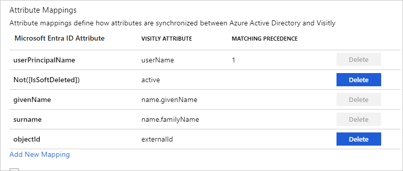

# Configure Visitly for automatic user provisioning with Microsoft Entra ID

The objective of this article is to demonstrate the steps you perform in Visitly and Microsoft Entra ID to configure Microsoft Entra ID to automatically provision and deprovision users or groups to Visitly.

> [!NOTE]
> This article describes a connector built on top of the Microsoft Entra user provisioning service. For important details on what this service does, how it works, and frequently asked questions, see [Automate user provisioning and deprovisioning to software-as-a-service (SaaS) applications with Microsoft Entra ID](~/identity/app-provisioning/user-provisioning.md).
>

## Prerequisites

The scenario outlined in this article assumes that you already have the following prerequisites:

[!INCLUDE [common-prerequisites.md](~/identity/saas-apps/includes/common-prerequisites.md)]
* [A Visitly tenant](https://www.visitly.io/pricing/)
* A user account in Visitly with admin permissions

## Step 1: Assign users to Visitly 

Microsoft Entra ID uses a concept called *assignments* to determine which users should receive access to selected apps. In the context of automatic user provisioning, only the users or groups that were assigned to an application in Microsoft Entra ID are synchronized.

Before you configure and enable automatic user provisioning, decide which users or groups in Microsoft Entra ID need access to Visitly. Then assign these users or groups to Visitly by following the instructions here:
* [Assign a user or group to an enterprise app](~/identity/enterprise-apps/assign-user-or-group-access-portal.md)

### Important tips for assigning users to Visitly 

* We recommend that you assign a single Microsoft Entra user to Visitly to test the automatic user provisioning configuration. More users or groups can be assigned later.

* When you assign a user to Visitly, you must select any valid application-specific role (if available) in the assignment dialog box. Users with the Default Access role are excluded from provisioning.

## Step 2: Set up Visitly for provisioning

Before you configure Visitly for automatic user provisioning with Microsoft Entra ID, you need to enable System for Cross-domain Identity Management (SCIM) provisioning on Visitly.

1. Sign in to [Visitly](https://app.visitly.io/login). Select **Integrations** > **Host Synchronization**.

	

1. Select the **Microsoft Entra ID** section.

	

1. Copy the **API Key**. These values are entered in the **Secret Token** box on the **Provisioning** tab of your Visitly application.

	

## Step 3: Add Visitly from the gallery

To configure Visitly for automatic user provisioning with Microsoft Entra ID, add Visitly from the Microsoft Entra application gallery to your list of managed SaaS applications.

To add Visitly from the Microsoft Entra application gallery, follow these steps.

1. Sign in to the [Microsoft Entra admin center](https://entra.microsoft.com) as at least a [Cloud Application Administrator](~/identity/role-based-access-control/permissions-reference.md#cloud-application-administrator).
1. Browse to **Entra ID** > **Enterprise apps** > **New application**.Visitly**, select **Visitly** in the results panel, and then select **Add** to add the application.

	

## Step 4: Configure automatic user provisioning to Visitly 

This section guides you through the steps to configure the Microsoft Entra provisioning service to create, update, and disable users or groups in Visitly based on user or group assignments in Microsoft Entra ID.

> [!TIP]
> To enable SAML-based single sign-on for Visitly, follow the instructions in the [Visitly single sign-on  article](Visitly-tutorial.md). Single sign-on can be configured independently of automatic user provisioning, although these two features complement each other.

### Configure automatic user provisioning for Visitly in Microsoft Entra ID

1. Sign in to the [Microsoft Entra admin center](https://entra.microsoft.com) as at least a [Cloud Application Administrator](~/identity/role-based-access-control/permissions-reference.md#cloud-application-administrator).

1. Browse to **Entra ID** > **Enterprise apps** > **Visitly**.

	

3. Select the **Provisioning** tab.

	

1. Select **+ New configuration**.

	

1. Under the Admin Credentials section, input the `https://api.visitly.io/v1/usersync/SCIM` and **API Key** values retrieved earlier in **Tenant URL** and **Secret Token**, respectively. Select **Test Connection** to ensure that Microsoft Entra ID can connect to Visitly. If the connection fails, make sure that your Visitly account has admin permissions and try again.

   

1. Select **Create** to create your configuration.

1. Select **Properties** on the **Overview** page.

1. Select the **Edit** icon to edit the properties. Enable notification emails and provide an email to receive quarantine notifications. Enable **Accidental deletions prevention**. Select **Apply** to save the changes.

   

1. Select **Attribute Mapping** in the left panel and select **users**.

1. Review the user attributes that are synchronized from Microsoft Entra ID to Visitly in the **Attribute Mappings** section. The attributes selected as **Matching** properties are used to match the user accounts in Visitly for update operations. Select **Save** to commit any changes.

	

1. To configure scoping filters, refer to the instructions provided in the [Scoping filter article](~/identity/app-provisioning/define-conditional-rules-for-provisioning-user-accounts.md).

1. Use [on-demand provisioning](~/identity/app-provisioning/provision-on-demand.md) to validate sync with a small number of users before deploying more broadly in your organization.  

1. When you're ready to provision, select **Start Provisioning** from the **Overview** page.

## Step 5: Monitor your deployment

[!INCLUDE [monitor-deployment.md](~/identity/saas-apps/includes/monitor-deployment.md)]

## Connector limitations

Visitly doesn't support hard deletes. Everything is soft delete only.

## More resources

* [Manage user account provisioning for enterprise apps](~/identity/app-provisioning/configure-automatic-user-provisioning-portal.md)
* [What is application access and single sign-on with Microsoft Entra ID?](~/identity/enterprise-apps/what-is-single-sign-on.md)

## Related content

* [Learn how to review logs and get reports on provisioning activity](~/identity/app-provisioning/check-status-user-account-provisioning.md)
