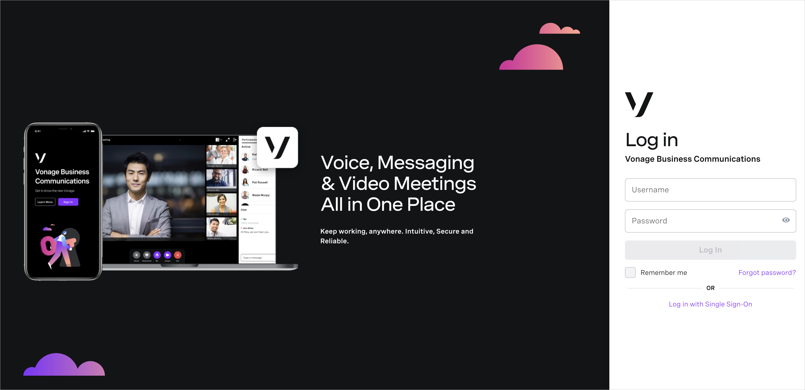
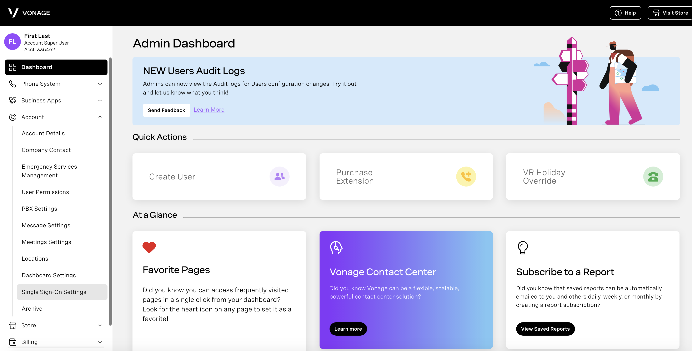
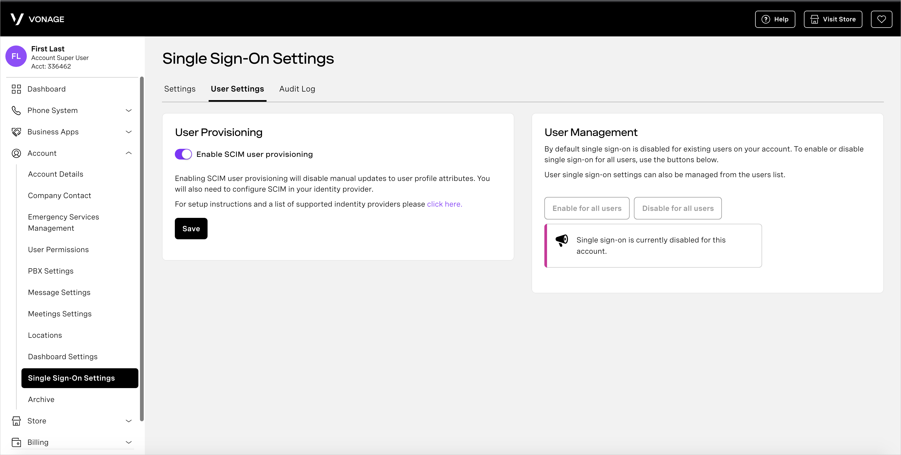
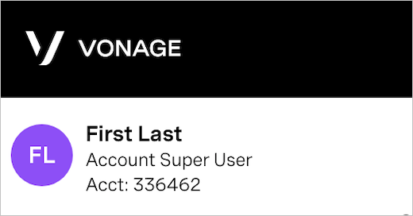

# Configure Vonage for automatic user provisioning with Microsoft Entra ID

This article describes the steps you need to perform in both Vonage and Microsoft Entra ID to configure automatic user provisioning. When configured, Microsoft Entra ID automatically provisions and de-provisions users and groups to [Vonage](https://www.vonage.com/) using the Microsoft Entra provisioning service. For important details on what this service does, how it works, and frequently asked questions, see [Automate user provisioning and deprovisioning to SaaS applications with Microsoft Entra ID](~/identity/app-provisioning/user-provisioning.md). 

## Capabilities Supported
> [!div class="checklist"]
> * Create users in Vonage.
> * Remove users in Vonage when they don't require access anymore.
> * Keep user attributes synchronized between Microsoft Entra ID and Vonage.
> * [Single sign-on](vonage-tutorial.md) to Vonage (recommended).

## Prerequisites

The scenario outlined in this article assumes that you already have the following prerequisites:

* [A Microsoft Entra tenant](~/identity-platform/quickstart-create-new-tenant.md). 
* One of the following roles: [Application Administrator](/entra/identity/role-based-access-control/permissions-reference#application-administrator), [Cloud Application Administrator](/entra/identity/role-based-access-control/permissions-reference#cloud-application-administrator), or [Application Owner](/entra/fundamentals/users-default-permissions#owned-enterprise-applications). 
* A [Vonage](https://www.vonage.com/) tenant.
* A user account in Vonage with Admin permission(Account Super User).

## Step 1: Plan your provisioning deployment

1. Learn about [how the provisioning service works](~/identity/app-provisioning/user-provisioning.md).
1. Determine who's in [scope for provisioning](~/identity/app-provisioning/define-conditional-rules-for-provisioning-user-accounts.md).
1. Determine what data to [map between Microsoft Entra ID and Vonage](~/identity/app-provisioning/customize-application-attributes.md). 

## Step 2: Configure Vonage to support provisioning with Microsoft Entra ID

1. Log in to [Vonage admin portal](http://admin.vonage.com) with an admin user.

   

1. Navigate to **Account > Single Sign-On Settings** on the left side menu.

   

1. Select **User Settings** tab, toggle **Enable SCIM user provisioning** ON and select **Save**.

## Step 3: Add Vonage from the Microsoft Entra application gallery

Add Vonage from the Microsoft Entra application gallery to start managing provisioning to Vonage. If you have previously setup Vonage for SSO you can use the same application. However, we recommend that you create a separate app when testing out the integration initially. Learn more about adding an application from the gallery [here](~/identity/enterprise-apps/add-application-portal.md).

## Step 4: Define who is in scope for provisioning 

[!INCLUDE [create-assign-users-provisioning.md](~/identity/saas-apps/includes/create-assign-users-provisioning.md)]

## Step 5: Configure automatic user provisioning to Vonage 

> [!NOTE]
>  Any user that's added to Vonage must have first name, last name and email. Otherwise the integration will fail.

This section guides you through the steps to configure the Microsoft Entra provisioning service to create, update, and disable users and/or groups in Vonage based on user and/or group assignments in Microsoft Entra ID.

### Configure automatic user provisioning for Vonage in Microsoft Entra ID

1. Sign in to the [Microsoft Entra admin center](https://entra.microsoft.com) as at least a [Cloud Application Administrator](~/identity/role-based-access-control/permissions-reference.md#cloud-application-administrator).

1. Browse to **Entra ID** > **Enterprise apps**

	

1. In the applications list, select **Vonage**.

	

1. Select the **Provisioning** tab.

	

1. Select **+ New configuration**.

	

1. Before the next step make sure you're authorized as Account Super User. For checking if the user is an Account Super User perform login at [Vonage admin portal](http://admin.vonage.com).
   You should see on the top left side similar to the picture below.

   

1. In the **Admin Credentials** section, select Authorize, make sure that you enter your Account Super User credentials, if it doesn't ask you to enter credentials make sure that you logged in with the Account Super User (you can check it http://admin.vonage.com/ on the upper left side, bellow your name you need to see "Account Super User"). Select **Test Connection** to ensure Microsoft Entra ID can connect to Vonage. If the connection fails, ensure your Vonage account has Admin permissions and try again.

   

1. Select **Create** to create your configuration.

1. Select **Properties** on the **Overview** page.

1. Select the **Edit** icon to edit the properties. Enable notification emails and provide an email to receive quarantine notifications. Enable **Accidental deletions prevention**. Select **Apply** to save the changes.

   

1. Select **Attribute Mapping** in the left panel and select **users**.

1. Review the user attributes that are synchronized from Microsoft Entra ID to Vonage in the **Attribute-Mapping** section. The attributes selected as **Matching** properties are used to match the user accounts in Vonage for update operations. If you choose to change the [matching target attribute](~/identity/app-provisioning/customize-application-attributes.md), you need to ensure that the Vonage API supports filtering users based on that attribute. Select the **Save** button to commit any changes.

   |Attribute|Type|Supported for filtering|
   |---|---|---|
   |userName|String|&check;
   |active|Boolean|   
   |emails[type eq "work"].value|String|
   |name.givenName|String|
   |name.familyName|String|

1. To configure scoping filters, refer to the instructions provided in the [Scoping filter article](~/identity/app-provisioning/define-conditional-rules-for-provisioning-user-accounts.md).

1. Use [on-demand provisioning](~/identity/app-provisioning/provision-on-demand.md) to validate sync with a small number of users before deploying more broadly in your organization.  

1. When you're ready to provision, select **Start Provisioning** from the **Overview** page.

## Step 6: Monitor your deployment

[!INCLUDE [monitor-deployment.md](~/identity/saas-apps/includes/monitor-deployment.md)]

## More resources

* [Managing user account provisioning for Enterprise Apps](~/identity/app-provisioning/configure-automatic-user-provisioning-portal.md)
* [What is application access and single sign-on with Microsoft Entra ID?](~/identity/enterprise-apps/what-is-single-sign-on.md)

## Related content

* [Learn how to review logs and get reports on provisioning activity](~/identity/app-provisioning/check-status-user-account-provisioning.md)
