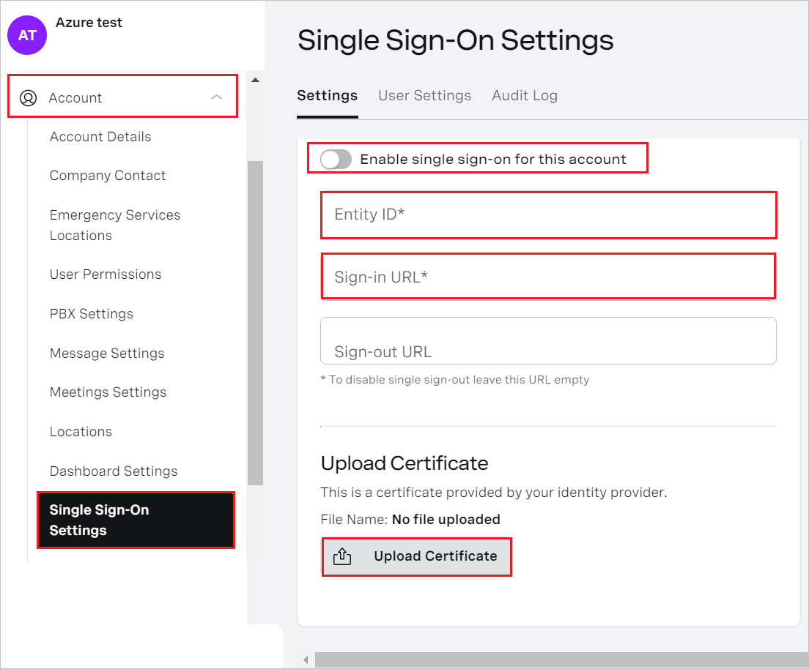
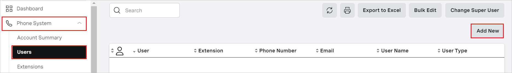
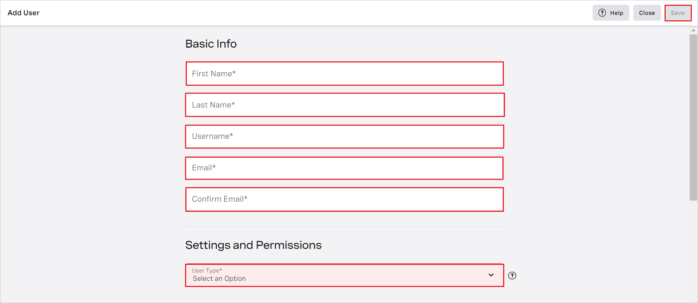

# Configure vonage for Single sign-on with Microsoft Entra ID

In this article,  you learn how to integrate vonage with Microsoft Entra ID. When you integrate vonage with Microsoft Entra ID, you can:

* Control in Microsoft Entra ID who has access to vonage.
* Enable your users to be automatically signed-in to vonage with their Microsoft Entra accounts.
* Manage your accounts in one central location.

## Prerequisites
The scenario outlined in this article assumes that you already have the following prerequisites:

[!INCLUDE [common-prerequisites.md](~/identity/saas-apps/includes/common-prerequisites.md)]
* vonage single sign-on (SSO) enabled subscription.

## Scenario description

In this article,  you configure and test Microsoft Entra SSO in a test environment.

* vonage supports **SP and IDP** initiated SSO.
* vonage supports [Automated user provisioning](vonage-provisioning-tutorial.md).

## Adding vonage from the gallery

To configure the integration of vonage into Microsoft Entra ID, you need to add vonage from the gallery to your list of managed SaaS apps.

1. Sign in to the [Microsoft Entra admin center](https://entra.microsoft.com) as at least a [Cloud Application Administrator](~/identity/role-based-access-control/permissions-reference.md#cloud-application-administrator).
1. Browse to **Entra ID** > **Enterprise apps** > **New application**.
1. In the **Add from the gallery** section, type **vonage** in the search box.
1. Select **vonage** from results panel and then add the app. Wait a few seconds while the app is added to your tenant.

 Alternatively, you can also use the [Enterprise App Configuration Wizard](https://portal.office.com/AdminPortal/home?Q=Docs#/azureadappintegration). In this wizard, you can add an application to your tenant, add users/groups to the app, assign roles, and walk through the SSO configuration as well. [Learn more about Microsoft 365 wizards.](/microsoft-365/admin/misc/azure-ad-setup-guides)

## Configure and test Microsoft Entra SSO for vonage

Configure and test Microsoft Entra SSO with vonage using a test user called **B.Simon**. For SSO to work, you need to establish a link relationship between a Microsoft Entra user and the related user in vonage.

To configure and test Microsoft Entra SSO with vonage, perform the following steps:

1. **[Configure Microsoft Entra SSO](#configure-azure-ad-sso)** - to enable your users to use this feature.
    1. **Create a Microsoft Entra test user** - to test Microsoft Entra single sign-on with B.Simon.
    1. **Assign the Microsoft Entra test user** - to enable B.Simon to use Microsoft Entra single sign-on.
1. **[Configure vonage SSO](#configure-vonage-sso)** - to configure the single sign-on settings on application side.
    1. **[Create vonage test user](#create-vonage-test-user)** - to have a counterpart of B.Simon in vonage linked to the Microsoft Entra representation of user.
1. **[Test SSO](#test-sso)** - to verify whether the configuration works.

## Configure Microsoft Entra SSO

Follow these steps to enable Microsoft Entra SSO.

1. Sign in to the [Microsoft Entra admin center](https://entra.microsoft.com) as at least a [Cloud Application Administrator](~/identity/role-based-access-control/permissions-reference.md#cloud-application-administrator).
1. Browse to **Entra ID** > **Enterprise apps** > **vonage** > **Single sign-on**.
1. On the **Select a single sign-on method** page, select **SAML**.
1. On the **Set up single sign-on with SAML** page, select the pencil icon for **Basic SAML Configuration** to edit the settings.

   

1. On the **Basic SAML Configuration** section, if you wish to configure the application in **IDP** initiated mode, enter the values for the following fields:

    a. In the **Identifier** text box, type a value using the following pattern:
    `wso2is-<ENVIRONMENT>`

    b. In the **Reply URL** text box, type a URL using the following pattern:
    `https://login.auth-<ENVIRONMENT>.vonage.com/accountrecoveryendpoint/saml-translator.jsp?id=<ID>&env=<ENVIRONMENT>&client=Web`

1. Select **Set additional URLs** and perform the following step if you wish to configure the application in **SP** initiated mode:

    In the **Sign-on URL** text box, type a URL using the following pattern:
    `https://admin.<ENVIRONMENT>.vocal-<ENVIRONMENT>.com/`

	> [!NOTE]
	> These values aren't real. Update these values with the actual Identifier, Reply URL, and Sign-on URL. Contact [vonage Client support team](mailto:office@vonage.com) to get these values. You can also refer to the patterns shown in the **Basic SAML Configuration** section.

1. On the **Set up single sign-on with SAML** page, in the **SAML Signing Certificate** section,  find **Certificate (Base64)** and select **Download** to download the certificate and save it on your computer.

	

1. On the **Set up vonage** section, copy the appropriate URL(s) based on your requirement.

	

[!INCLUDE [create-assign-users-sso.md](~/identity/saas-apps/includes/create-assign-users-sso.md)]

## Configure vonage SSO

1. In a different web browser window, sign into vonage website as an administrator.

1. Go to the **Account > Single Sign-On Settings > Settings**.

1. Perform the following steps in the following page.

    

    a. Select **Enable single sign-on for this account**.

    b. In the **Entity ID** textbox, paste the **Microsoft Entra Identifier** value which you copied previously.

    c. In the **Sign-in URL** textbox, paste the **Login URL** value which you copied previously. 

    d. Upload the **Certificate(Base64)** file which you have downloaded into the **Upload Certificate**.

### Create vonage test user

1. In a different web browser window, sign into vonage website as an administrator.

1. Go to the **Phone System > Users > Add New**.

    

1. Add the required fields in the following page and select **Save**.

    

> [!NOTE]
> vonage also supports automatic user provisioning. You can find more details [here](./vonage-provisioning-tutorial.md) on how to configure automatic user provisioning.

## Test SSO 

In this section, you test your Microsoft Entra single sign-on configuration with following options. 

#### SP initiated:

* Select **Test this application** in Azure portal. this option redirects to vonage Sign-on URL where you can initiate the sign-in flow.  

* Go to vonage Sign-on URL directly and initiate the sign-in flow from there.

#### IDP initiated:

* Select **Test this application** and you should be automatically signed in to the vonage for which you set up the SSO 

You can also use Microsoft My Apps to test the application in any mode. When you select the vonage tile in the My Apps, if configured in SP mode you would be redirected to the application sign-on page for initiating the sign-in flow and if configured in IDP mode, you should be automatically signed in to the vonage for which you set up the SSO. For more information about the My Apps, see [Introduction to the My Apps](https://support.microsoft.com/account-billing/sign-in-and-start-apps-from-the-my-apps-portal-2f3b1bae-0e5a-4a86-a33e-876fbd2a4510).

## Related content

Once you configure vonage you can enforce session control, which protects exfiltration and infiltration of your organization’s sensitive data in real time. Session control extends from Conditional Access. [Learn how to enforce session control with Microsoft Defender for Cloud Apps](/cloud-app-security/proxy-deployment-any-app).
