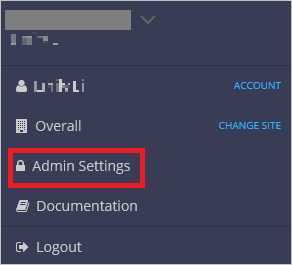
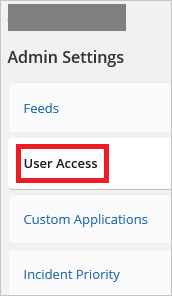
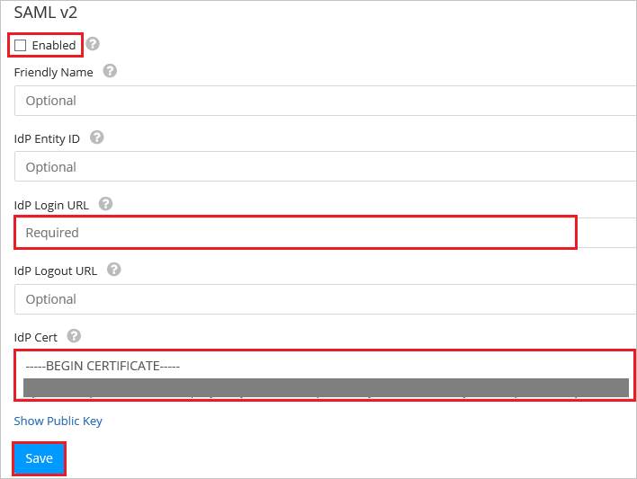

# Configure Voyance for Single sign-on with Microsoft Entra ID

In this article,  you learn how to integrate Voyance with Microsoft Entra ID.
Integrating Voyance with Microsoft Entra ID provides you with the following benefits:

* You can control in Microsoft Entra ID who has access to Voyance.
* You can enable your users to be automatically signed-in to Voyance (Single Sign-On) with their Microsoft Entra accounts.
* You can manage your accounts in one central location.

If you want to know more details about SaaS app integration with Microsoft Entra ID, see [What is application access and single sign-on with Microsoft Entra ID](~/identity/enterprise-apps/what-is-single-sign-on.md).
If you don't have an Azure subscription, [create a free account](https://azure.microsoft.com/free/) before you begin.

## Prerequisites
The scenario outlined in this article assumes that you already have the following prerequisites:

[!INCLUDE [common-prerequisites.md](~/identity/saas-apps/includes/common-prerequisites.md)]
* Voyance single sign-on enabled subscription

## Scenario description

In this article,  you configure and test Microsoft Entra single sign-on in a test environment.

* Voyance supports **SP** and **IDP** initiated SSO

* Voyance supports **Just In Time** user provisioning

## Adding Voyance from the gallery

To configure the integration of Voyance into Microsoft Entra ID, you need to add Voyance from the gallery to your list of managed SaaS apps.

**To add Voyance from the gallery, perform the following steps:**

1. Sign in to the [Microsoft Entra admin center](https://entra.microsoft.com) as at least a [Cloud Application Administrator](~/identity/role-based-access-control/permissions-reference.md#cloud-application-administrator).
1. Browse to **Entra ID** > **Enterprise apps** > **New application**.
1. In the search box, type **Voyance**, select **Voyance** from result panel then select **Add** button to add the application.

	 

## Configure and test Microsoft Entra single sign-on

In this section, you configure and test Microsoft Entra single sign-on with Voyance based on a test user called **Britta Simon**.
For single sign-on to work, a link relationship between a Microsoft Entra user and the related user in Voyance needs to be established.

To configure and test Microsoft Entra single sign-on with Voyance, you need to complete the following building blocks:

1. **[Configure Microsoft Entra Single Sign-On](#configure-azure-ad-single-sign-on)** - to enable your users to use this feature.
2. **[Configure Voyance Single Sign-On](#configure-voyance-single-sign-on)** - to configure the Single Sign-On settings on application side.
3. **Create a Microsoft Entra test user** - to test Microsoft Entra single sign-on with Britta Simon.
4. **Assign the Microsoft Entra test user** - to enable Britta Simon to use Microsoft Entra single sign-on.
5. **[Create Voyance test user](#create-voyance-test-user)** - to have a counterpart of Britta Simon in Voyance that's linked to the Microsoft Entra representation of user.
6. **[Test single sign-on](#test-single-sign-on)** - to verify whether the configuration works.

### Configure Microsoft Entra single sign-on

In this section, you enable Microsoft Entra single sign-on.

To configure Microsoft Entra single sign-on with Voyance, perform the following steps:

1. Sign in to the [Microsoft Entra admin center](https://entra.microsoft.com) as at least a [Cloud Application Administrator](~/identity/role-based-access-control/permissions-reference.md#cloud-application-administrator).
1. Browse to **Entra ID** > **Enterprise apps** > **Voyance** application integration page, select **Single sign-on**.

    

1. On the **Select a Single sign-on method** dialog, select **SAML/WS-Fed** mode to enable single sign-on.

    

1. On the **Set up Single Sign-On with SAML** page, select **Edit** icon to open **Basic SAML Configuration** dialog.

	

1. On the **Basic SAML Configuration** section, if you wish to configure the application in **IDP** initiated mode, perform the following steps:

    

    a. In the **Identifier** text box, type a URL using the following pattern:
    `https://<companyname>.nyansa.com`

    b. In the **Reply URL** text box, type a URL using the following pattern:
    `https://<companyname>.nyansa.com/saml/create/`

5. Select **Set additional URLs** and perform the following step if you wish to configure the application in **SP** initiated mode:

    

    In the **Sign-on URL** text box, type a URL using the following pattern:
    `https://<companyname>.nyansa.com/`

	> [!NOTE]
	> These values aren't real. Update these values with the actual Identifier, Reply URL and Sign-on URL. Contact [Voyance Client support team](mailto:support@nyansa.com) to get these values. You can also refer to the patterns shown in the **Basic SAML Configuration** section.

6. On the **Set up Single Sign-On with SAML** page, in the **SAML Signing Certificate** section, select **Download** to download the **Certificate (Base64)** from the given options as per your requirement and save it on your computer.

	

7. On the **Set up Voyance** section, copy the appropriate URL(s) as per your requirement.

	

	a. Login URL

	b. Microsoft Entra Identifier

	c. Logout URL

### Configure Voyance Single Sign-On

1. In a different web browser window, sign-on to your Voyance tenant as an administrator.

2. Go to the top right corner of the navigation bar and select **Profile**.
	
	 

3. Select **Admin Settings**.

	

4. Select **User Access** tab.

	

5. Select the **SSO is disabled** button to configure Microsoft Entra ID as an IdP using SAML 2.0.

	

6. Go to **SAML v2** section and perform below steps:

	
	
	a. Select **Enabled**.
	
	b. Paste **Login URL** into the **IdP Login URL** textbox.

	c. Open your downloaded Base64 encoded certificate in notepad, copy the content of it into your clipboard, and then paste it to the **IdP Cert** textbox.
	
	d. Select **Save**.

[!INCLUDE [create-assign-users-sso.md](~/identity/saas-apps/includes/create-assign-users-sso.md)]

### Create Voyance test user

In this section, a user called Britta Simon is created in Voyance. Voyance supports just-in-time user provisioning, which is enabled by default. There's no action item for you in this section. If a user doesn't already exist in Voyance, a new one is created after authentication.

>[!NOTE]
>If you need to create a user manually, you need to contact [Voyance support team](mailto:support@nyansa.com).

### Test single sign-on 

In this section, you test your Microsoft Entra single sign-on configuration using the Access Panel.

When you select the Voyance tile in the Access Panel, you should be automatically signed in to the Voyance for which you set up SSO. For more information about the Access Panel, see [Introduction to the Access Panel](https://support.microsoft.com/account-billing/sign-in-and-start-apps-from-the-my-apps-portal-2f3b1bae-0e5a-4a86-a33e-876fbd2a4510).

## Additional Resources

- [List of articles on How to Integrate SaaS Apps with Microsoft Entra ID](./tutorial-list.md)

- [What is application access and single sign-on with Microsoft Entra ID?](~/identity/enterprise-apps/what-is-single-sign-on.md)

- [What is Conditional Access in Microsoft Entra ID?](~/identity/conditional-access/overview.md)
