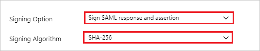
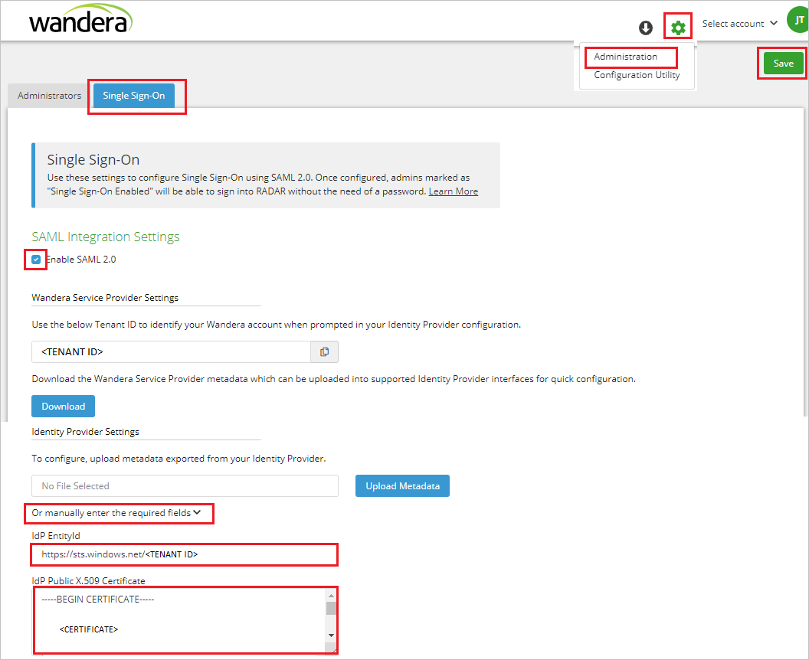

# Configure Wandera RADAR Admin for Single sign-on with Microsoft Entra ID

In this article,  you learn how to integrate Wandera RADAR Admin with Microsoft Entra ID. When you integrate Wandera RADAR Admin with Microsoft Entra ID, you can:

* Control in Microsoft Entra ID who has access to Wandera RADAR Admin.
* Enable your users to be automatically signed-in to Wandera RADAR Admin with their Microsoft Entra accounts.
* Manage your accounts in one central location.

## Prerequisites
The scenario outlined in this article assumes that you already have the following prerequisites:

[!INCLUDE [common-prerequisites.md](~/identity/saas-apps/includes/common-prerequisites.md)]
* Wandera RADAR Admin single sign-on (SSO) enabled subscription.

## Scenario description

In this article,  you configure and test Microsoft Entra SSO in a test environment.

* Wandera RADAR Admin supports **IDP** initiated SSO.

> [!NOTE]
> Identifier of this application is a fixed string value so only one instance can be configured in one tenant.

## Add Wandera RADAR Admin from the gallery

To configure the integration of Wandera RADAR Admin into Microsoft Entra ID, you need to add Wandera RADAR Admin from the gallery to your list of managed SaaS apps.

1. Sign in to the [Microsoft Entra admin center](https://entra.microsoft.com) as at least a [Cloud Application Administrator](~/identity/role-based-access-control/permissions-reference.md#cloud-application-administrator).
1. Browse to **Entra ID** > **Enterprise apps** > **New application**.
1. In the **Add from the gallery** section, type **Wandera RADAR Admin** in the search box.
1. Select **Wandera RADAR Admin** from results panel and then add the app. Wait a few seconds while the app is added to your tenant.

 Alternatively, you can also use the [Enterprise App Configuration Wizard](https://portal.office.com/AdminPortal/home?Q=Docs#/azureadappintegration). In this wizard, you can add an application to your tenant, add users/groups to the app, assign roles, and walk through the SSO configuration as well. [Learn more about Microsoft 365 wizards.](/microsoft-365/admin/misc/azure-ad-setup-guides)

## Configure and test Microsoft Entra SSO for Wandera RADAR Admin

Configure and test Microsoft Entra SSO with Wandera RADAR Admin using a test user called **B.Simon**. For SSO to work, you need to establish a link relationship between a Microsoft Entra user and the related user in Wandera RADAR Admin.

To configure and test Microsoft Entra SSO with Wandera RADAR Admin, perform the following steps:

1. **[Configure Microsoft Entra SSO](#configure-azure-ad-sso)** - to enable your users to use this feature.
   1. **Create a Microsoft Entra test user** - to test Microsoft Entra single sign-on with B.Simon.
   1. **Assign the Microsoft Entra test user** - to enable B.Simon to use Microsoft Entra single sign-on.
1. **[Configure Wandera RADAR Admin SSO](#configure-wandera-radar-admin-sso)** - to configure the Single Sign-On settings on application side.
   1. **[Create Wandera RADAR Admin test user](#create-wandera-radar-admin-test-user)** - to have a counterpart of B.Simon in Wandera RADAR Admin that's linked to the Microsoft Entra representation of user.
1. **[Test SSO](#test-sso)** - to verify whether the configuration works.

## Configure Microsoft Entra SSO

Follow these steps to enable Microsoft Entra SSO.

1. Sign in to the [Microsoft Entra admin center](https://entra.microsoft.com) as at least a [Cloud Application Administrator](~/identity/role-based-access-control/permissions-reference.md#cloud-application-administrator).
1. Browse to **Entra ID** > **Enterprise apps** > **Wandera RADAR Admin** application integration page, find the **Manage** section and select **Single sign-on**.
1. On the **Select a Single sign-on method** page, select **SAML**.
1. On the **Set up Single Sign-On with SAML** page, select the pencil icon for **Basic SAML Configuration** to edit the settings.

   

1. On the **Basic SAML Configuration** section, perform the following step:

    In the **Reply URL** text box, type a URL using the following pattern:
    `https://radar.wandera.com/saml/acs/<TENANT_ID>`

    > [!NOTE]
    > The value isn't real. Update the value with the actual Reply URL. Contact [Wandera RADAR Admin Client support team](https://www.wandera.com/about-wandera/contact/#supportsection) to get the value. You can also refer to the patterns shown in the **Basic SAML Configuration** section. Carefully replace the \<tenant id\> part of the above URL with the Tenant ID shown in the **Settings** > **Administration** > **Single Sign-On** page within your Wandera account.

1. On the **Set up Single Sign-On with SAML** page, in the **SAML Signing Certificate** section,  find **Federation Metadata XML** and select **Download** to download the certificate and save it on your computer.

    

1. On the **Set up Single Sign-On with SAML** page, select the pencil icon for **SAML Signing Certificate** to edit the settings.

    

    1. Select **Signing Option** as **Sign SAML response and assertion**.

    1. Select **Signing Algorithm** as **SHA-256**.

1. On the **Set up Wandera RADAR Admin** section, copy the appropriate URL(s) based on your requirement.

    

[!INCLUDE [create-assign-users-sso.md](~/identity/saas-apps/includes/create-assign-users-sso.md)]

## Configure Wandera RADAR Admin SSO

1. In a different web browser window, sign in to your Wandera RADAR Admin company site as an administrator

4. On the top-right corner of the page, select **Settings** > **Administration** > **Single Sign-On** and then check the option **Enable SAML 2.0** to perform the following steps.

    

    a. Select **Or manually enter the required fields**.

    b. In the **IdP EntityId** text box, Paste the **Microsoft Entra Identifier** value, which you copied previously.

    c. Open the Federation Metadata XML in notepad, copy its content and paste it into the **IdP Public X.509 Certificate** text box.

    d. Select **Save**.

### Create Wandera RADAR Admin test user

In this section, you create a user called B.Simon in Wandera RADAR Admin. Work with [Wandera RADAR Admin support team](https://www.wandera.com/about-wandera/contact/#supportsection) to add the users in the Wandera RADAR Admin platform. Users must be created and activated before you use single sign-on.

## Test SSO

In this section, you test your Microsoft Entra single sign-on configuration with following options.

* Select **Test this application**, and you should be automatically signed in to the Wandera RADAR Admin for which you set up the SSO.

* You can use Microsoft My Apps. When you select the Wandera RADAR Admin tile in the My Apps, you should be automatically signed in to the Wandera RADAR Admin for which you set up the SSO. For more information about the My Apps, see [Introduction to the My Apps](https://support.microsoft.com/account-billing/sign-in-and-start-apps-from-the-my-apps-portal-2f3b1bae-0e5a-4a86-a33e-876fbd2a4510).

## Related content

Once you configure Wandera RADAR Admin you can enforce session control, which protects exfiltration and infiltration of your organization's sensitive data in real time. Session control extends from Conditional Access. [Learn how to enforce session control with Microsoft Defender for Cloud Apps](/cloud-app-security/proxy-deployment-aad).
