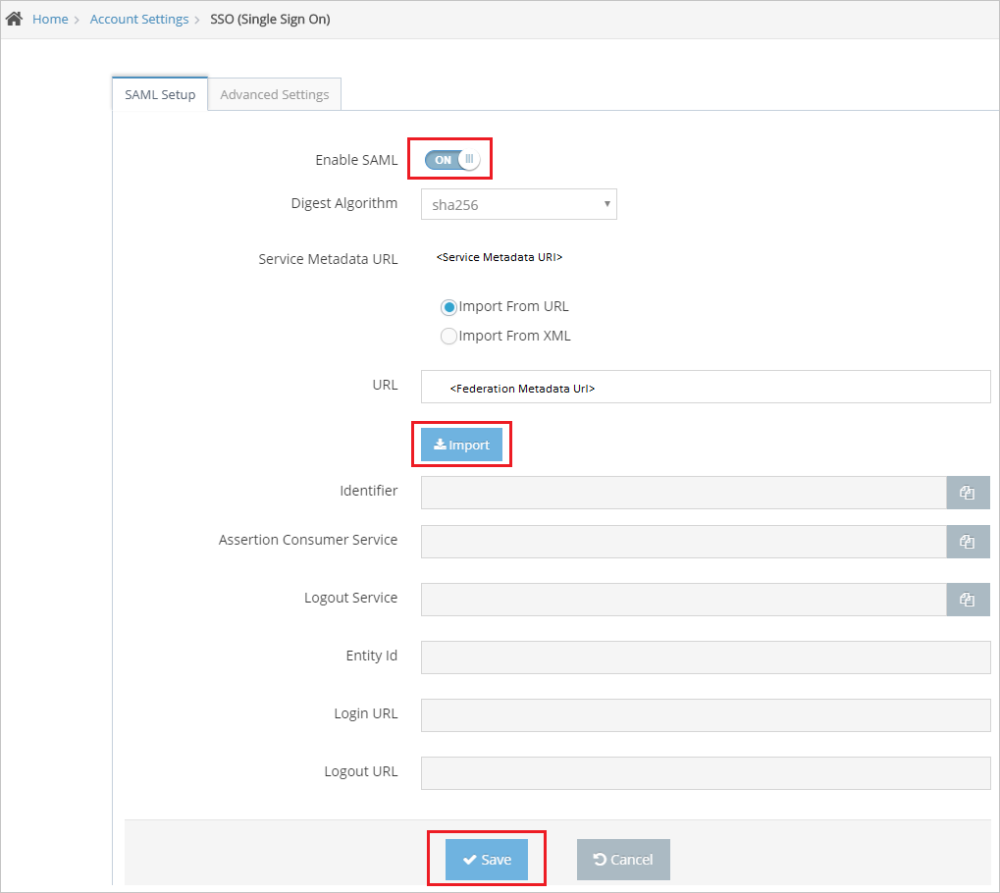
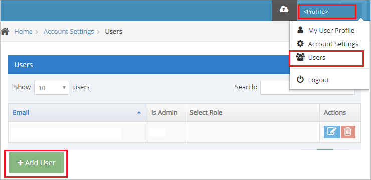
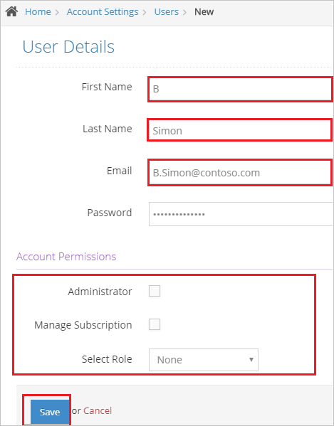

# Configure Watch by Colors for Single sign-on with Microsoft Entra ID

In this article,  you learn how to integrate Watch by Colors with Microsoft Entra ID. When you integrate Watch by Colors with Microsoft Entra ID, you can:

* Control in Microsoft Entra ID who has access to Watch by Colors.
* Enable your users to be automatically signed-in to Watch by Colors with their Microsoft Entra accounts.
* Manage your accounts in one central location.

## Prerequisites
The scenario outlined in this article assumes that you already have the following prerequisites:

[!INCLUDE [common-prerequisites.md](~/identity/saas-apps/includes/common-prerequisites.md)]
* Watch by Colors single sign-on (SSO) enabled subscription.

## Scenario description

In this article,  you configure and test Microsoft Entra SSO in a test environment.

* Watch by Colors supports **SP and IDP** initiated SSO.

## Add Watch by Colors from the gallery

To configure the integration of Watch by Colors into Microsoft Entra ID, you need to add Watch by Colors from the gallery to your list of managed SaaS apps.

1. Sign in to the [Microsoft Entra admin center](https://entra.microsoft.com) as at least a [Cloud Application Administrator](~/identity/role-based-access-control/permissions-reference.md#cloud-application-administrator).
1. Browse to **Entra ID** > **Enterprise apps** > **New application**.
1. In the **Add from the gallery** section, type **Watch by Colors** in the search box.
1. Select **Watch by Colors** from results panel and then add the app. Wait a few seconds while the app is added to your tenant.

 Alternatively, you can also use the [Enterprise App Configuration Wizard](https://portal.office.com/AdminPortal/home?Q=Docs#/azureadappintegration). In this wizard, you can add an application to your tenant, add users/groups to the app, assign roles, and walk through the SSO configuration as well. [Learn more about Microsoft 365 wizards.](/microsoft-365/admin/misc/azure-ad-setup-guides)

## Configure and test Microsoft Entra SSO for Watch by Colors

Configure and test Microsoft Entra SSO with Watch by Colors using a test user called **B.Simon**. For SSO to work, you need to establish a link relationship between a Microsoft Entra user and the related user in Watch by Colors.

To configure and test Microsoft Entra SSO with Watch by Colors, perform the following steps:

1. **[Configure Microsoft Entra SSO](#configure-azure-ad-sso)** - to enable your users to use this feature.
    1. **Create a Microsoft Entra test user** - to test Microsoft Entra single sign-on with B.Simon.
    1. **Assign the Microsoft Entra test user** - to enable B.Simon to use Microsoft Entra single sign-on.
1. **[Configure Watch by Colors SSO](#configure-watch-by-colors-sso)** - to configure the single sign-on settings on application side.
    1. **[Create Watch by Colors test user](#create-watch-by-colors-test-user)** - to have a counterpart of B.Simon in Watch by Colors that's linked to the Microsoft Entra representation of user.
1. **[Test SSO](#test-sso)** - to verify whether the configuration works.

## Configure Microsoft Entra SSO

Follow these steps to enable Microsoft Entra SSO.

1. Sign in to the [Microsoft Entra admin center](https://entra.microsoft.com) as at least a [Cloud Application Administrator](~/identity/role-based-access-control/permissions-reference.md#cloud-application-administrator).
1. Browse to **Entra ID** > **Enterprise apps** > **Watch by Colors** > **Single sign-on**.
1. On the **Select a single sign-on method** page, select **SAML**.
1. On the **Set up single sign-on with SAML** page, select the pencil icon for **Basic SAML Configuration** to edit the settings.

   

1. On the **Basic SAML Configuration** section the application is pre-configured in **IDP** initiated mode and the necessary URLs are already pre-populated with Azure. The user needs to save the configuration by selecting the **Save** button.

1. Select **Set additional URLs** and perform the following step if you wish to configure the application in **SP** initiated mode:

    In the **Sign-on URL** text box, type the URL:
    `https://app.colorscorporation.com/login`

1. On the **Set up single sign-on with SAML** page, In the **SAML Signing Certificate** section, select copy button to copy **App Federation Metadata Url** and save it on your computer.

	

[!INCLUDE [create-assign-users-sso.md](~/identity/saas-apps/includes/create-assign-users-sso.md)]

## Configure Watch by Colors SSO

1. In a different web browser window, sign in to your Watch by Colors company site as an administrator

4. On the top-right corner of the page, select **profile** > **Account Settings** > **SSO (Single Sign On)**.

	

5. On the **SSO (Single Sign On)** page, perform the following steps:

	

	a. Toggle **Enable SAML** to **ON**.

    b. In the **URL** text box, paste the **Federation Metadata Url**.

    c. Select **Import**, then the following fields get auto-populated automatically on the page.

    d. Select **Save**.

### Create Watch by Colors test user

To enable Microsoft Entra users to sign in to Watch by Colors, they must be provisioned into Watch by Colors. In Watch by Colors, provisioning is a manual task.

**To provision a user account, perform the following steps:**

1. Sign in to Watch by Colors as a Security Administrator.

1. On the top-right corner of the page, select **profile** > **Users** > **Add User**.

	

1. On the **User Details** page, perform the following steps:

    

    a. In **First Name** text box, enter the first name of user like **B**.

    b. In **Last Name** text box, enter the last name of user like **Simon**.

    c. In **Email** text box, enter the email of user like `B.Simon@contoso.com`.

    d. In **Password** text box, enter the password.

    e. Select **Account Permissions** as per your organization.

    f. Select **Save**.

## Test SSO 

In this section, you test your Microsoft Entra single sign-on configuration with following options. 

#### SP initiated:

* Select **Test this application**, this option redirects to Watch by Colors Sign on URL where you can initiate the login flow.  

* Go to Watch by Colors Sign-on URL directly and initiate the login flow from there.

#### IDP initiated:

* Select **Test this application**, and you should be automatically signed in to the Watch by Colors for which you set up the SSO. 

You can also use Microsoft My Apps to test the application in any mode. When you select the Watch by Colors tile in the My Apps, if configured in SP mode you would be redirected to the application sign on page for initiating the login flow and if configured in IDP mode, you should be automatically signed in to the Watch by Colors for which you set up the SSO. For more information, see [Microsoft Entra My Apps](/azure/active-directory/manage-apps/end-user-experiences#azure-ad-my-apps).

## Related content

Once you configure Watch by Colors you can enforce session control, which protects exfiltration and infiltration of your organization’s sensitive data in real time. Session control extends from Conditional Access. [Learn how to enforce session control with Microsoft Defender for Cloud Apps](/cloud-app-security/proxy-deployment-aad).
