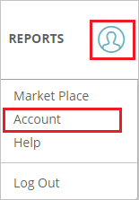

# Configure Way We Do for Single sign-on with Microsoft Entra ID

In this article,  you learn how to integrate Way We Do with Microsoft Entra ID. When you integrate Way We Do with Microsoft Entra ID, you can:

* Control in Microsoft Entra ID who has access to Way We Do.
* Enable your users to be automatically signed-in to Way We Do with their Microsoft Entra accounts.
* Manage your accounts in one central location.

## Prerequisites
The scenario outlined in this article assumes that you already have the following prerequisites:

[!INCLUDE [common-prerequisites.md](~/identity/saas-apps/includes/common-prerequisites.md)]
* Way We Do single sign-on enabled subscription.

## Scenario description

In this article,  you configure and test Microsoft Entra SSO in a test environment.

* Way We Do supports **SP** initiated SSO.
* Way We Do supports **Just In Time** user provisioning.

## Add Way We Do from the gallery

To configure the integration of Way We Do into Microsoft Entra ID, you need to add Way We Do from the gallery to your list of managed SaaS apps.

1. Sign in to the [Microsoft Entra admin center](https://entra.microsoft.com) as at least a [Cloud Application Administrator](~/identity/role-based-access-control/permissions-reference.md#cloud-application-administrator).
1. Browse to **Entra ID** > **Enterprise apps** > **New application**.
1. In the **Add from the gallery** section, type **Way We Do** in the search box.
1. Select **Way We Do** from results panel and then add the app. Wait a few seconds while the app is added to your tenant.

 Alternatively, you can also use the [Enterprise App Configuration Wizard](https://portal.office.com/AdminPortal/home?Q=Docs#/azureadappintegration). In this wizard, you can add an application to your tenant, add users/groups to the app, assign roles, and walk through the SSO configuration as well. [Learn more about Microsoft 365 wizards.](/microsoft-365/admin/misc/azure-ad-setup-guides)

## Configure and test Microsoft Entra SSO for Way We Do

Configure and test Microsoft Entra SSO with Way We Do using a test user called **B.Simon**. For SSO to work, you need to establish a link relationship between a Microsoft Entra user and the related user in Way We Do.

To configure and test Microsoft Entra SSO with Way We Do, perform the following steps:

1. **[Configure Microsoft Entra SSO](#configure-azure-ad-sso)** - to enable your users to use this feature.
    1. **Create a Microsoft Entra test user** - to test Microsoft Entra single sign-on with B.Simon.
    1. **Assign the Microsoft Entra test user** - to enable B.Simon to use Microsoft Entra single sign-on.
1. **[Configure Way We Do SSO](#configure-way-we-do-sso)** - to configure the single sign-on settings on application side.
    1. **[Create Way We Do test user](#create-way-we-do-test-user)** - to have a counterpart of B.Simon in Way We Do that's linked to the Microsoft Entra representation of user.
1. **[Test SSO](#test-sso)** - to verify whether the configuration works.

## Configure Microsoft Entra SSO

Follow these steps to enable Microsoft Entra SSO.

1. Sign in to the [Microsoft Entra admin center](https://entra.microsoft.com) as at least a [Cloud Application Administrator](~/identity/role-based-access-control/permissions-reference.md#cloud-application-administrator).
1. Browse to **Entra ID** > **Enterprise apps** > **Way We Do** application integration page, find the **Manage** section and select **Single sign-on**.
1. On the **Select a Single sign-on method** page, select **SAML**.
1. On the **Set up Single Sign-On with SAML** page, select the pencil icon for **Basic SAML Configuration** to edit the settings.

   

1. On the **Basic SAML Configuration** section, perform the following steps:  

    a. In the **Identifier (Entity ID)** text box, type a URL using the following pattern:
    `https://<SUBDOMAIN>.waywedo.com`

	b. In the **Sign on URL** text box, type a URL using the following pattern:
    `https://<SUBDOMAIN>.waywedo.com/Authentication/ExternalSignIn`

	> [!NOTE]
	> These values aren't real. Update these values with the actual Identifier and Sign on URL. Contact [Way We Do Client support team](mailto:support@waywedo.com) to get these values. You can also refer to the patterns shown in the **Basic SAML Configuration** section.

1. On the **Set up Single Sign-On with SAML** page, in the **SAML Signing Certificate** section, find **Certificate (Raw)** and select **Download** to download the certificate and save it on your computer.

   

1. On the **Set up Way We Do** section, copy the appropriate URL(s) based on your requirement.

   

[!INCLUDE [create-assign-users-sso.md](~/identity/saas-apps/includes/create-assign-users-sso.md)]

## Configure Way We Do SSO

1. In a different web browser window, sign in to your Way We Do company site as an administrator

1. Select the **person icon** in the top right corner of any page in Way We Do, then select **Account** in the dropdown menu.

    

1. Select the **menu icon** to open the push navigation menu and Select **Single Sign On**.

    

1. On the **Single sign-on setup** page, perform the following steps:

    

    1. Select the **Turn on single sign-on** toggle to **Yes** to enable Single Sign-On.

	1. In the **Single sign-on name** textbox, enter your name.

	1. In the **Entity ID** textbox, paste the value of **Microsoft Entra Identifier**, which you copied previously.

	1. In the **SAML SSO URL** textbox, paste the value of **Login URL**, which you copied previously.

	1. Upload the certificate by selecting the **select** button next to **Certificate**.

	1. **Optional Settings** -

	    * Enable Passwords - When this option is disabled, the regular password functions for Way We Do so that users can only use single sign-on.

        * Enable Auto-provisioning - When this is enabled, the email address used to sign-on is automatically compared to the list of users in Way We Do. If the email address doesn't match an active user in Way We Do, it automatically adds a new user account for the person signing in, requesting any missing information.

          > [!NOTE]
          > Users added through single sign-on are added as general users and aren't assigned a role in the system. An Administrator is able to go in and modify their security role as an editor or administrator and can also assign one or several Org Chart roles.

    1. Select **Save** to persist your settings.
    
### Create Way We Do test user

In this section, a user called Britta Simon is created in Way We Do. Way We Do supports just-in-time user provisioning, which is enabled by default. There's no action item for you in this section. If a user doesn't already exist in Way We Do, a new one is created after authentication.

> [!Note]
> If you need to create a user manually, contact [Way We Do Client support team](mailto:support@waywedo.com).

## Test SSO

In this section, you test your Microsoft Entra single sign-on configuration with following options. 

* Select **Test this application**, this option redirects to Way We Do Sign-on URL where you can initiate the login flow. 

* Go to Way We Do Sign-on URL directly and initiate the login flow from there.

* You can use Microsoft My Apps. When you select the Way We Do tile in the My Apps, this option redirects to Way We Do Sign-on URL. For more information, see [Microsoft Entra My Apps](/azure/active-directory/manage-apps/end-user-experiences#azure-ad-my-apps).

## Related content

Once you configure Way We Do you can enforce session control, which protects exfiltration and infiltration of your organization’s sensitive data in real time. Session control extends from Conditional Access. [Learn how to enforce session control with Microsoft Cloud App Security](/cloud-app-security/proxy-deployment-aad).
