---
title: Configure Workiva for Single sign-on with Microsoft Entra ID
description: Learn how to configure single sign-on between Microsoft Entra ID and Workiva.
ms.topic: how-to
ms.date: 08/28/2026
ms.custom: sfi-image-nochange
# Customer intent: As an IT administrator, I want to learn how to configure single sign-on between Microsoft Entra ID and Workiva so that I can control who has access to Workiva, enable automatic sign-in with Microsoft Entra accounts, and manage my accounts in one central location.
--- 
# Configure Workiva for Single sign-on with Microsoft Entra ID

This article will walk you through how to configure Single Sign-On for Workiva with Azure Entra ID. Workiva has created an entirely self-service portal for configuring SSO. Workiva suggests designating a member of the IAM/IT team to do the configuration as well as make sure the authentication settings are complying with your company requirements.

This is accomplished through a Workiva role called **Organization Security Admin** which gives no content access, just admin access to the security tab which contains authentication and SSO settings. 
> [!Caution]
> The Organization Security Admin will need to be added to a Workspace in order to access the Organization level

* Control in Microsoft Entra ID who has access to Workiva.
* Enable your users to be automatically signed-in to Workiva with their Microsoft Entra accounts.
* Manage your accounts in one central location.

## Prerequisites
The scenario outlined in this article assumes that you already have the following prerequisites:
[!INCLUDE [common-prerequisites.md](~/identity/saas-apps/includes/common-prerequisites.md)]

## Scenario description

In this article,  you configure and test Microsoft Entra single sign-on in a test environment.

* Workiva supports **SAML 2.0**.
* Workiva supports **SP** and **IDP** initiated SSO.
* Workiva can leverage **hybrid authentication** for smoother integration.
* Workiva contains an **SSO Exception List** for external third party users.

## Create Workiva SSO Configuration

To access the Security Panel where the SSO configuration can be found, an assigned **Organization Security Admin** will need to access: Workiva > **Person Icon** > **Admin** > **Organization Admin**.

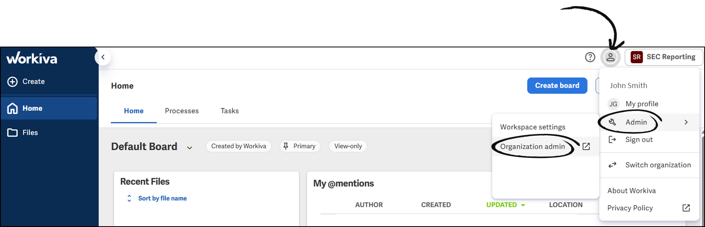

Once the new browser tab loads, browse to **Security** > **Single Sign-On** > **SSO configuration** > **+ Create SSO Configuration:**
	
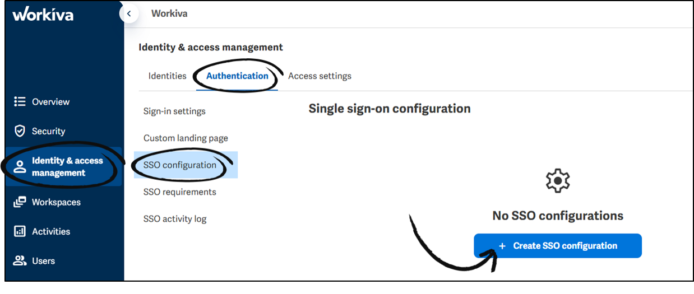

To create an SSO configuration the assigned Org Security Admin will need to: **Name** this specific SSO configuration > select Azure as the **Identity Provider (IdP)** > then **Create Configuration**.
	
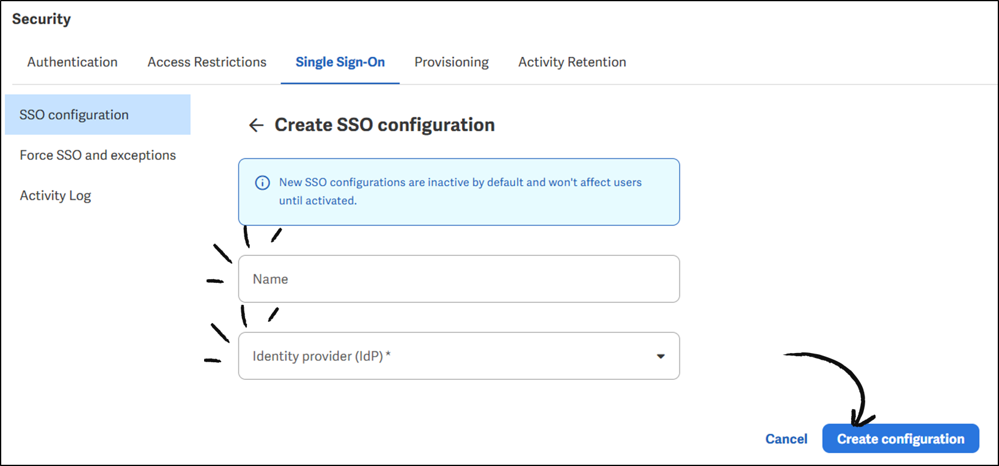

Under Step 1 Workiva Metadata, the Org Security Admin will be able to obtain the **Identifier (Entity ID)** and **Reply URL (Assertion Consumer Service URL)** endpoints. There is also an option to download the actual Workiva .XML Metadata file for the Azure import option.
	
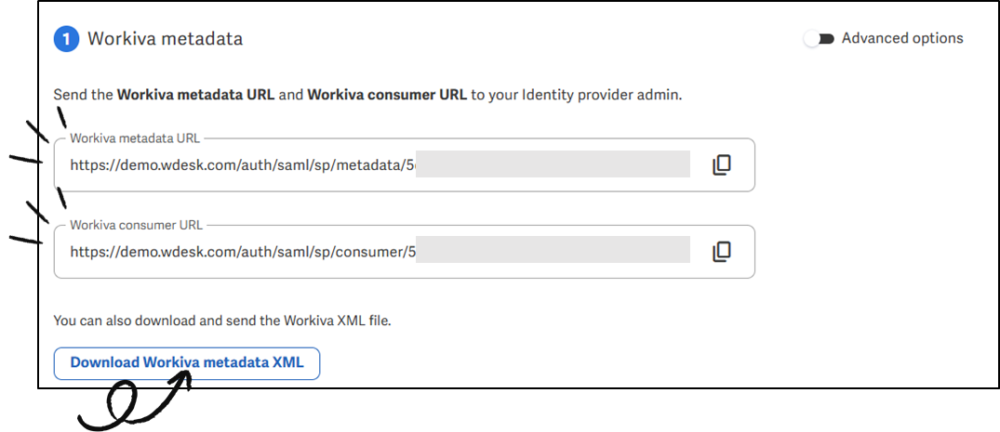

The **Advanced options** toggle will display additional **Login URL** and the **Logout URL** if required for configuration.

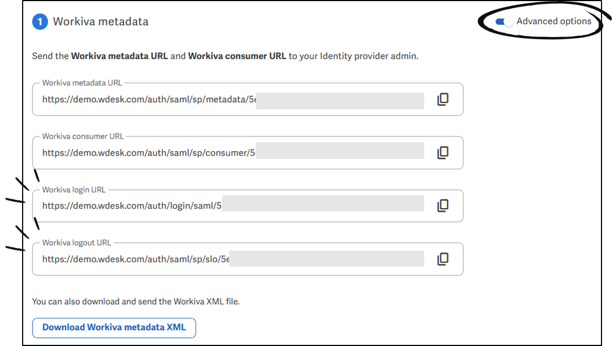

## Add Workiva from the Azure Entra ID Gallery

To configure the integration of Workiva into Microsoft Entra ID, you need to add Workiva from the gallery to your list of managed SaaS apps.

Sign in to the [Microsoft Entra admin center](https://entra.microsoft.com) as at least a [Cloud Application Administrator](~/identity/role-based-access-control/permissions-reference.md#cloud-application-administrator).

Browse to **Entra ID** > **Enterprise apps** > **New application**.

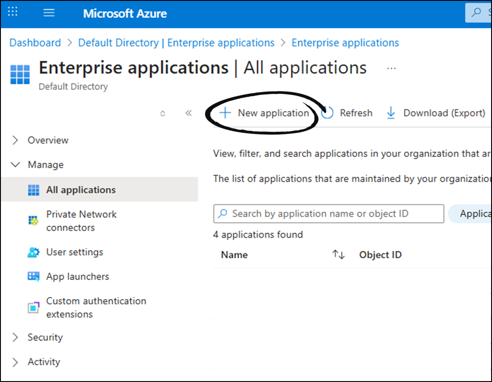

In the **Search application** section, type **Workiva** in the search box.
Select **Workiva** from results panel and then add the app. 

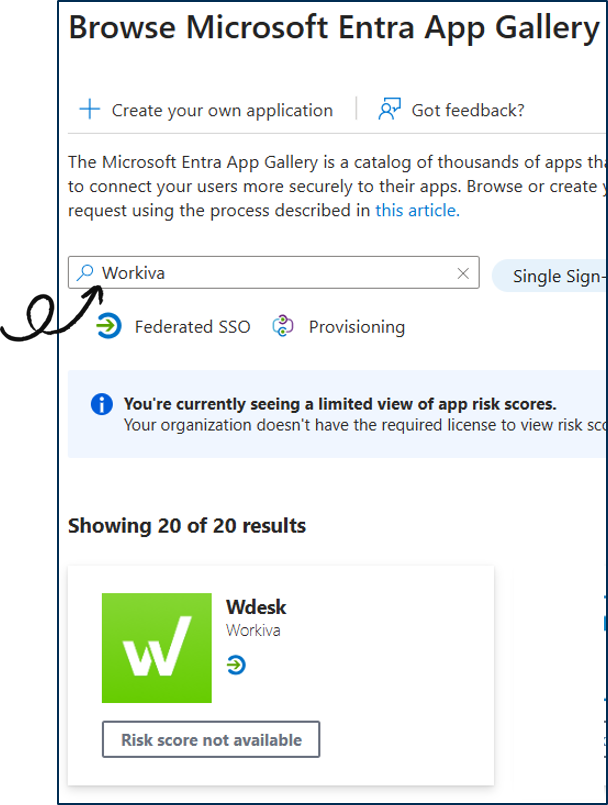

Alternatively, you can also use the [Enterprise App Configuration Wizard](https://portal.office.com/AdminPortal/home?Q=Docs#/azureadappintegration). In this wizard, you can add an application to your tenant, add users/groups to the app, assign roles, and walk through the SSO configuration as well. [Learn more about Microsoft 365 wizards.](/microsoft-365/admin/misc/azure-ad-setup-guides)

## Configure Microsoft Entra SSO

Follow these steps to configure Microsoft Entra SSO.

Sign in to the [Microsoft Entra admin center](https://entra.microsoft.com) as at least a [Cloud Application Administrator](~/identity/role-based-access-control/permissions-reference.md#cloud-application-administrator).
Browse to **Entra ID** > **Enterprise apps** > **Workiva** > **Single sign-on**.
On the **Select a single sign-on method** page, select **SAML**.

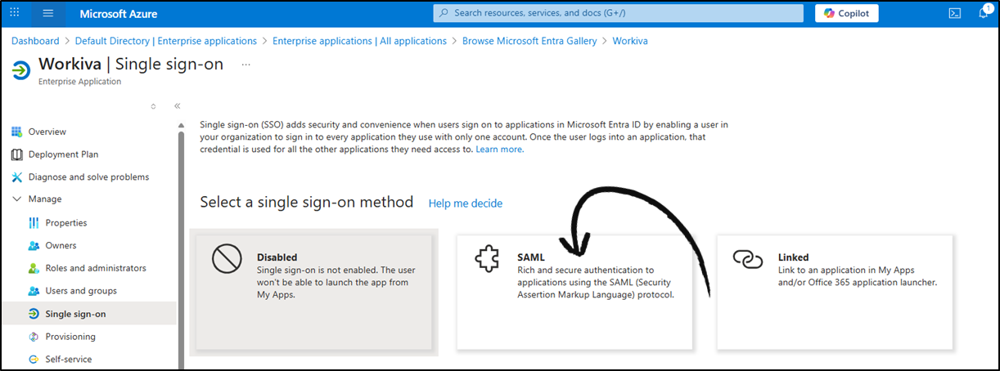

On the **Set up single sign-on with SAML** page, select the pencil icon for **Basic SAML Configuration** to edit the settings. Azure can either **import** the Workiva metadata file for the SP details or **manually enter** the information.

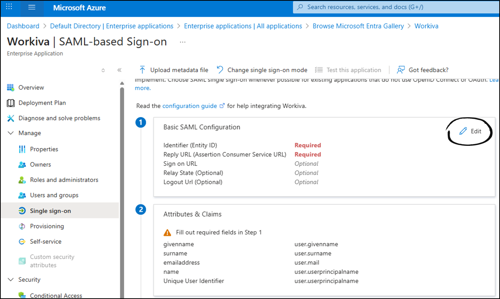

If manually, The **Org Security Admin** can either: 
*	Upload Metadata File
*	Paste them into the appropriate fields in the Azure SAML integration or  as shown below.
  	* The **Workiva Metadata URL** will go into the **Azure Identifier (EntityID)**
    * The **Workiva Consumer URL** will go into the **Azure Reply URL**
	* The **Workiva Login URL** will go into the **Azure Sign on URL**
	* Leave the **Relay State** Blank
	* The **Workiva Logout URL** will go into the **Azure Logout URL (optional)**

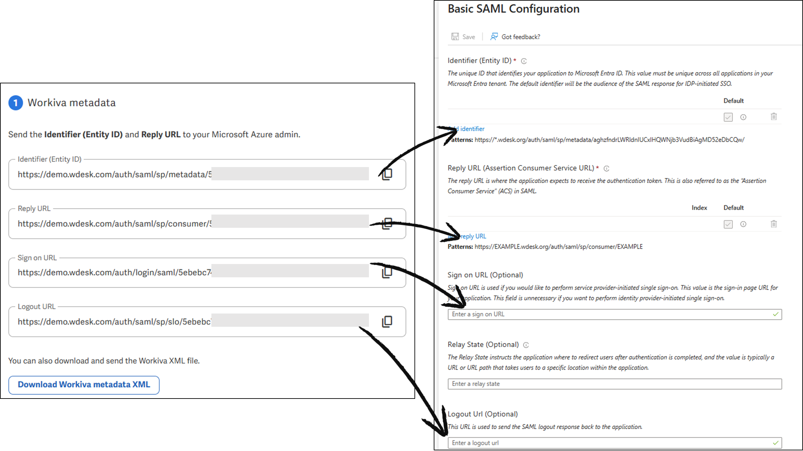

Once the configuration is saved with the SSO endpoints, click on **Edit** by step 2 to adjust the Attribute and Claims.

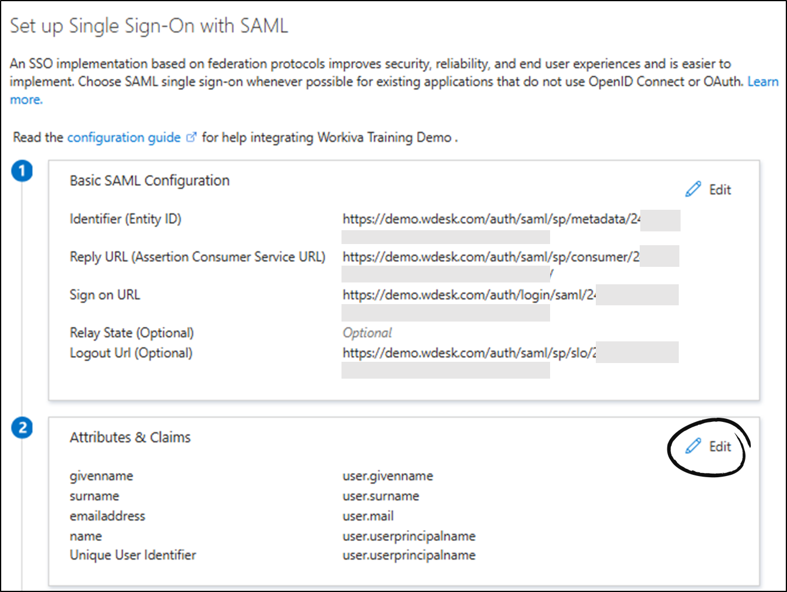
	
The preferred setup is to **match** the **Workiva Username** (case-insensitive) to the **Unique User Identifier** (Primary NameID Attribute); this is commonly UPN or user email but is dependent on the Workiva usernames and company standards. Having these match will allow Workiva to automatically map the attribute to the Workiva username when the user logs in with SSO for the first time. 

> [!Note]	
> Workiva only needs the Unique User Identifier / Primary NameID and no additional claims are required. However, if you send additional claims such as user.given and user.surname Workiva support can troubleshoot SSO login issues easier. 

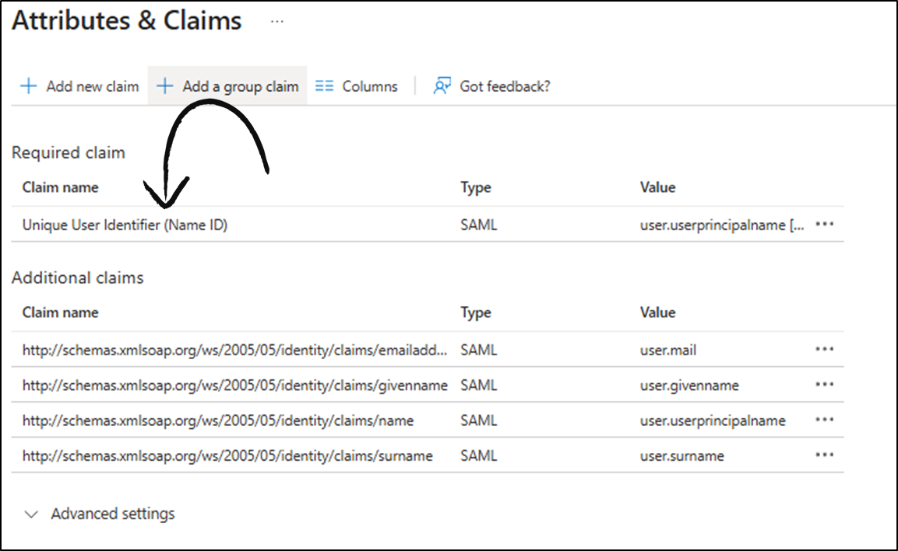

On the **Set up Single Sign-On with SAML** page, in the **SAML Certificates** section, select **Download** to download the **Federation Metadata XML** or copy the **App Federation Metadata URL** for the Workiva SSO configuration to digest. Then under the **Set up Wdesk** section, copy the appropriate URL(s) as per your requirement.
	
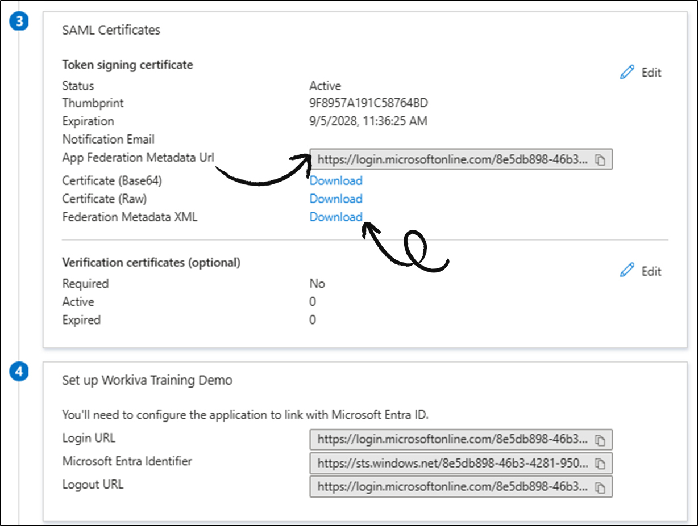

## Configuring Workiva Identity Provider (IdP) Settings

Once the Workiva Org Security Admin has the Azure Entra ID Metadata, they can access the SSO Configuration to import it in 3 different ways.
*Federation metadata URL
*Metadata XML file
*Manual entry

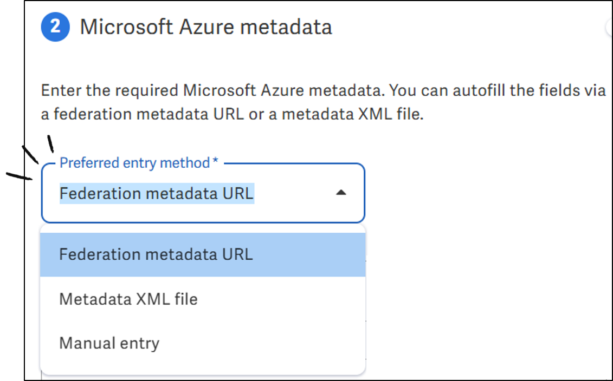

Workiva recommends selecting **Map user to their Workiva username** to set all the SSO IDs to match the Workiva usernames if possible. This allows Workiva to expect the incoming Unique User Identifier / Primary NameID attribute to match the Workiva username, ignoring any case sensitivity, when the user logs in and no extra Admin work is needed. However, if this is not an option then the SSO IDs can be manually mapped to the Workiva username before the user can access with SSO.

In the User Mapping section, click the Set **Mapping dropdown**, and select either:
* **Map users to their Workiva username**
	* Will configure Workiva to expect the incoming SSO ID will match the current Workiva username and auto-map the attribute when a user logs in
* **Map users manually**
	* Will configure Workiva to expect the Org Security Admin to manually map the SSO ID to the corresponding username before they can access with SSO

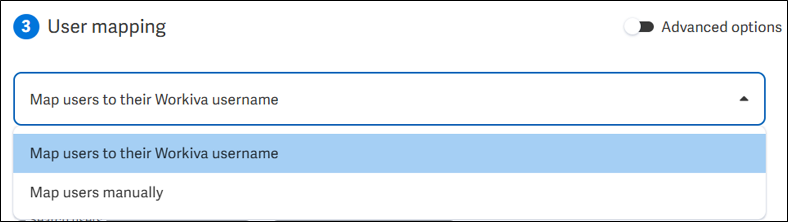

Click **Set Mapping** and there are two options for attribute mapping. 
* **Import SSO IDs via file**
	*Bulk assign SSO ID's corresponding to usernames via CSV
* **Set all SSO IDs to Workiva username**
	* Bulk assign SSO ID's to be Workiva usernames 
> [!Note]
> No necessary if the **Map users to their Workiva username** was previously selected

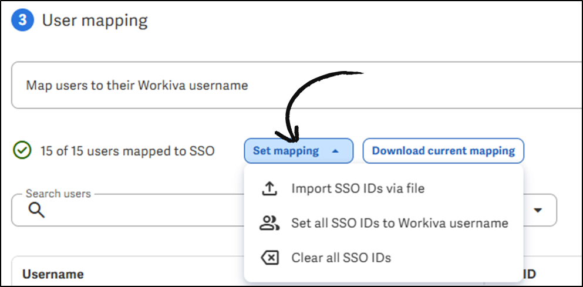

If you are unable to configure the SSO ID / Primary NameID attribute to match the Workiva username, the SSO ID/Workiva username mapping will need to be manually established 1 of 2 ways in the User Mapping area.
* **Import SSO IDs via file**
* **Search the user(s) and manually enter their SSO ID**

Select Import SSO IDs via file to map users to the SSO IDs in a .csv mapping file. This can be used to bulk map the SSO IDs to users if they are not going to match the corresponding Workiva username. 

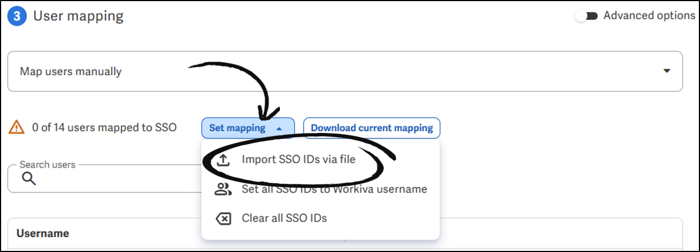

This method will have you download a template with 2 columns. The first column is for Workiva Username and the second column is for the corresponding SSO ID. Then Browse to file and upload the mapping.

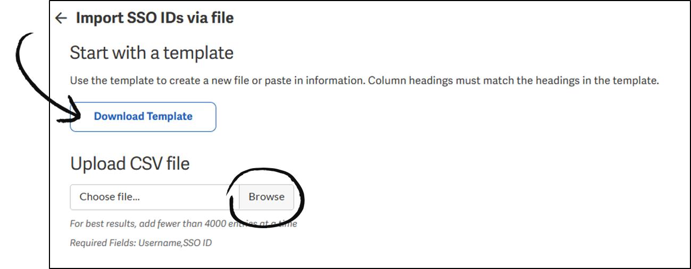

If you only need to adjust a single or small set of users you can use the Search Users field to find the user(s) by a string to manually map their SSO ID. 

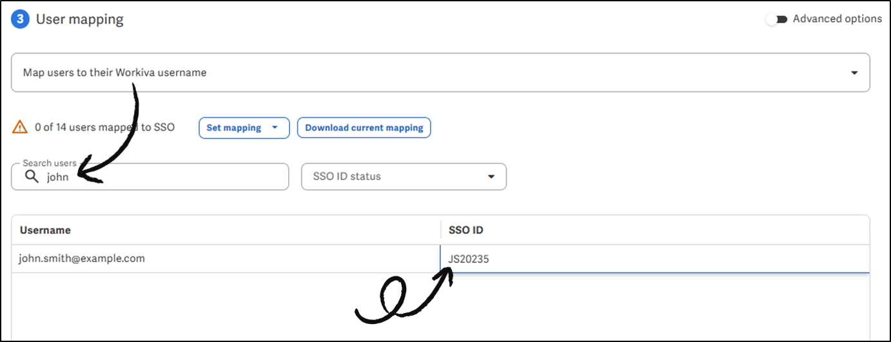

## Workiva SSO Requirement Settings
You can require users to sign in the organization using SSO. If certain users (ex: external auditors) still need to sign in using their username and password, add them to the SSO exception list.

**Force users to sign in using SSO**
Check this on will force users to access with SSO except Org Security Admin (break glass) and anyone listed on the SSO Exception List. 

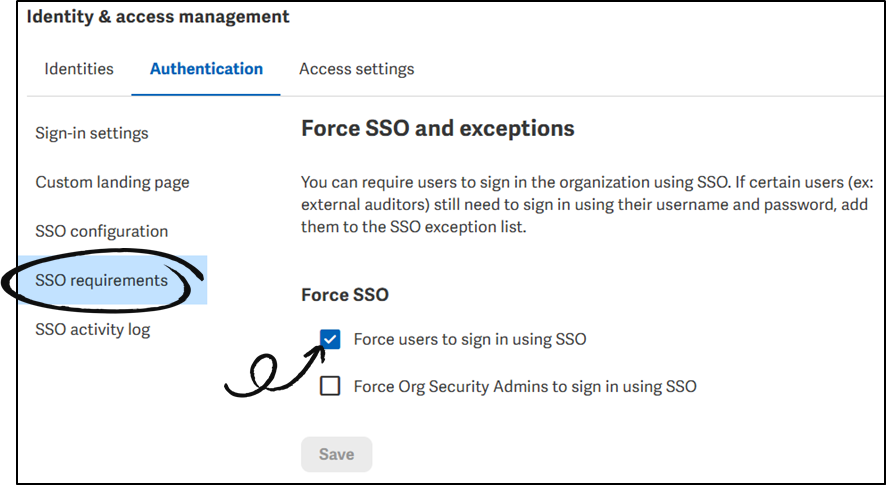

**Force Org Security Admins to sign in using SSO**
This will Force Org Security Admins to sign in using SSO as well.

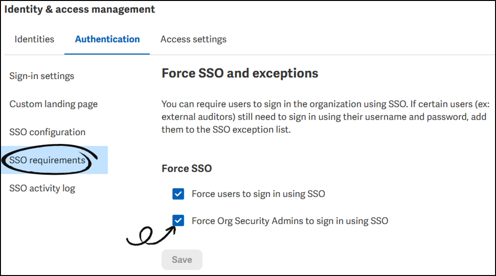

## Workiva SSO Exception List
Add users to the **SSO Exceptions List** if they need to sign in with their Workiva username and password instead of SSO (ex: external auditors, legal counsel, etc.) By default, these users will use Workiva local authentication with email OTP to authenticate. [Here](https://support.workiva.com/hc/en-us/articles/360036006091-Configure-sign-in-and-session-options) is more information on Workiva non-SSO sign-in criteria. 
> [!Caution]
> Please make sure bypass users are on this list before requiring SSO on the account to avoid user lockout

This view will let you **Search users** to see who is currently on the **SSO Exception List**. 

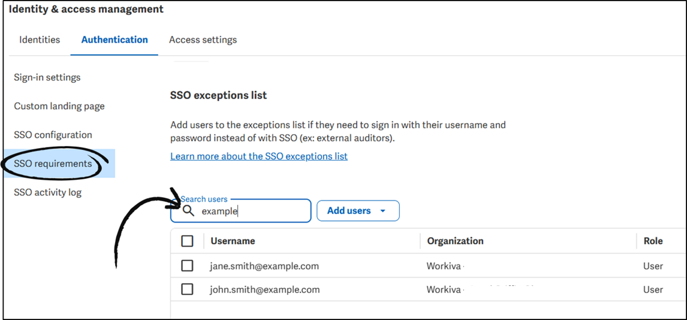

To add users to the SSO exception list you can click on Add users and choose to: 
* **Add users**
* **Add users in bulk**

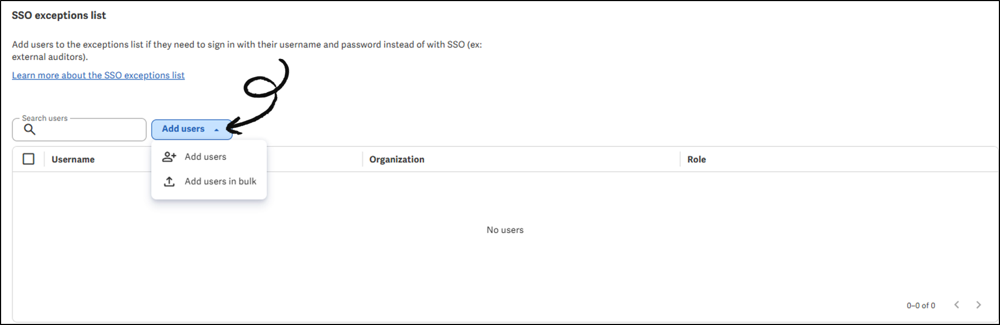

**Add Users** will let you add users to the list and review the list. This will allow you to:
* **Search Users**
* **Filter by Organization** (current Organization Name or External)
* **Role** (Org Workspace Admin or Org Security Admin)
* **Status** (on Exception List or Not on Exception List)

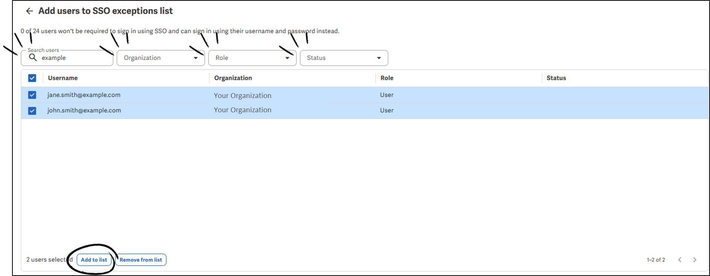

#### SP initiated:

* Select **Test this application**, this option redirects to Wdesk Sign on URL where you can initiate the login flow.  

* Go to Wdesk Sign-on URL directly and initiate the login flow from there.

#### IDP initiated:

* Select **Test this application**, and you should be automatically signed in to the Wdesk for which you set up the SSO. 

You can also use Microsoft My Apps to test the application in any mode. When you select the Wdesk tile in the My Apps, if configured in SP mode you would be redirected to the application sign on page for initiating the login flow and if configured in IDP mode, you should be automatically signed in to the Wdesk for which you set up the SSO. For more information about the My Apps, see [Introduction to the My Apps](https://support.microsoft.com/account-billing/sign-in-and-start-apps-from-the-my-apps-portal-2f3b1bae-0e5a-4a86-a33e-876fbd2a4510).

## Related content

Once you configure Wdesk you can enforce session control, which protects exfiltration and infiltration of your organization’s sensitive data in real time. Session control extends from Conditional Access. [Learn how to enforce session control with Microsoft Defender for Cloud Apps](/cloud-app-security/proxy-deployment-any-app).
