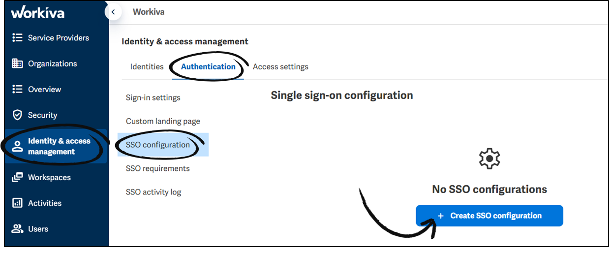
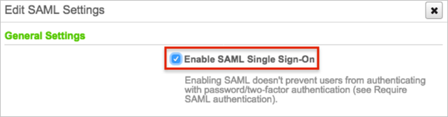

---
title: Configure Workiva for Single sign-on with Microsoft Entra ID
description: Learn how to configure single sign-on between Microsoft Entra ID and Workiva.
ms.topic: how-to
ms.date: 08/28/2026
ms.custom: sfi-image-nochange
# Customer intent: As an IT administrator, I want to learn how to configure single sign-on between Microsoft Entra ID and Workiva so that I can control who has access to Workiva, enable automatic sign-in with Microsoft Entra accounts, and manage my accounts in one central location.
--- 
# Configure Workiva for Single sign-on with Microsoft Entra ID

This article will walk you through how to configure Single Sign-On for Workiva with Azure Entra ID. Workiva has created an entirely self-service portal for configuring SSO. Workiva suggests designating a member of the IAM/IT team to do the configuration as well as make sure the authentication settings are complying with your company requirements.

This is accomplished through a Workiva role called "Organization Security Admin" which gives no content access, just admin access to the security tab which contains authentication and SSO settings. 
> [!NOTE]
> The Organization Security Admin will need to be added to a Workspace in order to access the Organization level

* Control in Microsoft Entra ID who has access to Workiva.
* Enable your users to be automatically signed-in to Workiva with their Microsoft Entra accounts.
* Manage your accounts in one central location.

## Prerequisites
The scenario outlined in this article assumes that you already have the following prerequisites:
[!INCLUDE [common-prerequisites.md](~/identity/saas-apps/includes/common-prerequisites.md)]

## Scenario description

In this article,  you configure and test Microsoft Entra single sign-on in a test environment.

* Workiva supports **SAML 2.0**.
* Workiva supports **SP** and **IDP** initiated SSO.
* Workiva can leverage **hybrid authentication**.
* Workiva contains an **SSO Exception List** for external third party users.

## Create Workiva SSO Configuration

1. To access the Security Panel where the SSO configuration can be found, an assigned Organization Security Admin will need to log into Workiva > click on the Person Icon > Admin > Organization Admin.

Link to settings.png

    

1. Once the new browser tab loads click on Security > Single Sign-On > SSO configuration > + Create SSO Configuration:
	
Link to account.png

    

1. To create an SSO configuration the assigned Org Security Admin will need to **Name** this specific SSO configuration and select the **Identity Provider (IdP)**, or in this case **Azure**. Once the SSO configuration is named and an identity provider is selected, click on **Create Configuration**.
	
Link to ConfigurationName.png

    

4. Under step 1 Workiva Metadata the Org Security Admin will be able to obtain the **Identifier (Entity ID)** and **Reply URL (Assertion Consumer Service URL)** endpoints. There is also an option to download the actual Workiva .XML Metadata file:
	
Link to WorkivaMetadata.png

    

5. The Advanced options toggle will display the additional **Login URL** and the **Logout URL** if required for configuration:

Insert Screenshot LoginURL.png

## Add Workiva from the gallery

To configure the integration of Workiva into Microsoft Entra ID, you need to add Workiva from the gallery to your list of managed SaaS apps.

1. Sign in to the [Microsoft Entra admin center](https://entra.microsoft.com) as at least a [Cloud Application Administrator](~/identity/role-based-access-control/permissions-reference.md#cloud-application-administrator).
1. Browse to **Entra ID** > **Enterprise apps** > **New application**.

Insert Screenshot AddApp.png

1. In the **Search application** section, type **Workiva** in the search box.
1. Select **Workiva** from results panel and then add the app. Wait a few seconds while the app is added to your tenant.

Insert Screenshot WorkivaGalleryApp.png

 Alternatively, you can also use the [Enterprise App Configuration Wizard](https://portal.office.com/AdminPortal/home?Q=Docs#/azureadappintegration). In this wizard, you can add an application to your tenant, add users/groups to the app, assign roles, and walk through the SSO configuration as well. [Learn more about Microsoft 365 wizards.](/microsoft-365/admin/misc/azure-ad-setup-guides)

## Configure Microsoft Entra SSO

Follow these steps to configure Microsoft Entra SSO.

1. Sign in to the [Microsoft Entra admin center](https://entra.microsoft.com) as at least a [Cloud Application Administrator](~/identity/role-based-access-control/permissions-reference.md#cloud-application-administrator).
1. Browse to **Entra ID** > **Enterprise apps** > **Workiva** > **Single sign-on**.
1. On the **Select a single sign-on method** page, select **SAML**.

Insert image EntraSAML.png

1. On the **Set up single sign-on with SAML** page, select the pencil icon for **Basic SAML Configuration** to edit the settings.

Link to EditSAML.png

   

1. On the **Basic SAML Configuration** section, if you wish to configure the application in **IDP** initiated mode, perform the following steps:

    a. In the **Identifier (EntityID)** text box, type a URL using the following pattern:
    `https://<subdomain>.wdesk.com/auth/saml/sp/metadata/<instancename>`

    b. In the **Reply URL** text box, type a URL using the following pattern:
    `https://<subdomain>.wdesk.com/auth/saml/sp/consumer/<instancename>`

5. Select **Set additional URLs** and perform the following step if you wish to configure the application in **SP** initiated mode:

    In the **Sign-on URL** text box, type a URL using the following pattern:
    `https://<subdomain>.wdesk.com/auth/login/saml/<instancename>`

	> [!NOTE]
	> These values aren't real. Update these values with the actual Identifier, Reply URL, and Sign-On URL. You get these values from WDesk portal when you configure the SSO.

	Insert Screenshot WorkivaEndpointsAzure.png

5. Once the configuration is saved with the SSO endpoints, click on **Edit** by step 2 to adjust the Attribute and Claims.

	Insert Screenshot AzureAttributes.png
	
6. The preferred setup is to match the Workiva Username (case-insensitive) to the Unique User Identifier (Primary NameID Attribute); this is commonly UPN or user email but is dependent on the Workiva usernames and company standards. Having these match will allow Workiva to automatically map the attribute to the Workiva username when the user logs in with SSO for the first time. 

> [!NOTE]	
> Workiva only needs the Unique User Identifier / Primary NameID and no additional claims are required. However, if you send additional claims such as user.given and user.surname Workiva support can troubleshoot SSO login issues easier. 

Insert Screenshot AzureNameID.png

7. On the **Set up Single Sign-On with SAML** page, in the **SAML Signing Certificate** section, select **Download** to download the **Federation Metadata XML** or copy the **App Federation Metadata URL** from the given options as per your requirement.
	Link to AzureMetadata.png
	

8. On the **Set up Wdesk** section, copy the appropriate URL(s) as per your requirement.
	Link to ConfigurationURLs.png
	

## Configuring Workiva Identity Provider (IdP) Settings

Once the Workiva Org Security Admin has the EntraID Metadata, it can be imported in 3 different ways.
*Federation metadata URL
*Metadata XML file
*Manual entry

Insert WorkivaMetadataImport.png

Workiva recommends selecting **Map user to their Workiva username** to set all the SSO IDs to match the Workiva usernames if possible. This allows Workiva to expect the incoming Unique User Identifier / Primary NameID attribute to match the Workiva username, ignoring any case sensitivity, when the user logs in and no extra Admin work is needed. However, if this is not an option then the SSO IDs can be manually mapped to the Workiva username before the user can access with SSO.

In the User Mapping section, click the Set **Mapping dropdown**, and select either:
* **Map users to their Workiva username**
	* Will configure Workiva to expect the incoming SSO ID will match the current Workiva username and auto-map the attribute when a user logs in
* **Map users manually**
	* Will configure Workiva to expect the Org Security Admin to manually map the SSO ID to the corresponding username before they can access with SSO

Insert WorkivaUserMapping.png

Click **Set Mapping** and there are two options for attribute mapping. 
* **Import SSO IDs via file**
	*Bulk assign SSO ID's corresponding to usernames via CSV
* **Set all SSO IDs to Workiva username**
	* Bulk assign SSO ID's to be Workiva usernames 
	> [!NOTE]
	> No necessary if the **Map users to their Workiva username** was previously selected

Insert SetMapping.png

If you are unable to configure the SSO ID / Primary NameID attribute to match the Workiva username, the SSO ID/Workiva username mapping will need to be manually established 1 of 2 ways in the User Mapping area.
* **Import SSO IDs via file**
* **Search the user(s) and manually enter their SSO ID**

Select Import SSO IDs via file to map users to the SSO IDs in a .csv mapping file. This can be used to bulk map the SSO IDs to users if they are not going to match the corresponding Workiva username. 

Insert SSOIDImport.png

This method will have you download a template with 2 columns. The first column is for Workiva Username and the second column is for the corresponding SSO ID. Then Browse to file and upload the mapping.

Insert SSOIDImportBrowse.png

If you only need to adjust a single or small set of users you can use the Search Users field to find the user(s) by a string to manually map their SSO ID. 

Insert SSOIDSingle.png

## Workiva SSO Requirement Settings
You can require users to sign in the organization using SSO. If certain users (ex: external auditors) still need to sign in using their username and password, add them to the SSO exception list.

**Force users to sign in using SSO**
Check this on will force users to access with SSO except Org Security Admin (break glass) and anyone listed on the SSO Exception List. 

Insert RequireSSO.png

**Force Org Security Admins to sign in using SSO**
This will Force Org Security Admins to sign in using SSO as well.

Insert SSORequireAdmins.png

## Workiva SSO Exception List
Add users to the **SSO Exceptions List** if they need to sign in with their Workiva username and password instead of SSO (ex: external auditors, legal counsel, etc.) By default, these users will use Workiva local authentication with email OTP to authenticate. [Here](https://support.workiva.com/hc/en-us/articles/360036006091-Configure-sign-in-and-session-options) is more information on Workiva non-SSO sign-in criteria. 
> [!NOTE]
> Please make sure bypass users are on this list before requiring SSO on the account to avoid user lockout

This view will let you **Search users** to see who is currently on the **SSO Exception List**. 

Insert ExceptionSearch.png

To add users to the SSO exception list you can click on Add users and choose to: 
* **Add users**
* **Add users in bulk**

Insert ExceptionAdd.png

**Add Users** will let you add users to the list and review the list. This will allow you to:
* **Search Users**
* **Filter by Organization** (current Organization Name or External)
* **Role** (Org Workspace Admin or Org Security Admin)
* **Status** (on Exception List or Not on Exception List)

Insert ExceptionReview.png

#### SP initiated:

* Select **Test this application**, this option redirects to Wdesk Sign on URL where you can initiate the login flow.  

* Go to Wdesk Sign-on URL directly and initiate the login flow from there.

#### IDP initiated:

* Select **Test this application**, and you should be automatically signed in to the Wdesk for which you set up the SSO. 

You can also use Microsoft My Apps to test the application in any mode. When you select the Wdesk tile in the My Apps, if configured in SP mode you would be redirected to the application sign on page for initiating the login flow and if configured in IDP mode, you should be automatically signed in to the Wdesk for which you set up the SSO. For more information about the My Apps, see [Introduction to the My Apps](https://support.microsoft.com/account-billing/sign-in-and-start-apps-from-the-my-apps-portal-2f3b1bae-0e5a-4a86-a33e-876fbd2a4510).

## Related content

Once you configure Wdesk you can enforce session control, which protects exfiltration and infiltration of your organization’s sensitive data in real time. Session control extends from Conditional Access. [Learn how to enforce session control with Microsoft Defender for Cloud Apps](/cloud-app-security/proxy-deployment-any-app).
