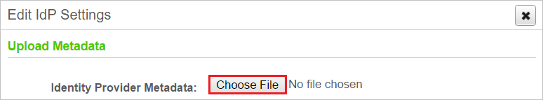

# Configure Wdesk for Single sign-on with Microsoft Entra ID

In this article,  you learn how to integrate Wdesk with Microsoft Entra ID. When you integrate Wdesk with Microsoft Entra ID, you can:

* Control in Microsoft Entra ID who has access to Wdesk.
* Enable your users to be automatically signed-in to Wdesk with their Microsoft Entra accounts.
* Manage your accounts in one central location.

## Prerequisites
The scenario outlined in this article assumes that you already have the following prerequisites:

[!INCLUDE [common-prerequisites.md](~/identity/saas-apps/includes/common-prerequisites.md)]
* Wdesk single sign-on (SSO) enabled subscription.

## Scenario description

In this article,  you configure and test Microsoft Entra single sign-on in a test environment.

* Wdesk supports **SP** and **IDP** initiated SSO.

## Add Wdesk from the gallery

To configure the integration of Wdesk into Microsoft Entra ID, you need to add Wdesk from the gallery to your list of managed SaaS apps.

1. Sign in to the [Microsoft Entra admin center](https://entra.microsoft.com) as at least a [Cloud Application Administrator](~/identity/role-based-access-control/permissions-reference.md#cloud-application-administrator).
1. Browse to **Entra ID** > **Enterprise apps** > **New application**.
1. In the **Add from the gallery** section, type **Wdesk** in the search box.
1. Select **Wdesk** from results panel and then add the app. Wait a few seconds while the app is added to your tenant.

 Alternatively, you can also use the [Enterprise App Configuration Wizard](https://portal.office.com/AdminPortal/home?Q=Docs#/azureadappintegration). In this wizard, you can add an application to your tenant, add users/groups to the app, assign roles, and walk through the SSO configuration as well. [Learn more about Microsoft 365 wizards.](/microsoft-365/admin/misc/azure-ad-setup-guides)

## Configure and test Microsoft Entra SSO for Wdesk

In this section, you configure and test Microsoft Entra single sign-on with Wdesk based on a test user called **Britta Simon**.
For single sign-on to work, a link relationship between a Microsoft Entra user and the related user in Wdesk needs to be established.

To configure and test Microsoft Entra SSO with Wdesk, perform the following steps:

1. **[Configure Microsoft Entra SSO](#configure-azure-ad-sso)** - to enable your users to use this feature.
    1. **Create a Microsoft Entra test user** - to test Microsoft Entra single sign-on with B.Simon.
    1. **Assign the Microsoft Entra test user** - to enable B.Simon to use Microsoft Entra single sign-on.
1. **[Configure Wdesk SSO](#configure-wdesk-sso)** - to configure the single sign-on settings on application side.
    1. **[Create Wdesk test user](#create-wdesk-test-user)** - to have a counterpart of B.Simon in Wdesk that's linked to the Microsoft Entra representation of user.
1. **[Test SSO](#test-sso)** - to verify whether the configuration works.

## Configure Microsoft Entra SSO

Follow these steps to enable Microsoft Entra SSO.

1. Sign in to the [Microsoft Entra admin center](https://entra.microsoft.com) as at least a [Cloud Application Administrator](~/identity/role-based-access-control/permissions-reference.md#cloud-application-administrator).
1. Browse to **Entra ID** > **Enterprise apps** > **Wdesk** > **Single sign-on**.
1. On the **Select a single sign-on method** page, select **SAML**.
1. On the **Set up single sign-on with SAML** page, select the pencil icon for **Basic SAML Configuration** to edit the settings.

   

1. On the **Basic SAML Configuration** section, if you wish to configure the application in **IDP** initiated mode, perform the following steps:

    a. In the **Identifier** text box, type a URL using the following pattern:
    `https://<subdomain>.wdesk.com/auth/saml/sp/metadata/<instancename>`

    b. In the **Reply URL** text box, type a URL using the following pattern:
    `https://<subdomain>.wdesk.com/auth/saml/sp/consumer/<instancename>`

5. Select **Set additional URLs** and perform the following step if you wish to configure the application in **SP** initiated mode:

    In the **Sign-on URL** text box, type a URL using the following pattern:
    `https://<subdomain>.wdesk.com/auth/login/saml/<instancename>`

	> [!NOTE]
	> These values aren't real. Update these values with the actual Identifier, Reply URL, and Sign-On URL. You get these values from WDesk portal when you configure the SSO.

4. On the **Set up Single Sign-On with SAML** page, in the **SAML Signing Certificate** section, select **Download** to download the **Federation Metadata XML** from the given options as per your requirement and save it on your computer.

	

6. On the **Set up Wdesk** section, copy the appropriate URL(s) as per your requirement.

	

	

[!INCLUDE [create-assign-users-sso.md](~/identity/saas-apps/includes/create-assign-users-sso.md)]

## Configure Wdesk SSO

1. In a different web browser window, sign in to Wdesk as a Security Administrator.

1. In the bottom left, select **Admin** and choose **Account Admin**:
 
    

1. In Wdesk Admin, navigate to **Security**, then **SAML** > **SAML Settings**:

    

1. Under **SAML User ID Settings**, check **SAML User ID is Wdesk Username**.

    

4. Under **General Settings**, check the **Enable SAML Single Sign On**:

    

5. Under **Service Provider Details**, perform the following steps:

    

    1. Copy the **Login URL** and paste it in **Sign-on Url** textbox on Azure portal.

    1. Copy the **Metadata Url** and paste it in **Identifier** textbox on Azure portal.

    1. Copy the **Consumer url** and paste it in **Reply Url** textbox on Azure portal.

    1. Select **Save** on Azure portal to save the changes.      

1. Select **Configure IdP Settings** to open **Edit IdP Settings** dialog. Select **Choose File** to locate the **Metadata.xml** file you saved from Azure portal, then upload it.
    
    
  
1. Select **Save changes**.

    

### Create Wdesk test user

To enable Microsoft Entra users to sign in to Wdesk, they must be provisioned into Wdesk. In Wdesk, provisioning is a manual task.

**To provision a user account, perform the following steps:**

1. Sign in to Wdesk as a Security Administrator.

2. Navigate to **Admin** > **Account Admin**.

     

3. Select **Members** under **People**.

4. Now select **Add Member** to open **Add Member** dialog box. 
   
      

5. In **User** text box, enter the username of user like b.simon@contoso.com and select **Continue** button.

    

6.  Enter the details as shown below:
  
    
 
    a. In **E-mail** text box, enter the email of user like b.simon@contoso.com.

    b. In **First Name** text box, enter the first name of user like **B**.

    c. In **Last Name** text box, enter the last name of user like **Simon**.

7. Select **Save Member** button.  

    

## Test SSO 

In this section, you test your Microsoft Entra single sign-on configuration with following options. 

#### SP initiated:

* Select **Test this application**, this option redirects to Wdesk Sign on URL where you can initiate the login flow.  

* Go to Wdesk Sign-on URL directly and initiate the login flow from there.

#### IDP initiated:

* Select **Test this application**, and you should be automatically signed in to the Wdesk for which you set up the SSO. 

You can also use Microsoft My Apps to test the application in any mode. When you select the Wdesk tile in the My Apps, if configured in SP mode you would be redirected to the application sign on page for initiating the login flow and if configured in IDP mode, you should be automatically signed in to the Wdesk for which you set up the SSO. For more information about the My Apps, see [Introduction to the My Apps](https://support.microsoft.com/account-billing/sign-in-and-start-apps-from-the-my-apps-portal-2f3b1bae-0e5a-4a86-a33e-876fbd2a4510).

## Related content

Once you configure Wdesk you can enforce session control, which protects exfiltration and infiltration of your organization’s sensitive data in real time. Session control extends from Conditional Access. [Learn how to enforce session control with Microsoft Defender for Cloud Apps](/cloud-app-security/proxy-deployment-any-app).
