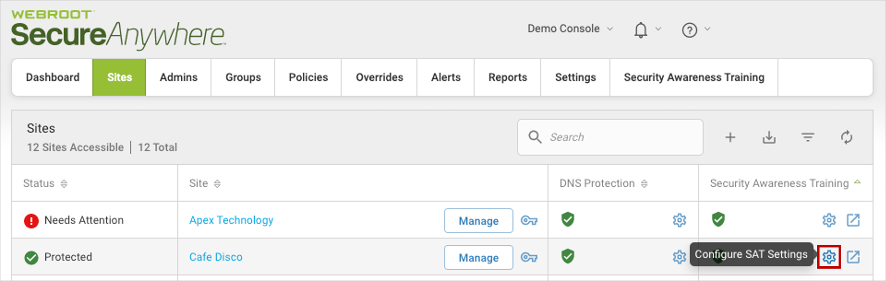
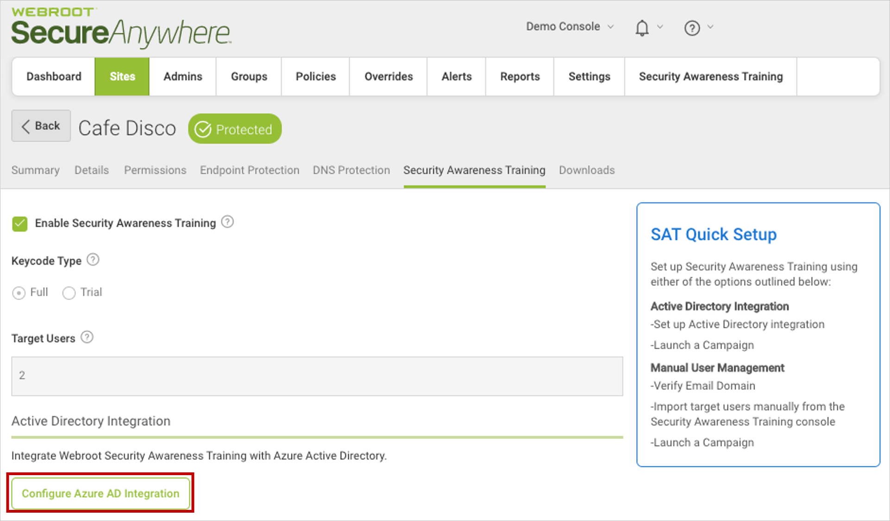
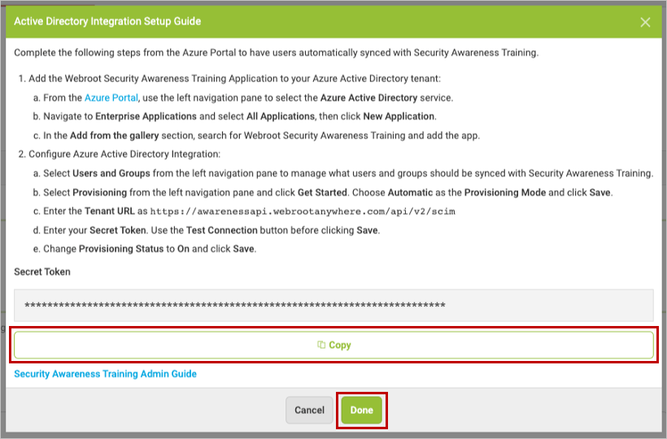
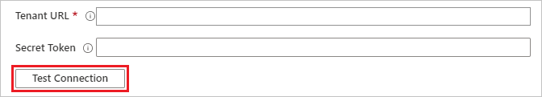

# Configure Webroot Security Awareness Training for automatic user provisioning with Microsoft Entra ID

This article describes the steps you need to perform in both Webroot Security Awareness Training and Microsoft Entra ID to configure automatic user provisioning. When configured, Microsoft Entra ID automatically provisions and de-provisions users and groups to [Webroot Security Awareness Training](https://www.webroot.com/) using the Microsoft Entra provisioning service. For important details on what this service does, how it works, and frequently asked questions, see [Automate user provisioning and deprovisioning to SaaS applications with Microsoft Entra ID](~/identity/app-provisioning/user-provisioning.md). 

## Capabilities supported
> [!div class="checklist"]
> * Create users in Webroot Security Awareness Training
> * Remove users in Webroot Security Awareness Training when they don't require access anymore
> * Keep user attributes synchronized between Microsoft Entra ID and Webroot Security Awareness Training
> * Provision groups and group memberships in Webroot Security Awareness Training

## Prerequisites

The scenario outlined in this article assumes that you already have the following prerequisites:

* [A Microsoft Entra tenant](~/identity-platform/quickstart-create-new-tenant.md) 
* One of the following roles: [Application Administrator](/entra/identity/role-based-access-control/permissions-reference#application-administrator), [Cloud Application Administrator](/entra/identity/role-based-access-control/permissions-reference#cloud-application-administrator), or [Application Owner](/entra/fundamentals/users-default-permissions#owned-enterprise-applications).
* A Managed Service Provider Console with Webroot Security Awareness Training enabled for at least one of your sites.

## Step 1: Plan your provisioning deployment
1. Learn about [how the provisioning service works](~/identity/app-provisioning/user-provisioning.md).
2. Determine who's in [scope for provisioning](~/identity/app-provisioning/define-conditional-rules-for-provisioning-user-accounts.md).
3. Determine what data to [map between Microsoft Entra ID and Webroot Security Awareness Training](~/identity/app-provisioning/customize-application-attributes.md). 

## Step 2: Configure Webroot Security Awareness Training to support provisioning with Microsoft Entra ID

### Obtain a secret token

To connect your site to Microsoft Entra ID, you need to obtain a **Secret Token** for that site in the Webroot management console.

1. Sign into your [Webroot management console](https://identity.webrootanywhere.com/v1/Account/login#tab_customers)

2. From the **Sites** tab, select the gear icon in the Security Awareness Training column for the site you wish to connect with Microsoft Entra ID.

    

3. Select the button to **Configure Microsoft Entra Integration**.

    

4. Copy and save the **Secret Token**. This value is entered in the Secret Token field in the Provisioning tab of your Webroot Security Awareness Training application.

5. Select **Done**.

    

## Step 3: Add Webroot Security Awareness Training from the Microsoft Entra application gallery

Add Webroot Security Awareness Training from the Microsoft Entra application gallery to start managing provisioning to Webroot Security Awareness Training. Learn more about adding an application from the gallery [here](~/identity/enterprise-apps/add-application-portal.md). 

## Step 4: Define who is in scope for provisioning 

[!INCLUDE [create-assign-users-provisioning.md](~/identity/saas-apps/includes/create-assign-users-provisioning.md)]

## Step 5: Configure automatic user provisioning to Webroot Security Awareness Training 

This section guides you through the steps to configure the Microsoft Entra provisioning service to create, update, and disable users and/or groups in TestApp based on user and/or group assignments in Microsoft Entra ID.

### To configure automatic user provisioning for Webroot Security Awareness Training in Microsoft Entra ID:

1. Sign in to the [Microsoft Entra admin center](https://entra.microsoft.com) as at least a [Cloud Application Administrator](~/identity/role-based-access-control/permissions-reference.md#cloud-application-administrator).
1. Browse to **Entra ID** > **Enterprise apps**

	

1. In the applications list, select **Webroot Security Awareness Training**.

	

3. Select the **Provisioning** tab.

	

4. Set the **Provisioning Mode** to **Automatic**.

	

5. Under the **Admin Credentials** section, input `https://awarenessapi.webrootanywhere.com/api/v2/scim` in **Tenant URL**. Input the secret token value retrieved earlier in **Secret Token**. Select **Test Connection** to ensure Microsoft Entra ID can connect to Webroot Security Awareness Training. If the connection fails, ensure your Webroot Security Awareness Training account has Admin permissions and try again.

 	

6. In the **Notification Email** field, enter the email address of a person or group who should receive the provisioning error notifications and select the **Send an email notification when a failure occurs** check box.

	

7. Select **Save**.

8. Under the **Mappings** section, select **Provision Microsoft Entra users**.

9. Review the user attributes that are synchronized from Microsoft Entra ID to Webroot Security Awareness Training in the **Attribute-Mapping** section. The attributes selected as **Matching** properties are used to match the user accounts in Webroot Security Awareness Training for update operations. If you choose to change the [matching target attribute](~/identity/app-provisioning/customize-application-attributes.md), you need to ensure that the Webroot Security Awareness Training API supports filtering users based on that attribute. Select the **Save** button to commit any changes.

   |Attribute|Type|Supported for filtering|
   |---|---|---|
   |userName|String|&check;|
   |externalId|String|
   |name.givenName|String|
   |name.familyName|String|
   |emails[type eq "work"].value|String|

10. Under the **Mappings** section, select **Provision Microsoft Entra groups**.

11. Review the group attributes that are synchronized from Microsoft Entra ID to Webroot Security Awareness Training in the **Attribute-Mapping** section. The attributes selected as **Matching** properties are used to match the groups in Webroot Security Awareness Training for update operations. Select the **Save** button to commit any changes.

      |Attribute|Type|Supported for filtering|
      |---|---|---|
      |displayName|String|&check;|
      |members|Reference|
      |externalId|String|

12. To configure scoping filters, refer to the following instructions provided in the [Scoping filter  article](~/identity/app-provisioning/define-conditional-rules-for-provisioning-user-accounts.md).

13. To enable the Microsoft Entra provisioning service for Webroot Security Awareness Training, change the **Provisioning Status** to **On** in the **Settings** section.

	

14. Define the users and/or groups that you would like to provision to Webroot Security Awareness Training by choosing the desired values in **Scope** in the **Settings** section.

	

15. When you're ready to provision, select **Save**.

	

This operation starts the initial synchronization cycle of all users and groups defined in **Scope** in the **Settings** section. The initial cycle takes longer to perform than subsequent cycles, which occur approximately every 40 minutes as long as the Microsoft Entra provisioning service is running. 

## Step 6: Monitor your deployment

[!INCLUDE [monitor-deployment.md](~/identity/saas-apps/includes/monitor-deployment.md)]

## Change log
* 1/21/2021 - Added support for core attribute "userName" for users.

## Additional resources

* [Managing user account provisioning for Enterprise Apps](~/identity/app-provisioning/configure-automatic-user-provisioning-portal.md)
* [What is application access and single sign-on with Microsoft Entra ID?](~/identity/enterprise-apps/what-is-single-sign-on.md)

## Related content

* [Learn how to review logs and get reports on provisioning activity](~/identity/app-provisioning/check-status-user-account-provisioning.md)
