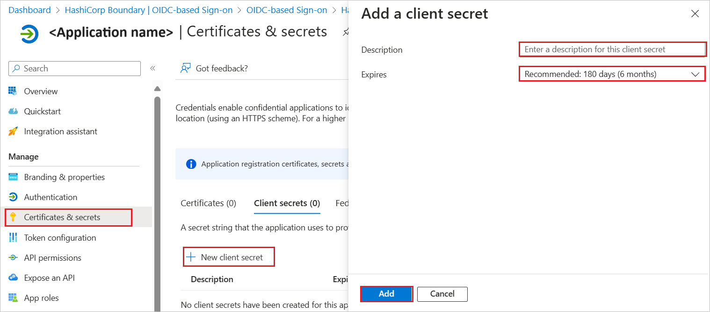

# Configure WebSphere Liberty for Single sign-on with Microsoft Entra ID

In this article,  you learn how to integrate WebSphere Liberty with Microsoft Entra ID. When you integrate WebSphere Liberty with Microsoft Entra ID, you can:

- Use Microsoft Entra ID to control who can access WebSphere Liberty.
- Enable your users to be automatically signed in to WebSphere Liberty with their Microsoft Entra accounts.
- Manage your accounts in one central location: the Azure portal.

## Prerequisites
The scenario outlined in this article assumes that you already have the following prerequisites:

[!INCLUDE [common-prerequisites.md](~/identity/saas-apps/includes/common-prerequisites.md)]
* WebSphere Liberty single sign-on (SSO) enabled subscription.

## Add WebSphere Liberty from the gallery

To configure the integration of WebSphere Liberty into Microsoft Entra ID, you need to add WebSphere Liberty from the gallery to your list of managed SaaS apps.

1. Sign in to the [Microsoft Entra admin center](https://entra.microsoft.com) as at least a [Cloud Application Administrator](~/identity/role-based-access-control/permissions-reference.md#cloud-application-administrator).

1. Browse to **Entra ID** > **Enterprise apps** > **New application**.

1. In the **Add from the gallery** section, enter **WebSphere Liberty** in the search box.

1. Select **WebSphere Liberty** in the results panel and then add the app. Wait a few seconds while the app is added to your tenant.

## Configure Microsoft Entra SSO

Follow these steps to enable Microsoft Entra SSO in the Microsoft Entra admin center.

1. Sign in to the [Microsoft Entra admin center](https://entra.microsoft.com) as at least a [Cloud Application Administrator](~/identity/role-based-access-control/permissions-reference.md#cloud-application-administrator).

1. Browse to **Entra ID** > **Enterprise apps** > **WebSphere Liberty** > **Single sign-on**.

1. Perform the following steps in the below section:

    1. Select **Go to application**.

        

    1. Copy **Application (client) ID** and use it later in the WebSphere Liberty side configuration.

        

    1. Under **Endpoints** tab, copy **OpenID Connect metadata document** link and use it later in the WebSphere Liberty side configuration.

        

1. Navigate to **Authentication** tab on the left menu and perform the following steps:

    1. In the **Redirect URIs** textbox, type a URL using the following pattern:
    `https://<HOST_NAME>:<SSL_PORT>/oidcclient/redirect/<ClientID>`

        

    1. Select **Configure** button.

1. Navigate to **Certificates & secrets** on the left menu and perform the following steps:

    1. Go to **Client secrets** tab and select **+New client secret**.
    1. Enter a valid **Description** in the textbox and select **Expires** days from the drop-down as per your requirement and select **Add**.

        

    1. Once you add a client secret, **Value** is generated. Copy the value and use it later in the WebSphere Liberty side configuration.

        

[!INCLUDE [create-assign-users-sso.md](~/identity/saas-apps/includes/create-assign-users-sso.md)]

## Configure WebSphere Liberty SSO

To complete the OAuth/OIDC federation setup on **WebSphere Liberty** side, you need to send the copied values like  Tenant ID, Application ID, and Client Secret from Entra to [WebSphere Liberty support team](mailto:support@ibm.com). They set this setting to have the OIDC connection set properly on both sides.
