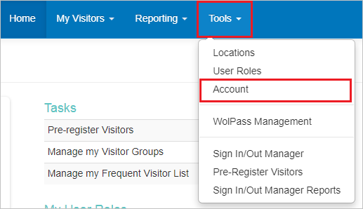
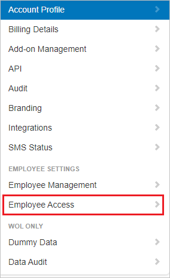
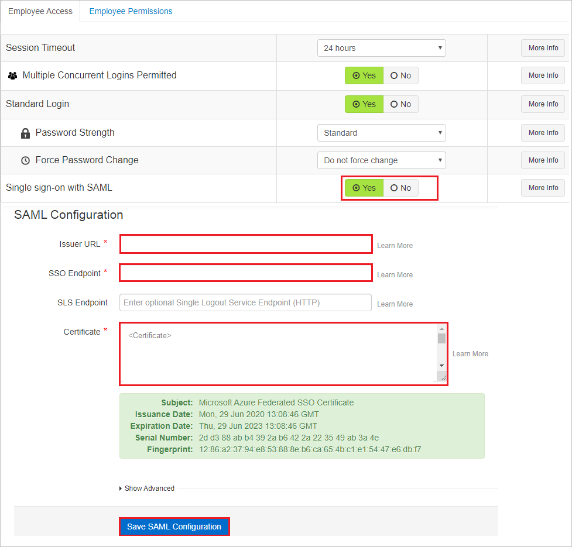

# Configure WhosOnLocation for Single sign-on with Microsoft Entra ID

In this article,  you learn how to integrate WhosOnLocation with Microsoft Entra ID. When you integrate WhosOnLocation with Microsoft Entra ID, you can:

* Control in Microsoft Entra ID who has access to WhosOnLocation.
* Enable your users to be automatically signed-in to WhosOnLocation with their Microsoft Entra accounts.
* Manage your accounts in one central location.

## Prerequisites

To get started, you need the following items:

* A Microsoft Entra subscription. If you don't have a subscription, you can get a [free account](https://azure.microsoft.com/free/).
* WhosOnLocation single sign-on (SSO) enabled subscription.
* Along with Cloud Application Administrator, Application Administrator can also add or manage applications in Microsoft Entra ID.
For more information, see [Azure built-in roles](~/identity/role-based-access-control/permissions-reference.md).

## Scenario description

In this article,  you configure and test Microsoft Entra SSO in a test environment.

* WhosOnLocation supports **SP** initiated SSO.

## Add WhosOnLocation from the gallery

To configure the integration of WhosOnLocation into Microsoft Entra ID, you need to add WhosOnLocation from the gallery to your list of managed SaaS apps.

1. Sign in to the [Microsoft Entra admin center](https://entra.microsoft.com) as at least a [Cloud Application Administrator](~/identity/role-based-access-control/permissions-reference.md#cloud-application-administrator).
1. Browse to **Entra ID** > **Enterprise apps** > **New application**.
1. In the **Add from the gallery** section, type **WhosOnLocation** in the search box.
1. Select **WhosOnLocation** from results panel and then add the app. Wait a few seconds while the app is added to your tenant.

 Alternatively, you can also use the [Enterprise App Configuration Wizard](https://portal.office.com/AdminPortal/home?Q=Docs#/azureadappintegration). In this wizard, you can add an application to your tenant, add users/groups to the app, assign roles, and walk through the SSO configuration as well. [Learn more about Microsoft 365 wizards.](/microsoft-365/admin/misc/azure-ad-setup-guides)

## Configure and test Microsoft Entra SSO for WhosOnLocation

Configure and test Microsoft Entra SSO with WhosOnLocation using a test user called **B.Simon**. For SSO to work, you need to establish a link relationship between a Microsoft Entra user and the related user in WhosOnLocation.

To configure and test Microsoft Entra SSO with WhosOnLocation, perform the following steps:

1. **[Configure Microsoft Entra SSO](#configure-azure-ad-sso)** - to enable your users to use this feature.
    1. **Create a Microsoft Entra test user** - to test Microsoft Entra single sign-on with B.Simon.
    1. **Assign the Microsoft Entra test user** - to enable B.Simon to use Microsoft Entra single sign-on.
1. **[Configure WhosOnLocation SSO](#configure-whosonlocation-sso)** - to configure the single sign-on settings on application side.
    1. **[Create WhosOnLocation test user](#create-whosonlocation-test-user)** - to have a counterpart of B.Simon in WhosOnLocation that's linked to the Microsoft Entra representation of user.
1. **[Test SSO](#test-sso)** - to verify whether the configuration works.

## Configure Microsoft Entra SSO

Follow these steps to enable Microsoft Entra SSO.

1. Sign in to the [Microsoft Entra admin center](https://entra.microsoft.com) as at least a [Cloud Application Administrator](~/identity/role-based-access-control/permissions-reference.md#cloud-application-administrator).
1. Browse to **Entra ID** > **Enterprise apps** > **WhosOnLocation** > **Single sign-on**.
1. On the **Select a single sign-on method** page, select **SAML**.
1. On the **Set up single sign-on with SAML** page, select the pencil icon for **Basic SAML Configuration** to edit the settings.

    

1. On the **Basic SAML Configuration** section, perform the following steps:

    a. In the **Identifier (Entity ID)** text box, type a URL using the following pattern:
    `https://login.whosonlocation.com/saml/metadata/<CUSTOM_ID>`

    b. In the **Reply URL** text box, type a URL using the following pattern:
    `https://login.whosonlocation.com/saml/acs/<CUSTOM_ID>`
    
	c. In the **Sign on URL** text box, type a URL using the following pattern:
    `https://login.whosonlocation.com/saml/login/<CUSTOM_ID>`

	> [!NOTE]
	> These values aren't real. Update these values with the actual Identifier, Reply URL and Sign on URL. Contact [WhosOnLocation Client support team](mailto:support@whosonlocation.com) to get these values. You can also refer to the patterns shown in the **Basic SAML Configuration** section.

1. On the **Set up single sign-on with SAML** page, in the **SAML Signing Certificate** section,  find **Certificate (Base64)** and select **Download** to download the certificate and save it on your computer.

	

1. On the **Set up WhosOnLocation** section, copy the appropriate URL(s) based on your requirement.

	

[!INCLUDE [create-assign-users-sso.md](~/identity/saas-apps/includes/create-assign-users-sso.md)]

## Configure WhosOnLocation SSO

1. In a different browser window, sign on to your WhosOnLocation company site as administrator.

2. Select **Tools** > **Account**.

    

3. In the left side navigator, select **Employee Access**.

    

4. Perform the following steps in the following page.

    

    a. Change **Single sign-on with SAML** to **Yes**.

    b. In the **Issuer URL** textbox, paste the **Entity ID** value which you copied previously.

    c. In the **SSO Endpoint** textbox, paste the **Login URL** value which you copied previously.

    d. Open the downloaded **Certificate (Base64)** into Notepad and paste the content into the **Certificate** textbox.

    e. Select **Save SAML Configuration**.

### Create WhosOnLocation test user

In this section, you create a user called B.Simon in WhosOnLocation. Work with [WhosOnLocation support team](mailto:support@whosonlocation.com) to add the users in the WhosOnLocation platform. Users must be created and activated before you use single sign-on.

## Test SSO 

In this section, you test your Microsoft Entra single sign-on configuration with following options. 

* Select **Test this application**, this option redirects to WhosOnLocation Sign-On URL where you can initiate the login flow. 

* Go to WhosOnLocation Sign-On URL directly and initiate the login flow from there.

* You can use Microsoft My Apps. When you select the WhosOnLocation tile in the My Apps, this option redirects to WhosOnLocation Sign-On URL. For more information, see [Microsoft Entra My Apps](/azure/active-directory/manage-apps/end-user-experiences#azure-ad-my-apps).

## Related content

Once you configure WhosOnLocation you can enforce session control, which protects exfiltration and infiltration of your organization’s sensitive data in real time. Session control extends from Conditional Access. [Learn how to enforce session control with Microsoft Cloud App Security](/cloud-app-security/proxy-deployment-aad).
