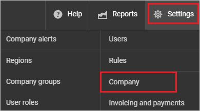
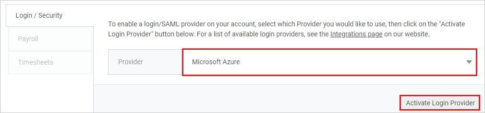
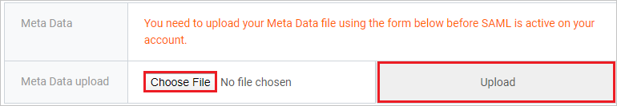
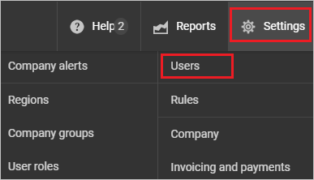
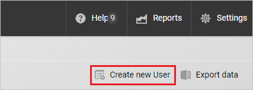
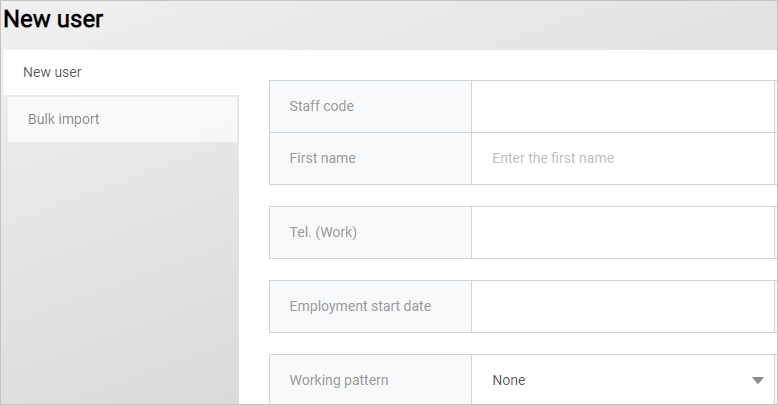

# Configure WhosOffice for Single sign-on with Microsoft Entra ID

In this article,  you learn how to integrate WhosOffice with Microsoft Entra ID. When you integrate WhosOffice with Microsoft Entra ID, you can:

* Control in Microsoft Entra ID who has access to WhosOffice.
* Enable your users to be automatically signed-in to WhosOffice with their Microsoft Entra accounts.
* Manage your accounts in one central location.

## Prerequisites
The scenario outlined in this article assumes that you already have the following prerequisites:

[!INCLUDE [common-prerequisites.md](~/identity/saas-apps/includes/common-prerequisites.md)]
* WhosOffice single sign-on (SSO) enabled subscription.

## Scenario description

In this article,  you configure and test Microsoft Entra SSO in a test environment.

* WhosOffice supports **SP and IDP** initiated SSO

> [!NOTE]
> Identifier of this application is a fixed string value so only one instance can be configured in one tenant.

## Adding WhosOffice from the gallery

To configure the integration of WhosOffice into Microsoft Entra ID, you need to add WhosOffice from the gallery to your list of managed SaaS apps.

1. Sign in to the [Microsoft Entra admin center](https://entra.microsoft.com) as at least a [Cloud Application Administrator](~/identity/role-based-access-control/permissions-reference.md#cloud-application-administrator).
1. Browse to **Entra ID** > **Enterprise apps** > **New application**.
1. In the **Add from the gallery** section, type **WhosOffice** in the search box.
1. Select **WhosOffice** from results panel and then add the app. Wait a few seconds while the app is added to your tenant.

 Alternatively, you can also use the [Enterprise App Configuration Wizard](https://portal.office.com/AdminPortal/home?Q=Docs#/azureadappintegration). In this wizard, you can add an application to your tenant, add users/groups to the app, assign roles, and walk through the SSO configuration as well. [Learn more about Microsoft 365 wizards.](/microsoft-365/admin/misc/azure-ad-setup-guides)

## Configure and test Microsoft Entra SSO for WhosOffice

Configure and test Microsoft Entra SSO with WhosOffice using a test user called **B.Simon**. For SSO to work, you need to establish a link relationship between a Microsoft Entra user and the related user in WhosOffice.

To configure and test Microsoft Entra SSO with WhosOffice, perform the following steps:

1. **[Configure Microsoft Entra SSO](#configure-azure-ad-sso)** - to enable your users to use this feature.
    1. **Create a Microsoft Entra test user** - to test Microsoft Entra single sign-on with B.Simon.
    1. **Assign the Microsoft Entra test user** - to enable B.Simon to use Microsoft Entra single sign-on.
1. **[Configure WhosOffice SSO](#configure-whosoffice-sso)** - to configure the single sign-on settings on application side.
    1. **[Create WhosOffice test user](#create-whosoffice-test-user)** - to have a counterpart of B.Simon in WhosOffice that's linked to the Microsoft Entra representation of user.
1. **[Test SSO](#test-sso)** - to verify whether the configuration works.

## Configure Microsoft Entra SSO

Follow these steps to enable Microsoft Entra SSO.

1. Sign in to the [Microsoft Entra admin center](https://entra.microsoft.com) as at least a [Cloud Application Administrator](~/identity/role-based-access-control/permissions-reference.md#cloud-application-administrator).
1. Browse to **Entra ID** > **Enterprise apps** > **WhosOffice** > **Single sign-on**.
1. On the **Select a single sign-on method** page, select **SAML**.
1. On the **Set up single sign-on with SAML** page, select the edit/pencil icon for **Basic SAML Configuration** to edit the settings.

   

1. On the **Basic SAML Configuration** section, if you wish to configure the application in **IDP** initiated mode, enter the values for the following fields:

    In the **Reply URL** text box, type a URL using the following pattern:
    `https://<SUBDOMAIN>.my.whosoffice.com/int/azure/consume.aspx`

1. Select **Set additional URLs** and perform the following step if you wish to configure the application in **SP** initiated mode:

    In the **Sign-on URL** text box, type a URL using the following pattern:
    `https://<SUBDOMAIN>.my.whosoffice.com/int/azure`

    > [!NOTE]
    > These values aren't real. Update these values with the actual Reply URL and Sign-on URL. Contact [WhosOffice Client support team](mailto:support@whosoffice.com) to get these values. You can also refer to the patterns shown in the **Basic SAML Configuration** section.

1. On the **Set up single sign-on with SAML** page, in the **SAML Signing Certificate** section,  find **Federation Metadata XML** and select **Download** to download the certificate and save it on your computer.

    

1. On the **Set up WhosOffice** section, copy the appropriate URL(s) based on your requirement.

    

[!INCLUDE [create-assign-users-sso.md](~/identity/saas-apps/includes/create-assign-users-sso.md)]

## Configure WhosOffice SSO

1. In a different web browser window, sign in to your WhosOffice company site as an administrator

1. Select **Settings** and select **Company**.

    

1. Select **Apps/Integrations**.

1. Select **Microsoft Azure** from the provider dropdown and select **Activate Login Provider**.

    

1. Upload the downloaded federation metadata file from Azure portal by selecting the **Upload** option.
    
    

### Create WhosOffice test user

1. In a different web browser window, sign into WhosOffice website as an administrator.

1. Select **Settings** and select **Users**.

    

1. Select **Create new User**.

    

1. Provide the necessary details of the user as per your organization requirement.

    

## Test SSO 

In this section, you test your Microsoft Entra single sign-on configuration with following options.

#### SP initiated:

* Select **Test this application**, this option redirects to WhosOffice Sign on URL where you can initiate the login flow.

* Go to WhosOffice Sign-on URL directly and initiate the login flow from there.

#### IDP initiated:

* Select **Test this application**, and you should be automatically signed in to the WhosOffice for which you set up the SSO

You can also use Microsoft My Apps to test the application in any mode. When you select the WhosOffice tile in the My Apps, if configured in SP mode you would be redirected to the application sign on page for initiating the login flow and if configured in IDP mode, you should be automatically signed in to the WhosOffice for which you set up the SSO. For more information about the My Apps, see [Introduction to the My Apps](https://support.microsoft.com/account-billing/sign-in-and-start-apps-from-the-my-apps-portal-2f3b1bae-0e5a-4a86-a33e-876fbd2a4510).

## Related content

Once you configure WhosOffice you can enforce session control, which protects exfiltration and infiltration of your organization's sensitive data in real time. Session control extends from Conditional Access. [Learn how to enforce session control with Microsoft Defender for Cloud Apps](/cloud-app-security/proxy-deployment-any-app).
