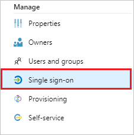
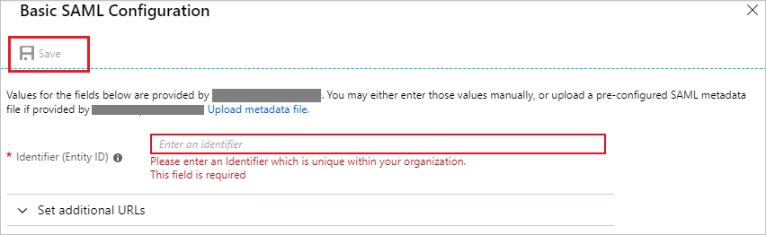

# Configure Wizergos Productivity Software for Single sign-on with Microsoft Entra ID

In this article,  you learn how to integrate Wizergos Productivity Software with Microsoft Entra ID.
Integrating Wizergos Productivity Software with Microsoft Entra ID provides you with the following benefits:

* You can control in Microsoft Entra ID who has access to Wizergos Productivity Software.
* You can enable your users to be automatically signed-in to Wizergos Productivity Software (Single Sign-On) with their Microsoft Entra accounts.
* You can manage your accounts in one central location.

If you want to know more details about SaaS app integration with Microsoft Entra ID, see [What is application access and single sign-on with Microsoft Entra ID](~/identity/enterprise-apps/what-is-single-sign-on.md).
If you don't have an Azure subscription, [create a free account](https://azure.microsoft.com/free/) before you begin.

## Prerequisites
The scenario outlined in this article assumes that you already have the following prerequisites:

[!INCLUDE [common-prerequisites.md](~/identity/saas-apps/includes/common-prerequisites.md)]
* Wizergos Productivity Software single sign-on enabled subscription

## Scenario description

In this article,  you configure and test Microsoft Entra single sign-on in a test environment.

* Wizergos Productivity Software supports **IDP** initiated SSO

## Adding Wizergos Productivity Software from the gallery

To configure the integration of Wizergos Productivity Software into Microsoft Entra ID, you need to add Wizergos Productivity Software from the gallery to your list of managed SaaS apps.

**To add Wizergos Productivity Software from the gallery, perform the following steps:**

1. Sign in to the [Microsoft Entra admin center](https://entra.microsoft.com) as at least a [Cloud Application Administrator](~/identity/role-based-access-control/permissions-reference.md#cloud-application-administrator).
1. Browse to **Entra ID** > **Enterprise apps** > **New application**.
1. In the search box, type **Wizergos Productivity Software**, select **Wizergos Productivity Software** from result panel then select **Add** button to add the application.

	 

## Configure and test Microsoft Entra single sign-on

In this section, you configure and test Microsoft Entra single sign-on with Wizergos Productivity Software based on a test user called **Britta Simon**.
For single sign-on to work, a link relationship between a Microsoft Entra user and the related user in Wizergos Productivity Software needs to be established.

To configure and test Microsoft Entra single sign-on with Wizergos Productivity Software, you need to complete the following building blocks:

1. **[Configure Microsoft Entra Single Sign-On](#configure-azure-ad-single-sign-on)** - to enable your users to use this feature.
2. **[Configure Wizergos Productivity Software Single Sign-On](#configure-wizergos-productivity-software-single-sign-on)** - to configure the Single Sign-On settings on application side.
3. **Create a Microsoft Entra test user** - to test Microsoft Entra single sign-on with Britta Simon.
4. **Assign the Microsoft Entra test user** - to enable Britta Simon to use Microsoft Entra single sign-on.
5. **[Create Wizergos Productivity Software test user](#create-wizergos-productivity-software-test-user)** - to have a counterpart of Britta Simon in Wizergos Productivity Software that's linked to the Microsoft Entra representation of user.
6. **[Test single sign-on](#test-single-sign-on)** - to verify whether the configuration works.

### Configure Microsoft Entra single sign-on

In this section, you enable Microsoft Entra single sign-on.

To configure Microsoft Entra single sign-on with Wizergos Productivity Software, perform the following steps:

1. Sign in to the [Microsoft Entra admin center](https://entra.microsoft.com) as at least a [Cloud Application Administrator](~/identity/role-based-access-control/permissions-reference.md#cloud-application-administrator).
1. Browse to **Entra ID** > **Enterprise apps** > **Wizergos Productivity Software** application integration page, select **Single sign-on**.

    

1. On the **Select a Single sign-on method** dialog, select **SAML/WS-Fed** mode to enable single sign-on.

    

1. On the **Set up Single Sign-On with SAML** page, select **Edit** icon to open **Basic SAML Configuration** dialog.

	

1. On the **Basic SAML Configuration** section, perform the following steps:

    

    In the **Identifier** text box, type a URL:
    `https://www.wizergos.net`

1. On the **Set up Single Sign-On with SAML** page, in the **SAML Signing Certificate** section, select **Download** to download the **Certificate (Base64)** from the given options as per your requirement and save it on your computer.

	

1. On the **Set up Wizergos Productivity Software** section, copy the appropriate URL(s) as per your requirement.

	

	a. Login URL

	b. Microsoft Entra Identifier

	c. Logout URL

### Configure Wizergos Productivity Software Single Sign-On

1. In a different web browser window, sign-on to your Wizergos Productivity Software tenant as an administrator.

2. From the hamburger menu, select **Admin**.

	

3. In Admin page on left hand menu select **AUTHENTICATION** and select **Microsoft Entra ID**.

	

4. Perform the following steps on **AUTHENTICATION** section.

	
	
	a. Select **UPLOAD** button to upload the downloaded certificate from Microsoft Entra ID.
	
	b. In the **Issuer URL** textbox, paste the **Microsoft Entra Identifier** value that you copied.
	
	c. In the **Single Sign-On URL** textbox, paste the **Login URL** value that you copied.
	
	d. In the **Single Sign-Out URL** textbox, paste the **Logout URL** value that you copied from Azure portal.
	
	e. Select **Save** button.

[!INCLUDE [create-assign-users-sso.md](~/identity/saas-apps/includes/create-assign-users-sso.md)]

### Create Wizergos Productivity Software test user

In this section, you create a user called Britta Simon in Wizergos Productivity Software. Work with [Wizergos Productivity Software support team](mailto:support@wizergos.com) to add the users in the Wizergos Productivity Software platform.

### Test single sign-on 

In this section, you test your Microsoft Entra single sign-on configuration using the Access Panel.

When you select the Wizergos Productivity Software tile in the Access Panel, you should be automatically signed in to the Wizergos Productivity Software for which you set up SSO. For more information about the Access Panel, see [Introduction to the Access Panel](https://support.microsoft.com/account-billing/sign-in-and-start-apps-from-the-my-apps-portal-2f3b1bae-0e5a-4a86-a33e-876fbd2a4510).

## Additional Resources

- [List of articles on How to Integrate SaaS Apps with Microsoft Entra ID](./tutorial-list.md)

- [What is application access and single sign-on with Microsoft Entra ID?](~/identity/enterprise-apps/what-is-single-sign-on.md)

- [What is Conditional Access in Microsoft Entra ID?](~/identity/conditional-access/overview.md)
