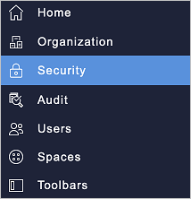
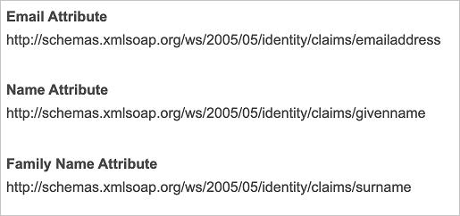

# Configure Workgrid for Single sign-on with Microsoft Entra ID

In this article,  you learn how to integrate Workgrid with Microsoft Entra ID. When you integrate Workgrid with Microsoft Entra ID, you can:

* Control in Microsoft Entra ID who has access to Workgrid.
* Enable your users to be automatically signed-in to Workgrid with their Microsoft Entra accounts.
* Manage your accounts in one central location.

## Prerequisites
The scenario outlined in this article assumes that you already have the following prerequisites:

[!INCLUDE [common-prerequisites.md](~/identity/saas-apps/includes/common-prerequisites.md)]
* Workgrid single sign-on enabled subscription.

## Scenario description

In this article,  you configure and test Microsoft Entra single sign-on in a test environment.

* Workgrid supports **SP** initiated SSO.
* Workgrid supports **Just In Time** user provisioning.
* Workgrid supports [Automated user provisioning](workgrid-provisioning-tutorial.md).

## Add Workgrid from the gallery

To configure the integration of Workgrid into Microsoft Entra ID, you need to add Workgrid from the gallery to your list of managed SaaS apps.

1. Sign in to the [Microsoft Entra admin center](https://entra.microsoft.com) as at least a [Cloud Application Administrator](~/identity/role-based-access-control/permissions-reference.md#cloud-application-administrator).
1. Browse to **Entra ID** > **Enterprise apps** > **New application**.
1. In the **Add from the gallery** section, type **Workgrid** in the search box.
1. Select **Workgrid** from results panel and then add the app. Wait a few seconds while the app is added to your tenant.

 Alternatively, you can also use the [Enterprise App Configuration Wizard](https://portal.office.com/AdminPortal/home?Q=Docs#/azureadappintegration). In this wizard, you can add an application to your tenant, add users/groups to the app, assign roles, and walk through the SSO configuration as well. [Learn more about Microsoft 365 wizards.](/microsoft-365/admin/misc/azure-ad-setup-guides)

## Configure and test Microsoft Entra SSO for Workgrid

Configure and test Microsoft Entra SSO with Workgrid using a test user called **B.Simon**. For SSO to work, you need to establish a link relationship between a Microsoft Entra user and the related user in Workgrid.

To configure and test Microsoft Entra SSO with Workgrid, perform the following steps:

1. **[Configure Microsoft Entra SSO](#configure-azure-ad-sso)** - to enable your users to use this feature.
    1. **Create a Microsoft Entra test user** - to test Microsoft Entra single sign-on with B.Simon.
    1. **Assign the Microsoft Entra test user** - to enable B.Simon to use Microsoft Entra single sign-on.
1. **[Configure Workgrid SSO](#configure-workgrid-sso)** - to configure the single sign-on settings on application side.
    1. **[Create Workgrid test user](#create-workgrid-test-user)** - to have a counterpart of B.Simon in Workgrid that's linked to the Microsoft Entra representation of user.
1. **[Test SSO](#test-sso)** - to verify whether the configuration works.

## Configure Microsoft Entra SSO

Follow these steps to enable Microsoft Entra SSO.

1. Sign in to the [Microsoft Entra admin center](https://entra.microsoft.com) as at least a [Cloud Application Administrator](~/identity/role-based-access-control/permissions-reference.md#cloud-application-administrator).
1. Browse to **Entra ID** > **Enterprise apps** > **Workgrid** > **Single sign-on**.
1. On the **Select a single sign-on method** page, select **SAML**.
1. On the **Set up single sign-on with SAML** page, select the pencil icon for **Basic SAML Configuration** to edit the settings.

   

1. On the **Basic SAML Configuration** section, perform the following steps:

   a. In the **Sign on URL** text box, type a URL using the following pattern:
   `https://<COMPANYCODE>.workgrid.com/console`

   b. In the **Identifier (Entity ID)** text box, type a value using the following pattern:
   `urn:amazon:cognito:sp:us-east-1_<poolid>`

   > [!NOTE]
   > These values aren't real. Update these values with the actual Sign on URL and Identifier. Your Sign On URL is the same URL you use to sign in to the Workgrid console.  You can find the Entity ID in the Security Section of your Workgrid console.

1. Workgrid application expects the SAML assertions in a specific format. Configure the following claims for this application. You can manage the values of these attributes from the **User Attributes** section on application integration page. On the **Set up Single Sign-On with SAML** page, select **Edit** button to open **User Attributes** dialog.

   

1. On the **Set-up Single Sign-On with SAML** page, in the **SAML Signing Certificate** section, select **Download** to download the **Federation Metadata XML** from the given options as per your requirement and save it on your computer.

   

1. On the **Set-up Workgrid** section, copy the appropriate URL(s) as per your requirement.

   

[!INCLUDE [create-assign-users-sso.md](~/identity/saas-apps/includes/create-assign-users-sso.md)]

## Configure Workgrid SSO

To configure single sign-on on **Workgrid** side, you need to add the downloaded **Federation Metadata XML** and appropriate copied URLs from the application configuration to your Workgrid console in the **Security section**.

   

   > [!NOTE]
   > You need to use the full schema URI for the Email, Name and Family Name claims when mapping the attributes in Workgrid:
 >
 >  

### Create Workgrid test user

In this section, a user called Britta Simon is created in Workgrid. Workgrid supports just-in-time provisioning, which is enabled by default. There's no action item for you in this section. If a user doesn't already exist in Workgrid, a new one is created when you attempt to access Workgrid.

Workgrid also supports automatic user provisioning, you can find more details [here](./workgrid-provisioning-tutorial.md) on how to configure automatic user provisioning.

## Test SSO

In this section, you test your Microsoft Entra single sign-on configuration with following options.

* Select **Test this application**, this option redirects to Workgrid Sign-on URL where you can initiate the login flow.

* Go to Workgrid Sign-on URL directly and initiate the login flow from there.

* You can use Microsoft My Apps. When you select the Workgrid tile in the My Apps, this option redirects to Workgrid Sign-on URL. For more information, see [Microsoft Entra My Apps](/azure/active-directory/manage-apps/end-user-experiences#azure-ad-my-apps).

## Related content

Once you configure Workgrid you can enforce session control, which protects exfiltration and infiltration of your organization’s sensitive data in real time. Session control extends from Conditional Access. [Learn how to enforce session control with Microsoft Defender for Cloud Apps](/cloud-app-security/proxy-deployment-aad).
