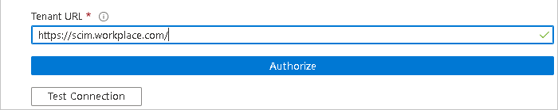
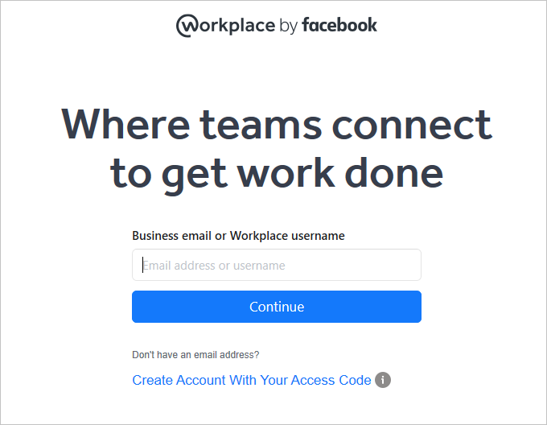
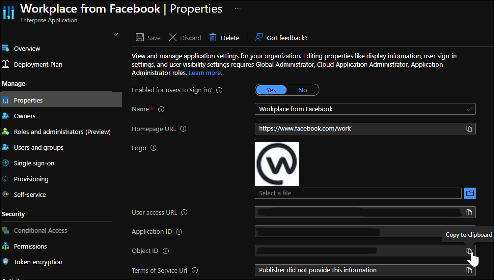
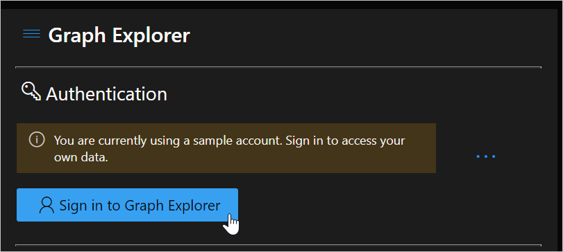
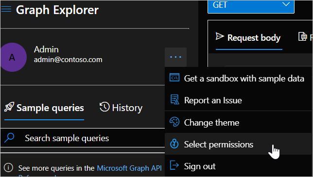
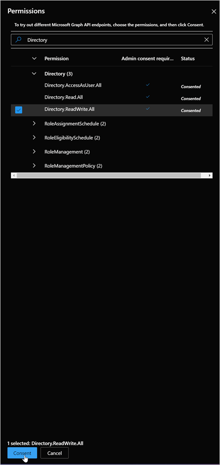
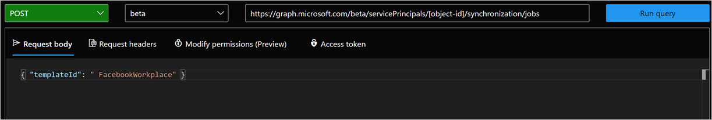

# Tutorial: Configure Workplace from Meta for automatic user provisioning

This tutorial describes the steps you need to do in both Workplace from Meta and Microsoft Entra ID to configure automatic user provisioning. When configured, Microsoft Entra ID automatically provisions and deprovisions users to [Workplace from Meta](https://work.workplace.com/) using the Microsoft Entra provisioning service. For important details on what this service does, how it works, and frequently asked questions, see [Automate user provisioning and deprovisioning to SaaS applications with Microsoft Entra ID](~/identity/app-provisioning/user-provisioning.md).

## Capabilities supported
> [!div class="checklist"]
> * Create users in Workplace from Meta
> * Remove users in Workplace from Meta when they do not require access anymore
> * Keep user attributes synchronized between Microsoft Entra ID and Workplace from Meta
> * [Single sign-on](./workplacebyfacebook-tutorial.md) to Workplace from Meta (recommended)

>[!VIDEO https://www.youtube.com/embed/oF7I0jjCfrY]

## Prerequisites

The scenario outlined in this tutorial assumes that you already have the following prerequisites:

* [A Microsoft Entra tenant](~/identity-platform/quickstart-create-new-tenant.md) 
* One of the following roles: [Application Administrator](/entra/identity/role-based-access-control/permissions-reference#application-administrator), [Cloud Application Administrator](/entra/identity/role-based-access-control/permissions-reference#cloud-application-administrator), or [Application Owner](/entra/fundamentals/users-default-permissions#owned-enterprise-applications).
* A Workplace from Meta single-sign on enabled subscription

> [!NOTE]
> To test the steps in this tutorial, we do not recommend using a production environment.

> [!NOTE]
> This integration is also available to use from Microsoft Entra US Government Cloud environment. You can find this application in the Microsoft Entra US Government Cloud Application Gallery and configure it in the same way as you do from public cloud.

To test the steps in this tutorial, you should follow these recommendations:

- Don't use your production environment, unless it's necessary.
- If you don't have a Microsoft Entra trial environment, you can get a one-month trial [here](https://azure.microsoft.com/pricing/free-trial/).

## Step 1: Plan your provisioning deployment
1. Learn about [how the provisioning service works](~/identity/app-provisioning/user-provisioning.md).
2. Determine who will be in [scope for provisioning](~/identity/app-provisioning/define-conditional-rules-for-provisioning-user-accounts.md).
3. Determine what data to [map between Microsoft Entra ID and Workplace from Meta](~/identity/app-provisioning/customize-application-attributes.md).

<a name='step-2-configure-workplace-by-facebook-to-support-provisioning-with-azure-ad'></a>

## Step 2: Configure Workplace from Meta to support provisioning with Microsoft Entra ID

Before configuring and enabling the provisioning service, you need to decide what users in Microsoft Entra ID represent the users who need access to your Workplace from Meta app. Once decided, you can assign these users to your Workplace from Meta app by following the instructions here:

*   It's recommended that a single Microsoft Entra user is assigned to Workplace from Meta to test the provisioning configuration. More users may be assigned later.

*   When assigning a user to Workplace from Meta, you must select a valid user role. The "Default Access" role doesn't work for provisioning.

<a name='step-3-add-workplace-by-facebook-from-the-azure-ad-application-gallery'></a>

## Step 3: Add Workplace from Meta from the Microsoft Entra application gallery

Add Workplace from Meta from the Microsoft Entra application gallery to start managing provisioning to Workplace from Meta. If you have previously setup Workplace from Meta for SSO, you can use the same application. However it's recommended that you create a separate app when testing out the integration initially. Learn more about adding an application from the gallery [here](~/identity/enterprise-apps/add-application-portal.md).

## Step 4: Define who will be in scope for provisioning 

The Microsoft Entra provisioning service allows you to scope who will be provisioned based on assignment to the application and or based on attributes of the user / group. If you choose to scope who will be provisioned to your app based on assignment, you can use the following [steps](~/identity/enterprise-apps/assign-user-or-group-access-portal.md) to assign users to the application. If you choose to scope who will be provisioned based solely on attributes of the user or group, you can use a scoping filter as described [here](~/identity/app-provisioning/define-conditional-rules-for-provisioning-user-accounts.md). 

* Start small. Test with a small set of users and groups before rolling out to everyone. When scope for provisioning is set to assigned users and groups, you can control this by assigning one or two users or groups to the app. When scope is set to all users and groups, you can specify an [attribute based scoping filter](~/identity/app-provisioning/define-conditional-rules-for-provisioning-user-accounts.md).

* If you need additional roles, you can [update the application manifest](~/identity-platform/howto-add-app-roles-in-apps.md) to add new roles.
## Step 5: Configure automatic user provisioning to Workplace from Meta
This section guides you through the steps to configure the Microsoft Entra provisioning service to create, update, and disable users in Workplace from Meta App based on user assignments in Microsoft Entra ID.

1. Sign in to the [Microsoft Entra admin center](https://entra.microsoft.com) as at least a [Cloud Application Administrator](~/identity/role-based-access-control/permissions-reference.md#cloud-application-administrator).
1. Browse to **Identity** > **Applications** > **Enterprise applications**

	

1. In the applications list, select **Workplace from Meta**.

	

1. Select the **Provisioning** tab.

	

1. Set the **Provisioning Mode** to **Automatic**.

	

1. Ensure the "Tenant URL" section is populated with the correct endpoint: https://scim.workplace.com/. Under the **Admin Credentials** section, click on **Authorize**. You'll be redirected to Workplace from Meta's authorization page. Input your Workplace from Meta username and click on the **Continue** button. Click **Test Connection** to ensure Microsoft Entra ID can connect to Workplace from Meta. If the connection fails, ensure your Workplace from Meta account has Admin permissions and try again.

 	

 	

   > [!NOTE]
   > Failure to change the URL to https://scim.workplace.com/ will result in a failure when trying to save the configuration 

1. In the **Notification Email** field, enter the email address of a person or group who should receive the provisioning error notifications and select the **Send an email notification when a failure occurs** check box.

	

1. Select **Save**.

1. Under the **Mappings** section, select **Synchronize Microsoft Entra users to Workplace from Meta**.

1. Review the user attributes that are synchronized from Microsoft Entra ID to Workplace from Meta in the **Attribute-Mapping** section. The attributes selected as **Matching** properties are used to match the user accounts in Workplace from Meta for update operations. If you choose to change the [matching target attribute](~/identity/app-provisioning/customize-application-attributes.md), you'll need to ensure that the Workplace from Meta API supports filtering users based on that attribute. Select the **Save** button to commit any changes.

   |Attribute|Type|
   |---|---|
   |userName|String|
   |displayName|String|
   |active|Boolean|
   |title|Boolean|
   |emails[type eq "work"].value|String|
   |name.givenName|String|
   |name.familyName|String|
   |name.formatted|String|
   |addresses[type eq "work"].formatted|String|
   |addresses[type eq "work"].streetAddress|String|
   |addresses[type eq "work"].locality|String|
   |addresses[type eq "work"].region|String|
   |addresses[type eq "work"].country|String|
   |addresses[type eq "work"].postalCode|String|
   |addresses[type eq "other"].formatted|String|
   |phoneNumbers[type eq "work"].value|String|
   |phoneNumbers[type eq "mobile"].value|String|
   |phoneNumbers[type eq "fax"].value|String|
   |externalId|String|
   |preferredLanguage|String|
   |urn:scim:schemas:extension:enterprise:1.0.manager|String|
   |urn:scim:schemas:extension:enterprise:1.0.department|String|
   |urn:scim:schemas:extension:enterprise:1.0.division|String|
   |urn:scim:schemas:extension:enterprise:1.0.organization|String|
   |urn:scim:schemas:extension:enterprise:1.0.costCenter|String|
   |urn:scim:schemas:extension:enterprise:1.0.employeeNumber|String|
   |urn:scim:schemas:extension:facebook:auth_method:1.0:auth_method|String|
   |urn:scim:schemas:extension:facebook:frontline:1.0.is_frontline|Boolean|
   |urn:scim:schemas:extension:facebook:starttermdates:1.0.startDate|Integer|


1. To configure scoping filters, refer to the following instructions provided in the [Scoping filter tutorial](~/identity/app-provisioning/define-conditional-rules-for-provisioning-user-accounts.md).

1. To enable the Microsoft Entra provisioning service for Workplace from Meta, change the **Provisioning Status** to **On** in the **Settings** section.

	

1. Define the users that you would like to provision to Workplace from Meta by choosing the appropriate values in **Scope** in the **Settings** section.

	

1. When you're ready to provision, click **Save**.

	

This operation starts the initial synchronization cycle of all users defined in **Scope** in the **Settings** section. The initial cycle takes longer to perform than subsequent cycles, which occur approximately every 40 minutes as long as the Microsoft Entra provisioning service is running. 

## Step 6: Monitor your deployment
Once you've configured provisioning, use the following resources to monitor your deployment:

1. Use the [provisioning logs](~/identity/monitoring-health/concept-provisioning-logs.md) to determine which users have been provisioned successfully or unsuccessfully
2. Check the [progress bar](~/identity/app-provisioning/application-provisioning-when-will-provisioning-finish-specific-user.md) to see the status of the provisioning cycle and how close it's to completion
3. If the provisioning configuration seems to be in an unhealthy state, the application will go into quarantine. Learn more about quarantine states [here](~/identity/app-provisioning/application-provisioning-quarantine-status.md).

## Troubleshooting tips
*  If you see a user unsuccessfully created and there's an audit log event with the code "1789003" it means that the user is from an unverified domain.
*  There are cases where users get an error 'ERROR: Missing Email field: You must provide an email Error returned from Facebook: Processing of the HTTP request resulted in an exception. See the HTTP response returned by the 'Response' property of this exception for details. This operation was retried zero times. It will be retried again after this date'. This error is due to customers mapping mail, rather than userPrincipalName, to Facebook email, yet some users don't have a mail attribute. 
To avoid the errors and successfully provision the failed users to Workplace from Facebook, modify the attribute mapping to the Workplace from Facebook email attribute to Coalesce([mail],[userPrincipalName]) or unassign the user from Workplace from Facebook, or provision an email address for the user.  
*  There's an option in Workplace, which allows the existence of [users without email addresses.](https://www.workplace.com/resources/tech/account-management/email-less#enable) If this setting is toggled on the Workplace side, provisioning on the Azure side must be restarted in order for users without emails to successfully be created in Workplace.  

## Update a Workplace from Meta application to use the Workplace from Meta SCIM 2.0 endpoint
In December 2021, Facebook released a SCIM 2.0 connector. Completing the steps below will update applications configured to use the SCIM 1.0 endpoint to the use the SCIM 2.0 endpoint. These steps will remove any customizations previously made to the Workplace from Meta application, including:
* Authentication details
* Scoping filters
* Custom attribute mappings

> [!NOTE]
> Be sure to note any changes that have been made to the settings listed above before completing the steps below. Failure to do so will result in the loss of customized settings. 

1. Sign in to the [Microsoft Entra admin center](https://entra.microsoft.com) as at least a [Cloud Application Administrator](~/identity/role-based-access-control/permissions-reference.md#cloud-application-administrator).
1. Browse to **Identity** > **Applications** > **Enterprise applications** > **Workplace from Meta**.
1. In the Properties section of your new custom app, copy the Object ID.

	

1. In a new web browser window, go to https://developer.microsoft.com/graph/graph-explorer and sign in as the administrator for the Microsoft Entra tenant where your app is added. 

	

1. Check to make sure the account being used has the correct permissions. The permission “Directory.ReadWrite.All” is required to make this change.                              

	                          

	

1. Using the ObjectID selected from the app previously, run the following command:

   ```
   GET https://graph.microsoft.com/beta/servicePrincipals/[object-id]/synchronization/jobs/
   ```

1. Taking the "id" value from the response body of the GET request from above, run the command below, replacing "[job-id]" with the id value from the GET request. The value should have the format of "FacebookAtWorkOutDelta.xxxxxxxxxxxxxxx.xxxxxxxxxxxxxxx":

   ```
   DELETE https://graph.microsoft.com/beta/servicePrincipals/[object-id]/synchronization/jobs/[job-id]
   ```

1. In the Graph Explorer, run the command below. Replace "[object-id]" with the service principal ID (object ID) copied from the third step.             

   ```
   POST https://graph.microsoft.com/beta/servicePrincipals/[object-id]/synchronization/jobs { "templateId": "FacebookWorkplace" }
   ```

   

1. Return to the first web browser window and select the Provisioning tab for your application. Your configuration will have been reset. You can confirm the upgrade has taken place by confirming the Job ID starts with “FacebookWorkplace”. 

1. Update the tenant URL in the Admin Credentials section to the following: https://scim.workplace.com/  

   

1. Restore any previous changes you made to the application (Authentication details, Scoping filters, Custom attribute mappings) and re-enable provisioning. 

   > [!NOTE] 
   > Failure to restore the previous settings may results in attributes (name.formatted for example) updating in Workplace unexpectedly. Be sure to check the configuration before enabling  provisioning 

## Change log

* 09/10/2020 - Added support for enterprise attributes "division", "organization", "costCenter" and "employeeNumber". Added support for custom attributes "startDate", "auth_method" and "frontline".
* 07/22/2021 - Updated the troubleshooting tips for customers with a mapping of mail to Facebook mail yet some users don't have a mail attribute.

## More resources

* [Managing user account provisioning for Enterprise Apps](~/identity/app-provisioning/configure-automatic-user-provisioning-portal.md)
* [What is application access and single sign-on with Microsoft Entra ID?](~/identity/enterprise-apps/what-is-single-sign-on.md)

## Next steps

* [Learn how to review logs and get reports on provisioning activity](~/identity/app-provisioning/check-status-user-account-provisioning.md)
