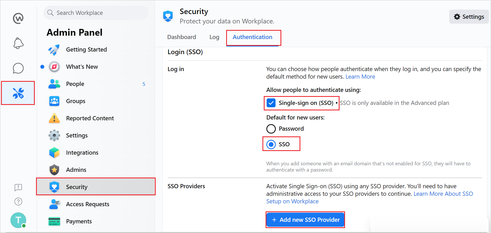
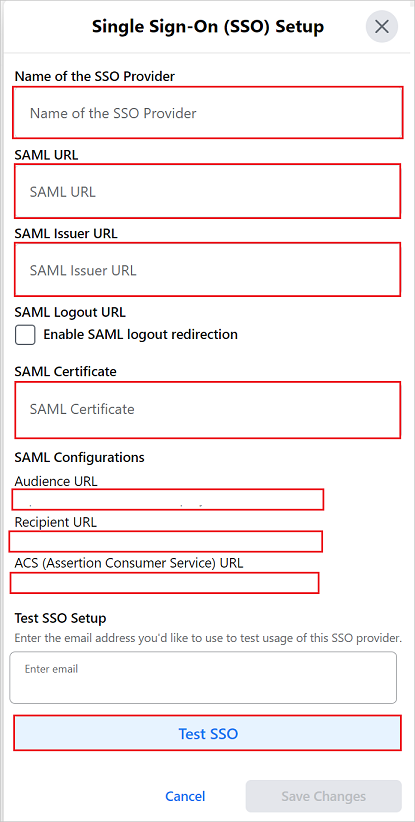
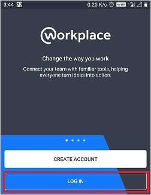
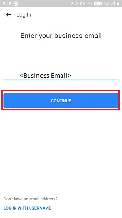
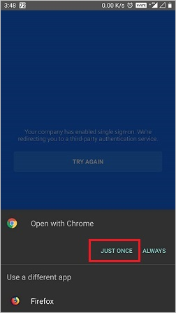
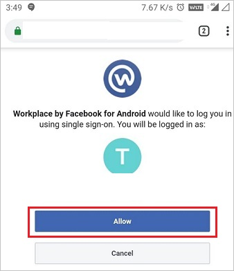

# Configure Workplace by Meta for Single sign-on with Microsoft Entra ID

In this article,  you learn how to integrate Workplace by Meta with Microsoft Entra ID. When you integrate Workplace by Meta with Microsoft Entra ID, you can:

* Control in Microsoft Entra ID who has access to Workplace by Meta.
* Enable your users to be automatically signed-in to Workplace by Meta with their Microsoft Entra accounts.
* Manage your accounts in one central location.

## Prerequisites
The scenario outlined in this article assumes that you already have the following prerequisites:

[!INCLUDE [common-prerequisites.md](~/identity/saas-apps/includes/common-prerequisites.md)]
* Workplace by Meta single sign-on (SSO) enabled subscription.

> [!NOTE]
> Meta has two products, Workplace Standard (free) and Workplace Premium (paid). Any Workplace Premium tenant can configure SCIM and SSO integration with no other implications to cost or licenses required. SSO and SCIM aren't available in Workplace Standard instances.

## Scenario description

In this article,  you configure and test Microsoft Entra SSO in a test environment.

* Workplace by Meta supports **SP** initiated SSO.
* Workplace by Meta supports **just-in-time provisioning**.
* Workplace by Meta supports **[automatic User Provisioning](workplace-by-facebook-provisioning-tutorial.md)**.
* Workplace by Meta Mobile application can now be configured with Microsoft Entra ID for enabling SSO. In this article,  you configure and test Microsoft Entra SSO in a test environment.

## Adding Workplace by Meta from the gallery

To configure the integration of Workplace by Meta into Microsoft Entra ID, you need to add Workplace by Meta from the gallery to your list of managed SaaS apps.

1. Sign in to the [Microsoft Entra admin center](https://entra.microsoft.com) as at least a [Cloud Application Administrator](~/identity/role-based-access-control/permissions-reference.md#cloud-application-administrator).
1. Browse to **Entra ID** > **Enterprise apps** > **New application**.
1. In the **Add from the gallery** section, type **Workplace by Meta** in the search box.
1. Select **Workplace by Meta** from results panel and then add the app. Wait a few seconds while the app is added to your tenant.

 Alternatively, you can also use the [Enterprise App Configuration Wizard](https://portal.office.com/AdminPortal/home?Q=Docs#/azureadappintegration). In this wizard, you can add an application to your tenant, add users/groups to the app, assign roles, and walk through the SSO configuration as well. [Learn more about Microsoft 365 wizards.](/microsoft-365/admin/misc/azure-ad-setup-guides)

## Configure and test Microsoft Entra SSO for Workplace by Meta

Configure and test Microsoft Entra SSO with Workplace by Meta using a test user called **B.Simon**. For SSO to work, you need to establish a link relationship between a Microsoft Entra user and the related user in Workplace by Meta.

To configure and test Microsoft Entra SSO with Workplace by Meta, perform the following steps:

1. **[Configure Microsoft Entra SSO](#configure-azure-ad-sso)** - to enable your users to use this feature.
    1. **Create a Microsoft Entra test user** - to test Microsoft Entra single sign-on with B.Simon.
    1. **Assign the Microsoft Entra test user** - to enable B.Simon to use Microsoft Entra single sign-on.
2. **[Configure Workplace by Meta SSO](#configure-workplace-by-meta-sso)** - to configure the Single Sign-On settings on application side.
    1. **[Create Workplace by Meta test user](#create-workplace-by-meta-test-user)** - to have a counterpart of B.Simon in Workplace by Meta that's linked to the Microsoft Entra representation of user.
3. **[Test SSO](#test-sso)** - to verify whether the configuration works.

## Configure Microsoft Entra SSO

Follow these steps to enable Microsoft Entra SSO.

1. Sign in to the [Microsoft Entra admin center](https://entra.microsoft.com) as at least a [Cloud Application Administrator](~/identity/role-based-access-control/permissions-reference.md#cloud-application-administrator).
1. Browse to **Entra ID** > **Enterprise apps** > **Workplace by Meta** application integration page, find the **Manage** section and select **Single sign-on**.
1. On the **Select a Single sign-on method** page, select **SAML**.
1. On the **Set up Single Sign-On with SAML** page, select the pencil icon for **Basic SAML Configuration** to edit the settings.

   

1. On the **Basic SAML Configuration** section, enter the values for the following fields:

    a. In the **Sign on URL** (found in WorkPlace as the Recipient URL) text box, type a URL using the following pattern:
    `https://.workplace.com/work/saml.php`

    b. In the **Identifier (Entity ID)** (found in WorkPlace as the Audience URL) text box, type a URL using the following pattern: 
    `https://www.workplace.com/company/`

    c. In the **Reply URL** (found in WorkPlace as the Assertion Consumer Service) text box, type a URL using the following pattern: 
    `https://.workplace.com/work/saml.php`

    > [!NOTE]
    > These values aren't the real. Update these values with the actual Sign-On URL, Identifier and Reply URL. See the Authentication page of the Workplace Company Dashboard for the correct values for your Workplace community, this is explained later in the article.

1. On the **Set up Single Sign-On with SAML** page, in the **SAML Signing Certificate** section,  find **Certificate (Base64)** and select **Download** to download the certificate and save it on your computer.

    

1. On the **Set up Workplace by Meta** section, copy the appropriate URL(s) based on your requirement.

    

[!INCLUDE [create-assign-users-sso.md](~/identity/saas-apps/includes/create-assign-users-sso.md)]

## Configure Workplace by Meta SSO

1. In a different web browser window, sign in to your Workplace by Meta company site as an administrator

    > [!NOTE]
    > As part of the SAML authentication process, Workplace may utilize query strings of up to 2.5 kilobytes in size in order to pass parameters to Microsoft Entra ID.

1. Navigate to **Admin Panel** > **Security** > **Authentication** tab.

    

    a. Check the **Single-sign on(SSO)** option.

    b. Select **SSO** as default for new users.
    
    c. Select **+Add new SSO Provider**.
    > [!NOTE]
    > Make sure you check the Password login checkbox too. Admins may need this option for login while doing the certificate rollover in order to stop themselves getting locked out.

1. In the **Single Sign-On (SSO) Setup** pop-up window, perform the following steps:

    

    a. In the **Name of the SSO Provider**, enter the SSO instance name like Azureadsso.

    b. In **SAML URL** textbox, paste the value of **Login URL**.

    c. In **SAML Issuer URL** textbox, paste the value of **Microsoft Entra Identifier**.

    d. Open the downloaded **Certificate (Base64)** into Notepad, copy the content of it into your clipboard, and then paste it to the **SAML Certificate** textbox.

    e. Copy the **Audience URL** for your instance and paste it in **Identifier (Entity ID)** textbox in **Basic SAML Configuration** section.

    f. Copy the **Recipient URL** for your instance and paste it in **Sign on URL** textbox in **Basic SAML Configuration** section.

    g. Copy the **ACS (Assertion Consumer Service) URL** for your instance and paste it in **Reply URL** textbox in **Basic SAML Configuration** section.

    h. Scroll to the bottom of the section and select the **Test SSO** button. This results in a pop-up window appearing with Microsoft Entra login page presented. Enter your credentials in as normal to authenticate.

    **Troubleshooting:** Ensure the email address being returned back from Microsoft Entra ID is the same as the Workplace account you're logged in with.

    i. Once the test has been completed successfully, scroll to the bottom of the page and select the **Save** button.

    j. All users using Workplace will now be presented with Microsoft Entra login page for authentication.

1. **SAML Logout Redirect (optional)** -

    You can choose to optionally configure a SAML Logout URL, which can be used to point at Microsoft Entra ID's logout page. When this setting is enabled and configured, the user will no longer be directed to the Workplace logout page. Instead, the user is redirected to the URL that was added in the SAML Logout Redirect setting.

### Configuring reauthentication frequency

You can configure Workplace to prompt for a SAML check every day, three days, week, two weeks, month or never.

> [!NOTE]
> The minimum value for the SAML check on mobile applications is set to one week.

You can also force a SAML reset for all users using the button: Require SAML authentication for all users now.

### Create Workplace by Meta test user

In this section, a user called B.Simon is created in Workplace by Meta. Workplace by Meta supports just-in-time provisioning, which is enabled by default.

There's no action for you in this section. If a user doesn't exist in Workplace by Meta, a new one is created when you attempt to access Workplace by Meta.

>[!Note]
>If you need to create a user manually, Contact [Workplace by Meta Client support team](https://www.workplace.com/help/work/).

## Test SSO 

In this section, you test your Microsoft Entra single sign-on configuration with following options. 

* Select **Test this application**, this option redirects to Workplace by Meta Sign-on URL where you can initiate the login flow. 

* Go to Workplace by Meta Sign-on URL directly and initiate the login flow from there.

* You can use Microsoft My Apps. When you select the Workplace by Meta tile in the My Apps, this option redirects to Workplace by Meta Sign-on URL. For more information about the My Apps, see [Introduction to the My Apps](https://support.microsoft.com/account-billing/sign-in-and-start-apps-from-the-my-apps-portal-2f3b1bae-0e5a-4a86-a33e-876fbd2a4510).

## Test SSO for Workplace by Meta (mobile)

1. Open Workplace by Meta Mobile application. On the sign in page, select **LOG IN**.

    

2. Enter your business email and select **CONTINUE**.

    

3. Select **JUST ONCE**.

    

4. Select **Allow**.

    

5. Finally after successful sign in, the application homepage is displayed.    

    

## Related content

Once you configure Workplace by Meta you can enforce Session control, which protects exfiltration and infiltration of your organization's sensitive data in real time. Session control extends from Conditional Access. [Learn how to enforce session control with Microsoft Defender for Cloud Apps](/cloud-app-security/proxy-deployment-aad).
