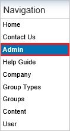
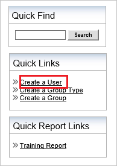
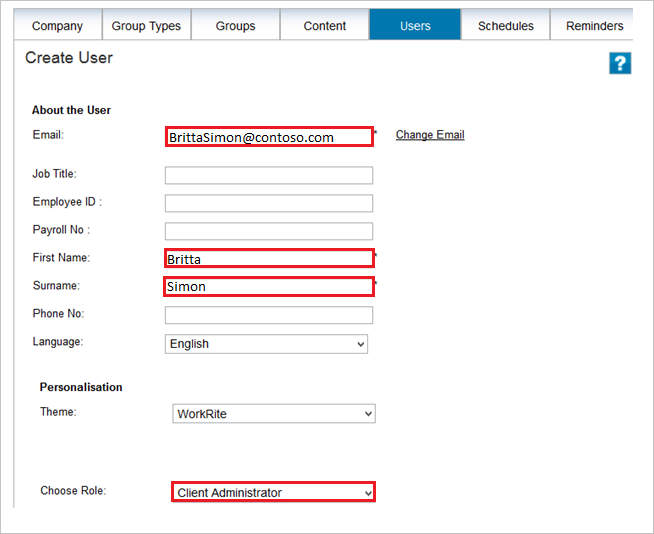

# Configure Workrite for Single sign-on with Microsoft Entra ID

In this article,  you learn how to integrate Workrite with Microsoft Entra ID. When you integrate Workrite with Microsoft Entra ID, you can:

* Control in Microsoft Entra ID who has access to Workrite.
* Enable your users to be automatically signed-in to Workrite with their Microsoft Entra accounts.
* Manage your accounts in one central location.

## Prerequisites
The scenario outlined in this article assumes that you already have the following prerequisites:

[!INCLUDE [common-prerequisites.md](~/identity/saas-apps/includes/common-prerequisites.md)]
* Workrite single sign-on enabled subscription.

## Scenario description

In this article,  you configure and test Microsoft Entra single sign-on in a test environment.

* Workrite supports **SP** initiated SSO.

> [!NOTE]
> Identifier of this application is a fixed string value so only one instance can be configured in one tenant.

## Add Workrite from the gallery

To configure the integration of Workrite into Microsoft Entra ID, you need to add Workrite from the gallery to your list of managed SaaS apps.

1. Sign in to the [Microsoft Entra admin center](https://entra.microsoft.com) as at least a [Cloud Application Administrator](~/identity/role-based-access-control/permissions-reference.md#cloud-application-administrator).
1. Browse to **Entra ID** > **Enterprise apps** > **New application**.
1. In the **Add from the gallery** section, type **Workrite** in the search box.
1. Select **Workrite** from results panel and then add the app. Wait a few seconds while the app is added to your tenant.

 Alternatively, you can also use the [Enterprise App Configuration Wizard](https://portal.office.com/AdminPortal/home?Q=Docs#/azureadappintegration). In this wizard, you can add an application to your tenant, add users/groups to the app, assign roles, and walk through the SSO configuration as well. [Learn more about Microsoft 365 wizards.](/microsoft-365/admin/misc/azure-ad-setup-guides)

## Configure and test Microsoft Entra SSO for Workrite

Configure and test Microsoft Entra SSO with Workrite using a test user called **B.Simon**. For SSO to work, you need to establish a link relationship between a Microsoft Entra user and the related user in Workrite.

To configure and test Microsoft Entra SSO with Workrite, perform the following steps:

1. **[Configure Microsoft Entra SSO](#configure-azure-ad-sso)** - to enable your users to use this feature.
    1. **Create a Microsoft Entra test user** - to test Microsoft Entra single sign-on with B.Simon.
    1. **Assign the Microsoft Entra test user** - to enable B.Simon to use Microsoft Entra single sign-on.
1. **[Configure Workrite SSO](#configure-workrite-sso)** - to configure the single sign-on settings on application side.
    1. **[Create Workrite test user](#create-workrite-test-user)** - to have a counterpart of B.Simon in Workrite that's linked to the Microsoft Entra representation of user.
1. **[Test SSO](#test-sso)** - to verify whether the configuration works.

## Configure Microsoft Entra SSO

Follow these steps to enable Microsoft Entra SSO.

1. Sign in to the [Microsoft Entra admin center](https://entra.microsoft.com) as at least a [Cloud Application Administrator](~/identity/role-based-access-control/permissions-reference.md#cloud-application-administrator).
1. Browse to **Entra ID** > **Enterprise apps** > **Workrite** > **Single sign-on**.
1. On the **Select a single sign-on method** page, select **SAML**.
1. On the **Set up single sign-on with SAML** page, select the pencil icon for **Basic SAML Configuration** to edit the settings.

   

1. On the **Basic SAML Configuration** section, perform the following step:

    In the **Sign-on URL** text box, type a URL using the following pattern:
    `https://app.workrite.co.uk/securelogin/samlgateway.aspx?id=<uniqueid>`

	> [!NOTE]
	> The value isn't real. Update the value with the actual Sign-On URL. Contact [Workrite Client support team](mailto:support@workrite.co.uk) to get the value. You can also refer to the patterns shown in the **Basic SAML Configuration** section.

1. On the **Set up Single Sign-On with SAML** page, in the **SAML Signing Certificate** section, select **Download** to download the **Certificate (Base64)** from the given options as per your requirement and save it on your computer.

	

1. On the **Set up Workrite** section, copy the appropriate URL(s) as per your requirement.

	

[!INCLUDE [create-assign-users-sso.md](~/identity/saas-apps/includes/create-assign-users-sso.md)]

## Configure Workrite SSO

To configure single sign-on on **Workrite** side, you need to send the downloaded **Certificate (Base64)** and appropriate copied URLs from the application configuration to [Workrite support team](mailto:support@workrite.co.uk). They set this setting to have the SAML SSO connection set properly on both sides.

### Create Workrite test user

The objective of this section is to create a user called Britta Simon in Workrite.

**To create a user called Britta Simon in Workrite, perform the following steps:**

1. Sign on to your workrite company site as administrator.

2. In the navigation pane, select **Admin**.
   
    

3. Go to Quick Links, and then select **Create a User**.
   
    

4. On the **Create User** dialog, perform the following steps:
   
    
	
	a. In the **Email** textbox, type the email address of user like Brittasimon@contoso.com.

	b. In the **First Name** textbox, type the firstname of user like Britta.

	c. In the **Surname** textbox, type the surname of user like Simon.
	
	d. Select **Client Administrator** as **Choose Role**.
	
	e. Select **Save**.

## Test SSO 

In this section, you test your Microsoft Entra single sign-on configuration with following options. 

* Select **Test this application**, this option redirects to Workrite Sign-on URL where you can initiate the login flow. 

* Go to Workrite Sign-on URL directly and initiate the login flow from there.

* You can use Microsoft My Apps. When you select the Workrite tile in the My Apps, this option redirects to Workrite Sign-on URL. For more information, see [Microsoft Entra My Apps](/azure/active-directory/manage-apps/end-user-experiences#azure-ad-my-apps).

## Related content

Once you configure Workrite you can enforce session control, which protects exfiltration and infiltration of your organization’s sensitive data in real time. Session control extends from Conditional Access. [Learn how to enforce session control with Microsoft Defender for Cloud Apps](/cloud-app-security/proxy-deployment-aad).
