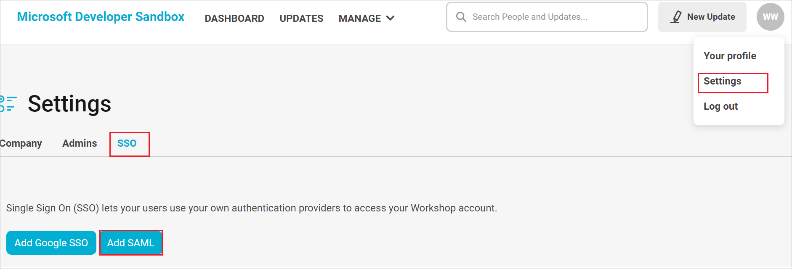
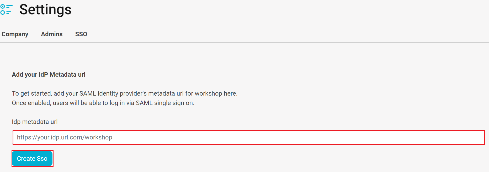

# Configure Workshop for Single sign-on with Microsoft Entra ID

In this article,  you learn how to integrate Workshop with Microsoft Entra ID. When you integrate Workshop with Microsoft Entra ID, you can:

* Control in Microsoft Entra ID who has access to Workshop.
* Enable your users to be automatically signed-in to Workshop with their Microsoft Entra accounts.
* Manage your accounts in one central location.

## Prerequisites
The scenario outlined in this article assumes that you already have the following prerequisites:

[!INCLUDE [common-prerequisites.md](~/identity/saas-apps/includes/common-prerequisites.md)]
* Workshop single sign-on (SSO) enabled subscription.

## Scenario description

In this article,  you configure and test Microsoft Entra SSO in a test environment.

* Workshop supports **SP and IDP** initiated SSO.
* Workshop supports **Just In Time** user provisioning.

## Add Workshop from the gallery

To configure the integration of Workshop into Microsoft Entra ID, you need to add Workshop from the gallery to your list of managed SaaS apps.

1. Sign in to the [Microsoft Entra admin center](https://entra.microsoft.com) as at least a [Cloud Application Administrator](~/identity/role-based-access-control/permissions-reference.md#cloud-application-administrator).
1. Browse to **Entra ID** > **Enterprise apps** > **New application**.
1. In the **Add from the gallery** section, type **Workshop** in the search box.
1. Select **Workshop** from results panel and then add the app. Wait a few seconds while the app is added to your tenant.

 Alternatively, you can also use the [Enterprise App Configuration Wizard](https://portal.office.com/AdminPortal/home?Q=Docs#/azureadappintegration). In this wizard, you can add an application to your tenant, add users/groups to the app, assign roles, and walk through the SSO configuration as well. [Learn more about Microsoft 365 wizards.](/microsoft-365/admin/misc/azure-ad-setup-guides)

## Configure and test Microsoft Entra SSO for Workshop

Configure and test Microsoft Entra SSO with Workshop using a test user called **B.Simon**. For SSO to work, you need to establish a link relationship between a Microsoft Entra user and the related user in Workshop.

To configure and test Microsoft Entra SSO with Workshop, perform the following steps:

1. **[Configure Microsoft Entra SSO](#configure-azure-ad-sso)** - to enable your users to use this feature.
    1. **Create a Microsoft Entra test user** - to test Microsoft Entra single sign-on with B.Simon.
    1. **Assign the Microsoft Entra test user** - to enable B.Simon to use Microsoft Entra single sign-on.
1. **[Configure Workshop SSO](#configure-workshop-sso)** - to configure the single sign-on settings on application side.
    1. **[Create Workshop test user](#create-workshop-test-user)** - to have a counterpart of B.Simon in Workshop that's linked to the Microsoft Entra representation of user.
1. **[Test SSO](#test-sso)** - to verify whether the configuration works.

## Configure Microsoft Entra SSO

Follow these steps to enable Microsoft Entra SSO.

1. Sign in to the [Microsoft Entra admin center](https://entra.microsoft.com) as at least a [Cloud Application Administrator](~/identity/role-based-access-control/permissions-reference.md#cloud-application-administrator).
1. Browse to **Entra ID** > **Enterprise apps** > **Workshop** > **Single sign-on**.
1. On the **Select a single sign-on method** page, select **SAML**.
1. On the **Set up single sign-on with SAML** page, select the pencil icon for **Basic SAML Configuration** to edit the settings.

   

1. On the **Basic SAML Configuration** section, if you wish to configure the application in **IDP** initiated mode, enter the values for the following fields:

    a. In the **Identifier (ENTITY ID)** text box, type one of the following URLs:
    
    | Identifier |
    |----|
    | `https://app.useworkshop.com/auth/auth/saml/metadata?id=<ID>` |
    | `https://app-eu.useworkshop.com/auth/auth/saml/metadata?id=<ID>` |

    b. In the **Reply URL** text box, type one of the following URLs:

    | Reply URL |
    |----|
    | `https://app.useworkshop.com/auth/auth/saml/callback?id=<ID>` |
    | `https://app-eu.useworkshop.com/auth/auth/saml/callback?id=<ID> `|

1. Perform the following step, if you wish to configure the application in **SP** initiated mode:

    In the **Sign on URL** text box, type one of the following URLs:

    | Sign on URL |
    |----|
    | `https://app.useworkshop.com/auth/auth/saml?id=<ID>`  | 
    | `https://app-eu.useworkshop.com/auth/auth/saml?id=<ID>` |

	> [!NOTE]
	> These values aren't real. Update these values with the actual Identifier, Reply URL and Sign-on URL. Contact [Workshop support team](mailto:help@useworkshop.com) to get these values. You can also refer to the patterns shown in the **Basic SAML Configuration** section.

1. Workshop application expects the SAML assertions in a specific format, which requires you to add custom attribute mappings to your SAML token attributes configuration. The following screenshot shows the list of default attributes.

	

1. In addition to above, Workshop application expects few more attributes to be passed back in SAML response, which are shown below. These attributes are also pre populated but you can review them as per your requirements.
	
	| Name | Source Attribute|
	| -------------- | --------- |
	| first_name | user.givenname |
	| last_name | user.surname |
	| email | user.mail |

1. On the **Set up single sign-on with SAML** page, In the **SAML Signing Certificate** section, select copy button to copy **App Federation Metadata Url** and save it on your computer.

	

[!INCLUDE [create-assign-users-sso.md](~/identity/saas-apps/includes/create-assign-users-sso.md)]

## Configure Workshop SSO

1. In a different browser window log in to your Workshop as an administrator.

1. Select the profile icon at the top right corner and select **Settings** from the list.

1. In the **Settings**, go to the **SSO** tab and select **Add SAML**.

    

1. In the **Idp metadata url** textbox, paste the **App Federation Metadata Url** value which you copied previously. 

    

1. Select **Create Sso**.

### Create Workshop test user

In this section, a user called Britta Simon is created in Workshop. Workshop supports just-in-time user provisioning, which is enabled by default. There's no action item for you in this section. If a user doesn't already exist in Workshop, a new one is created after authentication.

## Test SSO 

In this section, you test your Microsoft Entra single sign-on configuration with following options. 

#### SP initiated:

* Select **Test this application**, this option redirects to Workshop Sign on URL where you can initiate the login flow.  

* Go to Workshop Sign-on URL directly and initiate the login flow from there.

#### IDP initiated:

* Select **Test this application**, and you should be automatically signed in to the Workshop for which you set up the SSO 

You can also use Microsoft My Apps to test the application in any mode. When you select the Workshop tile in the My Apps, if configured in SP mode you would be redirected to the application sign on page for initiating the login flow and if configured in IDP mode, you should be automatically signed in to the Workshop for which you set up the SSO. For more information about the My Apps, see [Introduction to the My Apps](https://support.microsoft.com/account-billing/sign-in-and-start-apps-from-the-my-apps-portal-2f3b1bae-0e5a-4a86-a33e-876fbd2a4510).

## Related content

Once you configure Workshop you can enforce session control, which protects exfiltration and infiltration of your organization’s sensitive data in real time. Session control extends from Conditional Access. [Learn how to enforce session control with Microsoft Defender for Cloud Apps](/cloud-app-security/proxy-deployment-any-app).