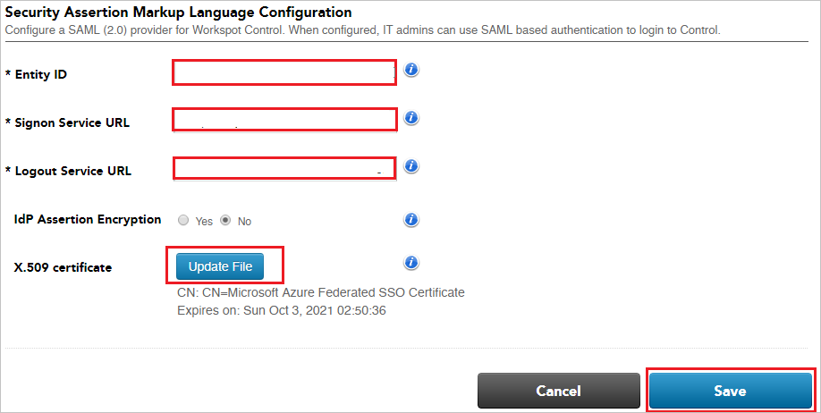
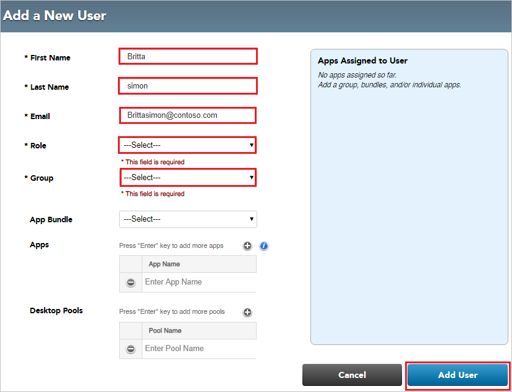

# Microsoft Entra integration with Workspot Control

In this article,  you'll learn how to integrate Workspot Control with Microsoft Entra ID. When you integrate Workspot Control with Microsoft Entra ID, you can:

* Control in Microsoft Entra ID who has access to Workspot Control.
* Enable your users to be automatically signed-in to Workspot Control with their Microsoft Entra accounts.
* Manage your accounts in one central location.

## Prerequisites

To configure Microsoft Entra integration with Workspot Control, you need the following things:

* A Microsoft Entra subscription. If you don't have a Microsoft Entra environment, you can get a [free account](https://azure.microsoft.com/free/).

* A Workspot Control single sign-on-enabled subscription.

## Scenario description

In this article,  you configure and test Microsoft Entra single sign-on in a test environment.

* Workspot Control supports SP-initiated and IDP-initiated SSO.

## Add Workspot Control from the gallery

To configure the integration of Workspot Control into Microsoft Entra ID, you need to add Workspot Control from the gallery to your list of managed SaaS apps.

1. Sign in to the [Microsoft Entra admin center](https://entra.microsoft.com) as at least a [Cloud Application Administrator](~/identity/role-based-access-control/permissions-reference.md#cloud-application-administrator).
1. Browse to **Identity** > **Applications** > **Enterprise applications** > **New application**.
1. In the **Add from the gallery** section, type **Workspot Control** in the search box.
1. Select **Workspot Control** from results panel and then add the app. Wait a few seconds while the app is added to your tenant.

 Alternatively, you can also use the [Enterprise App Configuration Wizard](https://portal.office.com/AdminPortal/home?Q=Docs#/azureadappintegration). In this wizard, you can add an application to your tenant, add users/groups to the app, assign roles, as well as walk through the SSO configuration as well. [Learn more about Microsoft 365 wizards.](/microsoft-365/admin/misc/azure-ad-setup-guides)

## Configure and test Microsoft Entra SSO for Workspot Control

Configure and test Microsoft Entra SSO with Workspot Control using a test user called **B.Simon**. For SSO to work, you need to establish a link relationship between a Microsoft Entra user and the related user in Workspot Control.

To configure and test Microsoft Entra SSO with Workspot Control, perform the following steps:

1. **[Configure Microsoft Entra SSO](#configure-azure-ad-sso)** - to enable your users to use this feature.
    1. **[Create a Microsoft Entra test user](#create-an-azure-ad-test-user)** - to test Microsoft Entra single sign-on with B.Simon.
    1. **[Assign the Microsoft Entra test user](#assign-the-azure-ad-test-user)** - to enable B.Simon to use Microsoft Entra single sign-on.
1. **[Configure Workspot Control SSO](#configure-workspot-control-sso)** - to configure the single sign-on settings on application side.
    1. **[Create Workspot Control test user](#create-workspot-control-test-user)** - to have a counterpart of B.Simon in Workspot Control that is linked to the Microsoft Entra representation of user.
1. **[Test SSO](#test-sso)** - to verify whether the configuration works.

## Configure Microsoft Entra SSO

Follow these steps to enable Microsoft Entra SSO.

1. Sign in to the [Microsoft Entra admin center](https://entra.microsoft.com) as at least a [Cloud Application Administrator](~/identity/role-based-access-control/permissions-reference.md#cloud-application-administrator).
1. Browse to **Identity** > **Applications** > **Enterprise applications** > **Workspot Control** > **Single sign-on**.
1. On the **Select a single sign-on method** page, select **SAML**.
1. On the **Set up single sign-on with SAML** page, click the pencil icon for **Basic SAML Configuration** to edit the settings.

   

1. In the **Basic SAML Configuration** section, if you want to configure the application in IDP-initiated mode, follow these steps:

    1. In the **identifier** text box, type a URL using the following pattern: 
    `https://<<i></i>INSTANCENAME>-saml.workspot.com/saml/metadata`

    1. In the **reply URL** text box, type a URL using the following pattern: 
    `https://<<i></i>INSTANCENAME>-saml.workspot.com/saml/assertion`

1. If you want to configure the application in SP-initiated mode, select **Set additional URLs**.

    In the **Sign-on URL** text box, type a URL using the following pattern: 
    `https://<<i></i>INSTANCENAME>-saml.workspot.com/`

	> [!NOTE]
	> These values are not real. Replace these values with the actual identifier, reply URL, and sign-on URL. Contact the [Workspot Control Client support team](mailto:support@workspot.com) to get these values. Or you can also refer to the patterns in the **Basic SAML Configuration** section.

1. On the **Set Up Single Sign-On with SAML** page, in the **SAML Signing Certificate** section, select **Download** to download **Certificate (Base64)** from the available options as per your requirements. Save it to your computer.

	

1. In the **Set up Workspot Control** section, copy the appropriate URLs as per your requirements:

	

### Create a Microsoft Entra test user

In this section, you'll create a test user called B.Simon.

1. Sign in to the [Microsoft Entra admin center](https://entra.microsoft.com) as at least a [User Administrator](~/identity/role-based-access-control/permissions-reference.md#user-administrator).
1. Browse to **Identity** > **Users** > **All users**.
1. Select **New user** > **Create new user**, at the top of the screen.
1. In the **User** properties, follow these steps:
   1. In the **Display name** field, enter `B.Simon`.  
   1. In the **User principal name** field, enter the username@companydomain.extension. For example, `B.Simon@contoso.com`.
   1. Select the **Show password** check box, and then write down the value that's displayed in the **Password** box.
   1. Select **Review + create**.
1. Select **Create**.

### Assign the Microsoft Entra test user

In this section, you'll enable B.Simon to use single sign-on by granting access to Workspot Control.

1. Sign in to the [Microsoft Entra admin center](https://entra.microsoft.com) as at least a [Cloud Application Administrator](~/identity/role-based-access-control/permissions-reference.md#cloud-application-administrator).
1. Browse to **Identity** > **Applications** > **Enterprise applications** > **Workspot Control**.
1. In the app's overview page, select **Users and groups**.
1. Select **Add user/group**, then select **Users and groups** in the **Add Assignment** dialog.
   1. In the **Users and groups** dialog, select **B.Simon** from the Users list, then click the **Select** button at the bottom of the screen.
   1. If you are expecting a role to be assigned to the users, you can select it from the **Select a role** dropdown. If no role has been set up for this app, you see "Default Access" role selected.
   1. In the **Add Assignment** dialog, click the **Assign** button.

## Configure Workspot Control SSO

1. In a different web browser window, sign in to Workspot Control as a Security Administrator.

2. In the toolbar at the top of the page, select **Setup** and then **SAML**.

	

3. In the **Security Assertion Markup Language Configuration** window, follow these steps:
 
	

	1. In the **Entity ID** box, paste the **Microsoft Entra Identifier** that you copied.

	1. In the **Signon Service URL** box, paste the **Login URL** that you copied.

	1. In the **Logout Service URL** box, paste the **Logout URL** that you copied.

	1. Select **Update File** to upload into the X.509 certificate the base-64 encoded certificate that you downloaded.

	1. Select **Save**.

### Create Workspot Control test user

To enable Microsoft Entra users to sign in to Workspot Control, they must be provisioned into Workspot Control. Provisioning is a manual task.

**To provision a user account, follow these steps:**

1. Sign in to Workspot Control as a Security Administrator.

2. In the toolbar at the top of the page, select **Users** and then **Add User**.

	

3. In the **Add a New User** window, follow these steps:

	

	1. In **First Name** box, enter the first name of a user, such as **Britta**.

	1. In **Last Name** text box, enter the last name of the user, such as **Simon**.

	1. In **Email** box, enter the email address of the user, such as **Brittasimon@contoso.<i></i>com**.

	1. Select the appropriate user role from the **Role** drop-down list.

	1. Select the appropriate user group from the **Group** drop-down list.

	1. Select **Add User**.

## Test SSO

In this section, you test your Microsoft Entra single sign-on configuration with following options. 

#### SP initiated:

* Click on **Test this application**, this will redirect to Workspot Control Sign on URL where you can initiate the login flow.  

* Go to Workspot Control Sign-on URL directly and initiate the login flow from there.

#### IDP initiated:

* Click on **Test this application**, and you should be automatically signed in to the Workspot Control for which you set up the SSO. 

You can also use Microsoft My Apps to test the application in any mode. When you click the Workspot Control tile in the My Apps, if configured in SP mode you would be redirected to the application sign on page for initiating the login flow and if configured in IDP mode, you should be automatically signed in to the Workspot Control for which you set up the SSO. For more information about the My Apps, see [Introduction to the My Apps](https://support.microsoft.com/account-billing/sign-in-and-start-apps-from-the-my-apps-portal-2f3b1bae-0e5a-4a86-a33e-876fbd2a4510).

## Related content

Once you configure Workspot Control you can enforce session control, which protects exfiltration and infiltration of your organization’s sensitive data in real time. Session control extends from Conditional Access. [Learn how to enforce session control with Microsoft Defender for Cloud Apps](/cloud-app-security/proxy-deployment-aad).
