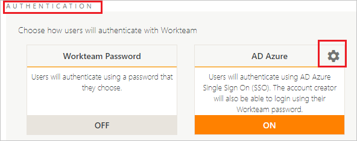

# Configure Workteam for Single sign-on with Microsoft Entra ID

In this article,  you learn how to integrate Workteam with Microsoft Entra ID. When you integrate Workteam with Microsoft Entra ID, you can:

* Control in Microsoft Entra ID who has access to Workteam.
* Enable your users to be automatically signed-in to Workteam with their Microsoft Entra accounts.
* Manage your accounts in one central location.

## Prerequisites
The scenario outlined in this article assumes that you already have the following prerequisites:

[!INCLUDE [common-prerequisites.md](~/identity/saas-apps/includes/common-prerequisites.md)]
* Workteam single sign-on (SSO) enabled subscription.

## Scenario description

In this article,  you configure and test Microsoft Entra SSO in a test environment.

* Workteam supports **SP and IDP** initiated SSO.
* Workteam supports [Automated user provisioning](workteam-provisioning-tutorial.md).

## Add Workteam from the gallery

To configure the integration of Workteam into Microsoft Entra ID, you need to add Workteam from the gallery to your list of managed SaaS apps.

1. Sign in to the [Microsoft Entra admin center](https://entra.microsoft.com) as at least a [Cloud Application Administrator](~/identity/role-based-access-control/permissions-reference.md#cloud-application-administrator).
1. Browse to **Entra ID** > **Enterprise apps** > **New application**.
1. In the **Add from the gallery** section, type **Workteam** in the search box.
1. Select **Workteam** from results panel and then add the app. Wait a few seconds while the app is added to your tenant.

 Alternatively, you can also use the [Enterprise App Configuration Wizard](https://portal.office.com/AdminPortal/home?Q=Docs#/azureadappintegration). In this wizard, you can add an application to your tenant, add users/groups to the app, assign roles, and walk through the SSO configuration as well. [Learn more about Microsoft 365 wizards.](/microsoft-365/admin/misc/azure-ad-setup-guides)

## Configure and test Microsoft Entra SSO for Workteam

Configure and test Microsoft Entra SSO with Workteam using a test user called **B.Simon**. For SSO to work, you need to establish a link relationship between a Microsoft Entra user and the related user in Workteam.

To configure and test Microsoft Entra SSO with Workteam, perform the following steps:

1. **[Configure Microsoft Entra SSO](#configure-azure-ad-sso)** - to enable your users to use this feature.
    1. **Create a Microsoft Entra test user** - to test Microsoft Entra single sign-on with B.Simon.
    1. **Assign the Microsoft Entra test user** - to enable B.Simon to use Microsoft Entra single sign-on.
1. **[Configure Workteam SSO](#configure-workteam-sso)** - to configure the single sign-on settings on application side.
    1. **[Create Workteam test user](#create-workteam-test-user)** - to have a counterpart of B.Simon in Workteam that's linked to the Microsoft Entra representation of user.
1. **[Test SSO](#test-sso)** - to verify whether the configuration works.

## Configure Microsoft Entra SSO

Follow these steps to enable Microsoft Entra SSO.

1. Sign in to the [Microsoft Entra admin center](https://entra.microsoft.com) as at least a [Cloud Application Administrator](~/identity/role-based-access-control/permissions-reference.md#cloud-application-administrator).
1. Browse to **Entra ID** > **Enterprise apps** > **Workteam** > **Single sign-on**.
1. On the **Select a single sign-on method** page, select **SAML**.
1. On the **Set up single sign-on with SAML** page, select the pencil icon for **Basic SAML Configuration** to edit the settings.

   

1. On the **Basic SAML Configuration** section the application is pre-configured in **IDP** initiated mode and the necessary URLs are already pre-populated with Azure. The user needs to save the configuration by selecting the **Save** button.

1. Select **Set additional URLs** and perform the following step if you wish to configure the application in **SP** initiated mode:

    In the **Sign-on URL** text box, type the URL:
    `https://app.workte.am`

1. On the **Set up single sign-on with SAML** page, in the **SAML Signing Certificate** section,  find **Certificate (Base64)** and select **Download** to download the certificate and save it on your computer.

	

1. On the **Set up Workteam** section, copy the appropriate URL(s) based on your requirement.

	

[!INCLUDE [create-assign-users-sso.md](~/identity/saas-apps/includes/create-assign-users-sso.md)]

## Configure Workteam SSO

1. In a different web browser window, sign in to your Workteam company site as an administrator

4. In the top right corner select **profile logo** and then select **Organization settings**. 

	

5. Under **AUTHENTICATION** section, select **Settings logo**.

     

6. On the **SAML Settings** page, perform the following steps:

	 

	a. Select **SAML IdP** as **AD Azure**.

	b. In the **SAML Single Sign-On Service URL** textbox, paste the value of **Login URL**, which you copied previously.

	c. In the **SAML Entity ID** textbox, paste the value of **Microsoft Entra Identifier**, which you copied previously.

	d. In Notepad, open the **base-64 encoded certificate** that you downloaded, copy its content, and then paste it into the **SAML Signing Certificate (Base64)** box.

	e. Select **OK**.

### Create Workteam test user

To enable Microsoft Entra users to sign in to Workteam, they must be provisioned into Workteam. In Workteam, provisioning is a manual task.

**To provision a user account, perform the following steps:**

1. Sign in to Workteam as a Security Administrator.

2. On the top middle of the **Organization settings** page, select **USERS** and then select **NEW USER**.

	

3. On the **New employee** page, perform the following steps:

	

	a. In the **Name** text box, enter the first name of user like **B.Simon**.

	b. In **Email** text box, enter the email of user like `B.Simon\@contoso.com`.

	c. Select **OK**.

> [!NOTE]
> Workteam also supports automatic user provisioning, you can find more details [here](./workteam-provisioning-tutorial.md) on how to configure automatic user provisioning.

## Test SSO 

In this section, you test your Microsoft Entra single sign-on configuration with following options. 

#### SP initiated:

* Select **Test this application**, this option redirects to Workteam Sign on URL where you can initiate the login flow.  

* Go to Workteam Sign-on URL directly and initiate the login flow from there.

#### IDP initiated:

* Select **Test this application**, and you should be automatically signed in to the Workteam for which you set up the SSO. 

You can also use Microsoft My Apps to test the application in any mode. When you select the Workteam tile in the My Apps, if configured in SP mode you would be redirected to the application sign on page for initiating the login flow and if configured in IDP mode, you should be automatically signed in to the Workteam for which you set up the SSO. For more information, see [Microsoft Entra My Apps](/azure/active-directory/manage-apps/end-user-experiences#azure-ad-my-apps).

## Related content

Once you configure Workteam you can enforce session control, which protects exfiltration and infiltration of your organization’s sensitive data in real time. Session control extends from Conditional Access. [Learn how to enforce session control with Microsoft Defender for Cloud Apps](/cloud-app-security/proxy-deployment-aad).
