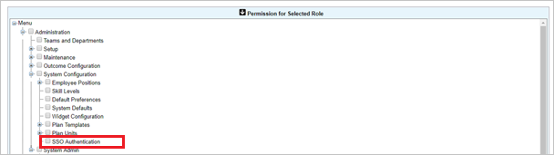
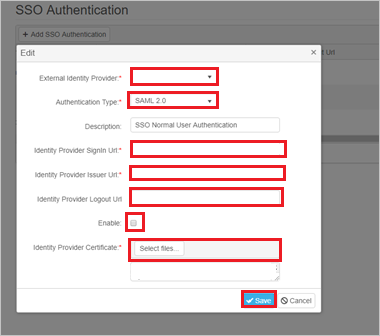
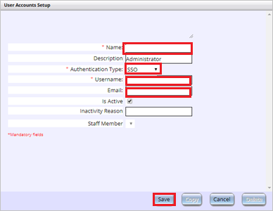

# Configure Workware for Single sign-on with Microsoft Entra ID

In this article,  you learn how to integrate Workware with Microsoft Entra ID. When you integrate Workware with Microsoft Entra ID, you can:

* Control in Microsoft Entra ID who has access to Workware.
* Enable your users to be automatically signed-in to Workware with their Microsoft Entra accounts.
* Manage your accounts in one central location.

## Prerequisites
The scenario outlined in this article assumes that you already have the following prerequisites:

[!INCLUDE [common-prerequisites.md](~/identity/saas-apps/includes/common-prerequisites.md)]
* Workware single sign-on (SSO) enabled subscription.

## Scenario description

In this article,  you configure and test Microsoft Entra SSO in a test environment.

* Workware supports **IDP** initiated SSO.

## Add Workware from the gallery

To configure the integration of Workware into Microsoft Entra ID, you need to add Workware from the gallery to your list of managed SaaS apps.

1. Sign in to the [Microsoft Entra admin center](https://entra.microsoft.com) as at least a [Cloud Application Administrator](~/identity/role-based-access-control/permissions-reference.md#cloud-application-administrator).
1. Browse to **Entra ID** > **Enterprise apps** > **New application**.
1. In the **Add from the gallery** section, type **Workware** in the search box.
1. Select **Workware** from results panel and then add the app. Wait a few seconds while the app is added to your tenant.

 Alternatively, you can also use the [Enterprise App Configuration Wizard](https://portal.office.com/AdminPortal/home?Q=Docs#/azureadappintegration). In this wizard, you can add an application to your tenant, add users/groups to the app, assign roles, and walk through the SSO configuration as well. [Learn more about Microsoft 365 wizards.](/microsoft-365/admin/misc/azure-ad-setup-guides)

## Configure and test Microsoft Entra SSO for Workware

Configure and test Microsoft Entra SSO with Workware using a test user called **B.Simon**. For SSO to work, you need to establish a link relationship between a Microsoft Entra user and the related user in Workware.

To configure and test Microsoft Entra SSO with Workware, perform the following steps:

1. **[Configure Microsoft Entra SSO](#configure-azure-ad-sso)** - to enable your users to use this feature.
    1. **Create a Microsoft Entra test user** - to test Microsoft Entra single sign-on with B.Simon.
    1. **Assign the Microsoft Entra test user** - to enable B.Simon to use Microsoft Entra single sign-on.
1. **[Configure Workware SSO](#configure-workware-sso)** - to configure the single sign-on settings on application side.
    1. **[Create Workware test user](#create-workware-test-user)** - to have a counterpart of B.Simon in Workware that's linked to the Microsoft Entra representation of user.
1. **[Test SSO](#test-sso)** - to verify whether the configuration works.

## Configure Microsoft Entra SSO

Follow these steps to enable Microsoft Entra SSO.

1. Sign in to the [Microsoft Entra admin center](https://entra.microsoft.com) as at least a [Cloud Application Administrator](~/identity/role-based-access-control/permissions-reference.md#cloud-application-administrator).
1. Browse to **Entra ID** > **Enterprise apps** > **Workware** > **Single sign-on**.
1. On the **Select a single sign-on method** page, select **SAML**.
1. On the **Set up single sign-on with SAML** page, select the pencil icon for **Basic SAML Configuration** to edit the settings.

   

1. On the **Basic SAML Configuration** section, perform the following steps:

    a. In the **Identifier** text box, type a value using the following pattern:
    `<WORKWARE_URL>/WW/AuthServices`

    b. In the **Reply URL** text box, type a value using the following pattern:
    `<WORKWARE_URL>/WW/AuthServices/Acs`

	> [!NOTE]
	> These values aren't real. Update these values with the actual Identifier and Reply URL. Contact [Workware Client support team](mailto:support@activeops.com) to get these values. You can also refer to the patterns shown in the **Basic SAML Configuration** section.

1. On the **Set up single sign-on with SAML** page, in the **SAML Signing Certificate** section,  find **Federation Metadata XML** and select **Download** to download the certificate and save it on your computer.

	

1. On the **Set up Workware** section, copy the appropriate URL(s) based on your requirement.

	

[!INCLUDE [create-assign-users-sso.md](~/identity/saas-apps/includes/create-assign-users-sso.md)]

## Configure Workware SSO

To use the SSO feature in Workware, the following setup needs to be completed:

#### Enable SSO permissions for Workware system administrators

* To allow Workware system administrators to set up SSO authentication, the SSO Authentication permission (in the **Administration > System configuration permissions category in the System Settings > Permissions to Role** screen) needs to be enabled for Workware system administrators.

    

#### Set up SSO Authentication in Workware

1. Go to the **System Settings** page and select **SSO Authentication**.

1. In the **SSO Authentication** section, select the **Add SSO Authentication** button and perform the following steps: 

    

    1. In the **External Identity Provider**, provide the name of the IDP.
    1. Select **SAML2.0** as **Authentication Type**.
    1. In the **Identity Provider SignIn URL** textbox, enter the **Login URL** value, which you copied previously.
    1. In the **Identity Provider Issuer URL** textbox, enter the **Microsoft Entra Identifier** value, which you copied previously.
    1. In the **Identity Provider Logout URL** textbox, enter the **Logout URL** value, which you copied previously.
    1. Select **Enable**.
    1. Upload the downloaded **Certificate** into the **Identity Provider Certificate**.
    1. Select **Save**.

### Create Workware test user

1. Sign into the Workware website as an administrator.

1. Select **Admin > Create / View > User Accounts > Add New**.

1. Perform the following steps in the following page.

    

    a. Give a valid name in the **Name** field.

    b. Select **Authentication Type** as **SSO**.

    c. Enter the required fields and select **Save**.

## Test SSO 

In this section, you test your Microsoft Entra single sign-on configuration with following options.

* Select **Test this application**, and you should be automatically signed in to the Workware for which you set up the SSO.

* You can use Microsoft My Apps. When you select the Workware tile in the My Apps, you should be automatically signed in to the Workware for which you set up the SSO. For more information, see [Microsoft Entra My Apps](/azure/active-directory/manage-apps/end-user-experiences#azure-ad-my-apps).

## Related content

Once you configure Workware you can enforce session control, which protects exfiltration and infiltration of your organization’s sensitive data in real time. Session control extends from Conditional Access. [Learn how to enforce session control with Microsoft Defender for Cloud Apps](/cloud-app-security/proxy-deployment-any-app).
