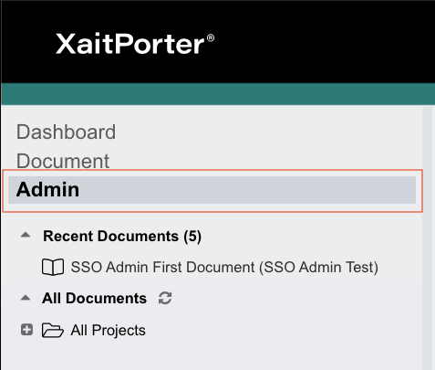
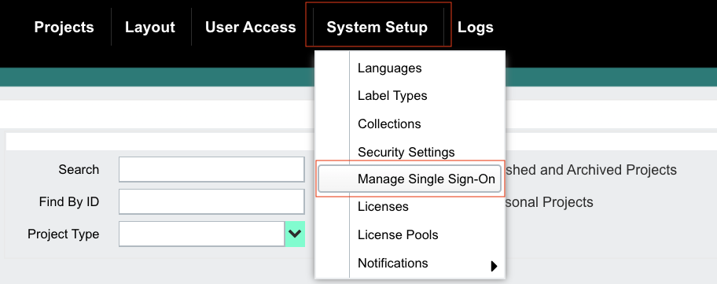
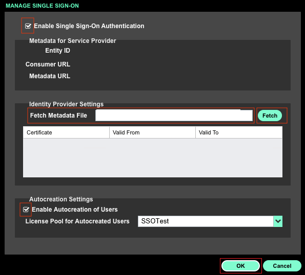

# Configure XaitPorter for Single sign-on with Microsoft Entra ID

In this article,  you learn how to integrate XaitPorter with Microsoft Entra ID. When you integrate XaitPorter with Microsoft Entra ID, you can:

* Control in Microsoft Entra ID who has access to XaitPorter.
* Enable your users to be automatically signed-in to XaitPorter with their Microsoft Entra accounts.
* Manage your accounts in one central location.

## Prerequisites
The scenario outlined in this article assumes that you already have the following prerequisites:

[!INCLUDE [common-prerequisites.md](~/identity/saas-apps/includes/common-prerequisites.md)]
* XaitPorter single sign-on enabled subscription.

## Scenario description

In this article,  you configure and test Microsoft Entra single sign-on in a test environment.

* XaitPorter supports **SP** initiated SSO.

## Add XaitPorter from the gallery

To configure the integration of XaitPorter into Microsoft Entra ID, you need to add XaitPorter from the gallery to your list of managed SaaS apps.

1. Sign in to the [Microsoft Entra admin center](https://entra.microsoft.com) as at least a [Cloud Application Administrator](~/identity/role-based-access-control/permissions-reference.md#cloud-application-administrator).
1. Browse to **Entra ID** > **Enterprise apps** > **New application**.
1. In the **Add from the gallery** section, type **XaitPorter** in the search box.
1. Select **XaitPorter** from results panel and then add the app. Wait a few seconds while the app is added to your tenant.

 Alternatively, you can also use the [Enterprise App Configuration Wizard](https://portal.office.com/AdminPortal/home?Q=Docs#/azureadappintegration). In this wizard, you can add an application to your tenant, add users/groups to the app, assign roles, and walk through the SSO configuration as well. [Learn more about Microsoft 365 wizards.](/microsoft-365/admin/misc/azure-ad-setup-guides)

## Configure and test Microsoft Entra SSO for XaitPorter

Configure and test Microsoft Entra SSO with XaitPorter using a test user called **B.Simon**. For SSO to work, you need to establish a link relationship between a Microsoft Entra user and the related user in XaitPorter.

To configure and test Microsoft Entra SSO with XaitPorter, perform the following steps:

1. **[Configure Microsoft Entra SSO](#configure-azure-ad-sso)** - to enable your users to use this feature.
    1. **Create a Microsoft Entra test user** - to test Microsoft Entra single sign-on with B.Simon.
    1. **Assign the Microsoft Entra test user** - to enable B.Simon to use Microsoft Entra single sign-on.
1. **[Configure XaitPorter SSO](#configure-xaitporter-sso)** - to configure the single sign-on settings on application side.
    1. **[Create XaitPorter test user](#create-xaitporter-test-user)** - to have a counterpart of B.Simon in XaitPorter that's linked to the Microsoft Entra representation of user.
1. **[Test SSO](#test-sso)** - to verify whether the configuration works.

## Configure Microsoft Entra SSO

Follow these steps to enable Microsoft Entra SSO.

1. Sign in to the [Microsoft Entra admin center](https://entra.microsoft.com) as at least a [Cloud Application Administrator](~/identity/role-based-access-control/permissions-reference.md#cloud-application-administrator).
1. Browse to **Entra ID** > **Enterprise apps** > **XaitPorter** > **Single sign-on**.
1. On the **Select a single sign-on method** page, select **SAML**.
1. On the **Set up single sign-on with SAML** page, select the pencil icon for **Basic SAML Configuration** to edit the settings.

   

1. On the **Basic SAML Configuration** section, perform the following steps:

	a. In the **Identifier (Entity ID)** text box, type a URL using the following pattern:
    `https://<SUBDOMAIN>.xaitporter.com`

	b. In the **Sign on URL** text box, type a URL using the following pattern:
    `https://<SUBDOMAIN>.xaitporter.com/saml/login`

	> [!NOTE]
	> These values aren't real. Update these values with the actual identifier and Sign on URL. Contact [XaitPorter Client support team](https://www.xait.com/support/) to get these values. You can also refer to the patterns shown in the **Basic SAML Configuration** section.

1. On the **Set up Single Sign-On with SAML** page, In the **SAML Signing Certificate** section, select copy button to copy **App Federation Metadata Url** and save it on your computer.

	

1. Provide the **IP address** or the **App Federation Metadata Url** to the [SmartRecruiters support team](https://www.smartrecruiters.com/about-us/contact-us/), so that XaitPorter can ensure that IP address is reachable from your XaitPorter instance configuring approved list at their side. 

[!INCLUDE [create-assign-users-sso.md](~/identity/saas-apps/includes/create-assign-users-sso.md)]

## Configure XaitPorter SSO

1. In a different web browser window, sign in to your XaitPorter company site as an administrator

4. Select **Admin**.

	

5. Select **Manage Single Sign-On** from the **System Setup** dropdown list.

	

6. In the **MANAGE SINGLE SIGN-ON** section, perform the following steps:

	

	a. Select **Enable Single Sign-On Authentication**.

	b. In **Identity Provider Settings** textbox, paste **App Federation Metadata Url** which you have copied and select **Fetch**.

	c. Select **Enable Autocreation of Users**.

	d. Select **OK**.

### Create XaitPorter test user

In this section, you create a user called Britta Simon in XaitPorter. Work with [XaitPorter Client support team](https://www.xait.com/support/) to add the users in the XaitPorter platform. Users must be created and activated before you use single sign-on.

## Test SSO

In this section, you test your Microsoft Entra single sign-on configuration with following options. 

* Select **Test this application**, this option redirects to XaitPorter Sign-on URL where you can initiate the login flow. 

* Go to XaitPorter Sign-on URL directly and initiate the login flow from there.

* You can use Microsoft My Apps. When you select the XaitPorter tile in the My Apps, this option redirects to XaitPorter Sign-on URL. For more information about the My Apps, see [Introduction to the My Apps](https://support.microsoft.com/account-billing/sign-in-and-start-apps-from-the-my-apps-portal-2f3b1bae-0e5a-4a86-a33e-876fbd2a4510).

## Related content

Once you configure XaitPorter you can enforce session control, which protects exfiltration and infiltration of your organization’s sensitive data in real time. Session control extends from Conditional Access. [Learn how to enforce session control with Microsoft Defender for Cloud Apps](/cloud-app-security/proxy-deployment-aad).
