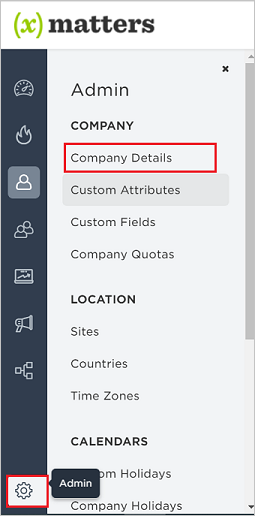
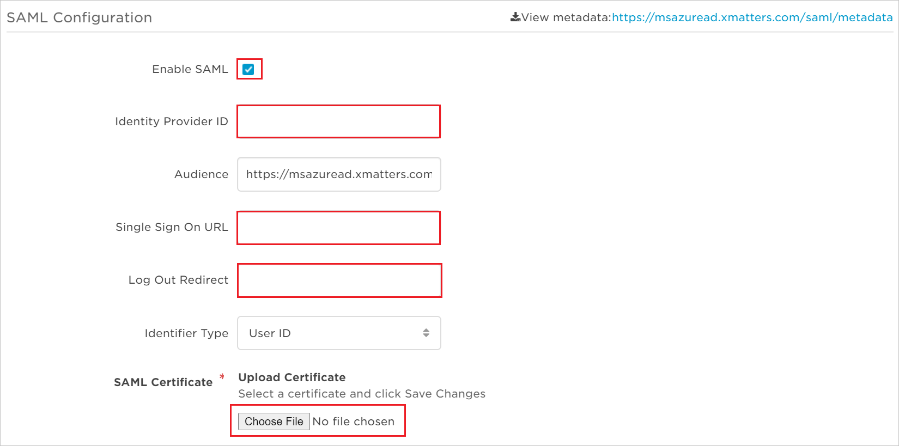
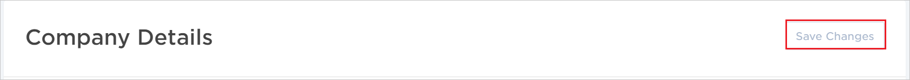
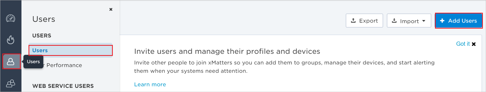
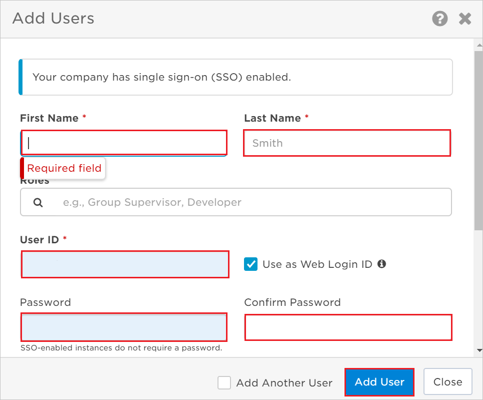

# Configure xMatters OnDemand for Single sign-on with Microsoft Entra ID

In this article,  you learn how to integrate xMatters OnDemand with Microsoft Entra ID. When you integrate xMatters OnDemand with Microsoft Entra ID, you can:

* Control in Microsoft Entra ID who has access to xMatters OnDemand.
* Enable your users to be automatically signed-in to xMatters OnDemand with their Microsoft Entra accounts.
* Manage your accounts in one central location.

## Prerequisites
The scenario outlined in this article assumes that you already have the following prerequisites:

[!INCLUDE [common-prerequisites.md](~/identity/saas-apps/includes/common-prerequisites.md)]
* xMatters OnDemand single sign-on enabled subscription.

## Scenario description

In this article,  you configure and test Microsoft Entra single sign-on in a test environment.

* xMatters OnDemand supports **IDP** initiated SSO.

## Add xMatters OnDemand from the gallery

To configure the integration of xMatters OnDemand into Microsoft Entra ID, you need to add xMatters OnDemand from the gallery to your list of managed SaaS apps.

1. Sign in to the [Microsoft Entra admin center](https://entra.microsoft.com) as at least a [Cloud Application Administrator](~/identity/role-based-access-control/permissions-reference.md#cloud-application-administrator).
1. Browse to **Entra ID** > **Enterprise apps** > **New application**.
1. In the **Add from the gallery** section, type **xMatters OnDemand** in the search box.
1. Select **xMatters OnDemand** from results panel and then add the app. Wait a few seconds while the app is added to your tenant.

 Alternatively, you can also use the [Enterprise App Configuration Wizard](https://portal.office.com/AdminPortal/home?Q=Docs#/azureadappintegration). In this wizard, you can add an application to your tenant, add users/groups to the app, assign roles, and walk through the SSO configuration as well. [Learn more about Microsoft 365 wizards.](/microsoft-365/admin/misc/azure-ad-setup-guides)

## Configure and test Microsoft Entra SSO for xMatters OnDemand

Configure and test Microsoft Entra SSO with xMatters OnDemand using a test user called **B.Simon**. For SSO to work, you need to establish a link relationship between a Microsoft Entra user and the related user in xMatters OnDemand.

To configure and test Microsoft Entra SSO with xMatters OnDemand, perform the following steps:

1. **[Configure Microsoft Entra SSO](#configure-azure-ad-sso)** - to enable your users to use this feature.
	1. **Create a Microsoft Entra test user** - to test Microsoft Entra single sign-on with Britta Simon.
	2. **Assign the Microsoft Entra test user** - to enable Britta Simon to use Microsoft Entra single sign-on.
2. **[Configure xMatters OnDemand SSO](#configure-xmatters-ondemand-sso)** - to configure the Single Sign-On settings on application side.
	1. **[Create xMatters OnDemand test user](#create-xmatters-ondemand-test-user)** - to have a counterpart of Britta Simon in xMatters OnDemand that's linked to the Microsoft Entra representation of user.
3. **[Test SSO](#test-sso)** - to verify whether the configuration works.

## Configure Microsoft Entra SSO

Follow these steps to enable Microsoft Entra SSO.

1. Sign in to the [Microsoft Entra admin center](https://entra.microsoft.com) as at least a [Cloud Application Administrator](~/identity/role-based-access-control/permissions-reference.md#cloud-application-administrator).
1. Browse to **Entra ID** > **Enterprise apps** > **xMatters OnDemand** > **Single sign-on**.
1. On the **Select a single sign-on method** page, select **SAML**.
1. On the **Set up single sign-on with SAML** page, select the pencil icon for **Basic SAML Configuration** to edit the settings.

   

1. On the **Basic SAML Configuration** section, perform the following steps:

    a. In the **Identifier** text box, type a URL using one of the following patterns:

	| Identifier |
	| ---------- |
	| `https://<COMPANY_NAME>.au1.xmatters.com.au/` |
	| `https://<COMPANY_NAME>.cs1.xmatters.com/` |
	| `https://<COMPANY_NAME>.xmatters.com/` |
	| `https://www.xmatters.com` |
	| `https://<COMPANY_NAME>.xmatters.com.au/` |

    b. In the **Reply URL** text box, type a URL using one of the following patterns:

	| Reply URL |
	| ---------- |
	| `https://<COMPANY_NAME>.au1.xmatters.com.au` |
	| `https://<COMPANY_NAME>.xmatters.com/sp/<INSTANCE_NAME>` |
	| `https://<COMPANY_NAME>.cs1.xmatters.com/sp/<INSTANCE_NAME>` |
	| `https://<COMPANY_NAME>.au1.xmatters.com.au/<INSTANCE_NAME>` |

	> [!NOTE]
	> These values aren't real. Update these values with the actual Identifier and Reply URL. Contact [xMatters OnDemand Client support team](https://www.xmatters.com/company/contact-us/) to get these values. You can also refer to the patterns shown in the **Basic SAML Configuration** section.

1. On the **Set up Single Sign-On with SAML** page, in the **SAML Signing Certificate** section, select **Download** to download the **Certificate (Base64)** from the given options as per your requirement and save it on your computer.

	

	> [!IMPORTANT]
    > You need to forward the certificate to the [xMatters OnDemand support team](https://www.xmatters.com/company/contact-us/). The certificate needs to be uploaded by the xMatters support team before you can finalize the single sign-on configuration.

1. On the **Set up xMatters OnDemand** section, copy the appropriate URL(s) as per your requirement.

	

[!INCLUDE [create-assign-users-sso.md](~/identity/saas-apps/includes/create-assign-users-sso.md)]

## Configure xMatters OnDemand SSO

1. In a different web browser window, sign in to your xMatters OnDemand company site as an administrator.

2. Select **Admin**, and then select **Company Details**.

    

3. On the **SAML Configuration** page, perform the following steps:

    

    a. Select **Enable SAML**.

    b. In the **Identity Provider ID** textbox, paste **Microsoft Entra Identifier** value which you copied previously.

    c. In the **Single Sign On URL** textbox, paste **Login URL** value which you copied previously.

    d. In the **Logout URL Redirect** textbox, paste **Logout URL**, which you copied previously.

	e. Select **Choose File** to upload the **Certificate (Base64)** which you have downloaded. 

    f. On the Company Details page, at the top, select **Save Changes**.

    

### Create xMatters OnDemand test user

1. Sign in to your **xMatters OnDemand** tenant.

2. Go to the **Users Icon** > **Users** and then select **Add Users**.

	

3. In the **Add Users** section, fill the required fields and select **Add User** button.

    

## Test SSO

In this section, you test your Microsoft Entra single sign-on configuration with following options.

* Select **Test this application**, and you should be automatically signed in to the xMatters OnDemand for which you set up the SSO.

* You can use Microsoft My Apps. When you select the xMatters OnDemand tile in the My Apps, you should be automatically signed in to the xMatters OnDemand for which you set up the SSO. For more information about the My Apps, see [Introduction to the My Apps](https://support.microsoft.com/account-billing/sign-in-and-start-apps-from-the-my-apps-portal-2f3b1bae-0e5a-4a86-a33e-876fbd2a4510).

## Related content

Once you configure xMatters OnDemand you can enforce session control, which protects exfiltration and infiltration of your organization’s sensitive data in real time. Session control extends from Conditional Access. [Learn how to enforce session control with Microsoft Defender for Cloud Apps](/cloud-app-security/proxy-deployment-any-app).
