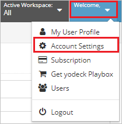
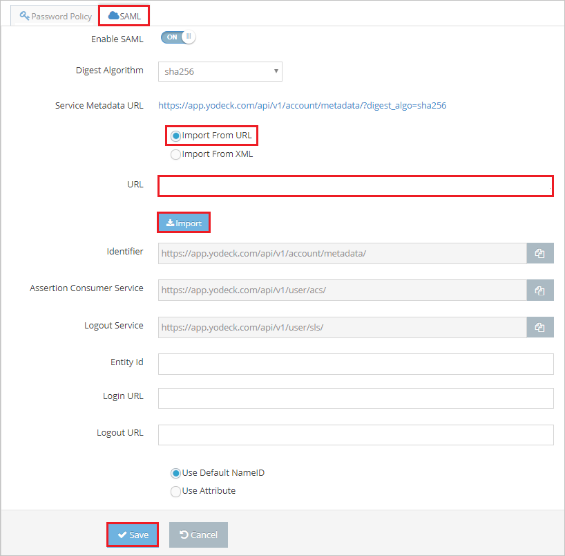
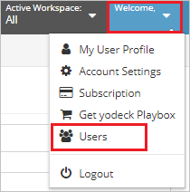
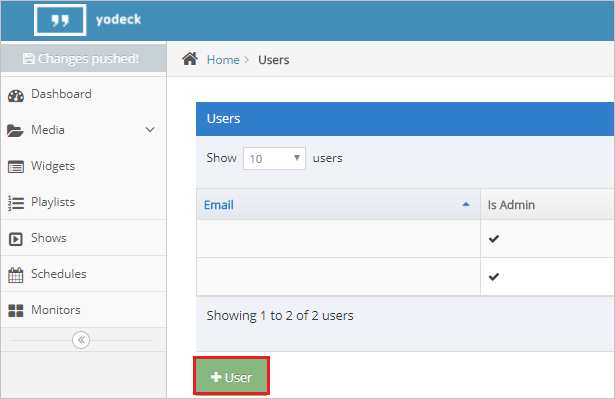
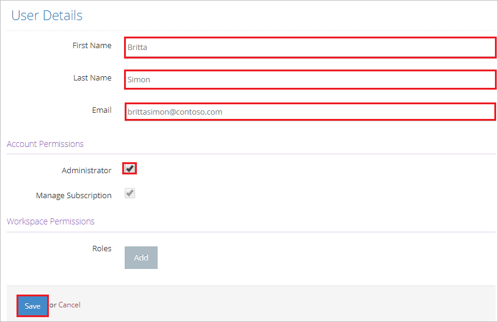

# Configure Yodeck for Single sign-on with Microsoft Entra ID

In this article,  you learn how to integrate Yodeck with Microsoft Entra ID. When you integrate Yodeck with Microsoft Entra ID, you can:

* Control in Microsoft Entra ID who has access to Yodeck.
* Enable your users to be automatically signed-in to Yodeck with their Microsoft Entra accounts.
* Manage your accounts in one central location.

## Prerequisites
The scenario outlined in this article assumes that you already have the following prerequisites:

[!INCLUDE [common-prerequisites.md](~/identity/saas-apps/includes/common-prerequisites.md)]
* Yodeck single sign-on enabled subscription.

## Scenario description

In this article,  you configure and test Microsoft Entra single sign-on in a test environment.

* Yodeck supports **SP** and **IDP** initiated SSO.

> [!NOTE]
> Identifier of this application is a fixed string value so only one instance can be configured in one tenant.

## Add Yodeck from the gallery

To configure the integration of Yodeck into Microsoft Entra ID, you need to add Yodeck from the gallery to your list of managed SaaS apps.

1. Sign in to the [Microsoft Entra admin center](https://entra.microsoft.com) as at least a [Cloud Application Administrator](~/identity/role-based-access-control/permissions-reference.md#cloud-application-administrator).
1. Browse to **Entra ID** > **Enterprise apps** > **New application**.
1. In the **Add from the gallery** section, type **Yodeck** in the search box.
1. Select **Yodeck** from results panel and then add the app. Wait a few seconds while the app is added to your tenant.

 Alternatively, you can also use the [Enterprise App Configuration Wizard](https://portal.office.com/AdminPortal/home?Q=Docs#/azureadappintegration). In this wizard, you can add an application to your tenant, add users/groups to the app, assign roles, and walk through the SSO configuration as well. [Learn more about Microsoft 365 wizards.](/microsoft-365/admin/misc/azure-ad-setup-guides)

## Configure and test Microsoft Entra SSO for Yodeck

Configure and test Microsoft Entra SSO with Yodeck using a test user called **B.Simon**. For SSO to work, you need to establish a link relationship between a Microsoft Entra user and the related user in Yodeck.

To configure and test Microsoft Entra SSO with Yodeck, perform the following steps:

1. **[Configure Microsoft Entra SSO](#configure-azure-ad-sso)** - to enable your users to use this feature.
    1. **Create a Microsoft Entra test user** - to test Microsoft Entra single sign-on with B.Simon.
    1. **Assign the Microsoft Entra test user** - to enable B.Simon to use Microsoft Entra single sign-on.
1. **[Configure Yodeck SSO](#configure-yodeck-sso)** - to configure the single sign-on settings on application side.
    1. **[Create Yodeck test user](#create-yodeck-test-user)** - to have a counterpart of B.Simon in Yodeck that's linked to the Microsoft Entra representation of user.
1. **[Test SSO](#test-sso)** - to verify whether the configuration works.

## Configure Microsoft Entra SSO

Follow these steps to enable Microsoft Entra SSO.

1. Sign in to the [Microsoft Entra admin center](https://entra.microsoft.com) as at least a [Cloud Application Administrator](~/identity/role-based-access-control/permissions-reference.md#cloud-application-administrator).
1. Browse to **Entra ID** > **Enterprise apps** > **Yodeck** > **Single sign-on**.
1. On the **Select a single sign-on method** page, select **SAML**.
1. On the **Set up single sign-on with SAML** page, select the pencil icon for **Basic SAML Configuration** to edit the settings.

   

1. On the **Basic SAML Configuration** section, if you wish to configure the application in **IDP** initiated mode, perform the following step:

    In the **Identifier** text box, type the URL:
    `https://app.yodeck.com/api/v1/account/metadata/`

1. On the **Set up Single Sign-On with SAML** page, In the **SAML Signing Certificate** section, select copy button to copy **App Federation Metadata Url** and save it on your computer.

	

1. Your Yodeck application expects the SAML assertions in a specific format, which requires you to add custom attribute mappings to your SAML token attributes configuration. The following screenshot shows an example for this. The default value of **Unique User Identifier** is **user.userprincipalname** but Yodeck expects this to be mapped with the user's email address. For that you can use **user.mail** attribute from the list or use the appropriate attribute value based on your organization configuration.

    

[!INCLUDE [create-assign-users-sso.md](~/identity/saas-apps/includes/create-assign-users-sso.md)]

## Configure Yodeck SSO
1. In a different web browser window, sign in to your Yodeck company site as an administrator.

1. Select **User Settings** option from the top right corner of the page and select **Account Settings**.

	

1. Select **SAML** and perform the following steps:

	

	a. Select **Import from URL**.

	b. In the **URL** textbox, paste the **App Federation Metadata Url** value, which you have copied, and select **Import**.
	
	c. After importing **App Federation Metadata Url**, the remaining fields populate automatically.

	d. Select **Save**.

### Create Yodeck test user

To enable Microsoft Entra users to sign in to Yodeck, they must be provisioned into Yodeck. In the case of Yodeck, provisioning is a manual task.

**To provision a user account, perform the following steps:**

1. Sign in to your Yodeck company site as an administrator.

2. Select **User Settings** option form the top right corner of the page and select **Users**.

	

3. Select **+User** to open the **User Details** tab.

	

4. On the **User Details** dialog page, perform the following steps:

	

	a. In the **First Name** textbox, type the first name of the user like **Britta**.

	b. In the **Last Name** textbox, type the last name of user like **Simon**.

	c. In the **Email** textbox, type the email address of user like brittasimon@contoso.com.

	d. Select appropriate **Account Permissions** option as per your organizational requirement.
	
	e. Select **Save**.

## Test SSO

In this section, you test your Microsoft Entra single sign-on configuration with following options. 

#### SP initiated:

* Select **Test this application**, this option redirects to Yodeck Sign on URL where you can initiate the login flow.  

* Go to Yodeck Sign-on URL directly and initiate the login flow from there.

#### IDP initiated:

* Select **Test this application**, and you should be automatically signed in to the Yodeck for which you set up the SSO. 

You can also use Microsoft My Apps to test the application in any mode. When you select the Yodeck tile in the My Apps, if configured in SP mode you would be redirected to the application sign-on page for initiating the login flow and if configured in IDP mode, you should be automatically signed in to the Yodeck for which you set up the SSO. For more information about the My Apps, see [Introduction to the My Apps](https://support.microsoft.com/account-billing/sign-in-and-start-apps-from-the-my-apps-portal-2f3b1bae-0e5a-4a86-a33e-876fbd2a4510).

## Related content

Once you configure Yodeck you can enforce session control, which protects exfiltration and infiltration of your organization’s sensitive data in real time. Session control extends from Conditional Access. [Learn how to enforce session control with Microsoft Defender for Cloud Apps](/cloud-app-security/proxy-deployment-aad).
