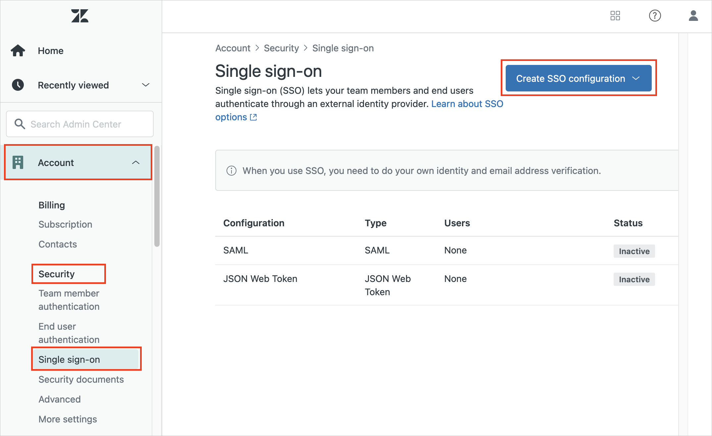
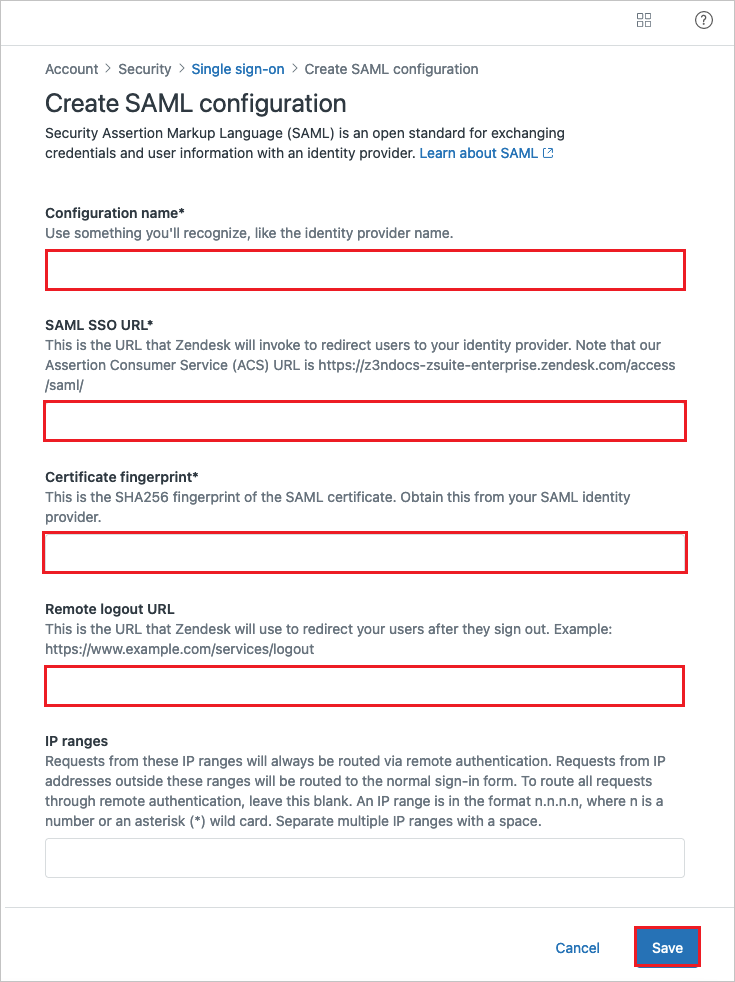

# Configure Zendesk for Single sign-on with Microsoft Entra ID

In this article,  you learn how to integrate Zendesk with Microsoft Entra ID. When you integrate Zendesk with Microsoft Entra ID, you can:

* Control in Microsoft Entra ID who has access to Zendesk.
* Enable your users to be automatically signed-in to Zendesk with their Microsoft Entra accounts.
* Manage your accounts in one central location.

## Prerequisites
The scenario outlined in this article assumes that you already have the following prerequisites:

[!INCLUDE [common-prerequisites.md](~/identity/saas-apps/includes/common-prerequisites.md)]
* Zendesk single sign-on (SSO) enabled subscription.

## Scenario description

In this article,  you configure and test Microsoft Entra SSO in a test environment.

* Zendesk supports **SP** initiated SSO.
* Zendesk supports [**Automated** user provisioning](zendesk-provisioning-tutorial.md).

## Adding Zendesk from the gallery

To configure the integration of Zendesk into Microsoft Entra ID, you need to add Zendesk from the gallery to your list of managed SaaS apps.

1. Sign in to the [Microsoft Entra admin center](https://entra.microsoft.com) as at least a [Cloud Application Administrator](~/identity/role-based-access-control/permissions-reference.md#cloud-application-administrator).
1. Browse to **Entra ID** > **Enterprise apps** > **New application**.
1. In the **Add from the gallery** section, type **Zendesk** in the search box.
1. Select **Zendesk** from results panel and then add the app. Wait a few seconds while the app is added to your tenant.

 Alternatively, you can also use the [Enterprise App Configuration Wizard](https://portal.office.com/AdminPortal/home?Q=Docs#/azureadappintegration). In this wizard, you can add an application to your tenant, add users/groups to the app, assign roles, and walk through the SSO configuration as well. [Learn more about Microsoft 365 wizards.](/microsoft-365/admin/misc/azure-ad-setup-guides)

## Configure and test Microsoft Entra SSO for Zendesk

Configure and test Microsoft Entra SSO with Zendesk using a test user called **B.Simon**. For SSO to work, you need to establish a link relationship between a Microsoft Entra user and the related user in Zendesk.

To configure and test Microsoft Entra SSO with Zendesk, perform the following steps:

1. **[Configure Microsoft Entra SSO](#configure-azure-ad-sso)** - to enable your users to use this feature.
    1. **Create a Microsoft Entra test user** - to test Microsoft Entra single sign-on with B.Simon.
    1. **Assign the Microsoft Entra test user** - to enable B.Simon to use Microsoft Entra single sign-on.
1. **[Configure Zendesk SSO](#configure-zendesk-sso)** - to configure the single sign-on settings on application side.
    1. **[Create Zendesk test user](#create-zendesk-test-user)** - to have a counterpart of B.Simon in Zendesk that's linked to the Microsoft Entra representation of user.
1. **[Test SSO](#test-sso)** - to verify whether the configuration works.

## Configure Microsoft Entra SSO

Follow these steps to enable Microsoft Entra SSO.

1. Sign in to the [Microsoft Entra admin center](https://entra.microsoft.com) as at least a [Cloud Application Administrator](~/identity/role-based-access-control/permissions-reference.md#cloud-application-administrator).
1. Browse to **Entra ID** > **Enterprise apps** > **Zendesk** > **Single sign-on**.
1. On the **Select a single sign-on method** page, select **SAML**.
1. On the **Set up single sign-on with SAML** page, select the pencil icon for **Basic SAML Configuration** to edit the settings.

   

1. On the **Basic SAML Configuration** section, perform the following steps:

	a. In the **Sign on URL** text box, type a URL using the following pattern:
    `https://<subdomain>.zendesk.com`

    b. In the **Identifier (Entity ID)** text box, type a URL using the following pattern:
    `https://<subdomain>.zendesk.com`

    c. In the **Reply URL** text box, type a URL using the following pattern: `https://<subdomain>.zendesk.com/access/saml`

	> [!NOTE]
	> These values aren't real. Update these values with the actual Sign on URL, Identifier and Reply URL. Contact [Zendesk Client support team](https://support.zendesk.com/hc/en-us/articles/203663676-Using-SAML-for-single-sign-on-Professional-and-Enterprise) to get these values. You can also refer to the patterns shown in the **Basic SAML Configuration** section.

1. Zendesk application expects the SAML assertions in a specific format. There are no mandatory SAML attributes but optionally you can manage from the **User Attributes** section on application integration page. On the **Set up Single Sign-On with SAML** page, select **Edit** button to open **User Attributes** dialog.

	

    > [!NOTE]
    > You use extension attributes to add attributes that aren't in Microsoft Entra ID by default. Select [User attributes that can be set in SAML](https://support.zendesk.com/hc/articles/203663676-Using-SAML-for-single-sign-on-Professional-and-Enterprise-) to get the complete list of SAML attributes that **Zendesk** accepts.

1. In the **SAML Signing Certificate** section, select **Edit** button to open **SAML Signing Certificate** dialog.

	

1. In the **SAML Signing Certificate** section, copy the **Thumbprint Value** and save it on your computer.

    

1. On the **Set up Zendesk** section, copy the appropriate URL(s) based on your requirement.

	

[!INCLUDE [create-assign-users-sso.md](~/identity/saas-apps/includes/create-assign-users-sso.md)]

## Configure Zendesk SSO

You can set up one SAML configuration for team members and a second SAML configuration for end users.
1. In a different web browser window, sign in to your up Zendesk company site as an administrator

1. In the **Zendesk Admin Center**, go to **Account -> Security -> Single sign-on**, then select **Create SSO configuration** and select **SAML**.

	

1. Perform the following steps in the **Single sign-on** page.

	

    a. In **Configuration name**, enter a name for your configuration. Up to two SAML and two JWT configurations are possible.

    b. In **SAML SSO URL** textbox, paste the value of **Login URL**.

    c. In **Certificate fingerprint** textbox, paste the **Thumbprint** value of certificate.

    d. In **Remote logout URL** textbox, paste the value of **Logout URL**.

    e. Select **Save**.

After creating your SAML configuration, you must activate it by assigning it to end users or team members.

1. In the **Zendesk Admin Center**, go to **Account -> Security** and select either **Team member authentication** or **End user authentication**.

1. If you're assigning the configuration to team members, select **External authentication** to show the authentication options. These options are already displayed for end users.

1. Select the **Single sign-on (SSO)** option in the **External authentication** section, then select the name of the SSO configuration you want to use.

1. Select the primary SSO method for this group of users if you have more than one authentication method assigned to the group. This option sets the default method used when users go to a page that requires authentication.

1. Select **Save**.

### Create Zendesk test user

The objective of this section is to create a user called Britta Simon in Zendesk. Zendesk supports automatic user provisioning, which is by default enabled. You can find more details [here](Zendesk-provisioning-tutorial.md) on how to configure automatic user provisioning.

## Test SSO 

In this section, you test your Microsoft Entra single sign-on configuration with following options. 

* Select **Test this application**, this option redirects to Zendesk Sign-on URL where you can initiate the login flow. 

* Go to Zendesk Sign-on URL directly and initiate the login flow from there.

* You can use Microsoft My Apps. When you select the Zendesk tile in the My Apps, this option redirects to Zendesk Sign-on URL. For more information about the My Apps, see [Introduction to the My Apps](https://support.microsoft.com/account-billing/sign-in-and-start-apps-from-the-my-apps-portal-2f3b1bae-0e5a-4a86-a33e-876fbd2a4510).

## Related content

Once you configure Zendesk you can enforce session control, which protects exfiltration and infiltration of your organization’s sensitive data in real time. Session control extends from Conditional Access. [Learn how to enforce session control with Microsoft Defender for Cloud Apps](/cloud-app-security/proxy-deployment-any-app).
