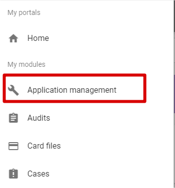
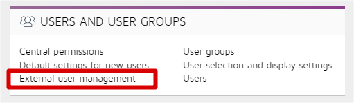
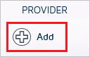
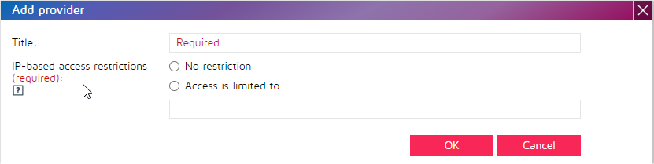
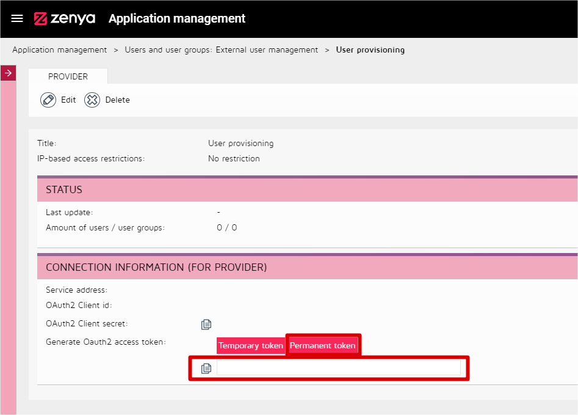

# Configure Zenya for automatic user provisioning with Microsoft Entra ID

The objective of this article is to demonstrate the steps to be performed in Zenya and Microsoft Entra ID to configure Microsoft Entra ID to automatically provision and deprovision users and/or groups to [Zenya](https://www.infoland.nl/). For important details on what this service does, how it works, and frequently asked questions, see [Automate user provisioning and deprovisioning to SaaS applications with Microsoft Entra ID](~/identity/app-provisioning/user-provisioning.md). Before you attempt to use this article,  be sure that you know and meet all requirements. If you have questions, contact Infoland.

## Capabilities supported
> * Create users in Zenya
> * Remove/disable users in Zenya when they don't require access anymore
> * Keep user attributes synchronized between Microsoft Entra ID and Zenya
> * Provision groups and group memberships in Zenya
> * [Single sign-on](./zenya-tutorial.md) to Zenya (recommended)

## Prerequisites

The scenario outlined in this article assumes that you already have the following prerequisites:

* [A Microsoft Entra tenant](~/identity-platform/quickstart-create-new-tenant.md).
* One of the following roles: [Application Administrator](/entra/identity/role-based-access-control/permissions-reference#application-administrator), [Cloud Application Administrator](/entra/identity/role-based-access-control/permissions-reference#cloud-application-administrator), or [Application Owner](/entra/fundamentals/users-default-permissions#owned-enterprise-applications).
* [A Zenya tenant](https://www.infoland.nl/).
* A user account in Zenya with admin permissions.

## Step 1: Plan your provisioning deployment
1. Learn about [how the provisioning service works](~/identity/app-provisioning/user-provisioning.md).
2. Determine who's in [scope for provisioning](~/identity/app-provisioning/define-conditional-rules-for-provisioning-user-accounts.md).
3. Determine what data to [map between Microsoft Entra ID and Zenya](~/identity/app-provisioning/customize-application-attributes.md). 

## Step 2: Configure Zenya to support provisioning with Microsoft Entra ID

1. Sign in to your [Zenya Admin Console](https://www.infoland.nl/). Navigate to **Go to > Application Management**.

	

2.	Select **External user management**.

	

3. To add a new provider, select the **plus** icon. In the new **Add provider** dialog box, provide a **Title**. You can choose to add **IP-based access restriction**. Select **OK**.

	

	

4.	Select the **Permanent token** button. Copy the **Permanent token** and save it. You won't be able to view it later. This value is entered in the Secret Token field in the Provisioning tab of your Zenya application.

	

## Step 3: Add Zenya from the Microsoft Entra application gallery

Add Zenya from the Microsoft Entra application gallery to start managing provisioning to Zenya. If you have previously setup Zenya for SSO, you can use the same application. However it's recommended that you create a separate app when testing out the integration initially. Learn more about adding an application from the gallery [here](~/identity/enterprise-apps/add-application-portal.md). 

## Step 4: Define who is in scope for provisioning 

[!INCLUDE [create-assign-users-provisioning.md](~/identity/saas-apps/includes/create-assign-users-provisioning.md)]

## Step 5: Configure automatic user provisioning to Zenya 

This section guides you through the steps to configure the Microsoft Entra provisioning service to create, update, and disable users and/or groups in Zenya based on user and/or group assignments in Microsoft Entra ID.

For more information (in Dutch) also read: [`Implementatie SCIM koppeling`](https://webshare.iprova.nl/8my7yg8c1ofsmdj9/Document.aspx)

### To configure automatic user provisioning for Zenya in Microsoft Entra ID:

1. Sign in to the [Microsoft Entra admin center](https://entra.microsoft.com) as at least a [Cloud Application Administrator](~/identity/role-based-access-control/permissions-reference.md#cloud-application-administrator).
1. Browse to **Entra ID** > **Enterprise apps**

	

1. In the applications list, select **Zenya**.

	

1. Select the **Provisioning** tab.

	

1. Set the **Provisioning Mode** to **Automatic**.

	

1. In the **Admin Credentials** section, input the **SCIM 2.0 base URL and Permanent Token** values retrieved earlier in the **Tenant URL** and add /scim/ to it. Also add the  **Secret Token**. You can generate a secret token in Zenya by using the **permanent token** button. Select **Test Connection** to ensure Microsoft Entra ID can connect to Zenya. If the connection fails, ensure your Zenya account has Admin permissions and try again. 

	

1. In the **Notification Email** field, enter the email address of a person or group who should receive the provisioning error notifications and check the checkbox - **Send an email notification when a failure occurs**.

	

1. Select **Save**.

1. Under the **Mappings** section, select **Synchronize Microsoft Entra users to Zenya**.

1. Review the user attributes that are synchronized from Microsoft Entra ID to Zenya in the **Attribute Mapping** section. The attributes selected as **Matching** properties are used to match the user accounts in Zenya for update operations. Select the **Save** button to commit any changes.

   |Attribute|Type|
   |---|---|
   |active|Boolean|
   |displayName|String|
   |emails[type eq "work"].value|String|
   |preferredLanguage|String|
   |userName|String|
   |phoneNumbers[type eq "work"].value|String|
   |externalId|String|
   |urn:ietf:params:scim:schemas:extension:enterprise:2.0:User:department|String|
   |title|String|
   |urn:ietf:params:scim:schemas:extension:enterprise:2.0:User:manager|String|

1. Under the **Mappings** section, select **Synchronize Microsoft Entra groups to Zenya**.

1. Review the group attributes that are synchronized from Microsoft Entra ID to Zenya in the **Attribute Mapping** section. The attributes selected as **Matching** properties are used to match the groups in Zenya for update operations. Select the **Save** button to commit any changes.

      |Attribute|Type|
      |---|---|
      |displayName|String|
      |members|Reference|
      |externalID|String|

1. To configure scoping filters, refer to the following instructions provided in the [Scoping filter  article](~/identity/app-provisioning/define-conditional-rules-for-provisioning-user-accounts.md).

1. To enable the Microsoft Entra provisioning service for Zenya, change the **Provisioning Status** to **On** in the **Settings** section.

	

1. Define the users and/or groups that you would like to provision to Zenya by choosing the desired values in **Scope** in the **Settings** section. You need a P1 or P2 license in order to allow provisioning assigned users and groups. 

	

1. When you're ready to provision, select **Save**.

	

This operation starts the initial synchronization of all users and/or groups defined in **Scope** in the **Settings** section. The initial sync takes longer to perform than subsequent syncs, which occur approximately every 40 minutes as long as the Microsoft Entra provisioning service is running. 

## Step 6: Monitor your deployment

[!INCLUDE [monitor-deployment.md](~/identity/saas-apps/includes/monitor-deployment.md)]

## Change log

* 06/17/2020 - Removed support for enterprise extension attribute **urn:ietf:params:scim:schemas:extension:enterprise:2.0:User:manager**.
* 10/11/2023 - Added support for core attribute **title** and added support for enterprise extension attributes **urn:ietf:params:scim:schemas:extension:enterprise:2.0:User:department** and **urn:ietf:params:scim:schemas:extension:enterprise:2.0:User:manager**.

## More resources

* [Managing user account provisioning for Enterprise Apps](~/identity/app-provisioning/configure-automatic-user-provisioning-portal.md)
* [What is application access and single sign-on with Microsoft Entra ID?](~/identity/enterprise-apps/what-is-single-sign-on.md)
* [`Implementatie SCIM koppeling`](https://webshare.iprova.nl/8my7yg8c1ofsmdj9/Document.aspx)

## Related content

* [Learn how to review logs and get reports on provisioning activity](~/identity/app-provisioning/check-status-user-account-provisioning.md)