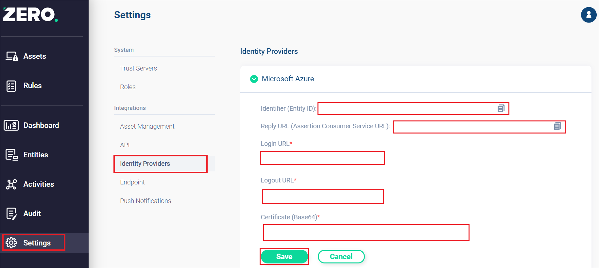

# Configure Zero Networks for Single sign-on with Microsoft Entra ID

In this article,  you learn how to integrate Zero Networks with Microsoft Entra ID. When you integrate Zero Networks with Microsoft Entra ID, you can:

* Control in Microsoft Entra ID who has access to Zero Networks.
* Enable your users to be automatically signed-in to Zero Networks with their Microsoft Entra accounts.
* Manage your accounts in one central location.

## Prerequisites
The scenario outlined in this article assumes that you already have the following prerequisites:

[!INCLUDE [common-prerequisites.md](~/identity/saas-apps/includes/common-prerequisites.md)]
* Zero Networks single sign-on (SSO) enabled subscription.

## Scenario description

In this article,  you configure Microsoft Entra SSO for the Zero Networks Admin Portal and Access Portal.

* Zero Networks supports **SP** and **IDP** initiated SSO.

> [!NOTE]
> Identifier of this application is a fixed string value so only one instance can be configured in one tenant.

## Add Zero Networks from the gallery

To configure the integration of Zero Networks into Microsoft Entra ID, you need to add Zero Networks from the gallery to your list of managed SaaS apps.

1. Sign in to the [Microsoft Entra admin center](https://entra.microsoft.com) as at least a [Cloud Application Administrator](~/identity/role-based-access-control/permissions-reference.md#cloud-application-administrator).
1. Browse to **Entra ID** > **Enterprise apps** > **New application**.
1. In the **Add from the gallery** section, type **Zero Networks** in the search box.
1. Select **Zero Networks** from results panel and select **Create** to add the app. Wait a few seconds while the app is added to your tenant.

 Alternatively, you can also use the [Enterprise App Configuration Wizard](https://portal.office.com/AdminPortal/home?Q=Docs#/azureadappintegration). In this wizard, you can add an application to your tenant, add users/groups to the app, assign roles, and walk through the SSO configuration as well. [Learn more about Microsoft 365 wizards.](/microsoft-365/admin/misc/azure-ad-setup-guides)

## Configure Microsoft Entra SSO

Follow these steps to enable Microsoft Entra SSO.

1. Sign in to the [Microsoft Entra admin center](https://entra.microsoft.com) as at least a [Cloud Application Administrator](~/identity/role-based-access-control/permissions-reference.md#cloud-application-administrator).
1. Browse to **Entra ID** > **Enterprise apps** > **Zero Networks**.
1. select **Single sign-on**.
1. On the **Select a single sign-on method** page, select **SAML**.
1. On the **Set up single sign-on with SAML** page, select the pencil icon for **Basic SAML Configuration** to edit the settings.

   

1. On the **Basic SAML Configuration** section, perform the following step.

	a. In the **Identifier (Entity ID)** text box, type the URL:
    `https://<customerUrl>.zeronetworks.com/api/v1/sso/azure/metadata`
     
	b. In the **Reply URL (Assertion Consumer Service URL)** text box, type the URL:
    `https://<customerUrl>.zeronetworks.com/api/v1/sso/azure/acs`
	
	c. In the **Sign on URL** text box, type the URL:
    `https://<customerUrl>.zeronetworks.com/#/login`      	

1. On the **Set up single sign-on with SAML** page, in the **SAML Certificates** section,  find **Certificate (Base64)** and select **Download** to download the certificate and save it on your computer.

	

1. On the **Set up Zero Networks** section, copy the appropriate URL(s) based on your requirement.

	

## Configure Zero Networks SSO

1. Log in to the Zero Networks Admin Portal as an administrator.

1. Navigate to **Settings** > **Identity Providers**.

1. Select **Microsoft Azure** and perform the following steps.
    
    

    1. In the **Login URL** textbox, paste the **Login URL** value which you copied previously.

    1. In the **Logout URL** textbox, paste the **Logout URL** value which you copied previously.

    1. Open the downloaded **Certificate (Base64)** into Notepad and paste the content into the **Certificate(Base64)** textbox.

    1. Select **Save**.

## Configure user assignment requirement

1. Sign in to the [Microsoft Entra admin center](https://entra.microsoft.com) as at least a [Cloud Application Administrator](~/identity/role-based-access-control/permissions-reference.md#cloud-application-administrator).
1. Browse to **Entra ID** > **Enterprise apps** > **Zero Networks** application integration page, find the **Manage** section and select **Properties**.
1. Change **User assignment required?** to **No**.

## Test SSO 

In this section, you test your Microsoft Entra single sign-on configuration with following options. 

* Select **Test this application**, this option redirects to Zero Networks Sign-on URL where you can initiate the login flow. 

* Go to Zero Networks Sign-on URL directly and initiate the login flow from there.

* You can use Microsoft My Apps. When you select the Zero Networks tile in the My Apps, this option redirects to Zero Networks Sign-on URL. For more information, see [Microsoft Entra My Apps](/azure/active-directory/manage-apps/end-user-experiences#azure-ad-my-apps).
