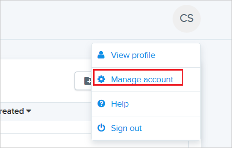
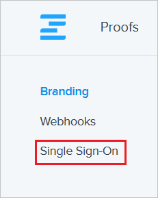
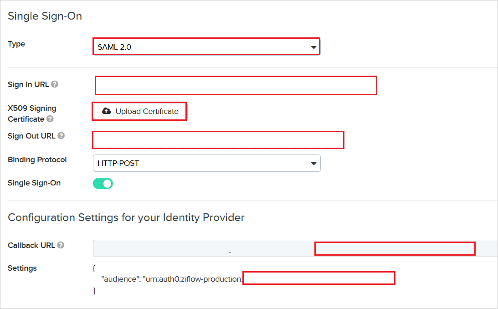
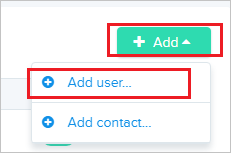
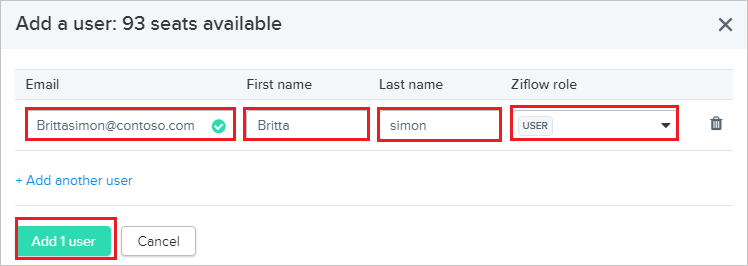

# Configure Ziflow for Single sign-on with Microsoft Entra ID

In this article,  you learn how to integrate Ziflow with Microsoft Entra ID. When you integrate Ziflow with Microsoft Entra ID, you can:

* Control in Microsoft Entra ID who has access to Ziflow.
* Enable your users to be automatically signed-in to Ziflow with their Microsoft Entra accounts.
* Manage your accounts in one central location.

## Prerequisites
The scenario outlined in this article assumes that you already have the following prerequisites:

[!INCLUDE [common-prerequisites.md](~/identity/saas-apps/includes/common-prerequisites.md)]
* Ziflow single sign-on enabled subscription.

## Scenario description

In this article,  you configure and test Microsoft Entra single sign-on in a test environment.

* Ziflow supports **SP** initiated SSO.

## Add Ziflow from the gallery

To configure the integration of Ziflow into Microsoft Entra ID, you need to add Ziflow from the gallery to your list of managed SaaS apps.

1. Sign in to the [Microsoft Entra admin center](https://entra.microsoft.com) as at least a [Cloud Application Administrator](~/identity/role-based-access-control/permissions-reference.md#cloud-application-administrator).
1. Browse to **Entra ID** > **Enterprise apps** > **New application**.
1. In the **Add from the gallery** section, type **Ziflow** in the search box.
1. Select **Ziflow** from results panel and then add the app. Wait a few seconds while the app is added to your tenant.

 Alternatively, you can also use the [Enterprise App Configuration Wizard](https://portal.office.com/AdminPortal/home?Q=Docs#/azureadappintegration). In this wizard, you can add an application to your tenant, add users/groups to the app, assign roles, and walk through the SSO configuration as well. [Learn more about Microsoft 365 wizards.](/microsoft-365/admin/misc/azure-ad-setup-guides)

## Configure and test Microsoft Entra SSO for Ziflow

Configure and test Microsoft Entra SSO with Ziflow using a test user called **B.Simon**. For SSO to work, you need to establish a link relationship between a Microsoft Entra user and the related user in Ziflow.

To configure and test Microsoft Entra SSO with Ziflow, perform the following steps:

1. **[Configure Microsoft Entra SSO](#configure-azure-ad-sso)** - to enable your users to use this feature.
    1. **Create a Microsoft Entra test user** - to test Microsoft Entra single sign-on with B.Simon.
    1. **Assign the Microsoft Entra test user** - to enable B.Simon to use Microsoft Entra single sign-on.
1. **[Configure Ziflow SSO](#configure-ziflow-sso)** - to configure the single sign-on settings on application side.
    1. **[Create Ziflow test user](#create-ziflow-test-user)** - to have a counterpart of B.Simon in Ziflow that's linked to the Microsoft Entra representation of user.
1. **[Test SSO](#test-sso)** - to verify whether the configuration works.

## Configure Microsoft Entra SSO

Follow these steps to enable Microsoft Entra SSO.

1. Sign in to the [Microsoft Entra admin center](https://entra.microsoft.com) as at least a [Cloud Application Administrator](~/identity/role-based-access-control/permissions-reference.md#cloud-application-administrator).
1. Browse to **Entra ID** > **Enterprise apps** > **Ziflow** > **Single sign-on**.
1. On the **Select a single sign-on method** page, select **SAML**.
1. On the **Set up single sign-on with SAML** page, select the pencil icon for **Basic SAML Configuration** to edit the settings.

   

1. On the **Basic SAML Configuration** section, perform the following steps:

	a. In the **Identifier (Entity ID)** text box, type a value using the following pattern:
    `urn:auth0:ziflow-production:<UNIQUE_ID>`

	b. In the **Sign on URL** text box, type a URL using the following pattern:
    `https://ziflow-production.auth0.com/login/callback?connection=<UNIQUE_ID>`

	c. In the **Reply URL** text box, type a URL using the following pattern:
    `https://ziflow-production.auth0.com/login/callback?connection=<UNIQUE_ID>`

	> [!NOTE]
	> The preceding values aren't real. You update the unique ID value in the Identifier, Sign on URL and Reply URL with actual value, which is explained later in the article.

1. On the **Set up Single Sign-On with SAML** page, in the **SAML Signing Certificate** section, select **Download** to download the **Certificate (Base64)** from the given options as per your requirement and save it on your computer.

	

1. On the **Set up Ziflow** section, copy the appropriate URL(s) as per your requirement.

	

[!INCLUDE [create-assign-users-sso.md](~/identity/saas-apps/includes/create-assign-users-sso.md)]

## Configure Ziflow SSO

1. In a different web browser window, sign in to Ziflow as a Security Administrator.

2. Select Avatar in the top right corner, and then select **Manage account**.

	

3. In the top left, select **Single Sign-On**.

	

4. On the **Single Sign-On** page, perform the following steps:

	

	a. Select **Type** as **SAML2.0**.

	b. In the **Sign In URL** textbox, paste the value of **Login URL**, which you copied previously.

    c. Upload the base-64 encoded certificate that you have downloaded, into the **X509 Signing Certificate**.

	d. In the **Sign Out URL** textbox, paste the value of **Logout URL**, which you copied previously.

	e. From the **Configuration Settings for your Identifier Provider** section, copy the highlighted unique ID value and append it with the Identifier and Sign on URL in the **Basic SAML Configuration** on Azure portal.

### Create Ziflow test user

To enable Microsoft Entra users to sign in to Ziflow, they must be provisioned into Ziflow. In Ziflow, provisioning is a manual task.

To provision a user account, perform the following steps:

1. Sign in to Ziflow as a Security Administrator.

2. Navigate to **People** on the top.

	

3. Select **Add** and then select **Add user**.

	

4. On the **Add a user** pop-up, perform the following steps:

	

	a. In **Email** text box, enter the email of user like brittasimon@contoso.com.

	b. In **First name** text box, enter the first name of user like Britta.

	c. In **Last name** text box, enter the last name of user like Simon.

	d. Select your Ziflow role.

	e. Select **Add 1 user**.

	> [!NOTE]
    > The Microsoft Entra account holder receives an email and follows a link to confirm their account before it becomes active.

## Test SSO 

In this section, you test your Microsoft Entra single sign-on configuration with following options. 

* Select **Test this application**, this option redirects to Ziflow Sign-on URL where you can initiate the login flow. 

* Go to Ziflow Sign-on URL directly and initiate the login flow from there.

* You can use Microsoft My Apps. When you select the Ziflow tile in the My Apps, this option redirects to Ziflow Sign-on URL. For more information about the My Apps, see [Introduction to the My Apps](https://support.microsoft.com/account-billing/sign-in-and-start-apps-from-the-my-apps-portal-2f3b1bae-0e5a-4a86-a33e-876fbd2a4510).

## Related content

Once you configure Ziflow you can enforce session control, which protects exfiltration and infiltration of your organization’s sensitive data in real time. Session control extends from Conditional Access. [Learn how to enforce session control with Microsoft Defender for Cloud Apps](/cloud-app-security/proxy-deployment-aad).
